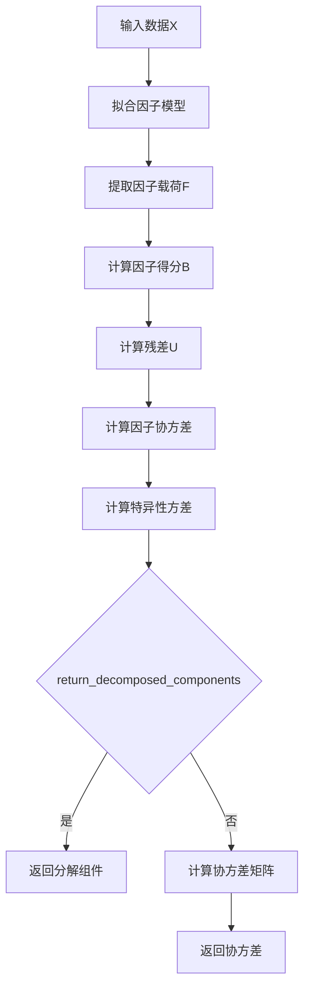

# model/riskmodel/structured.py 模块文档

## 文件概述

定义了结构化协方差估计器（Structured Covariance Estimator）：
- **StructuredCovEstimator**: 结构化协方差估计器

结构化估计器假设观测值可由多个因子预测，使用因子模型估计协方差。

## 参考文献

- [1] Fan, J., Liao, Y., & Liu, H. (2016). An overview of the estimation of large covariance and precision matrices. Econometrics Journal, 19(1), C1–C32.
- [2] Lin, H., Zhou, D., Liu, W., & Bian, J. (2021). Deep Risk Model: A Deep Learning Solution for Mining Latent Risk Factors to Improve Covariance Matrix Estimation. arXiv preprint arXiv:2107.05201.

## 类定义

### StructuredCovEstimator 类

**继承关系**: RiskModel → StructuredCovEstimator

**职责**: 结构化协方差估计器，使用因子模型估计协方差

#### 类属性

```python
FACTOR_MODEL_PCA = "pca"  # 主成分分析
FACTOR_MODEL_FA = "fa"   # 因子分析
DEFAULT_NAN_OPTION = "fill"  # 默认的NaN处理方式
```

#### 初始化
```python
def __init__(
    self,
    factor_model: str = "pca",
    num_factors: int = 10,
    **kwargs
):
```

**参数说明**:

| 参数 | 类型 | 说明 |
|------|------|------|
| `factor_model` | str | 因子模型类型：`pca`/`fa` |
| `num_factors` | int | 保留的因子数量 |
| `**kwargs` |  | 传递给RiskModel的参数 |

**功能**:
- 初始化结构化估计器
- 选择因子模型（PCA或FA）
- 设置因子数量
- 强制使用`nan_option="fill"`

#### 方法签名

##### `_predict(X, return_decomposed_components=False) -> Union[np.ndarray, tuple]`
```python
def _predict(
    self,
    X: np.ndarray,
    return_decomposed_components=False
) -> Union[np.ndarray, tuple]:
    model = self.solver(self.num_factors, random_state=0).fit(X)

    F = model.components_.T  # variables x factors
    B = model.transform(X)   # observations x factors
    U = X - B @ F.T
    cov_b = np.cov(B.T)       # factors x factors
    var_u = np.var(U, axis=0)   # diagonal

    if return_decomposed_components:
        return F, cov_b, var_u

    cov_x = F @ cov_b @ F.T + np.diag(var_u)

    return cov_x
```

**参数说明**:

| 参数 | 类型 | 说明 |
|------|------|------|
| `X` | np.ndarray | 数据矩阵（变量为列，观测为行） |
| `return_decomposed_components` | bool | 是否返回分解的组件 |

**返回值**:
- 默认：协方差矩阵（np.ndarray）
- `return_decomposed_components=True`: 元组(F, cov_b, var_u)

**功能流程**:


**详细步骤**:

1. **拟合因子模型**：
    ```python
    model = self.solver(self.num_factors, random_state=0).fit(X)
    ```
    - PCA: `sklearn.decomposition.PCA`
    - FA: `sklearn.decomposition.FactorAnalysis`

2. **提取因子载荷**：
    ```python
    F = model.components_.T  # p x k (变量 x 因子)
    ```
    - `components_`: 因子载荷矩阵（k x p）
    - 转置为`p x k`

3. **计算因子得分**：
    ```python
    B = model.transform(X)  # n x k (观测 x 因子)
    ```

4. **计算残差**：
    ```python
    U = X - B @ F.T  # n x p
    ```
    - 残差是观测值减去因子预测值

5. **计算因子协方差**：
    ```python
    cov_b = np.cov(B.T)  # k x k
    ```
    - 因子之间的协方差矩阵

6. **计算特异性方差**：
    ```python
    var_u = np.var(U, axis=0)  # p (对角向量）
    ```
    - 每个变量的残差方差（特异性风险）

7. **计算协方差矩阵**：
    ```python
    cov_x = F @ cov_b @ F.T + np.diag(var_u)  # p x p
    ```
    - 公式：`Σ = F · cov(B) · F^T + diag(var(U))`

**数学模型**:

结构化协方差模型假设：

```
X = B · F^T + U

其中：
- X: 观测数据矩阵 (n x p)
- B: 因子得分矩阵 (n x k)
- F: 因子载荷矩阵 (p x k)
- U: 残差矩阵 (n x p)
```

协方差矩阵估计：

```
cov(X^T) = F · cov(B^T) · F^T + diag(var(U))
         = F · cov(Factors) · F^T + Idiosyncratic Risk
```

## 类继承关系图

```
RiskModel
    └── StructuredCovEstimator
```

## 使用示例

### 示例1：基本使用（PCA）

```python
from qlib.model.riskmodel.structured import StructuredCovEstimator
import numpy as np

# 创建PCA结构化估计器
structured = StructuredCovEstimator(
    factor_model="pca",
    num_factors=10
)

# 准备数据
returns = np.random.randn(200, 50)  # 200个观测，50个变量

# 估计协方差
cov = structured.predict(returns, is_price=False)
print(f"协方差矩阵形状: {cov.shape)  # (50, 50)
```

### 示例2：使用因子分析

```python
from qlib.model.riskmodel.structured import StructuredCovEstimator

# 创建FA结构化估计器
structured = StructuredCovEstimator(
    factor_model="fa",
    num_factors=5
)

# 估计协方差
cov = structured.predict(returns, is_price=False)
```

### 示例3：获取分解组件

```python
from qlib.model.riskmodel.structured import StructuredCovEstimator
import numpy as np

# 创建估计器
structured = StructuredCovEstimator(
    factor_model="pca",
    num_factors=10
)

# 准备数据
returns = np.random.randn(200, 50)

# 获取分解组件
F, cov_b, var_u = structured.predict(
    returns,
    is_price=False,
    return_decomposed_components=True
)

print(f"因子载荷F形状: {F.shape}")      # (50, 10)
print(f"因子协方差形状: {cov_b.shape}")   # (10, 10)
print(f"特异性方差形状: {var_u.shape}")   # (50,)

# 重建协方差矩阵
cov_reconstructed = F @ cov_b @ F.T + np.diag(var_u)
```

### 示例4：比较PCA和FA

```python
from qlib.model.riskmodel.structured import StructuredCovEstimator
import numpy as np

# 准备数据
returns = np.random.randn(200, 50)

# 比较PCA和FA
for model_type in ["pca", "fa"]:
    structured = StructuredCovEstimator(
        factor_model=model_type,
        num_factors=10
    )

    # 获取分解组件
    F, cov_b, var_u = structured.predict(
        returns,
        is_price=False,
        return_decomposed_components=True
    )

    # 计算解释的方差比例
    explained_variance = np.trace(F @ cov_b @ F.T)
    total_variance = np.trace(F @ cov_b @ F.T + np.diag(var_u))
    ratio = explained_variance / total_variance

    print(f"{model_type.upper()}模型:")
    print(f"  因子解释方差比例: {ratio:.2%}")
    print(f"  特异性风险比例: {1 - ratio:.2%}")
```

### 示例5：因子数量敏感性分析

```python
import matplotlib.pyplot as plt

# 测试不同因子数量
num_factors_list = [1, 5, 10, 15, 20, 25]
explained_ratios = []

for num_factors in num_factors_list:
    structured = StructuredCovEstimator(
        factor_model="pca",
        num_factors=num_factors
    )

    # 获取分解组件
    F, cov_b, var_u = structured.predict(
        returns,
        is_price=False,
        return_decomposed_components=True
    )

    # 计算解释方差比例
    explained_variance = np.trace(F @ cov_b @ F.T)
    total_variance = np.trace(F @ cov_b @ F.T + np.diag(var_u))
    ratio = explained_variance / total_variance
    explained_ratios.append(ratio)

# 绘制结果
plt.figure(figsize=(10, 6))
plt.plot(num_factors_list, explained_ratios, marker='o')
plt.xlabel('因子数量')
plt.ylabel('解释方差比例')
plt.title('因子数量对解释度的影响')
plt.grid(True)
plt.show()
```

## 设计理念

### 结构化风险模型

Qlib支持三种结构化风险模型：

#### 1. 统计风险模型（SRM）

- **方法**: 使用潜在因子（PCA、FA）
- **优点**: 数据驱动，自动学习因子
- **缺点**: 因子解释性较差

#### 2. 基本面风险模型（FRM）

- **方法**: 人工设计的因子（行业、风格等）
- **优点**: 因子可解释性强
- **缺点**: 需要领域知识

#### 3. 深度风险模型（DRM）

- **方法**: 神经网络设计的因子
- **优点**: 结合SRM和FRM的优点
- **缺点**: 计算复杂度高

### 协方差分解

结构化估计器将协方差分解为：

```
Σ = Σ_common + Σ_specific

其中：
- Σ_common = F · cov(B) · F^T：系统风险（共同部分）
- Σ_specific = diag(var(U))：特异性风险（特质部分）
```

**解释**:
- `Σ_common`: 由共同因子驱动的风险（市场风险、行业风险等）
- `Σ_specific`: 资产特有的风险（特质波动）

### 因子模型对比

| 因子模型 | 方法 | 优点 | 缺点 |
|---------|------|------|------|
| PCA | 主成分分析 | 正交因子，解释最大方差 | 假设线性关系 |
| FA | 因子分析 | 考虑观测误差，更灵活 | 计算较复杂 |

## 设计模式

### 1. 策略模式

- 通过`factor_model`参数选择因子模型
- 支持PCA和FA两种策略

### 2. 组合模式

- 组合系统风险和特异性风险
- Σ = Σ_common + Σ_specific

## 与其他模块的关系

### 依赖模块

- `qlib.model.riskmodel.RiskModel`: 风险模型基类
- `sklearn.decomposition`: PCA和FactorAnalysis
- `numpy`: 数值计算

### 被依赖模块

- `qlib.contrib.strategy`: 投资组合优化
- `qlib.backtest`: 回测

## 扩展指南

### 实现自定义因子模型

```python
from qlib.model.riskmodel.structured import StructuredCovEstimator
import numpy as np

class CustomFactorStructuredCov(StructuredCovEstimator):
    """自定义因子模型的结构化估计器"""

    def __init__(self, factor_extractor=None, **kwargs):
        super().__init__(**kwargs)
        self.factor_extractor = factor_extractor

    def _predict(self, X, return_decomposed_components=False):
        """使用自定义因子提取器"""
        if self.factor_extractor is not None:
            # 提取因子载荷
            F = self.factor_extractor.extract_factor_loadings(X)
            B = self.factor_extractor.transform(X)
            U = X - B @ F.T
            cov_b = np.cov(B.T)
            var_u = np.var(U, axis=0)

            if return_decomposed_components:
                return F, cov_b, var_u

            cov_x = F @ cov_b @ F.T + np.diag(var_u)
            return cov_x

        return super()._predict(X, return_decomposed_components)

# 使用自定义因子提取器
class MyFactorExtractor:
    def extract_factor_loadings(self, X):
        # 自定义因子提取逻辑
        # 返回因子载荷矩阵
        return F

    def transform(self, X):
        # 将数据转换到因子空间
        # 返回因子得分
        return B

# 使用
structured = CustomFactorStructuredCov(
    factor_extractor=MyFactorExtractor()
)
cov = structured.predict(returns, is_price=False)
```

## 注意事项

1. **因子数量**: `num_factors`应该小于变量数
2. **NaN处理**: 强制使用`nan_option="fill"`
3. **随机种子**: 使用固定随机种子确保可重复性
4. **因子正交性**: PCA生成的因子是正交的，FA不是

## 性能优化建议

1. **因子数量**: 根据数据特性选择合适的因子数量
2. **增量学习**: 对于新增数据，使用增量PCA
3. **并行计算**: 因子提取可以并行化
4. **近似方法**: 对于大规模数据，使用随机SVD

## 应用场景

### 1. 风险分解

```python
# 分解投资组合风险
structured = StructuredCovEstimator(
    factor_model="pca",
    num_factors=10
)

# 获取分解组件
F, cov_b, var_u = structured.predict(
    returns,
    is_price=False,
    return_decomposed_components=True
)

# 投资组合权重
portfolio_weights = np.array([0.3, 0.4, 0.3])

# 系统风险
systematic_cov = F @ cov_b @ F.T
systematic_risk = np.sqrt(portfolio_weights @ systematic_cov @ portfolio_weights)

# 特异性风险
idiosyncratic_cov = np.diag(var_u)
idiosyncratic_risk = np.sqrt(portfolio_weights @ idiosyncratic_cov @ portfolio_weights)

print(f"系统风险: {systematic_risk:.4f}")
print(f"特异性风险: {idiosyncratic_risk:.4f}")
print(f"总风险: {np.sqrt(systematic_risk**2 + idiosyncratic_risk**2):.4f}")
```

### 2. 因子暴露分析

```python
# 分析投资组合的因子暴露
structured = StructuredCovEstimator(
    factor_model="pca",
    num_factors=10
)

# 获取因子载荷
F, cov_b, var_u = structured.predict(
    returns,
    is_price=False,
    return_decomposed_components=True
)

# 因子得分
B = structured.solver(10, random_state=0).fit(returns).transform(returns)

# 投资组合的因子暴露
factor_exposures = B.T @ portfolio_weights

print("因子暴露:")
for i, exposure in enumerate(factor_exposures):
    print(f"  因子{i+1}: {exposure:.4f}")
```

### 3. 特异性风险控制

```python
# 控制特异性风险
structured = StructuredCovEstimator(
    factor_model="pca",
    num_factors=10
)

# 获取分解组件
F, cov_b, var_u = structured.predict(
    returns,
    is_price=False,
    return_decomposed_components=True
)

# 特异性风险权重（对角线）
idiosyncratic_weights = 1 / (var_u + 1e-6)  # 避免除零

# 最小方差组合（考虑特异性风险）
systematic_cov = F @ cov_b @ F.T
total_cov = systematic_cov + np.diag(var_u)

# 使用特异性权重调整
inv_cov = np.linalg.inv(total_cov)
weights = inv_cov @ ones / (ones @ inv_cov @ ones)

print(f"组合权重: {weights}")
```

### 4. 因子选择

```python
# 选择解释最多方差的因子
import matplotlib.pyplot as plt

structured = StructuredCovEstimator(
    factor_model="pca",
    num_factors=20
)

# 获取分解组件
F, cov_b, var_u = structured.predict(
    returns,
    is_price=False,
    return_decomposed_components=True
)

# 因子方差
factor_variances = np.diag(cov_b)

# 绘制因子方差
plt.figure(figsize=(10, 6))
plt.bar(range(1, 21), factor_variances)
plt.xlabel('因子')
plt.ylabel('方差')
plt.title('因子方差贡献')
plt.grid(True)
plt.show()

# 选择解释最多的前k个因子
top_k = 5
top_factors = np.argsort(factor_variances)[-top_k:][::-1]
print(f"解释最多的{top_k}个因子: {top_factors + 1}")
```

### 5. 模型比较

```python
# 比较PCA和FA的估计结果
import matplotlib.pyplot as plt

methods = ["pca", "fa"]
fig, axes = plt.subplots(1, 2, figsize=(15, 6))

for i, method in enumerate(methods):
    structured = StructuredCovEstimator(
        factor_model=method,
        num_factors=10
    )

    cov = structured.predict(returns, is_price=False)

    # 可视化协方差矩阵
    im = axes[i].imshow(cov, cmap='viridis')
    axes[i].set_title(f'{method.upper()}协方差矩阵')
    plt.colorbar(im, ax=axes[i])

plt.tight_layout()
plt.show()

# 比较条件数
for method in methods:
    structured = StructuredCovEstimator(
        factor_model=method,
        num_factors=10
    )
    cov = structured.predict(returns, is_price=False)
    cond_num = np.linalg.cond(cov)
    print(f"{method.upper()}条件数: {cond_num:.2f}")
```
