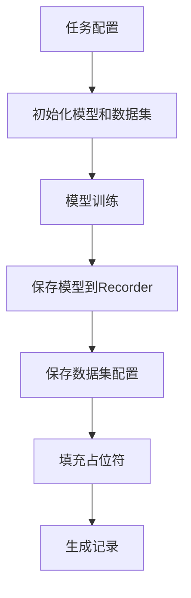
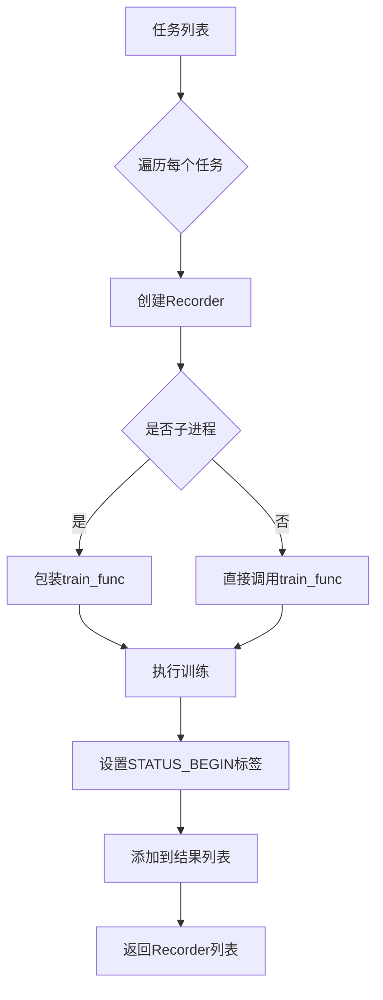
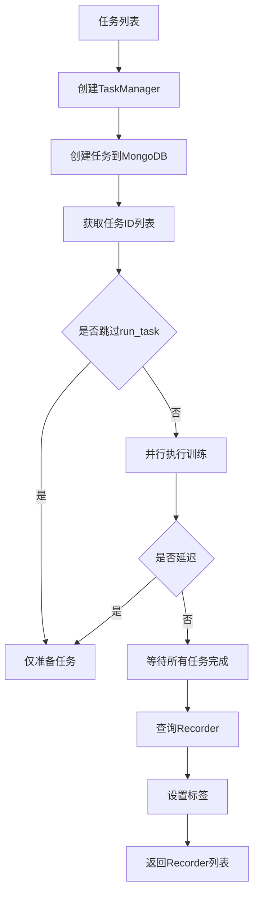

# model/trainer.py 模块文档

## 文件概述

定义了Qlib的模型训练器系统，提供多种训练策略以支持不同的训练场景：
- **Trainer**: 训练器基类
- **TrainerR**: 基于Recorder的单进程训练器
- **DelayTrainerR**: 基于Recorder的延迟训练器
- **TrainerRM**: 基于Recorder和TaskManager的多进程训练器
- **DelayTrainerRM**: 基于Recorder和TaskManager的延迟多进程训练器

训练器系统采用"延迟训练"（DelayTrainer）设计，支持在线模拟和并行训练。

## 核心概念

### 延迟训练（DelayTrainer）

延迟训练将模型训练分为两个阶段：
1. **train阶段**: 仅保存必要信息到Recorder，进行轻量级准备
2. **end_train阶段**: 执行真实的数据加载和模型拟合

这种设计允许：
- 在线模拟中批量准备任务
- 并行执行耗时的训练操作
- 跨进程或跨机器分布训练

## 函数定义

### `_log_task_info(task_config: dict)`
```python
def _log_task_info(task_config: dict):
    R.log_params(**flatten_dict(task_config))
    R.save_objects(**{"task": task_config})
    R.set_tags(**{"hostname": socket.gethostname()})
```
- **功能**: 记录任务配置信息到Recorder
- **记录内容**:
  - 扁平化的任务参数
  - 原始任务配置
  - 主机名（用于分布式训练追踪）

### `_exe_task(task_config: dict)`
```python
def _exe_task(task_config: dict):
    """执行单个任务"""
```

**执行流程**:


**详细步骤**:
1. 初始化模型和数据集
2. 执行模型训练（自动过滤kwargs）
3. 保存训练后的模型（params.pkl）
4. 保存数据集配置（不保存具体数据）
5. 填充占位符（<MODEL>、<DATASET>）
6. 生成分析记录（预测、回测、分析）

### `begin_task_train(task_config: dict, experiment_name: str, recorder_name: str = None) -> Recorder`
```python
def begin_task_train(task_config: dict, experiment_name: str, recorder_name: str = None) -> Recorder:
```
- **功能**: 开始任务训练，创建Recorder并保存任务配置
- **返回**: Recorder对象
- **用途**: DelayTrainer的第一阶段

### `end_task_train(rec: Recorder, experiment_name: str) -> Recorder`
```python
def end_task_train(rec: Recorder, experiment_name: str) -> Recorder:
```
- **功能**: 完成任务训练，恢复Recorder并执行真实训练
- **返回**: Recorder对象
- **用途**: DelayTrainer的第二阶段

### `task_train(task_config: dict, experiment_name: str, recorder_name: str = None) -> Recorder`
```python
def task_train(task_config: dict, experiment_name: str, recorder_name: str = None) -> Recorder:
```
- **功能**: 完整的任务训练流程
- **流程**: 调用begin_task_train → _log_task_info → _exe_task
- **返回**: Recorder对象
- **用途**: Trainer的默认训练函数

## 类定义

### Trainer 类

**职责**: 训练器基类，定义训练器的基本接口

#### 属性
- `delay: bool`: 是否为延迟训练器

#### 方法签名

##### `train(tasks: list, *args, **kwargs) -> list`
```python
def train(self, tasks: list, *args, **kwargs) -> list:
```
- **功能**: 执行训练
- **Trainer行为**: 在此方法中完成真实训练
- **DelayTrainer行为**: 仅进行准备工作
- **参数**: tasks - 任务配置列表

##### `end_train(models: list, *args, **kwargs) -> list`
```python
def end_train(models: list, *args, **kwargs) -> list:
```
- **功能**: 完成训练
- **Trainer行为**: 执行收尾工作
- **DelayTrainer行为**: 完成真实训练
- **参数**: models - 模型或Recorder列表

##### `is_delay() -> bool`
```python
def is_delay(self) -> bool:
```
- **功能**: 判断是否为延迟训练器

##### `__call__(*args, **kwargs) -> list`
```python
def __call__(self, *args, **kwargs) -> list:
```
- **功能**: 使训练器可调用，等价于`end_train(train(...))`

##### `has_worker() -> bool`
```python
def has_worker(self) -> bool:
```
- **功能**: 判断是否支持后台工作进程

##### `worker()`
```python
def worker(self):
```
- **功能**: 启动后台工作进程
- **说明**: 仅支持worker的训练器可调用此方法

### TrainerR 类

**继承关系**: Trainer → TrainerR

**职责**: 基于Recorder的单进程线性训练器

#### 类属性
- `STATUS_KEY = "train_status"`: 训练状态标签键
- `STATUS_BEGIN = "begin_task_train"`: 训练开始状态
- `STATUS_END = "end_task_train"`: 训练结束状态

#### 初始化
```python
def __init__(
    self,
    experiment_name: Optional[str] = None,
    train_func: Callable = task_train,
    call_in_subproc: bool = False,
    default_rec_name: Optional[str] = None,
):
```

**参数说明**:
- `experiment_name`: 实验名称
- `train_func`: 训练函数，默认为task_train
- `call_in_subproc`: 是否在子进程中调用（强制释放内存）
- `default_rec_name`: 默认Recorder名称

#### 方法

##### `train(tasks: list, train_func=None, experiment_name=None, **kwargs) -> List[Recorder]`
```python
def train(self, tasks: list, train_func=None, experiment_name=None, **kwargs) -> List[arRecorder]:
```

**训练流程**:


##### `end_train(models: list, **kwargs) -> List[Recorder]`
```python
def end_train(models: list, **kwargs) -> List[Recorder]:
```
- **功能**: 设置STATUS_END标签到所有Recorder
- **返回**: 相同的Recorder列表

### DelayTrainerR 类

**继承关系**: TrainerR → DelayTrainerR

**职责**: 基于Recorder的延迟训练器

#### 初始化
```python
def __init__(
    self,
    experiment_name: str = None,
    train_func=begin_task_train,
    end_train_func=end_task_train,
    **kwargs
):
```

**参数说明**:
- `train_func`: 默认为begin_task_train（仅准备）
- `end_train_func`: 默认为end_task_train（真实训练）

#### 方法

##### `end_train(models, end_train_func=None, experiment_name=None, **kwargs) -> List[Recorder]`
```python
def end_train(models, end_train_func=None, experiment_name=None, **kwargs) -> List[Recorder]:
```

**流程**:
1. 遍历所有Recorder
2. 跳过已完成的（STATUS_END）
3. 恢复Recorder并执行end_train_func
4. 设置STATUS_END标签

### TrainerRM 类

**继承关系**: Trainer → TrainerRM

**职责**: 基于Recorder和TaskManager的多进程训练器

#### 类属性
- `TM_ID = "_id in TaskManager"`: TaskManager中的任务ID标签

#### 初始化
```python
def __init__(
    self,
    experiment_name: str = None,
    task_pool: str = None,
    train_func=task_train,
    skip_run_task: bool = False,
    default_rec_name: Optional[str] = None,
):
```

**参数说明**:
- `task_pool`: TaskManager中的任务池名称
- `skip_run_task`: 是否跳过run_task（仅在worker中运行）

#### 方法

##### `train(tasks, train_func=None, experiment_name=None, before_status=None, after_status=None, **kwargs) -> List[Recorder]`
```python
def train(self, tasks, train_func=None, experiment_name=None, before_status=None, after_status=None, **kwargs) -> List[Recorder]:
```

**训练流程**:


##### `worker(train_func=None, experiment_name=None)`
```python
def worker(self, train_func=None, experiment_name=None):
```
- **功能**: 启动后台工作进程
- **说明**: 可以在独立进程或机器上运行

### DelayTrainerRM 类

**继承关系**: TrainerRM → DelayTrainerRM

**职责**: 基于Recorder和TaskManager的延迟多进程训练器

#### 初始化
```python
def __init__(
    self,
    experiment_name: str = None,
    task_pool: str = None,
    train_func=begin_task_train,
    end_train_func=end_task_train,
    skip_run_task: bool = False,
    **kwargs
):
```

#### 方法

##### `train(tasks, train_func=None, experiment_name=None, **kwargs) -> List[Recorder]`
```python
def train(self, tasks, train_func=None, experiment_name=None, **kwargs) -> List[Recorder]:
```
- **说明**: 类似TrainerRM.train，但after_status为STATUS_PART_DONE

##### `end_train(recs, end_train_func=None, experiment_name=None, **kwargs) -> List[Recorder]`
```python
def end_train(recs, end_train_func=None, experiment_name=None, **kwargs) -> List[Recorder]:
```

**流程**:
1. 从Recorder中获取TaskManager的ID列表
2. 并行执行end_train_func
3. 等待所有任务完成
4. 设置STATUS_END标签

##### `worker(end_train_func=None, experiment_name=None)`
```python
def worker(self, end_train_func=None, experiment_name=None):
```
- **功能**: 启动end_train的后台工作进程

## 类继承关系图

```
Trainer
├── TrainerR
│   └── DelayTrainerR
└── TrainerRM
    └── DelayTrainerRM
```

## 训练器对比

| 特性 | TrainerR | DelayTrainerR | TrainerRM | DelayTrainerRM |
|------|----------|---------------|-----------|----------------|
| 多进程 | ❌ | ❌ | ✅ | ✅ |
| 延迟训练 | ❌ | ✅ | ❌ | ✅ |
| TaskManager | ❌ | ❌ | ✅ | ✅ |
| 适用场景 | 简单训练 | 在线模拟 | 并行训练 | 分布式训练 |

## 使用示例

### 单进程训练（TrainerR）

```python
from qlib.model.trainer import TrainerR

trainer = TrainerR(experiment_name="my_exp")
tasks = [task_config1, task_config2, task_config3]

recorders = trainer(tasks)
# 或使用分步调用
recorders = trainer.train(tasks)
recorders = trainer.end_train(recorders)
```

### 延迟训练（DelayTrainerR）

```python
from qlib.model.trainer import DelayTrainerR

trainer = DelayTrainerR(experiment_name="my_exp")

# 阶段1：仅准备
recorders = trainer.train(tasks)

# 阶段2：真实训练（可并行）
recorders = trainer.end_train(recorders)
```

### 多进程训练（TrainerRM）

```python
from qlib.model.trainer import TrainerRM

trainer = TrainerRM(experiment_name="my_exp", task_pool="my_pool")

# 在主进程中
recorders = trainer(tasks)

# 在工作进程中
trainer.worker()
```

### 分布式延迟训练（DelayTrainerRM）

```python
from qlib.model.trainer import DelayTrainerRM

# CPU VM上准备任务
trainer = DelayTrainerRM(
    experiment_name="my_exp",
    task_pool="my_pool",
    skip_run_task=True
)
recorders = trainer(tasks)

# GPU VM上执行训练
trainer = DelayTrainerRM(
    experiment_name="my_exp",
    task_pool="my_pool",
    skip_run_task=False
)
trainer.worker(end_train_func=end_task_train)
```

## 设计模式

### 1. 模板方法模式

- Trainer定义训练流程框架
- 子类实现具体的train和end_train逻辑

### 2. 策略模式

- 通过train_func参数自定义训练策略
- 支持不同的训练函数实现

### 3. 延迟初始化模式

- DelayTrainer将昂贵操作推迟到end_train
- 支持批量准备和延迟执行

## 与其他模块的关系

### 依赖模块

- `qlib.workflow.R`: 实验和Recorder管理
- `qlib.workflow.task.manage.TaskManager`: 任务管理和分布式训练
- `qlib.data.dataset.Dataset`: 数据集
- `qlib.data.dataset.weight.Reweighter`: 样本重加权
- `qlib.model.base.Model`: 模型接口

### 被依赖模块

- `qlib.workflow`: 工作流使用Trainer训练模型
- `qlib.contrib.model`: 具体模型实现使用Trainer

## 注意事项

1. **内存管理**: 使用`call_in_subproc=True`强制在子进程中训练以释放内存
2. **任务状态**: 注意STATUS_BEGIN和STATUS_END标签的正确设置
3. **分布式训练**: 确保TaskManager的MongoDB连接正常
4. **并行安全**: TaskManager确保任务在多进程中的安全执行
5. **参数传递**: 使用`auto_filter_kwargs`自动过滤不支持的参数
