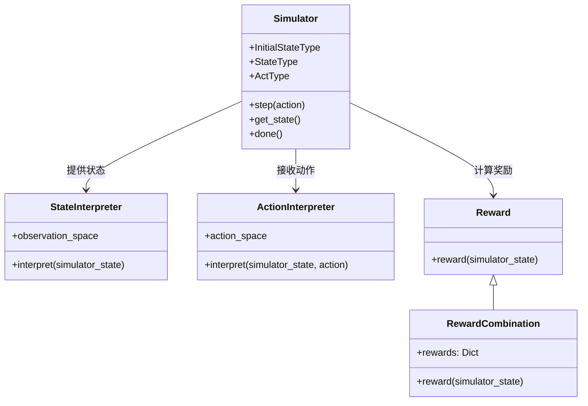

# qlib.rl.__init__ 模块文档

## 模块概述

`qlib.rl.__init__` 模块是强化学习（RL）框架的核心入口模块，导出了 RL 训练所需的主要组件：

- **Interpreter**: 解释器基类
- **StateInterpreter**: 状态解释器
- **ActionInterpreter**: 动作解释器
- **Reward**: 奖励计算类
- **RewardCombination**: 奖励组合类
- **Simulator**: 模拟器类

## 导出组件

| 组件 | 说明 |
|------|------|
| `Interpreter` | 解释器基类，用于在模拟器状态和策略状态之间进行转换 |
| `StateInterpreter` | 状态解释器，将模拟器状态转换为策略可用的观测 |
| `ActionInterpreter` | 动作解释器，将策略动作转换为模拟器可接受的动作 |
| `Reward` | 奖励计算基类 |
| `RewardCombination` | 多个奖励的组合计算类 |
| `Simulator` | 模拟器基类，定义环境模拟的核心接口 |

## 导入示例

```python
from qlib.rl import (
    Interpreter,
    StateInterpreter,
    ActionInterpreter,
    Reward,
    RewardCombination,
    Simulator,
)
```

## 组件关系图



## 使用说明

QLib 的 RL 框架采用清晰的组件分离设计：

1. **Simulator（模拟器）**：负责环境模拟，定义状态转移逻辑
2. **Interpreter（解释器）**：负责在模拟器和策略之间进行数据转换
   - `StateInterpreter`: 将模拟器内部状态转换为策略可观测的格式
   - `ActionInterpreter`: 将策略输出的动作转换为模拟器可接受的格式
3. **Reward（奖励）**：负责根据环境状态计算奖励值

这种设计使得同一个模拟器可以配合不同的解释器和奖励函数使用，提高了代码的复用性。

## 典型工作流程

```python
# 1. 创建模拟器
simulator = MySimulator(initial_state)

# 2. 创建解释器
state_interpreter = MyStateInterpreter()
action_interpreter = MyActionInterpreter()

# 3. 创建奖励函数
reward_fn = MyReward()

# 4. 训练循环
while not simulator.done():
    # 获取状态并转换为观测
    state = simulator.get_state()
    obs = state_interpreter(state)

    # 策略决策（获取动作）
    action = policy.get_action(obs)

    # 将动作转换为模拟器可接受的动作
    sim_action = action_interpreter(state, action)

    # 执行动作
    simulator.step(sim_action)

    # 计算奖励
    reward = reward_fn(simulator.get_state())
```

## 相关文档

- [interpreter.md](./interpreter.md) - 解释器详细文档
- [reward.md](./reward.md) - 奖励计算详细文档
- [simulator.md](./simulator.md) - 模拟器详细文档
- [aux_info.md](./aux_info.md) - 辅助信息收集器文档
