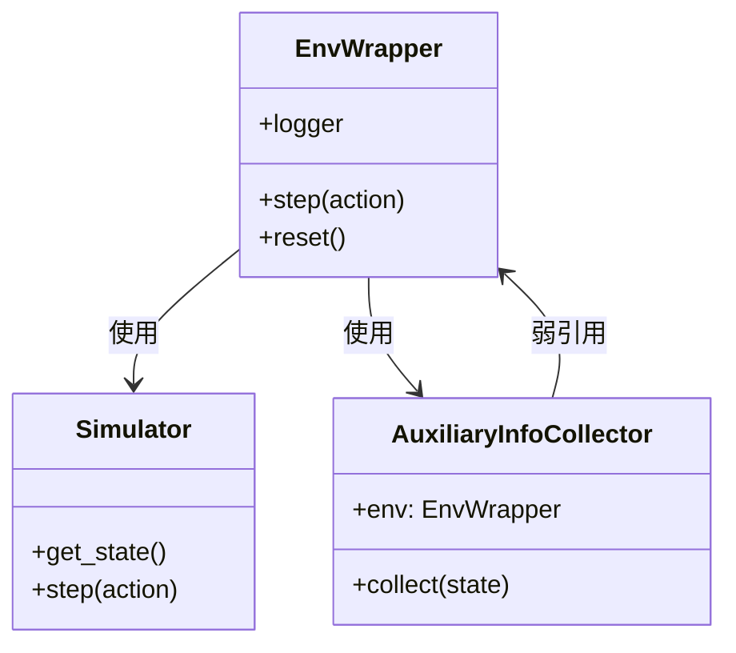

# qlib.rl.aux_info 模块文档

## 模块概述

`qlib.rl.aux_info` 模块定义了辅助信息收集器的基类，用于从环境中收集自定义的辅助信息。这在多智能体强化学习场景中特别有用。

## 主要组件

### AuxiliaryInfoCollector

```python
class AuxiliaryInfoCollector(Generic[StateType, AuxInfoType])
```

**说明**：辅助信息收集器基类，用于从模拟器状态中提取自定义的辅助信息。

用户应该继承此类并实现 `collect` 方法来定义自己的辅助信息收集逻辑。

#### 属性

| 属性名 | 类型 | 说明 |
|--------|------|------|
| `env` | `Optional[EnvWrapper]` | 环境包装器的弱引用，通常由框架自动设置 |

#### 方法

##### `__call__(simulator_state: StateType) -> AuxInfoType`

**说明**：调用该方法会执行 `collect` 方法。

**参数**：
- `simulator_state`: 从模拟器获取的状态，通过 `simulator.get_state()` 获得

**返回**：收集到的辅助信息

##### `collect(simulator_state: StateType) -> AuxInfoType`

**说明**：**抽象方法**，需要子类实现。定义如何从模拟器状态中收集辅助信息。

**参数**：
- `simulator_state`: 从模拟器获取的状态，通过 `simulator.get_state()` 获得

**返回**：自定义的辅助信息对象

**抛出**：`NotImplementedError` - 如果子类未实现此方法

## 类型定义

| 类型变量 | 说明 |
|---------|------|
| `AuxInfoType` | 辅助信息的类型，由用户自定义 |

## 使用示例

### 基本用法

```python
from qlib.rl.aux_info import AuxiliaryInfoCollector

class MyAuxInfoCollector(AuxiliaryInfoCollector):
    def collect(self, simulator_state):
        """从模拟器状态中收集辅助信息"""
        # 假设 simulator_state 是一个字典
        aux_info = {
            'timestamp': simulator_state.get('timestamp'),
            'volume': simulator_state.get('volume'),
            'custom_metric': self._calculate_custom_metric(simulator_state)
        }
        return aux_info

    def _calculate_custom_metric(self, state):
        """自定义计算逻辑"""
        # 实现自定义的计算
        return state.get('price') * state.get('volume')
```

### 在环境包装器中使用

```python
from qlib.rl.utils import EnvWrapper

# 创建辅助信息收集器
aux_collector = MyAuxInfoCollector()

# 创建环境包装器并设置收集器
env = EnvWrapper(
    simulator=simulator,
    state_interpreter=state_interpreter,
    action_interpreter=action_interpreter,
    reward=reward_fn,
    aux_info_collector=aux_collector  # 可选
)

# 执行步骤
obs, reward, done, info = env.step(action)

# 辅助信息会在 info 中返回
print(info['aux_info'])
```

### 多智能体场景示例

```python
class MultiAgentAuxInfoCollector(AuxiliaryInfoCollector):
    """收集多智能体的辅助信息"""
    def collect(self, simulator_state):
        agents_info = {}
        for agent_id, agent_state in simulator_state['agents'].items():
            agents_info[agent_id] = {
                'position': agent_state['position'],
                'profit': agent_state['profit'],
                'trades_count': agent_state['trades_count']
            }
        return {
            'agents': agents_info,
            'global_metrics': simulator_state['global_metrics']
        }
```

## 设计说明

### 状态管理

- `AuxiliaryInfoCollector` 应该是无状态的
- 不建议在解释器中使用 `self.xxx` 存储临时信息（这是反模式）
- 如果需要在解释器间共享状态，可以通过 `self.env` 访问环境包装器

### 与环境的关系



### 工作流程

1. 环境包装器在每次 `step` 或 `reset` 后获取模拟器状态
2. 如果配置了 `aux_info_collector`，调用其 `collect` 方法
3. 收集到的辅助信息通过 `info` 字典返回给调用者

## 典型应用场景

### 1. 多智能体协作

在多智能体强化学习中，收集每个智能体的独立信息用于分析：

```python
class AgentMetricsCollector(AuxiliaryInfoCollector):
    def collect(self, state):
        return {
            'agent_0': state['agents'][0]['metrics'],
            'agent_1': state['agents'][1]['metrics'],
            'cooperation_score': state['cooperation_score']
        }
```

### 2. 性能监控

收集环境运行时的性能指标：

```python
class PerformanceCollector(AuxiliaryInfoCollector):
    def collect(self, state):
        return {
            'execution_time': state['execution_time'],
            'memory_usage': state['memory_usage'],
            'throughput': state['throughput']
        }
```

### 3. 调试信息

收集调试所需的额外信息：

```python
class DebugCollector(AuxiliaryInfoCollector):
    def collect(self, state):
        return {
            'raw_state': state,  # 原始状态
            'intermediate_values': state['debug_info']
        }
```

## 注意事项

1. **性能考虑**：`collect` 方法会在每个步骤调用，应避免耗时操作
2. **内存管理**：收集的信息不应过大，可能影响内存使用
3. **线程安全**：如果环境在多线程中使用，确保 `collect` 方法是线程安全的
4. **日志记录**：可以通过 `self.env.logger` 记录自定义指标

## 相关文档

- [simulator.md](./simulator.md) - 模拟器文档
- [interpreter.md](./interpreter.md) - 解释器文档
- [reward.md](./reward.md) - 奖励计算文档
