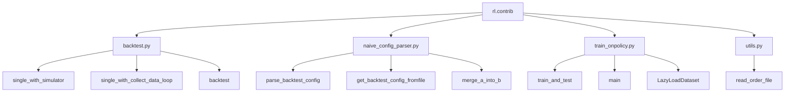
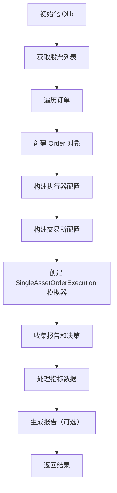
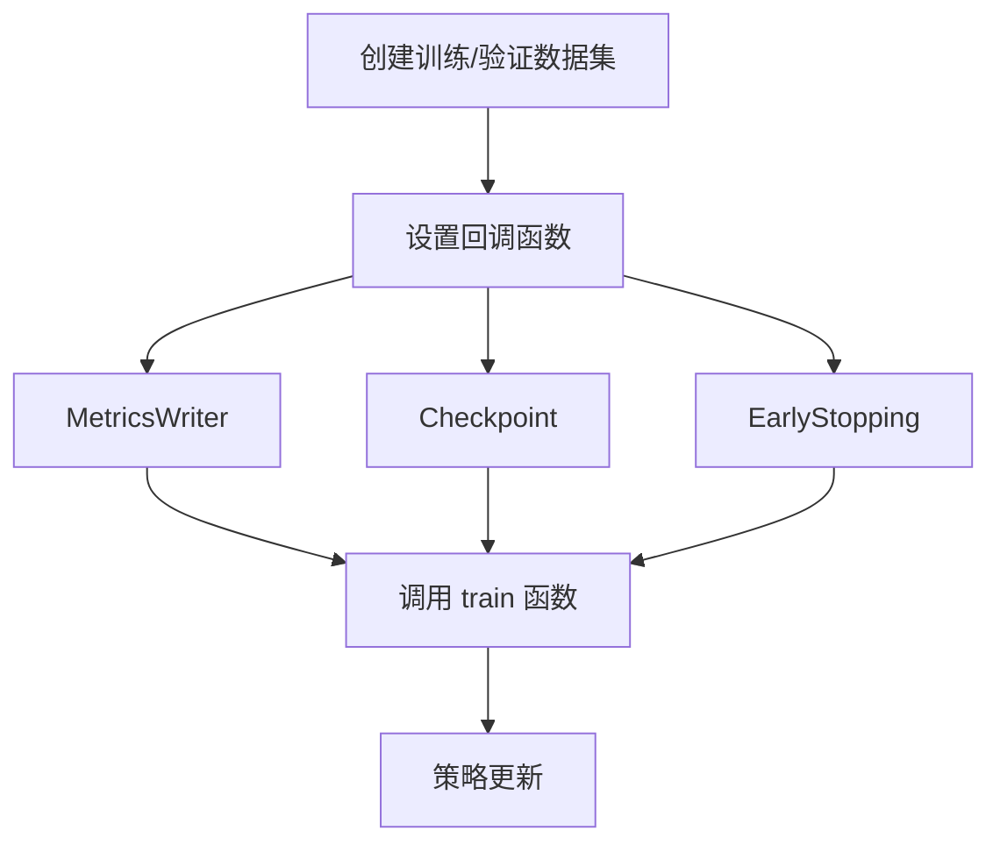
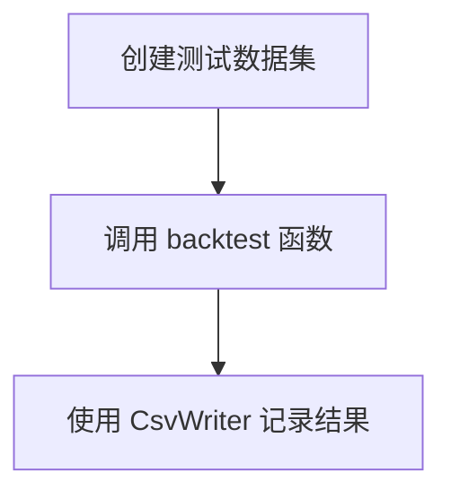

# RL Contrib 模块文档

## 模块概述

`qlib.rl.contrib` 模块提供了强化学习在量化投资中应用的辅助工具和功能，包括回测引擎、配置解析器、策略训练框架和实用工具函数。该模块主要用于支持基于强化学习的订单执行策略的开发、训练和评估。

### 主要功能

- **回测引擎**：支持单资产订单执行的回测，提供两种回测模式
- **配置管理**：灵活的配置文件解析和合并功能
- **训练框架**：在线策略（On-Policy）强化学习训练流程
- **工具函数**：订单文件读取等常用功能

### 模块架构图



---

## backtest.py - 回测引擎

### 模块概述

`backtest.py` 提供了强化学习订单执行策略的回测功能，支持两种回测模式：使用模拟器的单线程回测和使用 `collect_data_loop` 的回测。

### 函数说明

#### `_get_multi_level_executor_config`

```python
def _get_multi_level_executor_config(
    strategy_config: dict,
    cash_limit: float | None = None,
    generate_report: bool = False,
    data_granularity: str = "1min",
) -> dict
```

**功能说明**：构建多层级执行器配置，用于嵌套执行器结构。

**参数**：
- `strategy_config` (dict): 策略配置字典，键为频率
- `cash_limit` (float | None): 现金限制，默认为 None
- `generate_report` (bool): 是否生成报告，默认为 False
- `data_granularity` (str): 数据粒度，默认为 "1min"

**返回值**：
- `dict`: 多层级执行器配置

**使用示例**：
```python
strategy_config = {
    "1day": {"class": "DailyStrategy", ...},
    "1min": {"class": "MinuteStrategy", ...}
}
executor_config = _get_multi_level_executor_config(
    strategy_config,
    cash_limit=1000000,
    generate_report=True
)
```

---

#### `_convert_indicator_to_dataframe`

```python
def _convert_indicator_to_dataframe(indicator: dict) -> Optional[pd.DataFrame]
```

**功能说明**：将回测指标字典转换为 pandas DataFrame 格式。

**参数**：
- `indicator` (dict): 指标字典，键为时间，值为指标数据

**返回值**：
- `Optional[pd.DataFrame]`: 转换后的 DataFrame，如果没有记录则返回 None

**内部处理**：
1. 处理 `BaseOrderIndicator` 类型对象的转换
2. 过滤空的 "ffr" 字段
3. 处理异常情况，移除 "pa" 字段
4. 设置多级索引：`["instrument", "datetime"]`

---

#### `_generate_report`

```python
def _generate_report(
    decisions: List[BaseTradeDecision],
    report_indicators: List[INDICATOR_METRIC],
) -> Dict[str, Tuple[pd.DataFrame, pd.DataFrame]]
```

**功能说明**：生成回测报告，整合交易决策和指标数据。

**参数**：
- `decisions` (List[BaseTradeDecision]): 交易决策列表
- `report_indicators` (List[INDICATOR_METRIC]): 报告指标列表

**返回值**：
- `Dict[str, Tuple[pd.DataFrame, pd.DataFrame]]`: 报告字典，键为频率，值为（指标DataFrame, 历史DataFrame）的元组

**使用示例**：
```python
report = _generate_report(decisions, report_indicators)
for freq, (indicator_df, history_df) in report.items():
    print(f"Frequency: {freq}")
    print(indicator_df.head())
```

---

#### `single_with_simulator`

```python
def single_with_simulator(
    backtest_config: dict,
    orders: pd.DataFrame,
    split: Literal["stock", "day"] = "stock",
    cash_limit: float | None = None,
    generate_report: bool = False,
) -> Union[Tuple[pd.DataFrame, dict], pd.DataFrame]
```

**功能说明**：使用 `SingleAssetOrderExecution` 模拟器在单线程中运行回测。每个单日订单都会创建一个新的模拟器。

**参数**：
- `backtest_config` (dict): 回测配置
- `orders` (pd.DataFrame): 要执行的订单数据，格式示例：
  ```
           datetime instrument  amount  direction
  0  2020-06-01       INST   600.0          0
  1  2020-06-02       INST   700.0          1
  ```
- `split` (Literal["stock", "day"]): 订单分割方式，"stock" 按股票分割，"day" 按日期分割，默认为 "stock"
- `cash_limit` (float | None): 现金限制，默认为 None
- `generate_report` (bool): 是否生成报告，默认为 False

**返回值**：
- `Union[Tuple[pd.DataFrame, dict], pd.DataFrame]`: 如果 `generate_report` 为 True，返回（执行记录, 报告）；否则只返回执行记录

**执行流程**：


---

#### `single_with_collect_data_loop`

```python
def single_with_collect_data_loop(
    backtest_config: dict,
    orders: pd.DataFrame,
    split: Literal["stock", "day"] = "stock",
    cash_limit: float | None = None,
    generate_report: bool = False,
) -> Union[Tuple[pd.DataFrame, dict], pd.DataFrame]
```

**功能说明**：使用 `collect_data_loop` 在单线程中运行回测。

**参数**：
- 与 `single_with_simulator` 相同

**返回值**：
- 与 `single_with_simulator` 相同

**主要区别**：
- 使用 `FileOrderStrategy` 直接从订单文件读取订单
- 使用 `collect_data_loop` 收集数据
- 一次性处理整个时间段的订单，而不是按天创建模拟器

**使用示例**：
```python
import pandas as pd
from qlib.rl.contrib.backtest import single_with_collect_data_loop

# 准备订单数据
orders = pd.DataFrame({
    "datetime": ["2020-06-01", "2020-06-02"],
    "instrument": ["AAPL", "AAPL"],
    "amount": [600.0, 700.0],
    "direction": [0, 1]
})

# 运行回测
records = single_with_collect_data_loop(
    backtest_config=config,
    orders=orders,
    generate_report=False
)
print(records.head())
```

---

#### `backtest`

```python
def backtest(backtest_config: dict, with_simulator: bool = False) -> pd.DataFrame
```

**功能说明**：主回测函数，支持并行运行多个股票的回测。

**参数**：
- `backtest_config` (dict): 回测配置，包含以下关键字段：
  - `order_file`: 订单文件路径
  - `exchange`: 交易所配置
  - `concurrency`: 并行任务数
  - `output_dir`: 输出目录
  - `generate_report`: 是否生成报告
- `with_simulator` (bool): 是否使用模拟器作为后端，默认为 False

**返回值**：
- `pd.DataFrame`: 回测结果 DataFrame

**执行流程**：
1. 读取订单文件
2. 提取现金限制和报告生成配置
3. 获取股票池并排序
4. 根据 `with_simulator` 参数选择回测方法
5. 并行运行多个股票的回测
6. 保存结果到 CSV 文件
7. 可选：保存报告到 pickle 文件

**配置示例**：
```python
backtest_config = {
    "qlib": {
        "provider_uri": "~/.qlib/qlib_data/cn_data",
        "region": "cn"
    },
    "order_file": "orders.pkl",
    "start_time": "09:30",
    "end_time": "15:00",
    "data_granularity": "1min",
    "strategies": {
        "1day": {...}
    },
    "exchange": {
        "open_cost": 0.0005,
        "close_cost": 0.0015,
        "min_cost": 5.0,
        "cash_limit": 1000000
    },
    "concurrency": 4,
    "output_dir": "backtest_output/",
    "generate_report": True
}
```

**命令行使用**：
```bash
python -m qlib.rl.contrib.backtest \
    --config_path config.yaml \
    --use_simulator \
    --n_jobs 4
```

---

## naive_config_parser.py - 配置解析器

### 模块概述

`naive_config_parser.py` 提供了灵活的配置文件解析功能，支持 YAML、JSON 和 Python 文件格式，并支持配置继承和合并。

### 函数说明

#### `merge_a_into_b`

```python
def merge_a_into_b(a: dict, b: dict) -> dict
```

**功能说明**：将字典 a 合并到字典 b 中，支持嵌套字典的递归合并。

**参数**：
- `a` (dict): 源字典，优先保留其值
- `b` (dict): 目标字典，被 a 覆盖

**返回值**：
- `dict`: 合并后的新字典

**特殊处理**：
- 如果 a 中的某个键对应的值是字典且在 b 中存在，则递归合并
- 如果 a 中的字典包含 `_delete_` 键，该键会被移除
- 非字典类型的值直接覆盖

**使用示例**：
```python
a = {
    "model": {
        "lr": 0.001,
        "_delete_": True
    },
    "epochs": 100
}

b = {
    "model": {
        "lr": 0.01,
        "batch_size": 32
    },
    "epochs": 50
}

result = merge_a_into_b(a, b)
# 结果: {"model": {"lr": 0.001, "batch_size": 32}, "epochs": 100}
```

---

#### `check_file_exist`

```python
def check_file_exist(filename: str, msg_tmpl: str = 'file "{}" does not exist') -> None
```

**功能说明**：检查文件是否存在，如果不存在则抛出 `FileNotFoundError`。

**参数**：
- `filename` (str): 要检查的文件路径
- `msg_tmpl` (str): 错误消息模板，默认为 'file "{}" does not exist'

**异常**：
- `FileNotFoundError`: 当文件不存在时

---

#### `parse_backtest_config`

```python
def parse_backtest_config(path: str) -> dict
```

**功能说明**：解析回测配置文件，支持多种格式和配置继承。

**参数**：
- `path` (str): 配置文件路径，支持 .py、.json、.yaml、.yml 格式

**返回值**：
- `dict`: 解析后的配置字典

**支持的格式**：
1. **Python 文件** (.py)：导入模块并提取非私有变量
2. **YAML 文件** (.yaml, .yml)：使用 ruamel.yaml 解析
3. **JSON 文件** (.json)：使用 ruamel.yaml 解析

**配置继承**：
- 如果配置中包含 `_base_` 字段，会递归加载并合并基础配置
- `_base_` 可以是单个文件路径或文件路径列表
- 子配置覆盖基础配置的相同字段

**使用示例**：
```python
# 基础配置文件 base_config.yaml
exchange:
  open_cost: 0.0005
  close_cost: 0.0015

# 子配置文件 my_config.yaml
_base_: base_config.yaml
exchange:
  close_cost: 0.002  # 覆盖基础配置
  min_cost: 5.0      # 新增字段

# 解析
from qlib.rl.contrib.naive_config_parser import parse_backtest_config
config = parse_backtest_config("my_config.yaml")
```

---

#### `_convert_all_list_to_tuple`

```python
def _convert_all_list_to_tuple(config: dict) -> dict
```

**功能说明**：递归将配置字典中的所有列表转换为元组。

**参数**：
- `config` (dict): 配置字典

**返回值**：
- `dict`: 转换后的配置字典

**用途**：确保配置的不可变性，避免意外修改。

---

#### `get_backtest_config_fromfile`

```python
def get_backtest_config_fromfile(path: str) -> dict
```

**功能说明**：从文件获取回测配置，并应用默认值。

**参数**：
- `path` (str): 配置文件路径

**返回值**：
- `dict`: 完整的回测配置，包含所有默认值

**默认配置**：

交易所默认配置：
```python
{
    "open_cost": 0.0005,      # 开仓成本比例
    "close_cost": 0.0015,     # 平仓成本比例
    "min_cost": 5.0,           # 最小成本
    "trade_unit": 100.0,       # 交易单位
    "cash_limit": None,         # 现金限制
}
```

回测默认配置：
```python
{
    "debug_single_stock": None,    # 调试单个股票
    "debug_single_day": None,      # 调试单个日期
    "concurrency": -1,             # 并发数（-1 使用所有CPU）
    "multiplier": 1.0,             # 乘数
    "output_dir": "outputs_backtest/",  # 输出目录
    "generate_report": False,       # 是否生成报告
    "data_granularity": "1min",    # 数据粒度
}
```

**使用示例**：
```python
from qlib.rl.contrib.naive_config_parser import get_backtest_config_fromfile

config = get_backtest_config_fromfile("backtest_config.yaml")
print(config["exchange"]["open_cost"])  # 即使配置文件中未设置，也会有默认值
print(config["output_dir"])             # outputs_backtest/
```

---

## train_onpolicy.py - 在线策略训练

### 模块概述

`train_onpolicy.py` 提供了基于在线策略（On-Policy）强化学习的训练框架，支持订单执行策略的训练、验证和回测。

### 函数与类说明

#### `seed_everything`

```python
def seed_everything(seed: int) -> None
```

**功能说明**：设置所有随机数生成器的种子，确保实验可复现。

**参数**：
- `seed` (int): 随机种子

**设置的随机数生成器**：
- PyTorch (CPU 和 CUDA)
- NumPy
- Python random
- PyTorch cuDNN 确定性模式

**使用示例**：
```python
from qlib.rl.contrib.train_onpolicy import seed_everything

seed_everything(42)
# 现在所有随机操作都是确定的
```

---

#### `_read_orders`

```python
def _read_orders(order_dir: Path) -> pd.DataFrame
```

**功能说明**：读取订单数据，支持单个文件或目录。

**参数**：
- `order_dir` (Path): 订单文件路径或目录路径

**返回值**：
- `pd.DataFrame`: 合并后的订单 DataFrame

**处理逻辑**：
- 如果是文件，直接读取 pickle 文件
- 如果是目录，读取目录下所有 pickle 文件并合并

---

#### `LazyLoadDataset`

```python
class LazyLoadDataset(Dataset)
```

**功能说明**：延迟加载数据集，只在需要时加载数据，节省内存。

**初始化参数**：
- `data_dir` (str): 特征数据目录
- `order_file_path` (Path): 订单文件路径
- `default_start_time_index` (int): 默认开始时间索引
- `default_end_time_index` (int): 默认结束时间索引

**主要方法**：

##### `__len__`

```python
def __len__(self) -> int
```

返回数据集的长度（订单数量）。

##### `__getitem__`

```python
def __getitem__(self, index: int) -> Order
```

获取指定索引的订单对象。

**特性**：
- 只在第一次访问时加载时间索引
- 假设所有日期的时间索引都相同
- 延迟加载特征数据

**使用示例**：
```python
from pathlib import Path
from qlib.rl.contrib.train_onpolicy import LazyLoadDataset

dataset = LazyLoadDataset(
    data_dir="data/features",
    order_file_path=Path("orders/train.pkl"),
    default_start_time_index=0,
    default_end_time_index=240
)

print(len(dataset))  # 订单数量
order = dataset[0]    # 获取第一个订单
print(order)
```

---

#### `train_and_test`

```python
def train_and_test(
    env_config: dict,
    simulator_config: dict,
    trainer_config: dict,
    data_config: dict,
    state_interpreter: StateInterpreter,
    action_interpreter: ActionInterpreter,
    policy: BasePolicy,
    reward: Reward,
    run_training: bool,
    run_backtest: bool,
) -> None
```

**功能说明**：训练和测试强化学习策略的主函数。

**参数**：
- `env_config` (dict): 环境配置
- `simulator_config` (dict): 模拟器配置
- `trainer_config` (dict): 训练器配置
- `data_config` (dict): 数据配置
- `state_interpreter` (StateInterpreter): 状态解释器
- `action_interpreter` (ActionInterpreter): 动作解释器
- `policy` (BasePolicy): 策略对象
- `reward` (Reward): 奖励函数
- `run_training` (bool): 是否运行训练
- `run_backtest` (bool): 是否运行回测

**训练流程**：


**回测流程**：


**支持的回调函数**：
1. **MetricsWriter**：将指标写入文件
2. **Checkpoint**：定期保存模型检查点
3. **EarlyStopping**：基于验证指标提前停止训练

**使用示例**：
```python
from qlib.rl.contrib.train_onpolicy import train_and_test

train_and_test(
    env_config={"parallel_mode": "dummy", "concurrency": 4},
    simulator_config={"time_per_step": 30, "vol_limit": 0.1},
    trainer_config={
        "max_epoch": 100,
        "checkpoint_path": "checkpoints/",
        "earlystop_patience": 10
    },
    data_config={"source": {...}},
    state_interpreter=state_interpreter,
    action_interpreter=action_interpreter,
    policy=policy,
    reward=reward,
    run_training=True,
    run_backtest=True
)
```

---

#### `main`

```python
def main(config: dict, run_training: bool, run_backtest: bool) -> None
```

**功能说明**：训练流程的主入口函数，从配置初始化所有组件。

**参数**：
- `config` (dict): 完整配置字典
- `run_training` (bool): 是否运行训练
- `run_backtest` (bool): 是否运行回测

**配置结构**：
```python
config = {
    "runtime": {
        "seed": 42,
        "use_cuda": True
    },
    "env": {
        "extra_module_paths": [],
        "parallel_mode": "dummy",
        "concurrency": 4
    },
    "simulator": {...},
    "data": {...},
    "trainer": {...},
    "state_interpreter": {
        "class": "...",
        "kwargs": {...}
    },
    "action_interpreter": {...},
    "reward": {...},
    "network": {...},  # 可选
    "policy": {...}
}
```

**初始化流程**：
1. 设置随机种子（如果配置了）
2. 添加额外的模块路径
3. 初始化状态解释器、动作解释器和奖励函数
4. 创建神经网络（如果配置了）
5. 创建策略
6. 将策略移动到 CUDA（如果配置了）
7. 调用 `train_and_test`

**使用示例**：
```python
from ruamel.yaml import YAML
from qlib.rl.contrib.train_onpolicy import main

with open("config.yaml", "r") as f:
    yaml = YAML(typ="safe", pure=True)
    config = yaml.load(f)

main(config, run_training=True, run_backtest=True)
```

**命令行使用**：
```bash
python -m qlib.rl.contrib.train_onpolicy \
    --config_path config.yaml \
    --no_training \  # 跳过训练
    --run_backtest   # 运行回测
```

---

## utils.py - 工具函数

### 模块概述

`utils.py` 提供了 RL 模块中常用的工具函数。

### 函数说明

#### `read_order_file`

```python
def read_order_file(order_file: Path | pd.DataFrame) -> pd.DataFrame
```

**功能说明**：读取订单文件，支持多种格式，并进行格式标准化。

**参数**：
- `order_file` (Path | pd.DataFrame): 订单文件路径或 DataFrame

**返回值**：
- `pd.DataFrame`: 标准化后的订单 DataFrame

**支持的文件格式**：
1. **Pickle 文件** (.pkl)：使用 `pd.read_pickle` 读取
2. **CSV 文件** (.csv)：使用 `pd.read_csv` 读取
3. **DataFrame**：直接返回

**标准化处理**：
1. 重置索引（如果是 pickle 文件）
2. 重命名旧列名：
   - `date` → `datetime`
   - `order_type` → `direction`
3. 将 `datetime` 列转换为字符串类型

**订单 DataFrame 格式**：
```python
# 标准化后的格式
columns = ["datetime", "instrument", "amount", "direction"]

# 示例数据
pd.DataFrame({
    "datetime": ["2020-06-01", "2020-06-02"],
    "instrument": ["AAPL", "AAPL"],
    "amount": [600.0, 700.0],
    "direction": [0, 1]  # 0: 买入, 1: 卖出
})
```

**使用示例**：
```python
from pathlib import Path
from qlib.rl.contrib.utils import read_order_file

# 从文件读取
orders = read_order_file(Path("orders.pkl"))

# 从 CSV 读取
orders = read_order_file(Path("orders.csv"))

# 直接传入 DataFrame（会进行标准化）
import pandas as pd
df = pd.DataFrame({
    "date": ["2020-06-01"],
    "instrument": ["AAPL"],
    "amount": [600.0],
    "order_type": [0]
})
orders = read_order_file(df)
print(orders.columns)  # Index(['datetime', 'instrument', 'amount', 'direction'], dtype='object')
```

---

## 完整使用示例

### 示例 1：运行回测

```python
from qlib.rl.contrib.naive_config_parser import get_backtest_config_fromfile
from qlib.rl.contrib.backtest import backtest

# 1. 加载配置
config = get_backtest_config_fromfile("backtest_config.yaml")

# 2. 运行回测
results = backtest(config, with_simulator=False)

# 3. 查看结果
print(results.head())
print(f"平均 FFR: {results['ffr'].mean():.4f}")
print(f"平均 PA: {results['pa'].mean():.4f}")
```

### 示例 2：训练强化学习策略

```python
from ruamel.yaml import YAML
from qlib.rl.contrib.train_onpolicy import main

# 1. 加载配置
with open("train_config.yaml", "r") as f:
    yaml = YAML(typ="safe", pure=True)
    config = yaml.load(f)

# 2. 运行训练和回测
main(config, run_training=True, run_backtest=True)
```

### 示例 3：配置文件示例

```yaml
# backtest_config.yaml
qlib:
  provider_uri: "~/.qlib/qlib_data/cn_data"
  region: "cn"

order_file: "orders.pkl"
start_time: "09:30"
end_time: "15:00"
data_granularity: "1min"

strategies:
  "1day":
    class: "SomeStrategy"
    module_path: "some.module"
    kwargs: {}

exchange:
  open_cost: 0.0005
  close_cost: 0.0015
  min_cost: 5.0
  cash_limit: 1000000

concurrency: 4
output_dir: "backtest_output/"
generate_report: true
```

---

## 总结

`qlib.rl.contrib` 模块为强化学习在量化投资中的应用提供了完整的工具链：

1. **backtest.py** - 提供灵活的回测引擎，支持两种回测模式
2. **naive_config_parser.py** - 提供强大的配置管理功能，支持多格式和继承
3. **train_onpolicy.py** - 提供完整的在线策略训练框架
4. **utils.py** - 提供常用的工具函数

这些模块共同构成了一个完整的强化学习订单执行策略开发、训练和评估平台。
