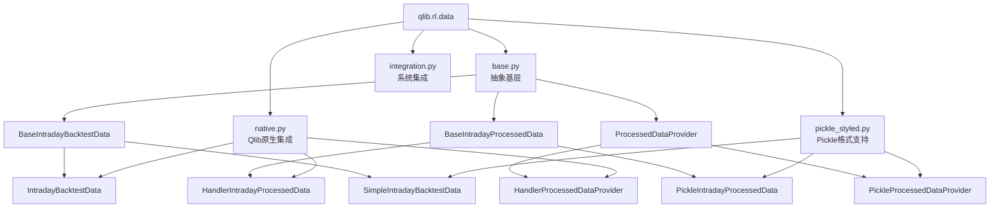
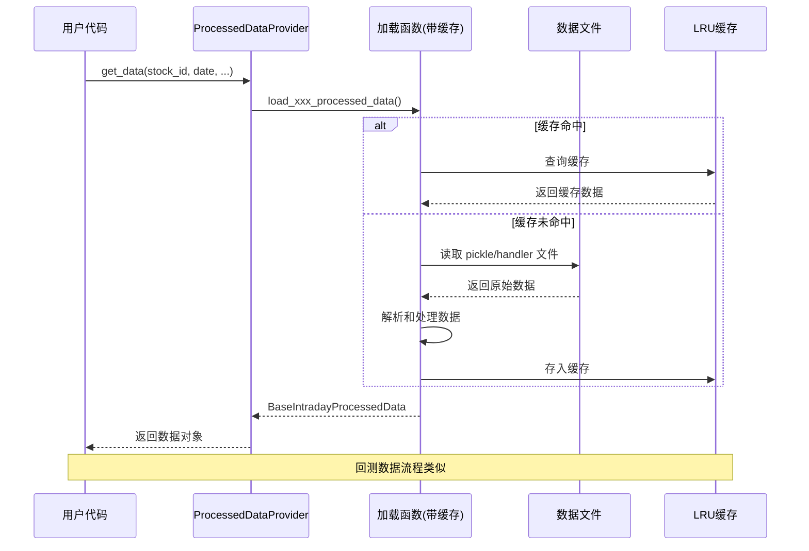

# qlib.rl.data 模块文档

## 模块概述

`qlib.rl.data` 模块是 Qlib 强化学习（RL）框架中的数据处理核心模块，专门用于处理强化学习交易策略所需的日内金融数据。该模块提供了多种数据源格式的支持、数据加载抽象接口，以及回测数据和处理后特征数据的统一管理方式。

**主要功能特性：**
- 支持多种数据格式（Handler 格式、Pickle 格式、DataFrame 原生格式）
- 内置缓存机制优化数据读取性能
- 抽象基类设计，便于扩展新的数据类型
- 日内交易数据的完整支持
- 与 Qlib 回测引擎无缝集成

> **注意**：该模块中的大部分代码片段来自研究项目（论文代码），在生产环境中使用时请谨慎。

---

## 模块架构



---

## 子模块说明

### 1. base.py - 抽象基类模块

该模块定义了数据处理的核心抽象接口，是整个 `rl.data` 模块的基础。

#### 类定义

##### BaseIntradayBacktestData

**描述**：日内回测数据的抽象基类。
用于存储回测时常用的原始市场数据，不同类型的模拟器都有对应的回测数据类型。

**主要方法**：

| 方法 | 描述 | 返回类型 |
|------|------|----------|
| `__repr__()` | 返回对象的字符串表示 | str |
| `__len__()` | 返回数据点数量 | int |
| `get_deal_price()` | 获取成交价时间序列 | pd.Series |
| `get_volume()` | 获取成交量时间序列 | pd.Series |
| `get_time_index()` | 获取时间索引 | pd.DatetimeIndex |

---

##### BaseIntradayProcessedData

**描述**：处理后的日内市场数据抽象基类。
包含经过数据清洗和特征工程后的市场数据，同时包含"今日"和"昨日"的数据，因为某些算法可能使用前一天的市场信息辅助决策。

**属性**：

| 属性 | 类型 | 描述 |
|------|------|------|
| `today` | pd.DataFrame | 今日处理后的数据，记录数必须为 `time_length`，列数必须为 `feature_dim` |
| `yesterday` | pd.DataFrame | 昨日处理后的数据，结构与 `today` 相同 |

---

##### ProcessedDataProvider

**描述**：处理后数据提供者抽象基类。

**主要方法**：

```python
def get_data(
    self,
    stock_id: str,
    date: pd.Timestamp,
    feature_dim: int,
    time_index: pd.Index,
) -> BaseIntradayProcessedData
```

**参数说明**：
- `stock_id`：股票代码
- `date`：日期
- `feature_dim`：特征维度
- `time_index`：时间索引

---

### 2. native.py - Qlib 原生数据模块

该模块提供与 Qlib 模拟器和 Handler 数据格式的集成支持。

#### 函数定义

##### get_ticks_slice

```python
def get_ticks_slice(
    ticks_index: pd.DatetimeIndex,
    start: pd.Timestamp,
    end: pd.Timestamp,
    include_end: bool = False,
) -> pd.DatetimeIndex
```

**描述**：从时间索引中截取指定时间段的数据。

**参数说明**：
- `ticks_index`：原始时间索引
- `start`：开始时间
- `end`：结束时间
- `include_end`：是否包含结束时间点，默认为 False

**返回值**：截取后的时间索引

**示例**：
```python
import pandas as pd
from qlib.rl.data.native import get_ticks_slice

ticks = pd.date_range('2024-01-01 09:30', '2024-01-01 15:00', freq='1min')
start = pd.Timestamp('2024-01-01 10:00')
end = pd.Timestamp('2024-01-01 11:00')

result = get_ticks_slice(ticks, start, end, include_end=True)
```

---

##### load_backtest_data

```python
@cachetools.cached(
    cache=cachetools.LRUCache(100),
    key=lambda order, _, __: order.key_by_day,
)
def load_backtest_data(
    order: Order,
    trade_exchange: Exchange,
    trade_range: TradeRange,
) -> IntradayBacktestData
```

**描述**：加载回测数据，使用 LRU 缓存优化性能（最多缓存 100 个条目）。

**参数说明**：
- `order`：订单对象
- `trade_exchange`：交易交易所对象
- `trade_range`：交易时间范围

**返回值**：日内回测数据对象

**缓存键**：`order.key_by_day`

---

##### load_handler_intraday_processed_data

```python
@cachetools.cached(
    cache=cachetools.LRUCache(100),
    key=lambda data_dir, stock_id, date, feature_columns_today,
           feature_columns_yesterday, backtest, index_only: (
        stock_id, date, backtest, index_only,
    ),
)
def load_handler_intraday_processed_data(
    data_dir: Path,
    stock_id: str,
    date: pd.Timestamp,
    feature_columns_today: List[str],
    feature_columns_yesterday: List[str],
    backtest: bool = False,
    index_only: bool = False,
) -> HandlerIntradayProcessedData
```

**描述**：加载 Handler 格式的日内处理数据，使用 LRU 缓存（最多缓存 100 个条目，约 5MB）。

**参数说明**：
- `data_dir`：数据目录路径
- `stock_id`：股票代码
- `date`：日期
- `feature_columns_today`：今日特征列列表
- `feature_columns_yesterday`：昨日特征列列表
- `backtest`：是否为回测模式，默认为 False
- `index_only`：是否只加载索引，默认为 False

---

#### 类定义

##### IntradayBacktestData

**描述**：Qlib 模拟器的回测数据类。

**构造函数**：
```python
def __init__(
    self,
    order: Order,
    exchange: Exchange,
    ticks_index: pd.DatetimeIndex,
    ticks_for_order: pd.DatetimeIndex,
) -> None
```

**主要方法**：
- `get_deal_price()`：获取成交价序列
- `get_volume()`：获取成交量序列
- `get_time_index()`：获取时间索引

**示例**：
```python
from qlib.rl.data.native import IntradayBacktestData, load_backtest_data
from qlib.backtest import Exchange, Order
from qlib.backtest.decision import TradeRangeByTime

# 方式1：直接构造
backtest_data = IntradayBacktestData(
    order=my_order,
    exchange=my_exchange,
    ticks_index=ticks,
    ticks_for_order=order_ticks
)

# 方式2：使用加载函数（推荐，带缓存）
backtest_data = load_backtest_data(
    order=order,
    trade_exchange=exchange,
    trade_range=TradeRangeByTime("09:30", "15:00")
)

print(len(backtest_data))
print(backtest_data.get_deal_price())
```

---

##### DataframeIntradayBacktestData

**描述**：基于 DataFrame 的回测数据类，支持从任意 DataFrame 创建回测数据。

**构造函数**：
```python
def __init__(
    self,
    df: pd.DataFrame,
    price_column: str = "$close0",
    volume_column: str = "$volume0"
) -> None
```

**参数说明**：
- `df`：包含市场数据的 DataFrame
- `price_column`：价格列名，默认为 `"$close0"`
- `volume_column`：成交量列名，默认为 `"$volume0"`

**示例**：
```python
import pandas as pd
from qlib.rl.data.native import DataframeIntradayBacktestData

# 创建示例数据
dates = pd.date_range('2024-01-01 09:30', periods=240, freq='1min')
df = pd.DataFrame({
    '$close0': np.random.randn(240).cumsum() + 100,
    '$volume0': np.random.randint(1000, 10000, 240)
}, index=dates)

# 创建回测数据对象
backtest_data = DataframeIntradayBacktestData(
    df=df,
    price_column='$close0',
    volume_column='$volume0'
)

print(backtest_data.get_deal_price().head())
```

---

##### HandlerIntradayProcessedData

**描述**：处理 Handler（二进制格式）类型数据的类。

**构造函数**：
```python
def __init__(
    self,
    data_dir: Path,
    stock_id: str,
    date: pd.Timestamp,
    feature_columns_today: List[str],
    feature_columns_yesterday: List[str],
    backtest: bool = False,
    index_only: bool = False,
) -> None
```

**属性**：
- `today`：今日数据 DataFrame
- `yesterday`：昨日数据 DataFrame

---

##### HandlerProcessedDataProvider

**描述**：Handler 格式数据提供者类。

**构造函数**：
```python
def __init__(
    self,
    data_dir: str,
    feature_columns_today: List[str],
    feature_columns_yesterday: List[str],
    backtest: bool = False,
) -> None
```

**示例**：
```python
from pathlib import Path
from qlib.rl.data.native import HandlerProcessedDataProvider

provider = HandlerProcessedDataProvider(
    data_dir="/path/to/data",
    feature_columns_today=["$open", "$high", "$low", "$close"],
    feature_columns_yesterday=["$open_1", "$high_1", "$low_1", "$close_1"],
    backtest=False
)

data = provider.get_data(
    stock_id="SH600000",
    date=pd.Timestamp("2024-01-01"),
    feature_dim=4,
    time_index=time_idx
)
```

---

### 3. pickle_styled.py - Pickle 格式数据模块

该模块提供对 Pickle 格式文件的支持，这是 [OPD 论文](https://seqml.github.io/opd/) 使用的格式（非 Qlib 标准数据格式）。

**注意事项**：
- 所有数据读取函数都使用 `@lru_cache` 装饰器优化性能
- 推荐使用 `get_xxx_yyy` 函数而非直接实例化类
- Pickle 文件使用 Python 3.8 生成，低于 3.7 的版本可能无法加载
- 该模块未来可能与 `qlib.backtest.high_performance_ds` 合并

#### 类型别名

##### DealPriceType

```python
DealPriceType = Literal["bid_or_ask", "bid_or_ask_fill", "close"]
```

**描述**：成交价类型。

**可选值说明**：
- `"bid_or_ask"`：卖出时使用 `$bid0`，买入时使用 `$ask0`
- `"bid_or_ask_fill"`：基于 `bid_or_ask`，如果价格为 0，则使用另一个价格填充
- `"close"`：使用收盘价 `$close0` 作为成交价

---

#### 函数定义

##### load_orders

```python
def load_orders(
    order_path: Path,
    start_time: pd.Timestamp = None,
    end_time: pd.Timestamp = None,
) -> Sequence[Order]
```

**描述**：加载订单数据，并设置订单的开始和结束时间。

**参数说明**：
- `order_path`：订单文件路径或目录路径
- `start_time`：开始时间，默认为 "0:00:00"
- `end_time`：结束时间，默认为 "23:59:59"

**返回值**：订单序列

**示例**：
```python
from pathlib import Path
import pandas as pd
from qlib.rl.data.pickle_styled import load_orders

# 加载单个文件的订单
orders = load_orders(
    order_path=Path("/path/to/orders.pkl"),
    start_time=pd.Timestamp("09:30:00"),
    end_time=pd.Timestamp("15:00:00")
)

# 加载目录下所有订单文件
orders = load_orders(order_path=Path("/path/to/orders_dir/"))

for order in orders:
    print(f"股票: {order.stock_id}, 数量: {order.amount}")
```

---

##### load_simple_intraday_backtest_data

```python
@lru_cache(maxsize=100)
def load_simple_intraday_backtest_data(
    data_dir: Path,
    stock_id: str,
    date: pd.Timestamp,
    deal_price: DealPriceType = "close",
    order_dir: int | None = None,
) -> SimpleIntradayBacktestData
```

**描述**：加载简单模拟器的日内回测数据，使用 LRU 缓存（最多 100 个条目）。

---

##### load_pickle_intraday_processed_data

```python
@cachetools.cached(
    cache=cachetools.LRUCache(100),
    key=lambda data_dir, stock_id, date, feature_dim, time_index:
        hashkey(data_dir, stock_id, date),
)
def load_pickle_intraday_processed_data(
    data_dir: Path,
    stock_id: str,
    date: pd.Timestamp,
    feature_dim: int,
    time_index: pd.Index,
) -> BaseIntradayProcessedData
```

**描述**：加载 Pickle 格式的日内处理数据，使用 LRU 缓存（最多 100 个条目，约 5MB）。

---

#### 类定义

##### SimpleIntradayBacktestData

**描述**：简单模拟器的回测数据类。

**构造函数**：
```python
def __init__(
    self,
    data_dir: Path | str,
    stock_id: str,
    date: pd.Timestamp,
    deal_price: DealPriceType = "close",
    order_dir: int | None = None,
) -> None
```

**主要方法**：

| 方法 | 描述 |
|------|------|
| `get_deal_price()` | 根据成交价类型返回成交价序列 |
| `get_volume()` | 返回成交量序列 |
| `get_time_index()` | 返回时间索引 |

**示例**：
```python
from pathlib import Path
import pandas as pd
from qlib.rl.data.pickle_styled import (
    SimpleIntradayBacktestData,
    load_simple_intraday_backtest_data,
    DealPriceType
)
from qlib.backtest.decision import OrderDir

# 方式1：直接构造
backtest_data = SimpleIntradayBacktestData(
    data_dir="/path/to/data",
    stock_id="SH600000",
    date=pd.Timestamp("2024-01-01"),
    deal_price="bid_or_ask",
    order_dir=OrderDir.BUY
)

# 方式2：使用加载函数（推荐，带缓存）
backtest_data = load_simple_intraday_backtest_data(
    data_dir=Path("/path/to/data"),
    stock_id="SH600000",
    date=pd.Timestamp("2024-01-01"),
    deal_price="close",
    order_dir=None
)

print(backtest_data.get_deal_price())
print(backtest_data.get_volume())
```

---

##### PickleIntradayProcessedData

**描述**：处理 Pickle 格式数据的类。

**构造函数**：
```python
def __init__(
    self,
    data_dir: Path | str,
    stock_id: str,
    date: pd.Timestamp,
    feature_dim: int,
    time_index: pd.Index,
) -> None
```

**说明**：
- 自动推断特征列名（支持 16 维、6 维、5 维数据）
- 支持新旧两种数据格式
- 属性 `today` 和 `yesterday` 分别存储今日和昨日数据

---

##### PickleProcessedDataProvider

**描述**：Pickle 格式数据提供者类。

**构造函数**：
```python
def __init__(self, data_dir: Path) -> None
```

**示例**：
```python
from pathlib import Path
from qlib.rl.data.pickle_styled import PickleProcessedDataProvider

provider = PickleProcessedDataProvider(data_dir=Path("/path/to/data"))

data = provider.get_data(
    stock_id="SH600000",
    date=pd.Timestamp("2024-01-01"),
    feature_dim=16,
    time_index=time_idx
)

print(data.today.head())
print(data.yesterday.head())
```

---

### 4. integration.py - 系统集成模块

该模块用于将 NeuTrader 与 Qlib 集成，用于运行现有项目。

> **注意**：该实现较为临时，未来可能会设计更统一通用的实现。

#### 函数定义

##### init_qlib

```python
def init_qlib(qlib_config: dict) -> None
```

**描述**：初始化 Qlib 必要资源，包括数据目录、特征列等。

**参数说明**：
- `qlib_config`：Qlib 配置字典

**配置示例**：
```python
{
    "provider_uri_day": DATA_ROOT_DIR / "qlib_1d",
    "provider_uri_1min": DATA_ROOT_DIR / "qlib_1min",
    "feature_root_dir": DATA_ROOT_DIR / "qlib_handler_stock",
    "feature_columns_today": [
        "$open", "$high", "$low", "$close", "$vwap", "$bid", "$ask", "$volume",
        "$bidV", "$bidV1", "$bidV3", "$bidV5", "$askV", "$askV1", "$askV3", "$askV5",
    ],
    "feature_columns_yesterday": [
        "$open_1", "$high_1", "$low_1", "$close_1", "$vwap_1", "$bid_1", "$ask_1", "$volume_1",
        "$bidV_1", "$bidV1_1", "$bidV3_1", "$bidV5_1", "$askV_1", "$askV1_1", "$askV3_1", "$askV5_1",
    ],
}
```

**功能特性**：
- 自动配置多时间粒度（1min、5min、day）的数据提供者
- 注册自定义高频操作算子：
  - `DayLast`、`FFillNan`、`BFillNan`
  - `Date`、`Select`、`IsNull`、`IsInf`
  - `Cut`、`DayCumsum`
- 配置中国地区（REG_CN）日历
- 保留内存缓存以提升性能

**使用示例**：
```python
from pathlib import Path
from qlib.rl.data.integration import init_qlib

config = {
    "provider_uri_day": Path("/data/qlib_1d"),
    "provider_uri_1min": Path("/data/qlib_1min"),
    "feature_columns_today": ["$open", "$high", "$low", "$close", "$volume"],
    "feature_columns_yesterday": ["$open_1", "$high_1", "$low_1", "$close_1", "$volume_1"],
}

# 初始化 Qlib
init_qlib(config)

# 之后可以正常使用 Qlib 的其他功能
```

---

## 完整使用示例

### 示例 1：使用 Pickle 格式数据进行回测

```python
from pathlib import Path
import pandas as pd
from qlib.rl.data.pickle_styled import (
    load_orders,
    load_simple_intraday_backtest_data,
    PickleProcessedDataProvider,
    DealPriceType
)
from qlib.backtest.decision import OrderDir

# 1. 配置路径
data_dir = Path("/path/to/data")
order_path = Path("/path/to/orders")

# 2. 加载订单
orders = load_orders(
    order_path=order_path,
    start_time=pd.Timestamp("09:30:00"),
    end_time=pd.Timestamp("15:00:00")
)

# 3. 处理每个订单
for order in orders:
    print(f"处理订单: {order.stock_id}")

    # 加载回测数据
    backtest_data = load_simple_intraday_backtest_data(
        data_dir=data_dir,
        stock_id=order.stock_id,
        date=order.start_time.normalize(),
        deal_price="bid_or_ask",
        order_dir=order.direction
    )

    # 获取成交价和成交量
    prices = backtest_data.get_deal_price()
    volumes = backtest_data.get_volume()

    print(f"  数据点数量: {len(backtest_data)}")
    print(f"  平均成交价: {prices.mean():.2f}")
```

### 示例 2：使用 Handler 格式数据与 Qlib 集成

```python
from pathlib import Path
import pandas as pd
from qlib.rl.data.integration import init_qlib
from qlib.rl.data.native import (
    HandlerProcessedDataProvider,
    load_backtest_data
)
from qlib.backtest import Exchange, Order
from qlib.backtest.decision import TradeRangeByTime

# 1. 初始化 Qlib
qlib_config = {
    "provider_uri_day": Path("/data/qlib_1d"),
    "provider_uri_1min": Path("/data/qlib_1min"),
    "feature_root_dir": Path("/data/features"),
    "feature_columns_today": [
        "$open", "$high", "$low", "$close", "$vwap", "$volume"
    ],
    "feature_columns_yesterday": [
        "$open_1", "$high_1", "$low_1", "$close_1", "$vwap_1", "$volume_1"
    ],
}
init_qlib(qlib_config)

# 2. 创建数据提供者
provider = HandlerProcessedDataProvider(
    data_dir="/data/features",
    feature_columns_today=qlib_config["feature_columns_today"],
    feature_columns_yesterday=qlib_config["feature_columns_yesterday"],
    backtest=False
)

# 3. 获取处理后的数据
date = pd.Timestamp("2024-01-01")
time_index = pd.date_range("09:30", "15:00", freq="1min")

processed_data = provider.get_data(
    stock_id="SH600000",
    date=date,
    feature_dim=6,
    time_index=time_index
)

# 4. 使用数据
print("今日数据:")
print(processed_data.today.head())
print("\n昨日数据:")
print(processed_data.yesterday.head())
```

### 示例 3：使用 DataFrame 创建自定义回测数据

```python
import numpy as np
import pandas as pd
from qlib.rl.data.native import DataframeIntradayBacktestData

# 1. 创建模拟的分钟级数据
np.random.seed(42)
n_minutes = 240  # 4小时交易时间
times = pd.date_range("2024-01-01 09:30", periods=n_minutes, freq="1min")

# 生成价格数据（带趋势的随机游走）
base_price = 100.0
returns = np.random.normal(0, 0.001, n_minutes)
prices = base_price * (1 + returns).cumprod()

# 生成买卖价（有微小点差）
bid_prices = prices - 0.01
ask_prices = prices + 0.01

# 生成成交量
volumes = np.random.randint(1000, 10000, n_minutes)

# 2. 构建 DataFrame
df = pd.DataFrame({
    "$close0": prices,
    "$bid0": bid_prices,
    "$ask0": ask_prices,
    "$volume0": volumes
}, index=times)

# 3. 创建回测数据对象
backtest_data = DataframeIntradayBacktestData(
    df=df,
    price_column="$close0",
    volume_column="$volume0"
)

# 4. 使用数据
print(f"总数据点数: {len(backtest_data)}")
print(f"\n前5条成交价:")
print(backtest_data.get_deal_price().head())
print(f"\n时间范围:")
print(f"  开始: {backtest_data.get_time_index()[0]}")
print(f"  结束: {backtest_data.get_time_index()[-1]}")
```

---

## 数据流程图



---

## 性能优化建议

1. **使用缓存加载函数**：推荐使用 `load_xxx` 系列函数而非直接实例化类，这些函数内置了 LRU 缓存。

2. **合理设置缓存大小**：
   - `load_backtest_data`: 缓存 100 个条目
   - `load_simple_intraday_backtest_data`: 缓存 100 个条目
   - 可根据实际内存情况调整

3. **批量处理**：按日期或股票分组处理，减少重复加载。

4. **内存管理**：处理大量数据后可手动清理缓存：
   ```python
   load_simple_intraday_backtest_data.cache_clear()
   ```

---

## 注意事项

1. **生产环境使用**：模块文档提示大部分代码来自研究项目，生产环境使用需谨慎。

2. **Python 版本**：Pickle 文件使用 Python 3.8 生成，低版本可能无法加载。

3. **日期处理**：注意区分 `date` 和 `datetime` 列，模块会自动转换。

4. **数据格式兼容性**：`pickle_styled.py` 支持新旧两种数据格式，会自动适配。

5. **缓存一致性**：修改源数据文件后需要清理缓存或重启程序。

---

## 文件位置

| 文件 | 路径 |
|------|------|
| 模块入口 | `/home/firewind0/qlib/qlib/rl/data/__init__.py` |
| 抽象基类 | `/home/firewind0/qlib/qlib/rl/data/base.py` |
| Qlib 原生支持 | `/home/firewind0/qlib/qlib/rl/data/native.py` |
| Pickle 格式支持 | `/home/firewind0/qlib/qlib/rl/data/pickle_styled.py` |
| 系统集成 | `/home/firewind0/qlib/qlib/rl/data/integration.py` |
