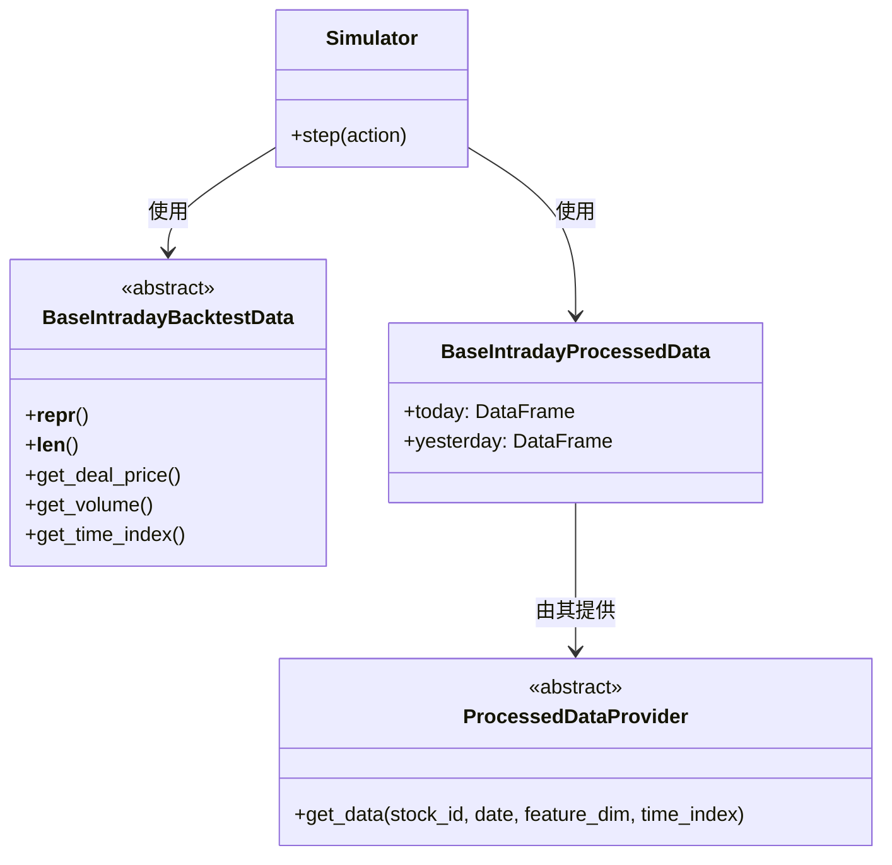

# qlib.rl.data.base 模块文档

## 模块概述

`qlib.rl.data.base` 模块定义了回测和处理数据的基类，是 `qlib.rl.data` 子模块的核心接口。

## 主要组件

### BaseIntradayBacktestData

```python
class BaseIntradayBacktestData
```

**说明**：回测中常用的原始市场数据基类。

每种类型的模拟器都有对应的回测数据类型。

#### 方法

##### `__repr__() -> str`

**说明**：**抽象方法**，返回对象的字符串表示。

**返回**：字符串

**抛出**：`NotImplementedError` - 如果子类未实现

##### `__len__() -> int`

**说明**：**抽象方法**，返回数据长度。

**返回**：数据长度

**抛出**：`NotImplementedError` - 如果子类未实现

##### `get_deal_price() -> pd.Series`

**说明**：**抽象方法**，返回成交价格序列。

**返回**：pandas Series，可以用时间索引访问

**抛出**：`NotImplementedError` - 如果子类未实现

##### `get_volume() -> pd.Series`

**说明**：**抽象方法**，返回成交量序列。

**返回**：pandas Series，可以用可以用时间索引访问

**抛出**：`NotImplementedError` - 如果子类未实现

##### `get_time_index() -> pd.DatetimeIndex`

**说明**：**抽象方法**，返回时间索引。

**返回**：pandas DatetimeIndex

**抛出**：`NotImplementedError` - 如果子类未实现

### BaseIntradayProcessedData

```python
class BaseIntradayProcessedData
```

**说明**：经过数据清理和特征工程后的处理数据。

包含"今天"和"昨天"的数据，因为某些算法可能使用前一天的市场信息来辅助决策。

#### 属性

| 属性名 | 类型 | 说明 |
|--------|------|------|
| `today` | `pd.DataFrame` | "今天"的处理数据，行数为 `time_length`，列数为 `feature_dim` |
| `yesterday` | `pd.DataFrame` | "昨天"的处理数据，行数为 `time_length`，列数为 `feature_dim` |

### ProcessedDataProvider

```python
class ProcessedDataProvider
```

**说明**：处理数据的提供者接口。

#### 方法

##### `get_data(stock_id, date, feature_dim, time_index) -> BaseIntradayProcessedData`

**说明**：获取指定股票和日期的处理数据。

**参数**：
- `stock_id`: 股票 ID
- `date`: 日期
- `feature_dim`: 特征维度
- `time_index`: 时间索引

**返回**：处理后的数据对象

**抛出**：`NotImplementedError` - 如果子类未实现

## 使用示例

### 实现自定义回测数据

```python
import pandas as pd
from qlib.rl.data.base import BaseIntradayBacktestData

class CustomBacktestData(BaseIntradayBacktestData):
    def __init__(self, data: pd.DataFrame):
        self.data = data

    def __repr__(self):
        return f"CustomBacktestData(len={len(self.data)})"

    def __len__(self):
        return len(self.data)

    def get_deal_price(self):
        return self.data['price']

    def get_volume(self):
        return self.data['volume']

    def get_time_index(self):
        return self.data.index
```

### 实现自定义处理数据

```python
import pandas as pd
from qlib.rl.data.base import BaseIntradayProcessedData

class CustomProcessedData(BaseIntradayProcessedData):
    def __init__(self, today_data, yesterday_data):
        self.today = today_data
        self.yesterday = yesterday_data
```

### 实现自定义数据提供者

```python
import pandas as pd
from qlib.rl.data.base import ProcessedDataProvider, BaseIntradayProcessedData

class CustomDataProvider(ProcessedDataProvider):
    def __init__(self, data_source):
        self.data_source = data_source

    def get_data(self, stock_id, date, feature_dim, time_index):
        # 从数据源加载并处理数据
        raw_data = self.data_source.load(stock_id, date)

        today = raw_data[:len(time_index)]
        yesterday = raw_data[len(time_index):]

        processed = BaseIntradayProcessedData()
        processed.today = today
        processed.yesterday = yesterday

        return processed
```

## 设计模式



## 注意事项

1. **数据一致性**：确保 `today` 和 `yesterday` 的维度一致
2. **时间对齐**：确保时间索引与数据长度匹配
3. **内存管理**：处理后的数据可能较大，注意内存使用
4. **线程安全**：如果数据提供者会被多个线程使用，确保线程安全

## 相关文档

- [pickle_styled.md](./pickle_styled.md) - Pickle 格式实现
- [native.md](./native.md) - 原生格式实现
