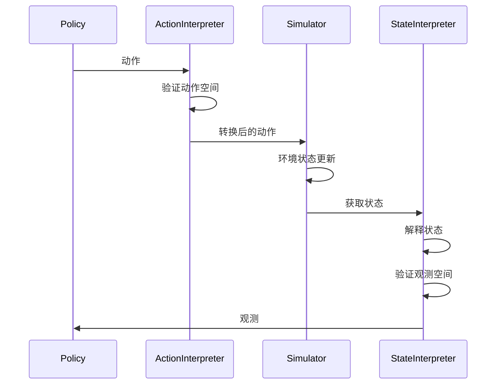
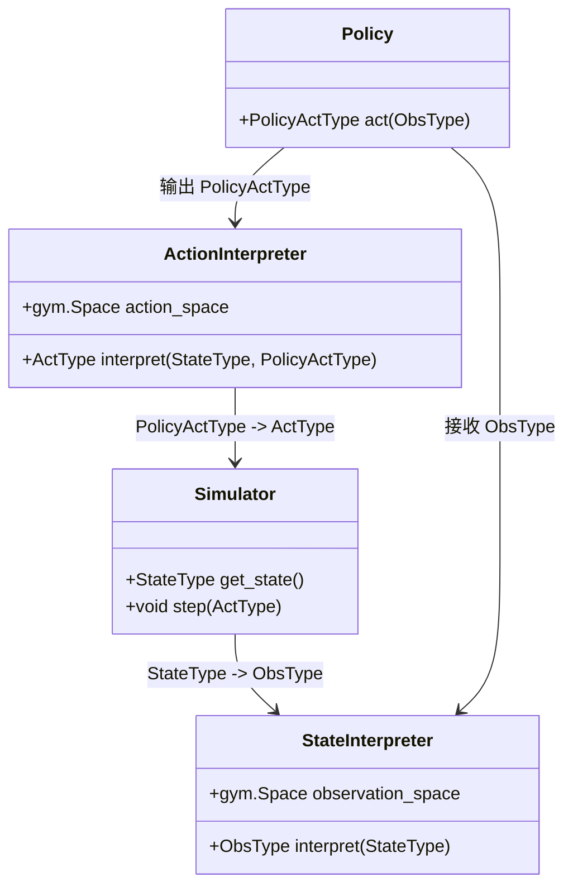

# qlib.rl.interpreter 模块文档

## 模块概述

`qlib.rl.interpreter` 模块定义了解释器接口，用于在模拟器状态和策略状态之间进行双向转换。

解释器是 QLib RL 框架中的关键组件，负责：

1. **状态解释器**（`StateInterpreter`）：将模拟器内部状态转换为策略可观测的格式
2. **动作解释器**（`ActionInterpreter`）：将策略输出的动作转换为模拟器可接受的格式

## 主要组件

### Interpreter

```python
class Interpreter
```

**说明**：解释器基类，仅用于 `isinstance` 类型检查。

**设计原则**：
- 解释器应该是无状态的
- 不建议使用 `self.xxx` 存储临时信息（这是反模式）
- 未来可能支持通过 `self.env.register_state()` 注册解释器相关状态

### StateInterpreter

```python
class StateInterpreter(Generic[StateType, ObsType], Interpreter)
```

**说明**：状态解释器，将模拟器执行结果的状态转换为 RL 环境的观测（Observation）。

#### 方法

##### `observation_space -> gym.Space`

**说明**：**属性**，定义观测空间的类型和范围。

**返回**：`gym.Space` 对象，描述观测的特征空间

##### `__call__(simulator_state: StateType) -> ObsType`

**说明**：调用解释器并验证输出。

**参数**：
- `simulator_state`: 从模拟器获取的状态，通过 `simulator.get_state()` 获得

**返回**：符合观测空间的观测对象

**流程**：
1. 调用 `interpret` 方法进行状态转换
2. 调用 `validate` 方法验证输出是否符合观测空间
3. 返回验证后的观测

##### `validate(obs: ObsType) -> None`

**说明**：验证观测对象是否属于预定义的观测空间。

**参数**：
- `obs`: 待验证的观测对象

**抛出**：`GymSpaceValidationError` - 如果观测不符合空间定义

##### `interpret(simulator_state: StateType) -> ObsType`

**说明**：**抽象方法**，将模拟器状态解释为策略所需的状态。

**参数**：
- `simulator_state`: 从模拟器获取的状态，通过 `simulator.get_state()` 获得

**返回**：策略所需的状态对象，应符合 `observation_space` 的定义

**抛出**：`NotImplementedError` - 如果子类未实现此方法

### ActionInterpreter

```python
class ActionInterpreter(Generic[StateType, PolicyActType, ActType], Interpreter)
```

**说明**：动作解释器，将 RL 智能体的动作转换为模拟器可接受的指令。

#### 方法

##### `action_space -> gym.Space`

**说明**：**属性**，定义动作空间的类型和范围。

**返回**：`gym.Space` 对象，描述动作的特征空间

##### `__call__(simulator_state: StateType, action: PolicyActType) -> ActType`

**说明**：调用解释器并验证输入。

**参数**：
- `simulator_state`: 从模拟器获取的状态，通过 `simulator.get_state()` 获得
- `action`: 策略输出的原始动作

**返回**：模拟器可接受的动作对象

**流程**：
1. 调用 `validate` 方法验证输入是否符合动作空间
2. 调用 `interpret` 方法进行动作转换
3. 返回转换后的动作

##### `validate(action: PolicyActType) -> None`

**说明**：验证动作对象是否属于预定义的动作空间。

**参数**：
- `action`: 待验证的动作对象

**抛出**：`GymSpaceValidationError` - 如果动作不符合空间定义

##### `interpret(simulator_state: StateType, action: PolicyActType) -> ActType`

**说明**：**抽象方法**，将策略动作转换为模拟器动作。

**参数**：
- `simulator_state`: 从模拟器获取的状态，通过 `simulator.get_state()` 获得
- `action`: 策略输出的原始动作

**返回**：模拟器所需的对象

**抛出**：`NotImplementedError` - 如果子类未实现此方法

## 辅助函数和类

### _gym_space_contains(space: gym.Space, x: Any) -> None

**说明**：`gym.Space.contains` 的增强版本，提供更详细的验证失败信息。

**参数**：
- `space`: gym 空间对象
- `x`: 待验证的样本

**抛出**：`GymSpaceValidationError` - 如果验证失败，包含详细的诊断信息

**支持的类型**：
- `spaces.Dict`: 字典空间
- `spaces.Tuple`: 元组空间
- 其他 gym 空间：直接使用 `contains` 方法

### GymSpaceValidationError

```python
class GymSpaceValidationError(Exception)
```

**说明**：空间验证异常类，提供详细的错误信息。

#### 属性

| 属性名 | 类型 | 说明 |
|--------|------|------|
| `message` | `str` | 错误消息 |
| `space` | `gym.Space` | 定义的空间 |
| `x` | `Any` | 验证的样本 |

## 类型定义

| 类型变量 | 说明 |
|---------|------|
| `StateType` | 模拟器状态类型 |
| `ObsType` | 观测类型 |
| `PolicyActType` | 策略动作类型 |
| `ActType` | 模拟器动作类型 |

## 使用示例

### 状态解释器示例

```python
from qlib.rl.interpreter import StateInterpreter
from gym import spaces
import numpy as np

class MyStateInterpreter(StateInterpreter):
    @property
    def observation_space(self):
        return spaces.Box(
            low=-np.inf,
            high=np.inf,
            shape=(10,),  # 10维观测
            dtype=np.float32
        )

    def interpret(self, simulator_state):
        """将模拟器状态转换为10维向量"""
        # 假设 simulator_state 是一个字典
        return np.array([
            simulator_state['price'],
            simulator_state['volume'],
            simulator_state['ma5'],
            simulator_state['ma20'],
            # ... 其他特征
        ], dtype=np.float32)
```

### 动作解释器示例

```python
from qlib.rl.interpreter import ActionInterpreter
from gym import spaces

class MyActionInterpreter(ActionInterpreter):
    @property
    def action_space(self):
        # 离散动作空间：0=买入, 1=持有, 2=卖出
        return spaces.Discrete(3)

    def interpret(self, simulator_state, action):
        """将离散动作转换为模拟器订单"""
        action_map = {
            0: 'buy',
            1: 'hold',
            2: 'sell'
        }
        return {
            'action': action_map[action],
            'amount': simulator_state['current_position'] * 0.1
        }
```

### 组合使用示例

```python
from qlib.rl import EnvWrapper, Simulator

# 创建模拟器
simulator = MySimulator(initial_state)

# 创建解释器
state_interpreter = MyStateInterpreter()
action_interpreter = MyActionInterpreter()

# 创建环境
env = EnvWrapper(
    simulator=simulator,
    state_interpreter=state_interpreter,
    action_interpreter=action_interpreter,
    reward=reward_fn
)

# 检查空间
print(f"Observation space: {env.observation_space}")
print(f"Action space: {env.action_space}")

# 运行环境
obs = env.reset()
action = env.action_space.sample()  # 随机动作
next_obs, reward, done, info = env.step(action)
```

## 高级用法

### 使用字典空间

```python
from gym import spaces

class DictStateInterpreter(StateInterpreter):
    @property
    def observation_space(self):
        return spaces.Dict({
            'prices': spaces.Box(low=0, high=np.inf, shape=(10,)),
            'volumes': spaces.Box(low=0, high=np.inf, shape=(10,)),
            'indicators': spaces.Box(low=-1, high=1, shape=(5,))
        })

    def interpret(self, simulator_state):
        return {
            'prices': simulator_state['prices'],
            'volumes': simulator_state['volumes'],
            'indicators': simulator_state['indicators']
        }
```

### 使用元组空间

```python
from gym import spaces

class TupleStateInterpreter(StateInterpreter):
    @property
    def observation_space(self):
        return spaces.Tuple([
            spaces.Box(low=0, high=1, shape=(1,)),  # 仓位
            spaces.Box(low=0, high=np.inf, shape=(10,)),  # 价格历史
            spaces.Discrete(3)  # 市场状态
        ])

    def interpret(self, simulator_state):
        return (
            simulator_state['position'],
            simulator_state['price_history'],
            simulator_state['market_state']
        )
```

## 设计模式

### 解释器模式



### 类型安全



## 验证机制

### 空间验证流程

1. **定义空间**：通过 `observation_space` 或 `action_space` 属性
2. **自动验证**：在解释器调用时自动验证输入/输出
3. **详细错误**：`GymSpaceValidationError` 提供失败原因和位置

### 验证失败示例

```python
# 假设 observation_space 定义为 shape (10,)
obs = np.random.randn(5)  # 错误：shape 不匹配
obs = state_interpreter(obs)
# 抛出：GymSpaceValidationError: Sample must be a tuple with same length as space.
```

## 最佳实践

### 1. 保持无状态

```python
# 好的做法
class GoodInterpreter(StateInterpreter):
    def interpret(self, state):
        return np.array([...])

# 坏的做法
class BadInterpreter(StateInterpreter):
    def __init__(self):
        self.cache = []  # 反模式

    def interpret(self, state):
        self.cache.append(state)
        return np.array([...])
```

### 2. 使用类型提示

```python
from typing import NamedTuple
import numpy as np

class TypedInterpreter(StateInterpreter):
    @property
    def observation_space(self):
        return spaces.Box(low=-1, high=1, shape=(10,), dtype=np.float32)

    def interpret(self, simulator_state: Dict[str, Any]) -> np.ndarray:
        return np.array([...], dtype=np.float32)
```

### 3. 完整的错误处理

```python
class RobustInterpreter(StateInterpreter):
    def interpret(self, simulator_state):
        try:
            obs = self._convert_state(simulator_state)
        except KeyError as e:
            raise ValueError(f"Missing key in state: {e}")
        except (ValueError, TypeError) as e:
            raise ValueError(f"Invalid state format: {e}")
        return obs
```

## 注意事项

1. **性能考虑**：`interpret` 方法会在每个步骤调用，应保持高效
2. **内存一致性**：确保返回的观测是独立的副本，避免共享引用
3. **空间一致性**：观测/动作必须严格符合定义的空间
4. **可逆性**：动作解释器应保持明确的语义，便于调试

## 相关文档

- [__init__.md](./__init__.md) - RL 模块概览
- [simulator.md](./simulator.md) - 模拟器文档
- [reward.md](./reward.md) - 奖励计算文档
