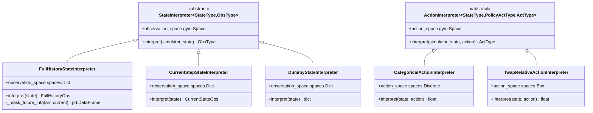
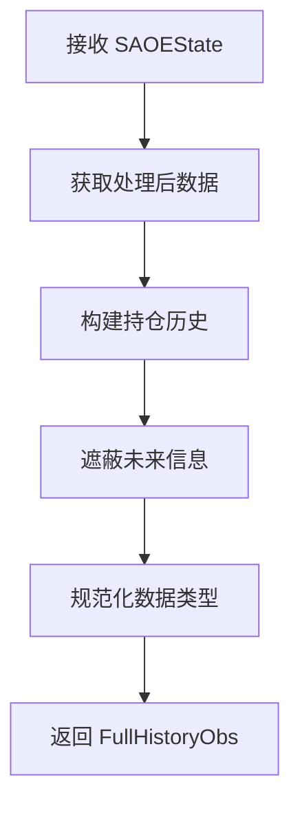
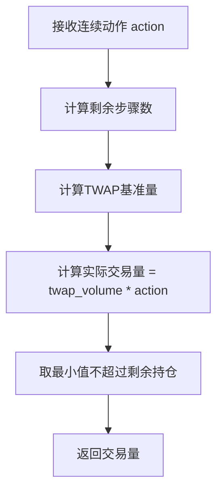

# 订单执行解释器 (Order Execution Interpreter)

## 模块概述

`interpreter.py` 模块提供了强化学习（RL）环境中订单执行任务的状态解释器和动作解释器。这些解释器负责在仿真器状态和策略所需的状态之间进行转换，以及将策略动作转换为仿真器可接受的动作。

该模块主要包含以下功能：

- **状态解释器**：将订单执行状态转换为强化学习策略可理解的观测空间
- **动作解释器**：将强化学习策略的输出动作转换为实际的交易量
- **数据类型规范化**：将数值类型转换为标准的32位格式

## 核心架构



## 工具函数

### `canonicalize(value)`

将数值类型规范化为标准的32位格式（递归处理）。

**参数：**
- `value` (int | float | np.ndarray | pd.DataFrame | dict)：需要规范化的值

**返回值：**
- `np.ndarray | dict`：规范化后的值

**类型转换规则：**
- `pd.DataFrame` → 转换为 NumPy 数组
- 浮点数类型 → `np.float32`
- 整数类型 → `np.int32`
- 字典 → 递归处理每个值

**示例：**
```python
import numpy as np
import pandas as pd

# DataFrame 转 NumPy
df = pd.DataFrame({'a': [1.0, 2.0], 'b': [3.0, 4.0]})
result = canonicalize(df)  # 返回 np.ndarray

# 浮点数规范化
result = canonicalize(3.14159)  # 返回 np.float32(3.14159)

# 字典递归处理
result = canonicalize({'a': 1.0, 'b': 2})  # 返回 {'a': float32, 'b': int32}
```

---

## 数据类型定义

### `FullHistoryObs`

完整历史观测的数据类型定义（TypedDict）。

**字段：**
- `data_processed` (Any)：当日处理后的市场数据
- `data_processed_prev` (Any)：前一日的市场数据
- `acquiring` (Any)：是否为买入（1=买入，0=卖出）
- `cur_tick` (Any)：当前时间刻度索引
- `cur_step` (Any)：当前步骤索引
- `num_step` (Any)：总步骤数
- `target` (Any)：目标订单数量
- `position` (Any)：当前持仓
- `position_history` (Any)：历史持仓记录

### `CurrentStateObs`

当前步骤观测的数据类型定义（TypedDict）。

**字段：**
- `acquiring` (bool)：是否为买入
- `cur_step` (int)：当前步骤索引
- `num_step` (int)：总步骤数
- `target` (float)：目标订单数量
- `position` (float)：当前持仓

---

## 状态解释器类

### `DummyStateInterpreter`

**用途：** 空解释器，用于不需要输入的策略（如 AllOne 策略）。

**父类：** `StateInterpreter[SAOEState, dict]`

#### `__init__()`

构造函数，继承自父类。

#### `interpret(state: SAOEState) -> dict`

将状态解释为虚拟观测值。

**参数：**
- `state` (SAOEState)：仿真器状态

**返回值：**
- `dict`：包含虚拟数据的字典 `{"DUMMY": 1}`

**说明：**
- 这是一个虚拟实现，用于通过 `check_nan_observation` 检查
- 未来计划寻找更好的替代方案

**示例：**
```python
from qlib.rl.order_execution.interpreter import DummyStateInterpreter

interpreter = DummyStateInterpreter()
observation = interpreter.interpret(state)
# observation = {"DUMMY": np.int32(1)}
```

#### `observation_space` (属性)

**返回值：**
- `spaces.Dict`：观测空间定义

**定义：**
```python
spaces.Dict({
    "DUMMY": spaces.Box(-np.inf, np.inf, shape=(), dtype=np.int32)
})
```

---

### `FullHistoryStateInterpreter`

**用途：** 提供完整历史观测，包括当日（直到当前时刻）和昨日的所有数据。

**父类：** `StateInterpreter[SAOEState, FullHistoryObs]`

#### 构造方法

```python
def __init__(
    self,
    max_step: int,
    data_ticks: int,
    data_dim: int,
    processed_data_provider: dict | ProcessedDataProvider,
) -> None
```

**参数说明：**

| 参数名 | 类型 | 必填 | 说明 |
|--------|------|------|------|
| `max_step` | int | 是 | 总步骤数（上界估计），例如：390分钟 / 30分钟每步 = 13步 |
| `data_ticks` | int | 是 | 总记录数，等于数据刻度总数。例如在SAOE每分钟场景下，总刻度数等于一天中的分钟数 |
| `data_dim` | int | 是 | 数据的特征维度数 |
| `processed_data_provider` | dict \| ProcessedDataProvider | 是 | 处理后数据的提供者，可以是配置字典或已实例化的对象 |

**示例：**
```python
from qlib.rl.order_execution.interpreter import FullHistoryStateInterpreter

# 创建完整历史状态解释器
interpreter = FullHistoryStateInterpreter(
    max_step=13,           # 总共13个步骤
    data_ticks=390,        # 390分钟数据
    data_dim=10,           # 10个特征维度
    processed_data_provider={
        "class": "qlib.contrib.data.processor.OrderPrcProcessor",
        "fit_start": "2020-01-01",
        "fit_end": "2023-12-31",
    }
)
```

#### `interpret(state: SAOEState) -> FullHistoryObs`

将仿真器状态解释为完整历史观测。

**参数：**
- `state` (SAOEState)：SAOE（Simulator of Order Execution）仿真器状态

**返回值：**
- `FullHistoryObs`：包含完整历史信息的观测字典

**返回字段说明：**

| 字段 | 类型 | 说明 |
|------|------|------|
| `data_processed` | np.ndarray | 当日处理后的市场数据，未来信息被遮蔽 |
| `data_processed_prev` | np.ndarray | 前一日的市场数据 |
| `acquiring` | np.int32 | 是否为买入（1=买入，0=卖出） |
| `cur_tick` | np.int32 | 当前时间刻度索引 |
| `cur` | np.int32 | 当前步骤索引 |
| `num_step` | np.int32 | 总步骤数 |
| `target` | np.float32 | 目标订单数量 |
| `position` | np.float32 | 当前持仓 |
| `position_history` | np.float32 | 历史持仓记录数组 |

**关键特性：**
1. **未来信息遮蔽**：`data_processed` 中当前时刻之后的数据被设置为0
2. **边界保护**：使用 `min` 确保索引不越界，使网络在最终步骤也能正常工作
3. **持仓历史**：构建从初始订单量到当前持仓的完整历史

**示例：**
```python
observation = interpreter.interpret(state)

# 访问观测数据
current_data = observation['data_processed']
prev_data = observation['data_processed_prev']
is_buying = observation['acquiring']
current_step = observation['cur_step']
remaining_position = observation['position']
```

**处理流程：**



#### `observation_space` (属性)

**返回值：**
- `spaces.Dict`：观测空间定义

**空间定义：**
```python
spaces.Dict({
    "data_processed": spaces.Box(-np.inf, np.inf, shape=(data_ticks, data_dim)),
    "data_processed_prev": spaces.Box(-np.inf, np.inf, shape=(data_ticks, data_dim)),
    "acquiring": spaces.Discrete(2),  # 0 或 1
    "cur_tick": spaces.Box(0, data_ticks - 1, shape=(), dtype=np.int32),
    "cur_step": spaces.Box(0, max_step - 1, shape=(), dtype=np.int32),
    "num_step": spaces.Box(max_step, max_step, shape=(), dtype=np.int32),
    "target": spaces.Box(-EPS, np.inf, shape=()),
    "position": spaces.Box(-EPS, np.inf, shape=()),
    "position_history": spaces.Box(-EPS, np.inf, shape=(max_step,)),
})
```

#### `_mask_future_info(arr: pd.DataFrame, current: pd.Timestamp) -> pd.ndarray` (静态方法)

遮蔽DataFrame中当前时刻及之后的数据。

**参数：**
- `arr` (pd.DataFrame)：原始数据
- `current` (pd.Timestamp)：当前时间

**返回值：**
- `pd.DataFrame`：未来信息被遮蔽的数据副本

**遮蔽规则：**
- 从 `current` 时刻（含）开始的所有数据被设置为 0.0

**示例：**
```python
import pandas as pd

# 原始数据包含未来信息
data = pd.DataFrame({
    'price': [100.0, 101.0, 102.0, 103.0, 104.0]
}, index=pd.date_range('09:30', periods=5, freq='1min'))

# 遮蔽 09:32 及之后的数据
masked = FullHistoryStateInterpreter._mask_future_info(
    data,
    pd.Timestamp('09:32')
)
# 结果: [100.0, 101.0, 0.0, 0.0, 0.0]
```

---

### `CurrentStepStateInterpreter`

**用途：** 提供仅包含当前步骤信息的观测，用于策略只依赖最新状态而非历史的情况。

**父类：** `StateInterpreter[SAOEState, CurrentStateObs]`

#### 构造方法

```python
def __init__(self, max_step: int) -> None
```

**参数说明：**

| 参数名 | 类型 | 必填 | 说明 |
|--------|------|------|------|
| `max_step` | int | 是 | 总步骤数（上界估计） |

**示例：**
```python
from qlib.rl.order_execution.interpreter import CurrentStepStateInterpreter

interpreter = CurrentStepStateInterpreter(max_step=13)
```

#### `interpret(state: SAOEState) -> CurrentStateObs`

将仿真器状态解释为当前步骤观测。

**参数：**
- `state` (SAOEState)：SAOE 仿真器状态

**返回值：**
- `CurrentStateObs`：当前步骤观测字典

**返回字段说明：**

| 字段 | 类型 | 说明 |
|------|------|------|
| `acquiring` | bool | 是否为买入 |
| `cur_step` | int | 当前步骤索引 |
| `num_step` | int | 总步骤数 |
| `target` | float | 目标订单数量 |
| `position` | float | 当前持仓 |

**断言检查：**
- 确保 `state.cur_step <= self.max_step`

**示例：**
```python
observation = interpreter.interpret(state)

if observation['acquiring']:
    print(f"买入操作，第 {observation['cur_step']} 步")
    print(f"剩余需要买入: {observation['position']} / {observation['target']}")
```

#### `observation_space` (属性)

**返回值：**
- `spaces.Dict`：观测空间定义

**空间定义：**
```python
spaces.Dict({
    "acquiring": spaces.Discrete(2),
    "cur_step": spaces.Box(0, max_step - 1, shape=(), dtype=np.int32),
    "num_step": spaces.Box(max_step, max_step, shape=(), dtype=np.int32),
    "target": spaces.Box(-EPS, np.inf, shape=()),
    "position": spaces.Box(-EPS, np.inf, shape=()),
})
```

---

## 动作解释器类

### `CategoricalActionInterpreter`

**用途：** 将离散策略动作转换为连续动作，然后乘以订单数量。

**父类：** `ActionInterpreter[SAOEState, int, float]`

#### 构造方法

```python
def __init__(self, values: int | List[float], max_step: Optional[int] = None) -> None
```

**参数说明：**

| 参数名 | 类型 | 必填 | 说明 |
|--------|------|------|------|
| `values` | int \| List[float] | 是 | 动作值列表或离散动作数量 |
| `max_step` | Optional[int] | 否 | 总步骤数，用于最后步骤强制完成剩余订单 |

**`values` 参数说明：**
1. **作为列表**：提供长度为 L 的列表 `[a_1, a_2, ..., a_L]`。当策略输出动作 x 时，交易量为 `a_x * order_amount`
2. **作为整数 n**：自动生成长度为 n+1 的列表 `[0, 1/n, 2/n, ..., n/n]`

**示例：**

```python
from qlib.rl.order_execution.interpreter import CategoricalActionInterpreter

# 方式1：直接提供动作值列表
interpreter1 = CategoricalActionInterpreter(
    values=[0.0, 0.1, 0.25, 0.5, 0.75, 1.0]  # 6个离散动作
)
# 动作 0 -> 0.0 * amount
# 动作 1 -> 0.1 * amount
# 动作 5 -> 1.0 * amount

# 方式2：指定动作数量（自动生成）
interpreter2 = CategoricalActionInterpreter(
    values=5,  # 生成 [0.0, 0.2, 0.4, 0.6, 0.8, 1.0]
)

# 方式3：带 max_step 参数，最后步骤强制完成
interpreter3 = CategoricalActionInterpreter(
    values=10,
    max_step=13
)
```

#### `interpret(state: SAOEState, action: int) -> float`

将离散策略动作转换为实际交易量。

**参数：**
- `state` (SAOEState)：SAOE 仿真器状态
- `action` (int)：策略输出的离散动作索引

**返回值：**
- `float`：实际交易量

**转换逻辑：**

```mermaid
flowchart TD
    A[接收动作 action] --> B{是否设置 max_step?}
    B -->|是| C{是否最后一步?}
    B -->|否| D[计算交易量]
    C -->|是| E[返回剩余持仓 position]
    C -->|否| D
    D --> F[交易量 = position, order_amount * values[action]]
    F --> G[返回交易量]
```

**详细规则：**
1. **动作范围检查**：断言 `0 <= action < len(self.action_values)`
2. **最后步骤处理**：如果设置了 `max_step` 且当前步骤 >= `max_step - 1`，返回剩余持仓 `state.position`
3. **正常计算**：返回 `min(state.position, state.order.amount * self.action_values[action])`
   - 交易量不超过剩余持仓
   - 交易量不超过目标订单量

**示例：**

```python
# 场景：目标买入 1000 股，当前剩余 600 股
order_amount = 1000
position = 600

interpreter = CategoricalActionInterpreter(values=[0.0, 0.1, 0.5, 1.0])

# 动作 0：交易 0 股
trade_amount = interpreter.interpret(state, action=0)  # 返回 0.0

# 动作 1：交易 100 股 (10% of 1000)
trade_amount = interpreter.interpret(state, action=1)  # 返回 100.0

# 动作 2：交易 500 股 (50% of 1000)
trade_amount = interpreter.interpret(state, action=2)  # 返回 500.0

# 动作 3：交易 600 股 (100% of 1000，但受限于剩余持仓)
trade_amount = interpreter.interpret(state, action=3)  # 返回 600.0
```

#### `action_space` (属性)

**返回值：**
- `spaces.Discrete`：离散动作空间

**定义：**
```python
spaces.Discrete(len(self.action_values))
```

---

### `TwapRelativeActionInterpreter`

**用途：** 将连续比率转换为交易量，该比率是相对于当天剩余时间的TWAP（时间加权平均价格）策略的。

**父类：** `ActionInterpreter[SAOEState, float, float]`

#### 构造方法

```python
def __init__(self) -> None
```

**说明：**
- 无需初始化参数
- 继承自父类

**示例：**
```python
from qlib.rl.order_execution.interpreter import TwapRelativeActionInterpreter

interpreter = TwapRelativeActionInterpreter()
```

#### `interpret(state: SAOEState, action: float) -> float`

将连续比率转换为实际交易量。

**参数：**
- `state` (SAOEState)：SAOE 仿真器状态
- `action` (float)：策略输出的连续比率

**返回值：**
- `float`：实际交易量

**转换逻辑：**

1. **估算总步骤数**：
   ```python
   estimated_total_steps = ceil(len(state.ticks_for_order) / state.ticks_per_step)
   ```

2. **计算TWAP基准交易量**：
   ```python
   twap_volume = state.position / (estimated_total_steps - state.cur_step)
   ```
   - 将剩余持仓平均分配到剩余步骤中

3. **返回实际交易量**：
   ```python
   min(state.position, twap_volume * action)
   ```

**工作原理示例：**

假设：
- 剩余持仓：300 股
- 剩余步骤：5 步
- TWAP基准：300 / 5 = 60 股/步

策略动作对应：
- `action = 0.5` → 交易 60 × 0.5 = 30 股
- `action = 1.0` → 交易 60 × 1.0 = 60 股（TWAP）
- `action = 2.0` → 交易 60 × 2.0 = 120 股（两倍TWAP）

**流程图：**



**示例：**

```python
interpreter = TwapRelativeActionInterpreter()

# 场景：剩余 300 股，剩余 5 步
# TWAP 基准 = 60 股/步

# 慢速执行（0.5倍TWAP）
trade = interpreter.interpret(state, action=0.5)  # 返回 30.0

# 标准TWAP
trade = interpreter.interpret(state, action=1.0)  # 返回 60.0

# 快速执行（2倍TWAP）
trade = interpreter.interpret(state, action=2.0)  # 返回 120.0
```

#### `action_space` (属性)

**返回值：**
- `spaces.Box`：连续动作空间

**定义：**
```python
spaces.Box(0, np.inf, shape=(), dtype=np.float32)
```

**说明：**
- 动作值范围为 [0, +∞)
- 0 表示不交易
- 1 表示标准TWAP交易量
- >1 表示比TWAP更快执行

---

## 内部辅助函数

### `_to_int32(val)`

将值转换为32位整数。

**参数：**
- `val`：待转换的值

**返回值：**
- `np.int32`：转换后的32位整数

### `_to_float32(val)`

将值转换为32位浮点数。

**参数：**
- `val`：待转换的值

**返回值：**
- `np.float32`：转换后的32位浮点数

---

## 完整使用示例

### 示例1：使用完整历史状态解释器

```python
import pandas as pd
from qlib.rl.order_execution.interpreter import FullHistoryStateInterpreter
from config import get_default_config  # 假设存在配置获取函数

# 1. 创建状态解释器
state_interpreter = FullHistoryStateInterpreter(
    max_step=13,                      # 总共13个步骤（每30分钟一步）
    data_ticks=390,                   # 390分钟数据（每分钟一个刻度）
    data_dim=10,                      # 10个特征维度
    processed_data_provider={
        "class": "qlib.contrib.data.processor.OrderPrcProcessor",
        "fit_start": "2020-01-01",
        "fit_end": "2023-12-31",
    }
)

# 2. 从仿真器获取状态
state = simulator.get_state()  # 假设 simulator 已初始化

# 3. 解释状态为观测
observation = state_interpreter.interpret(state)

# 4. 访问观测数据
print(f"当前步骤: {observation['cur_step']}")
print(f"剩余持仓: {observation['position']}")
print(f"目标订单: {observation['target']}")
print(f"数据维度: {observation['data_processed'].shape}")
```

### 示例2：使用分类动作解释器

```python
from qlib.rl.order_execution.interpreter import CategoricalActionInterpreter

# 1. 创建动作解释器（5个离散等级）
action_interpreter = CategoricalActionInterpreter(
    values=5,      # 自动生成 [0.0, 0.2, 0.4, 0.6, 0.8, 1.0]
    max_step=13    # 最后步骤强制完成剩余订单
)

# 2. 获取动作空间（用于策略配置）
action_space = action_interpreter.action_space
print(f"动作空间大小: {action_space.n}")  # 输出: 6

# 3. 策略输出动作（假设策略输出为 2）
policy_action = 2

# 4. 解释动作为实际交易量
state = simulator.get_state()
trade_amount = action_interpreter.interpret(state, policy_action)

print(f"策略动作: {policy_action}")
print(f"实际交易量: {trade_amount}")
```

### 示例3：使用TWAP相对动作解释器

```python
from qlib.rl.order_execution.interpreter import TwapRelativeActionInterpreter

# 1. 创建TWAP相对动作解释器
action_interpreter = TwapRelativeActionInterpreter()

# 2. 获取动作空间（用于策略配置）
action_space = action_interpreter.action_space
print(f"动作空间: {action_space}")  # Box(0, inf, shape=(), dtype=float32)

# 3. 策略输出连续动作（例如：1.5倍TWAP速度）
policy_action = 1.5

# 4. 解释动作为实际交易量
state = simulator.get_state()
trade_amount = action_interpreter.interpret(state, policy_action)

print(f"策略动作（倍数）: {policy_action}")
print(f"实际交易量: {trade_amount}")
```

### 示例4：完整RL环境配置

```python
from qlib.rl.order_execution.interpreter import (
    FullHistoryStateInterpreter,
    CategoricalActionInterpreter,
)

# 配置状态解释器
state_interpreter_config = {
    "class": "qlib.rl.order_execution.interpreter.FullHistoryStateInterpreter",
    "max_step": 13,
    "data_ticks": 390,
    "data_dim": 10,
    "processed_data_provider": {
        "class": "qlib.contrib.data.processor.OrderPrcProcessor",
        "fit_start": "2020-01-01",
        "fit_end": "2023-12-31",
    }
}

# 配置动作解释器
action_interpreter_config = {
    "class": "qlib.rl.order_execution.interpreter.CategoricalActionInterpreter",
    "values": [0.0, 0.1, 0.25, 0.5, 0.75, 1.0],
    "max_step": 13
}

# 在配置文件中使用（例如 YAML）
env_config = {
    "state_interpreter": state_interpreter_config,
    "action_interpreter": action_interpreter_config,
    # ... 其他配置
}
```

## 总结

`interpreter.py` 模块提供了订单执行强化学习任务的核心解释器：

1. **状态解释器**：
   - `FullHistoryStateInterpreter`：提供完整历史数据，包括市场数据和持仓历史
   - `CurrentStepStateInterpreter`：仅提供当前步骤信息，适用于简单策略
   - `DummyStateInterpreter`：虚拟解释器，用于测试

2. **动作解释器**：
   - `CategoricalActionInterpreter`：离散动作空间，适用于分类策略
   - `TwapRelativeActionInterpreter`：连续动作空间，相对TWAP速度，适用于连续策略

3. **关键特性**：
   - 未来信息遮蔽，确保强化学习不会使用未来数据
   - 边界保护，确保在最后步骤正确处理
   - 类型规范化，统一使用32位浮点和整数类型
   - 观测空间和动作空间定义，用于Gym环境配置

## 相关模块

- `qlib.rl.interpreter`：基础解释器类定义
- `qlib.rl.order_execution.state`：SAOE状态定义
- `qlib.rl.data.base`：数据提供者基类
- `qlib.constant`：常量定义（如EPS）
