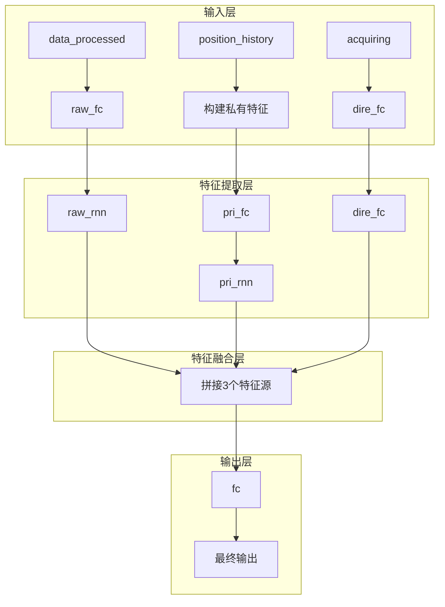
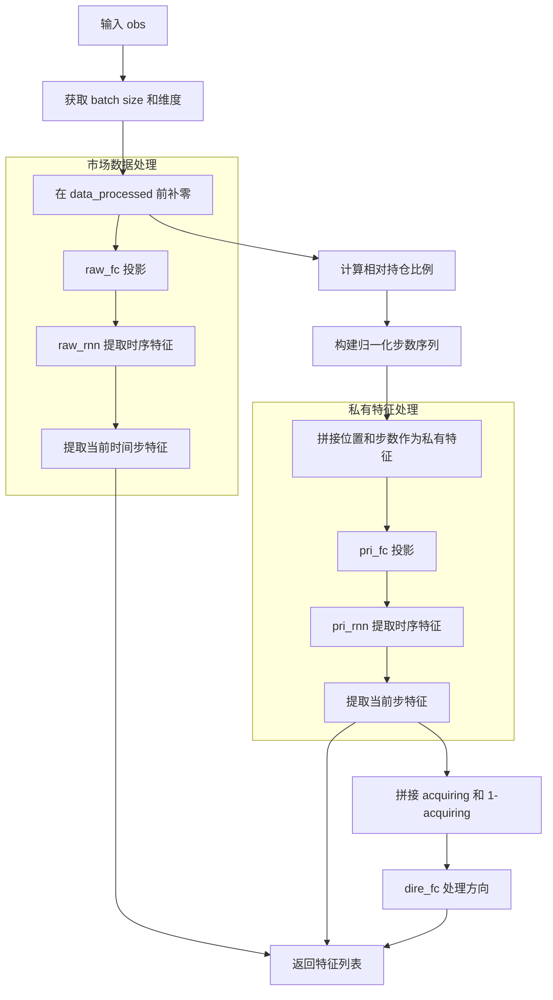
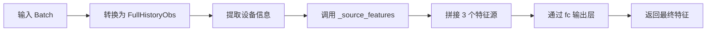
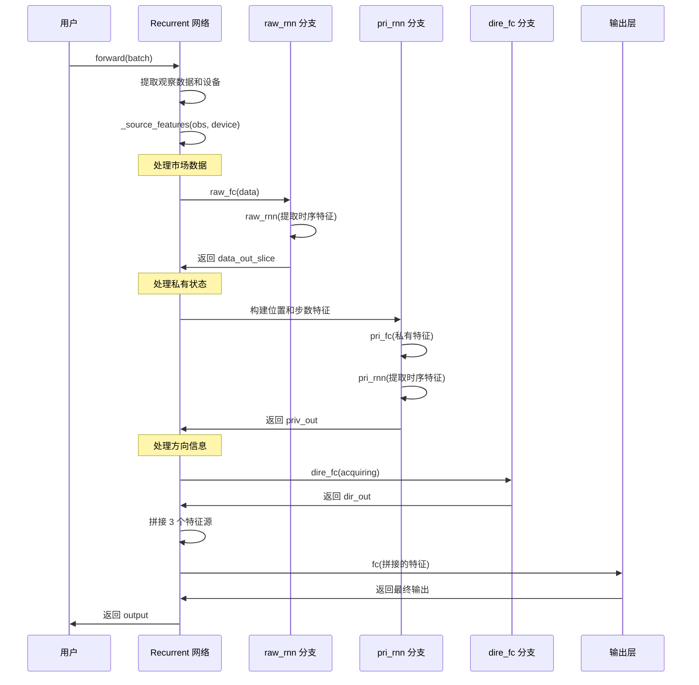
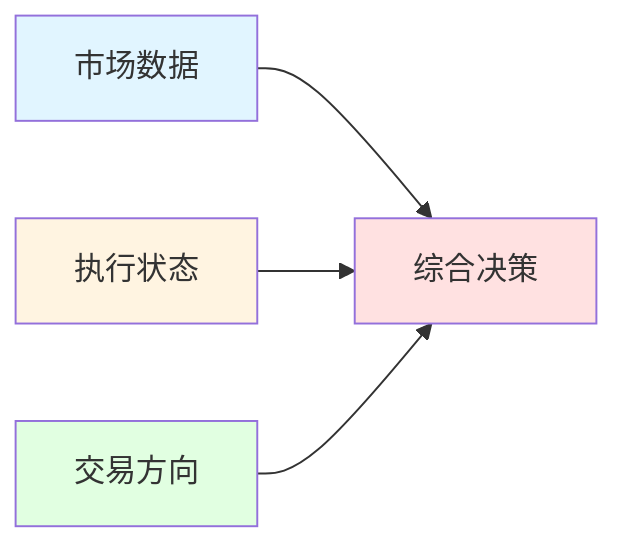

# Qlib RL Order Execution - Network 模块文档

## 模块概述

`qlib.rl.order_execution.network` 模块提供了用于订单执行强化学习的神经网络架构。该模块基于论文 [OPD (Optimal Policy Distillation)](https://seqml.github.io/opd/opd_aaai21_supplement.pdf) 提出的网络架构，适用于智能订单执行场景。

该模块包含两个主要类：
- **Recurrent**: 基于循环神经网络（RNN/LSTM/GRU）的订单执行策略网络
- **Attention**: 自注意力机制模块（当前未在主要流程中使用）

## 核心类定义

### 1. Recurrent 类

`Recurrent` 是本模块的核心类，实现了一个用于订单执行的循环神经网络架构。该网络在每个时间步将输入分为两部分：**公开变量**和**私有变量**，分别由 `raw_rnn` 和 `pri_rnn` 处理。

#### 网络架构设计



#### 构造方法

**签名**:
```python
def __init__(
    self,
    obs_space: FullHistoryObs,
    hidden_dim: int = 64,
    output_dim: int = 32,
    rnn_type: Literal["rnn", "lstm", "gru"] = "gru",
    rnn_num_layers: int = 1,
) -> None
```

**参数说明**:

| 参数名 | 类型 | 必填 | 默认值 | 说明 |
|-------|------|------|--------|------|
| `obs_space` | `FullHistoryObs` | 是 | - | 观察空间定义，定义网络输入的维度 |
| `hidden_dim` | `int` | 否 | `64` | 隐藏层维度，控制网络容量 |
| `output_dim` | `int` | 否 | `32` | 输出维度，即策略网络最终输出的特征维度 |
| `rnn_type` | `Literal["rnn", "lstm", "gru"]` | 否 | `"gru"` | 循环神经网络类型，支持 RNN、LSTM、GRU |
| `rnn_num_layers` | `int` | 否 | `1` | RNN 层数，增加层数可以提高模型表达能力 |

**网络组件说明**:

| 组件名 | 类型 | 作用 |
|-------|------|------|
| `raw_rnn` | RNN/LSTM/GRU | 处理公开市场数据（历史行情、成交量等） |
| `prev_rnn` | RNN/LSTM/GRU | 预留的前一状态处理分支（当前未使用） |
| `pri_rnn` | RNN/LSTM/GRU | 处理私有状态信息（持仓、当前步等） |
| `raw_fc` | Linear + ReLU | 将市场数据映射到隐藏维度 |
| `pri_fc` | Linear + ReLU | 将私有特征映射到隐藏维度 |
| `dire_fc` | Linear + ReLU | 处理买卖方向信息 |
| `fc` | MLP | 最终输出层，融合所有特征源 |

---

### 2. Attention 类

**签名**:
```python
class Attention(nn.Module)
```

**说明**:
实现标准的自注意力机制模块，包含 Query、Key、Value 三个投影网络。

**构造方法**:
```python
def __init__(self, in_dim, out_dim)
```

| 参数名 | 类型 | 说明 |
|-------|------|------|
| `in_dim` | int | 输入特征维度 |
| `out_dim` | int | 注意力机制的输出维度 |

**前向传播**:
```python
def forward(self, Q, K, V)
```

| 参数名 | 类型 | 说明 |
|-------|------|------|
| `Q` | Tensor | Query 张量 |
| `K` | Tensor | Key 张量 |
| `V` | Tensor | Value 张量 |

---

## 详细方法说明

### Recurrent._source_features

**签名**:
```python
def _source_features(self, obs: FullHistoryObs, device: torch.device) -> Tuple[List[torch.Tensor], torch.Tensor]
```

**功能**:
提取三个特征源：
1. **市场数据特征**: 通过 `raw_rnn` 处理历史市场数据
2. **私有状态特征**: 通过 `pri_rnn` 处理持仓历史和进度信息
3. **方向特征**: 通过 `dire_fc` 处理买卖方向

**参数**:

| 参数名 | 类型 | 说明 |
|-------|------|------|
| `obs` | `FullHistoryObs` | 观察数据字典 |
| `device` | `torch.device` | 张量设备（CPU/CUDA） |

**返回值**:
```python
Tuple[List[torch.Tensor], torch[ensor]
```
- 元组第一个元素：包含 3 个特征张量的列表 `[data_out_slice, priv_out, dir_out]`
- 元组第二个元素：完整的 `raw_rnn` 输出 `data_out`

**处理流程**:



**关键代码逻辑**:

```python
# 1. 在市场数据前补零，处理时间序列
data = torch.cat((torch.zeros(bs, 1, data_dim, device=device), obs["data_processed"]), 1)

# 2. 计算相对持仓比例
position = obs["position_history"] / obs["target"].unsqueeze(-1)

# 3. 构建归一化步数序列
steps = torch.arange(position.size(-1), device=device).unsqueeze(0).repeat(bs, 1).float() / obs["num_step"].unsqueeze(-1).float()

# 4. 拼接私有特征
priv = torch.stack((position.float(), steps), -1)

# 5. 提取当前时间步的特征
data_out_slice = data_out[bs_indices, cur_tick]
priv_out = priv_out[bs_indices, cur_step]

# 6. 方向特征：买入或卖出
dir_out = self.dire_fc(torch.stack((obs["acquiring"], 1 - obs["acquiring"]), -1).float())
```

---

### Recurrent.forward

**签名**:
```python
def forward(self, batch: Batch) -> torch.Tensor
```

**功能**:
网络的前向传播方法，输入观察数据，输出策略网络的隐藏状态表示。

**输入数据结构** (batch 参数):
```python
{
    "data_processed": torch.Tensor,    # [N, T, C] - 预处理后的市场数据
    "cur_step": torch.Tensor,          # [N] - 当前执行步骤索引 (int)
    "cur_time": torch.Tensor,          # [N] - 当前时间戳 (int)
    "position_history": torch.Tensor,  # [N, S] - 持仓历史
    "target": torch.Tensor,            # [N] - 目标交易量
    "num_step": torch.Tensor,          # [N] - 总执行步数 (int)
    "acquiring": torch.Tensor,         # [N] - 是否买入 (0 或 1)
}
```

| 字段名 | 形状 | 类型 | 说明 |
|-------|------|------|------|
| `data_processed` | `[N, T, C]` | float | N 个样本，T 个时间步，C 个特征维度的市场数据 |
| `cur_step` | `[N]` | int | 当前执行到的步骤索引 |
| `cur_time` | `[N]` | int | 当前时间戳（用于对齐市场数据） |
| `position_history` | `[N, S]` | float | 每个步骤的持仓历史 |
| `target` | `[N]` | float | 订单的目标交易量 |
| `num_step` | `[N]` | int | 总的执行步数 |
| `acquiring` | `[N]` | int (0/1) | 1 表示买入，0 表示卖出 |

**返回值**:
```python
torch.Tensor  # 形状 [N, output_dim]
```

**处理流程**:



**代码示例**:
```python
# 内部实现
inp = cast(FullHistoryObs, batch)
device = inp["data_processed"].device

# 提取多源特征
sources, _ = self._source_features(inp, device)
assert len(sources) == self.num_sources  # 确保有 3 个特征源

# 拼接所有特征
out = torch.cat(sources, -1)

# 通过最终的 MLP
return self.fc(out)
```

---

### Recurrent._init_extra_branches

**签名**:
```python
def _init_extra_branches(self) -> None
```

**功能**:
初始化额外的分支网络（当前为空方法，预留扩展接口）。子类可以重写此方法以添加额外的特征提取分支。

---

### Attention.forward

**签名**:
```python
def forward(self, Q, K, V) -> torch.Tensor
```

**功能**:
实现标准的自注意力机制计算。

**计算公式**:
```
Attention(Q, K, V) = softmax(Q * K^T) * V
```

**代码实现**:
```python
# 投影到
q = self.q_net(Q)
k = self.k_net(K)
v = self.v_net(V)

# 计算注意力分数
attn = torch.einsum("ijk,ilk->ijl", q, k)
attn_prob = torch.softmax(attn, dim=-1)

# 加权求和
attn_vec = torch.einsum("ijk,ikl->ijl", attn_prob, v)

return attn_vec
```

---

## 使用示例

### 示例 1: 创建 Recurrent 网络

```python
import torch
from qlib.rl.order_execution.interpreter import FullHistoryStateInterpreter
from qlib.rl.order_execution.network import Recurrent

# 定义观察空间（模拟）
obs_space = {
    "data_processed": torch.zeros((390, 10)),  # 390 分钟，10 个特征
    "data_processed_prev": torch.zeros((390, 10)),
    "acquiring": torch.tensor(1),
    "cur_tick": torch.tensor(100),
    "cur_step": torch.tensor(5),
    "num_step": torch.tensor(13),
    "target": torch.tensor(1000.0),
    "position": torch.tensor(500.0),
    "position_history": torch.zeros(13),
}

# 创建网络
network = Recurrent(
    obs_space=obs_space,
    hidden_dim=64,      # 隐藏层维度
    output_dim=32,      # 输出维度
    rnn_type="gru",      # 使用 GRU
    rnn_num_layers=2,    # 2 层 GRU
)

print(f"网络参数数量: {sum(p.numel() for p in network.parameters()):,}")
```

### 示例 2: 前向传播

```python
from tianshou.data import Batch

# 创建输入数据
batch_data = Batch({
    "data_processed": torch.randn(2, 390, 10),    # 2 个样本
    "cur_step": torch.tensor([5, 10]),
    "cur_time": torch.tensor([1000, 2000]),
    "position_history": torch.randn(2, 13),
    "target": torch.tensor([1000.0, 2000.0]),
    "num_step": torch.tensor([13, 13]),
    "acquiring": torch.tensor([1, 0]),  # 一个买入，一个卖出
})

# 前向传播
output = network(batch_data)

print(f"输出形状: {output.shape}")  # 应为 [2, 32]
print(f"输出值范围: [{output.min().item():.3f}, {output.max().item():.3f}]")
```

### 示例 3: 不同 RNN 类型的对比

```python
rnn_types = ["rnn", "lstm", "gru"]

for rnn_type in rnn_types:
    net = Recurrent(
        obs_space=obs_space,
        rnn_type=rnn_type,
        hidden_dim=64,
        rnn_num_layers=1,
    )
    params = sum(p.numel() for p in net.parameters())
    print(f"{rnn_type.upper()}: {params:,} 参数")
```

### 示例 4: 使用 Attention 模块

```python
from qlib.rl.order_execution.network import Attention

# 创建注意力模块
attention = Attention(in_dim=64, out_dim=32)

# 模拟输入
batch_size, seq_len, in_dim = 4, 10, 64
Q = torch.randn(batch_size, seq_len, in_dim)
K = torch.randn(batch_size, seq_len, in_dim)
V = torch.randn(batch_size, seq_len, in_dim)

# 前向传播
output = attention(Q, K, V)

print(f"输入形状: {Q.shape}")
print(f"输出形状: {output.shape}")  # 应为 [4, 10, 32]
```

### 示例 5: 完整的订单执行策略网络使用

```python
import torch.nn as nn
from qlib.rl.order_execution.network import Recurrent

class OrderExecutionPolicy(nn.Module):
    """完整的订单执行策略网络"""

    def __init__(self, obs_space, action_dim=10):
        super().__init__()

        # 特征提取网络
        self.encoder = Recurrent(
            obs_space=obs_space,
            hidden_dim=64,
            output_dim=32,
            rnn_type="gru",
            rnn_num_layers=2,
        )

        # 动作头
        self.actor_head = nn.Sequential(
            nn.Linear(32, 32),
            nn.ReLU(),
            nn.Linear(32, action_dim),
            nn.Softmax(dim=-1)  # 输出动作概率分布
        )

        # 价值头
        self.critic_head = nn.Sequential(
            nn.Linear(32, 32),
            nn.ReLU(),
            nn.Linear(32, 1)
        )

    def forward(self, batch):
        # 提取特征
        features = self.encoder(batch)

        # 输出动作概率和价值
        action_probs = self.actor_head(features)
        value = self.critic_head(features)

        return action_probs, value

# 使用示例
policy = OrderExecutionPolicy(obs_space=obs_space, action_dim=10)
action_probs, value = policy(batch_data)

print(f"动作概率分布形状: {action_probs.shape}")  # [2, 10]
print(f"价值估计形状: {value.shape}")             # [2, 1]
print(f"概率和: {action_probs.sum(dim=-1)}")         # 应为 [1., 1.]
```

### 示例 6: 可视化网络结构

```python
def print_network_structure(network):
    """打印网络结构"""
    print("=" * 60)
    print("Recurrent 网络结构")
    print("=" * 60)
    print(f"隐藏层维度: {network.hidden_dim}")
    print(f"输出维度: {network.output_dim}")
    print(f"特征源数量: {network.num_sources}")
    print(f"RNN 类型: {network.rnn_class.__name__}")
    print(f"RNN 层数: {network.rnn_layers}")
    print("\n网络组件:")
    print(f"  - raw_fc: {network.raw_fc}")
    print(f"  - raw_rnn: {network.raw_rnn}")
    print(f"  - prev_rnn: {network.prev_rnn}")
    print(f"  - pri_fc: {network.pri_fc}")
    print(f"  - pri_rnn: {network.pri_rnn}")
    print(f"  - dire_fc: {network.dire_fc}")
    print(f"  - fc: {network.fc}")
    print("=" * 60)

print_network_structure(network)
```

---

## 数据流图

### 完整前向传播数据流



---

## 设计原理

### 多源特征设计

该网络设计了三个独立的特征提取分支，分别处理不同类型的信息：

1. **市场数据分支 (raw_rnn)**:
   - 处理公开的市场数据（价格、成交量等）
   - 使用 RNN 捕捉时间序列模式
   - 通过在数据前补零，确保时间序列对齐

2. **私有状态分支 (pri_rnn)**:
   - 处理订单执行进度信息
   - 输入包括：相对持仓比例、归一化步数
   - 帮助策略理解当前执行进度

3. **方向分支 (dire_fc)**:
   - 处理买卖方向信息
   - 这是一个静态特征，不依赖时间序列
   - 双向表示：`(acquiring, 1-acquiring)`

### 为什么使用三个特征源？



- **解耦关注点**: 不同类型的信息由不同的网络处理，避免特征干扰
- **灵活扩展**: 可以独立改进每个分支而不影响其他分支
- **可解释性**: 可以分析每个分支对最终决策的贡献

### RNN 选择建议

| RNN 类型 | 优点 | 缺点 | 适用场景 |
|---------|------|------|---------|
| **RNN** | 计算简单、速度快 | 梯度消失、长时记忆弱 | 短序列、资源受限 |
| **LSTM** | 长时记忆强、稳定 | 参数多、计算慢 | 长序列、复杂模式 |
| **GRU** (推荐) | 平衡性能和速度 | 比 LSTM 稍弱 | 通用场景 |

---

## 性能优化建议

### 1. 批处理优化

```python
# 推荐：使用批处理
batch_data = Batch({
    "data_processed": torch.randn(32, 390, 10),  # 32 个样本
    # ...
})
output = network(batch_data)

# 避免：逐样本处理（慢）
for i in range(32):
    single_sample = Batch({...})  # 单个样本
    output_i = network(single_sample)
```

### 2. 设备管理

```python
# 将网络移到 GPU
device = torch.device("cuda" if torch.cuda.is_available() else "cpu")
network = network.to(device)

# 确保输入数据也在同一设备
batch_data.to(device)
output = network(batch_data)
```

### 3. 模型并行（多 GPU）

```python
if torch.cuda.device_count() > 1:
    network = nn.DataParallel(network)
```

---

## 常见问题

### Q1: 如何调整网络容量？

**A**: 调整 `hidden_dim` 和 `rnn_num_layers` 参数：
- `hidden_dim`: 主要控制网络容量，常用值 32、64、128
- `rnn_num_layers`: 增加层数可以捕捉更复杂的模式，但会增加计算量

```python
# 小型网络
small_net = Recurrent(obs_space, hidden_dim=32, rnn_num_layers=1)

# 大型网络
large_net = Recurrent(obs_space, hidden_dim=128, rnn_num_layers=3)
```

### Q2: 如何处理不同的市场数据维度？

**A**: `obs_space` 的 `data_processed` 维度会自动适应：

```python
# 假设市场数据有 20 个特征
obs_space = {
    "data_processed": torch.zeros((390, 20)),  # 20 个特征
    # ...
}

network = Recurrent(obs_space=obs_space)
# raw_fc 会自动将 20 维映射到 hidden_dim
```

### Q3: 为什么 data_processed 前要补零？

**A**: 这是一个时间对齐技巧：
- 补零后，索引 `i` 对应的是 `t-1` 时刻的数据
- 这样可以避免索引越界，并保持时间序列的一致性
- 第一时刻（t=0）会读取到零向量，表示"没有历史信息"

### Q4: 如何添加自定义特征分支？

**A**: 继承 `Recurrent` 类并重写 `_init_extra_branches`：

```python
class ExtendedRecurrent(Recurrent):
    def _init_extra_branches(self):
        # 添加自定义分支
        self.custom_fc = nn.Sequential(
            nn.Linear(5, self.hidden_dim),
            nn.ReLU()
        )
        self.num_sources += 1  # 增加特征源数量

    def _source_features(self, obs, device):
        sources, data_out = super()._source_features(obs, device)

        # 添加自定义特征
        custom_feature = self.custom_fc(obs["custom_input"])
        sources.append(custom_feature)

        return sources, data_out
```

---

## 参考文献

1. **OPD Paper**: [Optimal Policy Distillation](https://seqml.github.io/opd/opd_aaai21_supplement.pdf)
   - 该网络架构的原始论文

2. **Tianshou**: [https://github.com/thu-ml/tianshou](https://github.com/thu-ml/tianshou)
   - 强化学习库，提供 Batch 数据结构

3. **PyTorch RNN**: [https://pytorch.org/docs/stable/nn.html#rnn](https://pytorch.org/docs/stable/nn.html#rnn)
   - RNN、LSTM、GRU 的官方文档

---

## 版本历史

| 版本 | 日期 | 变更说明 |
|------|------|---------|
| 1.0 | 2024 | 初始版本，基于 OPD 论文实现 |

---

## 相关模块

- `qlib.rl.order_execution.interpreter`: 观察和动作的解释器
- `qlib.rl.order_execution.state`: 订单执行状态管理
- `qlib.rl.order_execution.env`: 订单执行环境

---

**文档生成时间**: 2026-03-30
**源文件**: `/home/firewind0/qlib/qlib/rl/order_execution/network.py`
