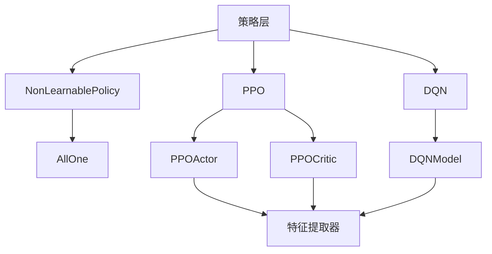
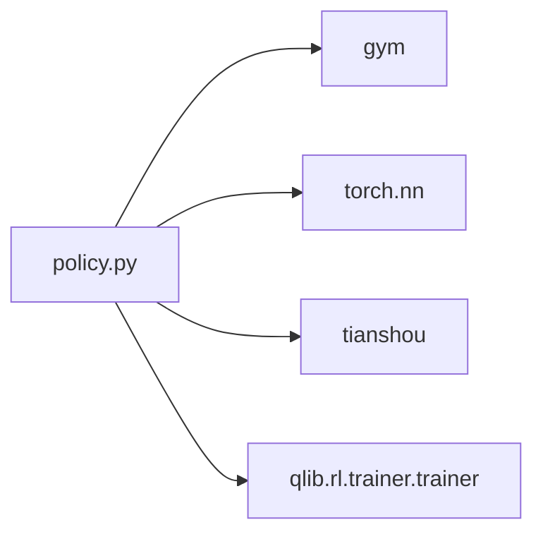
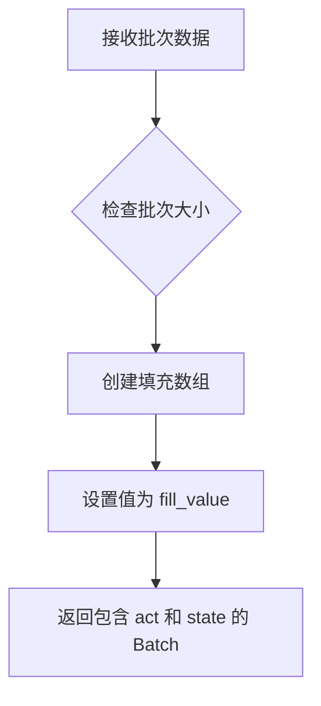
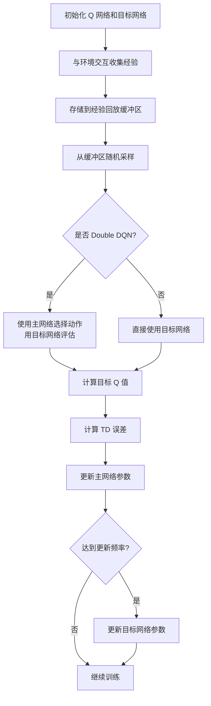

# Policy 模块文档

## 模块概述

`qlib.rl.order_execution.policy` 模块提供了强化学习订单执行策略的实现，基于 Tianshou 框架构建。该模块包含了多种策略类型，包括非学习策略（基线策略）和学习策略（PPO、DQN），为订单执行任务提供了完整的策略解决方案。

### 主要功能

- **非学习策略**：提供基线策略实现，如 AllOne（TWAP等基线的基础）
- **PPO 策略**：近端策略优化算法的完整实现，支持离散动作空间
- **DQN 策略**：深度 Q 网络算法的完整实现，支持离散动作空间
- **工具函数**：模型权重加载、设备自动检测等实用功能

### 架构设计

该模块采用分层架构设计：



### 依赖关系



---

## 核心类定义

### NonLearnablePolicy

**非学习策略基类**

Tianshou BasePolicy 的子类，实现了空的 `learn` 和 `process_fn` 方法。此类用于实现不需要训练的基线策略。

**继承关系**
```
tianshou.policy.BasePolicy
    └── NonLearnablePolicy
```

#### 构造方法

```python
def __init__(self, obs_space: gym.Space, action_space: gym.Space) -> None
```

**参数说明**

| 参数 | 类型 | 必需 | 描述 |
|------|------|------|------|
| `obs_space` | `gym.Space` | 是 | 观察空间定义，描述环境状态的形状和类型 |
| `action_space` | `gym.Space` | 是 | 动作空间定义，描述可执行动作的类型和范围 |

#### 方法说明

##### learn

```python
def learn(self, batch: Batch, **kwargs: Any) -> Dict[str, Any]
```

**功能**：空的训练方法，非学习策略不需要训练。

**参数**
- `batch` (`tianshou.data.Batch`)：训练数据批次
- `**kwargs`：额外的关键字参数

**返回值**
- `Dict[str, Any]`：空字典，表示没有训练指标

##### process_fn

```python
def process_fn(self, batch: Batch, buffer: ReplayBuffer, indices: np.ndarray) -> Batch
```

**功能**：空的预处理方法，不对数据做任何处理。

**参数**
- `batch` (`tianshou.data.Batch`)：待处理的批次数据
- `buffer` (`tianshou.data.ReplayBuffer`)：经验回放缓冲区
- `indices` (`np.ndarray`)：缓冲区中的索引

**返回值**
- `Batch`：空的 Batch 对象

---

### AllOne

**全1基线策略**

非学习策略，返回固定的动作值。适用于实现 TWAP（时间加权平均价格）等基线策略。

**继承关系**
```
NonLearnablePolicy
    └── AllOne
```

#### 构造方法

```python
def __init__(self, obs_space: gym.Space, action_space: gym.Space, fill_value: float | int = 1.0) -> None
```

**参数说明**

| 参数 | 类型 | 必需 | 默认值 | 描述 |
|------|------|------|--------|------|
| `obs_space` | `gym.Space` | 是 | - | 观察空间定义 |
| `action_space` | `gym.Space` | 是 | - | 动作空间定义 |
| `fill_value` | `float | int` | 否 | `1.0` | 填充值，返回的动作值 |

#### 方法说明

##### forward

```python
def forward(self, batch: Batch, state: dict | Batch | np.ndarray = None, **kwargs: Any) -> Batch
```

**功能**：前向传播，返回填充固定值的动作批次。

**参数**
- `batch` (`Batch`)：输入批次数据，包含观察信息
- `state` (`dict | Batch | np.ndarray`)：策略状态，默认为 None
- `**kwargs`：额外的关键字参数

**返回值**
- `Batch`：包含以下字段：
  - `act` (`np.ndarray`)：形状为 `(batch_size,)` 的数组，所有元素均为 `fill_value`
  - `state`：传入的策略状态

**使用示例**

```python
import gym
from qlib.rl.order_execution.policy import AllOne

# 创建环境
obs_space = gym.spaces.Box(low=0, high=1, shape=(10,))
action_space = gym.spaces.Discrete(5)

# 创建 AllOne 策略
policy = AllOne(obs_space, action_space, fill_value=2)

# 使用策略
from tianshou.data import Batch
batch = Batch(obs=np.random.rand(4, 10))
result = policy.forward(batch)

print(result.act)  # 输出: [2 2 2 2]
```

**工作流程**



---

### PPOActor

**PPO Actor 网络**

PPO 算法的 Actor 网络，负责从状态到动作概率的映射。使用特征提取器提取特征，然后通过线性层和 Softmax 输出动作概率分布。

**继承关系**
```
torch.nn.Module
    └── PPOActor
```

#### 构造方法

```python
def __init__(self, extractor: nn.Module, action_dim: int) -> None
```

**参数说明**

| 参数 | 类型 | 必需 | 描述 |
|------|------|------|------|
| `extractor` | `nn.Module` | 是 | 特征提取器神经网络模块 |
| `action_dim` | `int` | 是 | 动作空间的维度（离散动作数量） |

**网络结构**

```
输入观察 (obs)
    ↓
特征提取器 (extractor)
    ↓
线性层 (Linear) → 输出维度: action_dim
    ↓
Softmax 激活 (dim=-1)
    ↓
动作概率分布
```

#### 方法说明

##### forward

```python
def forward(self, obs: torch.Tensor, state: torch.Tensor = None, info: dict = {}) -> Tuple[torch.Tensor, Optional[torch.Tensor]]
```

**功能**：前向传播，计算给定观察的动作概率分布。

**参数**
- `obs` (`torch.Tensor`)：观察张量，形状为 `(batch_size, *obs_shape)`
- `state` (`torch.Tensor`)：RNN 隐藏状态，默认为 None
- `info` (`dict`)：额外信息字典，默认为空字典

**返回值**
- `Tuple[torch.Tensor, Optional[torch.Tensor]]`：
  - 第一个元素：动作概率分布张量，形状为 `(batch_size, action_dim)`
  - 第二个元素：RNN 隐藏状态（如果使用 RNN），否则为 None

**使用示例**

```python
import torch
import torch.nn as nn
from qlib.rl.order_execution.policy import PPOActor

# 定义简单的特征提取器
class SimpleExtractor(nn.Module):
    def __init__(self):
        super().__init__()
        self.fc = nn.Linear(10, 64)
        self.output_dim = 64

    def forward(self, x):
        return torch.relu(self.fc(x))

# 创建 Actor 网络
extractor = SimpleExtractor()
actor = PPOActor(extractor, action_dim=5)

# 前向传播
obs = torch.randn(4, 10)
action_probs, state = actor.forward(obs)

print(action_probs.shape)  # 输出: torch.Size([4, 5])
print(torch.allclose(action_probs.sum(dim=-1), torch.ones(4)))  # True (概率和为1)
```

---

### PPOCritic

**PPO Critic 网络**

PPO 算法的 Critic 网络，负责评估状态的价值。使用特征提取器提取特征，然后通过线性层输出标量价值。

**继承关系**
```
torch.nn.Module
    └── PPOCritic
```

#### 构造方法

```python
def __init__(self, extractor: nn.Module) -> None
```

**参数说明**

| 参数 | 类型 | 必需 | 描述 |
|------|------|------|------|
| `extractor` | `nn.Module` | 是 | 特征提取器神经网络模块 |

**网络结构**

```
输入观察 (obs)
    ↓
特征提取器 (extractor)
    ↓
线性层 (Linear) → 输出维度: 1
    ↓
Squeeze 压缩 (dim=-1)
    ↓
状态价值 (V(s))
```

#### 方法说明

##### forward

```python
def forward(self, obs: torch.Tensor, state: torch.Tensor = None, info: dict = {}) -> torch.Tensor
```

**功能**：前向传播，计算给定观察的状态价值。

**参数**
- `obs` (`torch.Tensor`)：观察张量，形状为 `(batch_size, *obs_shape)`
- `state` (`torch.Tensor`)：RNN 隐藏状态，默认为 None
- `info` (`dict`)：额外信息字典，默认为空字典

**返回值**
- `torch.Tensor`：状态价值张量，形状为 `(batch_size,)`

**使用示例**

```python
import torch
import torch.nn as nn
from qlib.rl.order_execution.policy import PPOCritic

# 定义特征提取器
class SimpleExtractor(nn.Module):
    def __init__(self):
        super().__init__()
        self.fc = nn.Linear(10, 64)
        self.output_dim = 64

    def forward(self, x):
        return torch.relu(self.fc(x))

# 创建 Critic 网络
extractor = SimpleExtractor()
critic = PPOCritic(extractor)

# 前向传播
obs = torch.randn(4, 10)
values = critic.forward(obs)

print(values.shape)  # 输出: torch.Size([4])
```

---

### PPO

**PPO 策略**

近端策略优化（Proximal Policy Optimization）算法的完整实现。这是对 Tianshou 的 PPOPolicy 的包装，提供了更便捷的接口和额外的功能。

**继承关系**
```
tianshou.policy.PPOPolicy
    └── PPO
```

**主要特性**

- 自动创建 Actor 和 Critic 网络
- 支持 Actor 和 Critic 共享特征提取器参数（去重）
- 仅支持离散动作空间
- 支持从检查点文件加载预训练权重
- 提供了针对订单执行任务优化的默认参数

#### 构造方法

```python
def __init__(
    self,
    network: nn.Module,
    obs_space: gym.Space,
    action_space: gym.Space,
    lr: float,
    weight_decay: float = 0.0,
    discount_factor: float = 1.0,
    max_grad_norm: float = 100.0,
    reward_normalization: bool = True,
    eps_clip: float = 0.3,
    value_clip: bool = True,
    vf_coef: float = 1.0,
    gae_lambda: float = 1.0,
    max_batch_size: int = 256,
    deterministic_eval: bool = True,
    weight_file: Optional[Path] = None,
) -> None
```

**参数说明**

| 参数 | 类型 | 必需 | 默认值 | 描述 |
|------|------|------|--------|------|
| `network` | `nn.Module` | 是 | - | 特征提取器神经网络（Actor 和 Critic 共享） |
| `obs_space` | `gym.Space` | 是 | - | 观察空间定义 |
| `action_space` | `gym.Space` | 是 | - | 动作空间定义（必须是 Discrete） |
| `lr` | `float` | 是 | - | 学习率 |
| `weight_decay` | `float` | 否 | `0.0` | 权重衰减（L2 正则化）系数 |
| `discount_factor` | `float` | 否 | `1.0` | 折扣因子 γ |
| `max_grad_norm` | `float` | 否 | `100.0` | 梯度裁剪的最大范数 |
| `reward_normalization` | `bool` | 否 | `True` | 是否对奖励进行归一化 |
| `eps_clip` | `float` | 否 | `0.3` | PPO 裁剪参数 ε |
| `value_clip` | `bool` | 否 | `True` | 是否裁剪价值函数 |
| `vf_coef` | `float` | 否 | `1.0` | 价值函数损失系数 |
| `gae_lambda` | `float` | 否 | `1.0` | GAE（广义优势估计）参数 λ |
| `max_batch_size` | `int` | 否 | `256` | 训练的最大批次大小 |
| `deterministic_eval` | `bool` | 否 | `True` | 评估时是否使用确定性策略 |
| `weight_file` | `Optional[Path]` | 否 | `None` | 预训练权重文件路径 |

**PPO 算法流程**

```mermaid
flowchart TD
    A[环境采样] --> B[收集轨迹]
    B --> C[计算优势函数<br/>使用 GAE]
    C --> D[计算策略比率<br/>π(a|s) / π_old(a|s)]
    D --> E[计算裁剪后的目标]
    E --> F[计算策略损失]
    F --> G[计算价值函数损失]
    G --> H[计算总损失]
    H --> I[反向传播更新]
    I --> J[收敛?]
    J -->|否| A
    J -->|是| K[训练完成]
```

**使用示例**

```python
import gym
import torch
import torch.nn as nn
from pathlib import Path
from qlib.rl.order_execution.policy import PPO

# 定义特征提取器
class OrderExecutionExtractor(nn.Module):
    def __init__(self):
        super().__init__()
        self.fc1 = nn.Linear(20, 128)
        self.fc2 = nn.Linear(128, 128)
        self.output_dim = 128

    def forward(self, x):
        x = torch.relu(self.fc1(x))
        x = torch.relu(self.fc2(x))
        return x

# 创建环境空间
obs_space = gym.spaces.Box(low=-1, high=1, shape=(20,))
action_space = gym.spaces.Discrete(10)

# 创建特征提取器
network = OrderExecutionExtractor()

# 创建 PPO 策略
policy = PPO(
    network=network,
    obs_space=obs_space,
    action_space=action_space,
    lr=1e-4,
    weight_decay=1e-5,
    discount_factor=0.99,
    eps_clip=0.2,
    gae_lambda=0.95,
    max_batch_size=64
)

# 加载预训练权重（可选）
# policy = PPO(
#     network=network,
#     obs_space=obs_space,
#     action_space=action_space,
#     lr=1e-4,
#     weight_file=Path("path/to/checkpoint.pth")
# )

# 使用策略进行推理
from tianshou.data import Batch
obs = torch.randn(1, 20)
batch = Batch(obs=obs.numpy())
action = policy.forward(batch)

print(action.act)  # 输出动作索引
```

**训练示例**

```python
import torch
from tianshou.data import Batch, ReplayBuffer
from tianshou.trainer import onpolicy_trainer

# 假设已有环境 env 和策略 policy
# 创建收集器
from tianshou.data import Collector

# 训练循环
for epoch in range(100):
    # 收集数据
    data = collector.collect(n_step=1000)

    # 训练策略
    policy.learn(data)

    # 评估
    if epoch % 10 == 0:
        rewards = []
        for _ in range(10):
            rew = collector.collect(n_episode=1, test=True)
            rewards.append(rew["rew"])
        print(f"Epoch {epoch}, Mean Reward: {sum(rewards)/len(rewards):.2f}")
```

---

### DQNModel

**DQN 模型网络**

深度 Q 网络的模型实现。该类复用了 PPOActor 的实现，因为它也使用了特征提取器加上线性输出层的结构。

**别名关系**
```
DQNModel = PPOActor
```

#### 构造方法

```python
def __init__(self, extractor: nn.Module, action_dim: int) -> None
```

**参数说明**

| 参数 | 类型 | 必需 | 描述 |
|------|------|------|------|
| `extractor` | `nn.Module` | 是 | 特征提取器神经网络模块 |
| `action_dim` | `int` | 是 | 动作空间的维度（离散动作数量） |

**网络结构**

```
输入观察 (obs)
    ↓
特征提取器 (extractor)
    ↓
线性层 (Linear) → 输出维度: action_dim
    ↓
Softmax 激活 (dim)=-1)
    ↓
Q 值分布
```

**使用示例**

```python
import torch
import torch.nn as nn
from qlib.rl.order_execution.policy import DQNModel

# 定义特征提取器
class SimpleExtractor(nn.Module):
    def __init__(self):
        super().__init__()
        self.fc = nn.Linear(10, 64)
        self.output_dim = 64

    def forward(self, x):
        return torch.relu(self.fc(x))

# 创建 DQN 模型
extractor = SimpleExtractor()
model = DQNModel(extractor, action_dim=5)

# 前向传播
obs = torch.randn(4, 10)
q_values, _ = model.forward(obs)

print(q_values.shape)  # 输出: torch.Size([4, 5])
```

---

### DQN

**DQN 策略**

深度 Q 网络（Deep Q-Network）算法的完整实现。这是对 Tianshou 的 DQNPolicy 的包装，提供了更便捷的接口和额外的功能。

**继承关系**
```
tianshou.policy.DQNPolicy
    └── DQN
```

**主要特性**

- 自动创建模型网络
- 支持离散动作空间
- 支持 Double DQN（双重 DQN）算法
- 支持从检查点文件加载预训练权重

#### 构造方法

```python
def __init__(
    self,
    network: nn.Module,
    obs_space: gym.Space,
    action_space: gym.Space,
    lr: float,
    weight_decay: float = 0.0,
    discount_factor: float = 0.99,
    estimation_step: int = 1,
    target_update_freq: int = 0,
    reward_normalization: bool = False,
    is_double: bool = True,
    clip_loss_grad: bool = False,
    weight_file: Optional[Path] = None,
) -> None
```

**参数说明**

| 参数 | 类型 | 必需 | 默认值 | 描述 |
|------|------|------|--------|------|
| `network` | `nn.Module` | 是 | - | 特征提取器神经网络 |
| `obs_space` | `gym.Space` | 是 | - | 观察空间定义 |
| `action_space` | `gym.Space` | 是 | - | 动作空间定义（必须是 Discrete） |
| `lr` | `float` | 是 | - | 学习率 |
| `weight_decay` | `float` | 否 | `0.0` | 权重衰减（L2 正则化）系数 |
| `discount_factor` | `float` | 否 | `0.99` | 折扣因子 γ |
| `estimation_step` | `int` | 否 | `1` | n-step 回归的步数 |
| `target_update_freq` | `int` | 否 | `0` | 目标网络更新频率（0 表示软更新） |
| `reward_normalization` | `bool` | 否 | `False` | 是否对奖励进行归一化 |
| `is_double` | `bool` | 否 | `True` | 是否使用 Double DQN |
| `clip_loss_grad` | `bool` | 否 | `False` | 是否裁剪损失梯度 |
| `weight_file` | `Optional[Path]` | 否 | `None` | 预训练权重文件路径 |

**DQN 算法流程**



**Double DQN 工作原理**

```mermaid
graph LR
    A[当前状态 s] --> B[主网络 Q]
    B --> C[选择动作 a* = argmax Q(s,a)]
    C --> D[目标网络 Q']
    D --> E[评估 Q'(s',a*)]
    E --> F[计算目标值 r + γQ'(s',a*)]
```

**使用示例**

```python
import gym
import torch
import torch.nn as nn
from pathlib import Path
from qlib.rl.order_execution.policy import DQN

# 定义特征提取器
class OrderExecutionExtractor(nn.Module):
    def __init__(self):
        super().__init__()
        self.fc1 = nn.Linear(20, 128)
        self.fc2 = nn.Linear(128, 128)
        self.output_dim = 128

    def forward(self, x):
        x = torch.relu(self.fc1(x))
        x = torch.relu(self.fc2(x))
        return x

# 创建环境空间
obs_space = gym.spaces.Box(low=-1, high=1, shape=(20,))
action_space = gym.spaces.Discrete(10)

# 创建特征提取器
network = OrderExecutionExtractor()

# 创建 DQN 策略
policy = DQN(
    network=network,
    obs_space=obs_space,
    action_space=action_space,
    lr=1e-4,
    weight_decay=1e-5,
    discount_factor=0.99,
    estimation_step=3,
    target_update_freq=500,
    is_double=True
)

# 加载预训练权重（可选）
# policy = DQN(
#     network=network,
#     obs_space=obs_space,
#     action_space=action_space,
#     lr=1e-4,
#     weight_file=Path("path/to/checkpoint.pth")
# )

# 使用策略进行推理
from tianshou.data import Batch
obs = torch.randn(1, 20)
batch = Batch(obs=obs.numpy())
action = policy.forward(batch)

print(action.act)  # 输出动作索引
```

**训练示例**

```python
import torch
from tianshou.data import Batch, ReplayBuffer

# 假设已有环境 env、策略 policy 和收集器 collector
# 创建经验回放缓冲区
buffer = ReplayBuffer(size=10000)

# 训练循环
for epoch in range(1000):
    # 收集数据
    data = collector.collect(n_step=100)

    # 添加到缓冲区
    buffer.update(data)

    # 训练策略
    if len(buffer) >= 1000:
        batch = buffer.sample(batch_size=32)
        policy.learn(batch)

    # 评估
    if epoch % 100 == 0:
        rewards = []
        for _ in range(10):
            rew = collector.collect(n_episode=1, test=True)
            rewards.append(rew["rew"])
        print(f"Epoch {epoch}, Mean Reward: {sum(rewards)/len(rewards):.2f}")
```

---

## 工具函数

### auto_device

**自动检测设备**

自动检测神经网络模块所在的设备（CPU 或 GPU）。

**函数签名**

```python
def auto_device(module: nn.Module) -> torch.device
```

**参数**
- `module` (`nn.Module`)：PyTorch 神经网络模块

**返回值**
- `torch.device`：模块参数所在的设备，如果没有参数则返回 CPU

**使用示例**

```python
import torch
import torch.nn as nn
from qlib.rl.order_execution.policy import auto_device

# CPU 设备
model_cpu = nn.Linear(10, 5)
device = auto_device(model_cpu)
print(device)  # 输出: cpu

# GPU 设备
model_gpu = nn.Linear(10, 5).cuda()
device = auto_device(model_gpu)
print(device)  # 输出: cuda:0
```

---

### set_weight

**设置模型权重**

将加载的权重字典设置到策略模型中。支持直接加载和兼容性加载两种方式。

**函数签名**

```python
def set_weight(policy: nn.Module, loaded_weight: OrderedDict) -> None
```

**参数**
- `policy` (`nn.Module`)：要设置权重的策略模型
- `loaded_weight` (`OrderedDict`)：加载的权重字典

**功能说明**

1. 首先尝试直接加载权重
2. 如果失败，尝试兼容性加载（添加 `_actor_critic.` 前缀）
3. 兼容性加载是为了处理旧版本权重的兼容性问题

**使用示例**

```python
import torch
import torch.nn as nn
from collections import OrderedDict
from qlib.rl.order_execution.policy import set_weight

# 创建模型
model = nn.Linear(10, 5)

# 准备权重
weights = OrderedDict({
    'weight': torch.randn(5, 10),
    'bias': torch.randn(5)
})

# 设置权重
set_weight(model, weights)

# 兼容性加载示例
old_weights = OrderedDict({
    'layer1.weight': torch.randn(64, 10),
    'layer1.bias': torch.randn(64)
})

# 新模型可能期望 '_actor_critic.layer1.weight' 格式
# set_weight 会自动处理这种转换
```

---

### chain_dedup

**链式去重迭代器**

将多个可迭代对象连接起来，并去除重复元素。适用于合并多个参数列表并去除重复参数。

**函数签名**

```python
def chain_dedup(*iterables: Iterable) -> Generator[Any, None, None]
```

**参数**
- `*iterables` (`Iterable`)：一个或多个可迭代对象

**返回值**
- `Generator[Any, None, None]`：去重后的生成器

**使用示例**

```python
from qlib.rl.order_execution.policy import chain_dedup

# 合并并去重两个列表
list1 = [1, 2, 3, 4]
list2 = [3, 4, 5, 6]
list3 = [6, 7, 8]

result = list(chain_dedup(list1, list2, list3))
print(result)  # 输出: [1, 2, 3, 4, 5, 6, 7, 8]

# 在策略中用于合并 actor 和 critic 参数
import torch
import torch.nn as nn

actor = nn.Sequential(nn.Linear(10, 5), nn.Linear(5, 3))
critic = nn.Sequential(nn.Linear(10, 5), nn.Linear(5, 1))

# 去重参数（共享的层）
dedup_params = list(chain_dedup(actor.parameters(), critic.parameters()))
print(f"Actor 参数数: {len(list(actor.parameters()))}")
print(f"Critic 参数数: {len(list(critic.parameters()))}")
print(f"去重后参数数: {len(dedup_params)}")
```

---

## 完整使用示例

### 示例 1：使用 AllOne 策略实现 TWAP 基线

```python
import gym
import numpy as np
from tianshou.data import Batch
from qlib.rl.order_execution.policy import AllOne

# 创建环境空间
obs_space = gym.spaces.Box(low=0, high=1, shape=(20,))
action_space = gym.spaces.Discrete(10)

# 创建 AllOne 策略（TWAP 基线）
# TWAP 通常返回固定的交易量
policy = AllOne(obs_space, action_space, fill_value=5)

# 模拟订单执行
total_shares = 1000
time_steps = 10
shares_per_step = total_shares / time_steps

for t in range(time_steps):
    # 获取当前状态（这里简化处理）
    batch = Batch(obs=np.random.rand(1, 20))

    # 获取动作
    action = policy.forward(batch)
    print(f"Step {t}: Execute {action.act[0]} shares")
```

### 示例 2：完整的 PPO 训练流程

```python
import gym
import torch
import torch.nn as nn
from tianshou.data import Collector, ReplayBuffer
from tianshou.env import DummyVectorEnv
from qlib.rl.order_execution.policy import PPO

# 1. 定义环境（这里用 DummyVectorEnv 作为示例）
def make_env():
    return gym.make('CartPole-v1')

envs = DummyVectorEnv([make_env for _ in range(4)])
test_envs = DummyVectorEnv([make_env for _ in range(1)])

# 2. 定义特征提取器
class CartPoleExtractor(nn.Module):
    def __init__(self):
        super().__init__()
        self.fc = nn.Linear(4, 64)
        self.output_dim = 64

    def forward(self, x):
        return torch.relu(self.fc(x))

# 3. 创建 PPO 策略
network = CartPoleExtractor()
policy = PPO(
    network=network,
    obs_space=envs.observation_space,
    action_space=envs.action_space,
    lr=0.001,
    discount_factor=0.99,
    eps_clip=0.2,
    max_batch_size=64
)

# 4. 创建收集器
collector = Collector(policy, envs)
test_collector = Collector(policy, test_envs)

# 5. 训练循环
for epoch in range(100):
    # 收集数据
    collector.reset()
    result = collector.collect(n_step=500)

    # 训练策略
    policy.learn(result)

    # 评估
    if epoch % 10 == 0:
        test_collector.reset()
        test_result = test_collector.collect(n_episode=10)
        mean_reward = test_result['rews'].mean()
        print(f"Epoch {epoch}, Mean Reward: {mean_reward:.2f}")

        # 保存模型
        if mean_reward > 450:
            torch.save(policy.state_dict(), f'ppo_model_epoch_{epoch}.pth')
            break
'```

### 示例 3：完整的 DQN 训练流程

```python
import gym
import torch
import torch.nn as nn
from tianshou.data import Collector, ReplayBuffer
from tianshou.env import DummyVectorEnv
from qlib.rl.order_execution.policy import DQN

# 1. 定义环境
def make_env():
    return gym.make('CartPole-v1')

envs = DummyVectorEnv([make_env for _ in range(4)])
test_envs = DummyVectorEnv([make_env for _ in range(1)])

# 2. 定义特征提取器
class CartPoleExtractor(nn.Module):
    def __init__(self):
        super().__init__()
        self.fc = nn.Linear(4, 64)
        self.output_dim = 64

    def forward(self, x):
        return torch.relu(self.fc(x))

# 3. 创建 DQN 策略
network = CartPoleExtractor()
policy = DQN(
    network=network,
    obs_space=envs.observation_space,
    action_space=envs.action_space,
    lr=0.0001,
    discount_factor=0.99,
    estimation_step=1,
    target_update_freq=500,
    is_double=True
)

# 4. 创建收集器和缓冲区
collector = Collector(policy, envs)
test_collector = Collector(policy, test_envs)
buffer = ReplayBuffer(size=10000)

# 5. 训练循环
for epoch in range(1000):
    # 收集数据
    collector.reset()
    result = collector.collect(n_step=100)

    # 更新缓冲区
    buffer.update(result)

    # 训练策略
    if len(buffer) >= 1000:
        batch = buffer.sample(batch_size=32)
        policy.learn(batch)

    # 评估
    if epoch % 100 == 0:
        test_collector.reset()
        test_result = test_collector.collect(n_episode=10)
        mean_reward = test_result['rews'].mean()
        print(f"Epoch {epoch}, Mean Reward: {mean_reward:.2f}")

        # 保存模型
        if mean_reward > 450:
            torch.save(policy.state_dict(), f'dqn_model_epoch_{epoch}.pth')
            break
```

### 示例 4：加载预训练模型

```python
import gym
import torch
import torch.nn as nn
from pathlib import Path
from qlib.rl.order_execution.policy import PPO

# 定义特征提取器（必须与训练时相同）
class OrderExecutionExtractor(nn.Module):
    def __init__(self):
        super().__init__()
        self.fc1 = nn.Linear(20, 128)
        self.fc2 = nn.Linear(128, 128)
        self.output_dim = 128

    def forward(self, x):
        x = torch.relu(self.fc1(x))
        x = torch.relu(self.fc2(x))
        return x

# 创建环境空间
obs_space = gym.spaces.Box(low=-1, high=1, shape=(20,))
action_space = gym.spaces.Discrete(10)

# 创建特征提取器
network = OrderExecutionExtractor()

# 加载预训练模型
policy = PPO(
    network=network,
    obs_space=obs_space,
    action_space=action_space,
    lr=1e-4,
    weight_file=Path("path/to/pretrained_checkpoint.pth")
)

# 使用加载的策略
from tianshou.data import Batch
obs = torch.randn(1, 20)
batch = Batch(obs=obs.numpy())
action = policy.forward(batch)
print("Predicted action:", action.act[0])
```

---

## 策略对比

| 特性 | AllOne | PPO | DQN |
|------|--------|-----|-----|
| **类型** | 非学习策略 | 策略梯度算法 | 价值函数算法 |
| **适用场景** | 基线策略（TWAP） | 连续/离散动作空间 | 离散动作空间 |
| **需要训练** | 否 | 是 | 是 |
| **样本效率** | N/A | 中 | 高 |
| **稳定性** | 高 | 高 | 中 |
| **动作空间** | 任意 | 离散 | 离散 |
| **探索策略** | 固定 | 随机（训练） | ε-贪婪 |

---

## 注意事项

1. **动作空间限制**：PPO 和 DQN 仅支持离散动作空间（`gym.spaces.Discrete`）

2. **特征提取器共享**：PPO 的 Actor 和 Critic 共享特征提取器，使用 `chain_dedup` 去重参数以避免重复优化

3. **权重加载**：从检查点加载权重时，确保特征提取器结构与训练时一致

4. **设备管理**：使用 `auto_device` 函数自动检测模块所在的设备

5. **参数调优**：
   - PPO：主要调节 `eps_clip`、`gae_lambda`、`lr`
   - DQN：主要调节 `estimation_step`、`target_update_freq`、`discount_factor`

6. **内存管理**：DQN 使用经验回放缓冲区，需要合理设置缓冲区大小

---

## 参考资料

- [Tianshou 文档](https://github.com/thu-ml/tianshou)
- [PPO 原论文](https://arxiv.org/abs/1707.06347)
- [DQN 原论文](https://www.nature.com/articles/nature14236)
- [Double DQN 论文](https://arxiv.org/abs/1509.06461)
