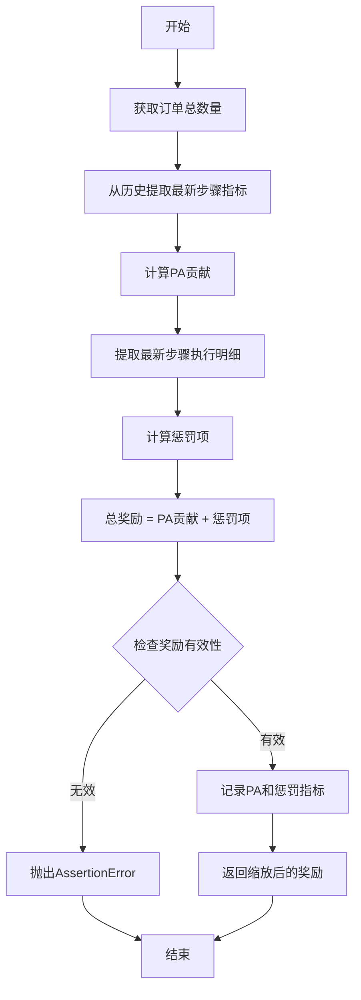
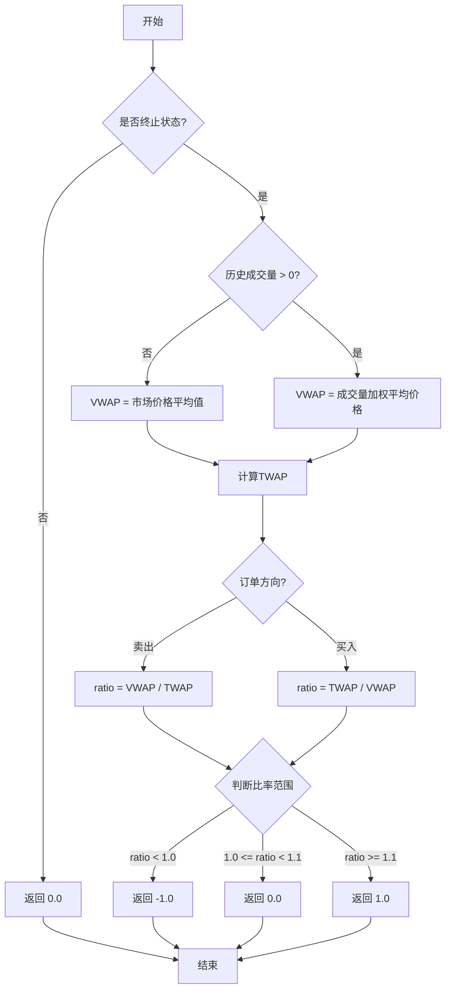

# Reward 模块

## 模块概述

本模块定义了订单执行强化学习环境中的奖励函数。奖励函数用于评估智能体在订单执行过程中的表现，指导智能体学习最优的交易策略。

模块包含两个主要奖励函数类：

1. **PAPenaltyReward** - 基于参与度平均值（PA）的奖励，鼓励更高的PA但惩罚短时间内的过度交易
2. **PPOReward** - 基于近端策略优化（PPO）论文提出的奖励机制

---

## 核心类

### 1. PAPenaltyReward

基于参与度平均值（PA）的奖励函数。该奖励函数鼓励智能体追求更高的PA值，但同时惩罚在极短时间内堆积所有交易量的行为。

#### 数学公式

对于每个时间步，奖励计算公式为：

```
reward = (PA_t * vol_t / target) - vol_t^2 * penalty
```

其中：
- `PA_t`：当前的参与度平均值
- `vol_t`：当前的交易量
- `target`：目标订单总数量
- `penalty`：惩罚系数

#### 构造方法参数

| 参数 | 类型 | 默认值 | 必填 | 说明 |
|------|------|--------|------|------|
| `penalty` | float | 100.0 | 否 | 短时间内大量交易的惩罚系数，值越大惩罚越重 |
| `scale` | float | 1.0 | 否 | 奖励的缩放权重，用于调整奖励的数值范围 |

#### 方法说明

##### `reward(self, simulator_state: SAOEState) -> float`

计算给定仿真器状态的奖励值。

**参数：**
- `simulator_state` (SAOEState)：仿真器当前状态对象，包含订单历史、执行历史等信息

**返回值：**
- `float`：计算得到的奖励值

**计算逻辑：**

1. 获取订单总数量 `whole_order`
2. 从历史步骤中提取最新一步的度量指标
3. 计算PA贡献：`pa = last_step["pa"] * last_step["amount"] / whole_order`
4. 提取最新步骤的执行明细（每个tick的交易量）
5. 计算惩罚项：`penalty = -self.penalty * ((last_step_breakdown["amount"] / whole_order) ** 2).sum()`
6. 总奖励 = PA贡献 + 惩罚项
7. 检查奖励值是否有效（非NaN且非无穷大）
8. 记录PA贡献和惩罚项
9. 返回缩放后的奖励值

**异常：**
- `AssertionError`：当订单数量 <= 0 或奖励值为NaN/无穷大时抛出

---

### 2. PPOReward

基于论文《An End-to-End Optimal Trade Execution Framework based on Proximal Policy Optimization》提出的奖励机制。

该奖励函数仅在交易执行结束时计算奖励，比较实际执行的VWAP（成交量加权平均价格）与时间加权平均价格（TWAP）的比率。

#### 构造方法参数

| 参数 | 类型 | 默认值 | 必填 | 说明 |
|------|------|--------|------|------|
| `max_step` | int | - | 是 | 最大允许的执行步数 |
| `start_time_index` | int | 0 | 否 | 允许交易的起始时间索引 |
| `end_time_index` | int | 239 | 否 | 允许交易的结束时间索引 |

#### 方法说明

##### `reward(self, simulator_state: SAOEState) -> float`

计算给定仿真器状态的奖励值。仅在最后一步或持仓接近0时计算奖励。

**参数：**
- `simulator_state` (SAOEState)：仿真器当前状态对象

**返回值：**
- `float`：奖励值（-1.0、0.0 或 1.0）

**计算逻辑：**

1. **非终止状态**：如果不是最后一步且持仓 > 1e-6，返回 0.0

2. **终止状态计算**：
   - 如果历史成交量为0：
     - VWAP价格 = 市场价格的平均值
   - 如果历史成交量 > 0：
     - VWAP价格 = 市场价格的成交量加权平均值
   - TWAP价格 = 回测数据中所有deal价格的平均值

3. **价格比率计算**：
   - 如果是卖出订单：`ratio = VWAP / TWAP`
   - 如果是买入订单：`ratio = TWAP / VWAP`

4. **奖励映射**：
   - `ratio < 1.0`：返回 -1.0（表现较差）
   - `1.0 <= ratio < 1.1`：返回 0.0（表现正常）
   - `ratio >= 1.1`：返回 1.0（表现优秀）

**奖励映射表：**

| 价格比率 | 奖励值 | 说明 |
|----------|--------|------|
| ratio < 1.0 | -1.0 | 执行价格不利，惩罚 |
| 1.0 <= ratio < 1.1 | 0.0 | 执行价格正常，中性 |
| ratio >= 1.1 | 1.0 | 执行价格有利，奖励 |

---

## 使用示例

### 示例 1：使用 PAPenaltyReward

```python
from qlib.rl.order_execution.reward import PAPenaltyReward
from qlib.rl.order_execution.state import SAOEState

# 创建奖励函数实例
reward_fn = PAPenaltyReward(
    penalty=100.0,  # 惩罚系数
    scale=1.0      # 缩放权重
)

# 计算奖励（simulator_state 是仿真器状态对象）
reward = reward_fn.reward(simulator_state)

print(f"奖励值: {reward}")
print(f"PA贡献: {reward_fn.get_metrics()['reward/pa']}")
print(f"惩罚项: {reward_fn.get_metrics()['reward/penalty']}")
```

### 示例 2：使用 PPOReward

```python
from qlib.rl.order_execution.reward import PPOReward
from qlib.rl.order_execution.state import SAOEState

# 创建奖励函数实例
reward_fn = PPOReward(
    max_step=240,          # 最大执行步数
    start_time_index=0,    # 起始时间索引
    end_time_index=239     # 结束时间索引
)

# 在执行过程中计算奖励
# 非终止状态返回 0.0
reward = reward_fn.reward(simulator_state)
print(f"中间步骤奖励: {reward}")  # 输出: 中间步骤奖励: 0.0

# 在终止时计算奖励
# （当 cur_step == max_step - 1 或 position < 1e-6）
reward = reward_fn.reward(final_simulator_state)
print(f"最终奖励: {reward}")  # 输出: 最终奖励: -1.0 / 0.0 / 1.0
```

### 示例 3：在强化学习环境中使用

```python
from qlib.rl.order_execution.reward import PAPenaltyReward, PPOReward
from qlib.rl.order_execution.sinterpreter import SingleAssetOrderExecutor

# 创建订单执行仿真器
executor = SingleAssetOrderExecutor(...)

# 选择奖励函数
reward_fn = PAPenaltyReward(penalty=50.0, scale=1.0)
# 或者
# reward_fn = PPOReward(max_step=240)

# 在训练循环中使用
for episode in range(num_episodes):
    state = executor.reset()
    done = False
    total_reward = 0.0

    while not done:
        action = policy.get_action(state)
        next_state, done, info = executor.step(action)

        # 计算奖励
        reward = reward_fn.reward(next_state)
        total_reward += reward

        # 更新策略
        policy.update(state, action, reward, next_state)

        state = next_state

    print(f"Episode {episode}, Total Reward: {total_reward}")
```

---

## 奖励计算流程图

### PAPenaltyReward 计算流程



### PPOReward 计算流程



---

## 关键概念

### PA (Participation Average)

参与度平均值，衡量在特定时间段内的市场参与程度。PA值越高，表示在该时间段内的市场参与度越大。

### VWAP (Volume Weighted Average Price)

成交量加权平均价格，按交易量加权的平均价格，是衡量实际执行质量的重要指标。

### TWAP (Time Weighted Average Price)

时间加权平均价格，按时间加权的平均价格，作为基准参考价格。

---

## 注意事项

1. **PAPenaltyReward**：
   - 需要确保仿真器状态中包含完整的执行历史
   - penalty参数需要根据具体场景调优
   - 较高的penalty值会鼓励更平滑的交易分布

2. **PPOReward**：
   - 仅在终止时计算奖励，中间步骤返回0
   - 适合以总执行质量为目标的场景
   - max_step需要与实际执行步数匹配

3. **通用注意事项**：
   - 奖励函数的选择应与训练策略相匹配
   - 建议通过实验调优奖励函数参数
   - 注意奖励值的数值范围，避免过大或过小

---

## 相关模块

- `qlib.rl.order_execution.state` - 定义了SAOEState状态类
- `qlib.rl.order_execution.sinterpreter` - 订单执行仿真器
- `qlib.rl.reward` - 基础奖励类定义
