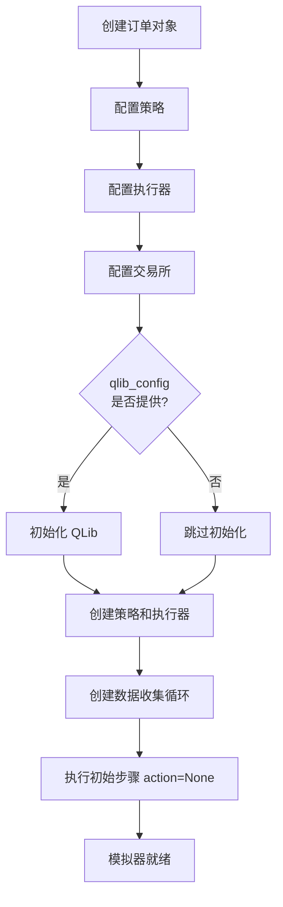
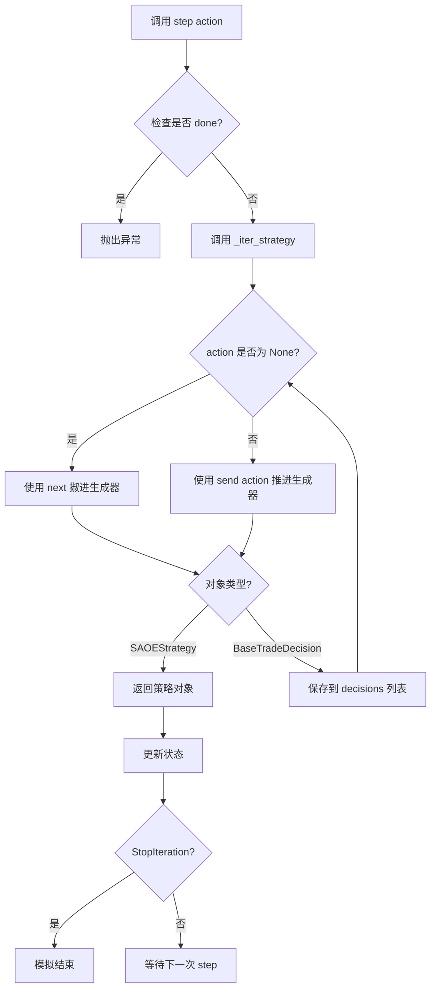

# simulator_qlib.py 单资产订单执行模拟器

## 模块概述

`simulator_qlib.py` 模块定义了 `SingleAssetOrderExecution` 类，这是一个单资产订单执行（Single-Asset Order Execution, SAOE）模拟器。该模拟器基于 QLib 的回测工具实现，用于在强化学习环境中模拟单个资产的订单执行过程。

该模块的主要功能包括：
- 模拟单个资产的订单执行流程
- 与 QLib 回测引擎集成，提供真实的市场环境模拟
- 支持强化学习策略的训练和评估
- 提供状态观测、动作执行和奖励计算接口

## 核心类：SingleAssetOrderExecution

### 类定义

```python
class SingleAssetOrderExecution(Simulator[Order, SAOEState, float])
```

`SingleAssetOrderExecution` 是一个泛型类，继承自 `Simulator` 基类，类型参数为：
- `Order`: 输入动作类型，表示订单对象
- `SAOEState`: 状态类型，表示单资产订单执行状态
- `float`: 奖励类型

### 类功能

该类实现了以下核心功能：
1. **订单执行模拟**: 根据输入订单，模拟在指定时间范围内的订单执行过程
2. **状态管理**: 维护订单执行过程中的各种状态信息
3. **回测集成**: 利用 QLib 的回测工具提供真实的市场环境
4. **奖励计算**: 根据订单执行结果计算奖励值

## 构造方法

### __init__

```python
def __init__(
    self,
    order: Order,
    executor_config: dict,
    exchange_config: dict,
    qlib_config: dict | None = None,
    cash_limit: float | None = None,
) -> None
```

**参数说明**

| 参数名 | 类型 | 必填 | 默认值 | 说明 |
|--------|------|------|--------|------|
| `order` | `Order` | 是 | 无 | 启动 SAOE 模拟器的种子订单，包含股票代码、起止时间、数量等信息 |
| `executor_config` | `dict` | 是 | 无 | 执行器配置，定义订单执行的具体参数和行为 |
| `exchange_config` | `dict` | 是 | 无 | 交易所配置，定义市场规则、手续费、滑点等参数 |
| `qlib_config` | `dict | None` | 否 | `None` | QLib 配置，用于初始化 QLib。如果为 None，则不会初始化 QLib |
| `cash_limit` | `float | None` | 否 | `None` | 现金限制，用于模拟有限资金的情况 |

**功能说明**

构造方法执行以下操作：
1. 调用父类 `Simulator` 的构造方法，初始化订单对象
2. 验证订单的起始日期和结束日期必须在同一天
3. 创建单订单策略配置（`SingleOrderStrategy`）
4. 调用 `reset` 方法初始化模拟器状态

**注意事项**

- 订单的 `start_time` 和 `end_time` 必须是同一天，否则会抛出 `AssertionError`
- 如果提供了 `qlib_config`，会在 `reset` 方法中初始化 QLib
- 如果提供了 `cash_limit`，会使用 `Position` 类型，否则使用 `InfPosition` 类型

## 主要方法

### reset

```python
def reset(
    self,
    order: Order,
    strategy_config: dict,
    executor_config: dict,
    exchange_config: dict,
    qlib_config: dict | None = None,
    cash_limit: Optional[float] = None,
) -> None
```

**参数说明**

| 参数名 | 类型 | 必填 | 默认值 | 说明 |
|--------|------|------|--------|------|
| `order` | `Order` | 是 | 无 | 需要重置的订单对象 |
| `strategy_config` | `dict` | 是 | 无 | 策略配置 |
| `executor_config` | `dict` | 是 | 无 | 执行器配置 |
| `exchange_config` | `dict` | 是 | 无 | 交易所配置 |
| `qlib_config` | `dict | None` | 否 | `None` | QLib 配置 |
| `cash_limit` | `float | None` | 否 | `None` | 现金限制 |

**返回值**

无返回值

**功能说明**

`reset` 方法用于重置模拟器状态，准备开始新的模拟回合。执行以下操作：

1. **初始化 QLib**: 如果提供了 `qlib_config`，则调用 `init_qlib(qlib_config)` 初始化 QLib
2. **创建策略和执行器**: 调用 `get_strategy_executor` 创建交易策略和执行器
3. **创建数据收集循环**: 调用 `collect_data_loop` 创建生成器，用于在回测过程中收集数据
4. **执行初始步骤**: 调用 `step(action=None)` 执行初始步骤，初始化状态
5. **保存订单**: 保存当前订单对象

### step

```python
def step(self, action: Optional[float]) -> None
```

**参数说明**

| 参数名 | 类型 | 必填 | 默认值 | 说明 |
|--------|------|------|--------|------|
| `action` | `float | None` | 是 | 无 | 希望交易的数量。注意：模拟器不保证所有数量都能成功交易 |

**返回值**

无返回值

**功能说明**

`step` 方法执行单资产订单执行的一步操作。这是强化学习环境的核心方法，用于执行动作并更新环境状态。

执行流程：
1. **检查状态**: 验证模拟器是否已经完成，如果已完成则抛出异常
2. **执行动作**: 调用 `_iter_strategy(action=action)` 执行指定的动作
3. **处理异常**: 捕获 `StopIteration` 异常，表示模拟结束

**注意事项**

- 在调用 `step` 之前，应先调用 `done()` 检查模拟器是否已完成
- 如果 `action` 为 `None`，则不执行任何交易动作，仅推进时间
- 实际成交数量可能小于请求的数量，取决于市场流动性和其他因素

### get_state

```python
def get_state(self) -> SAOEState
```

**参数说明**

无参数

**返回值**

| 返回值类型 | 说明 |
|------------|------|
| `SAOEState` | 当前单资产订单执行状态对象 |

**功能说明**

`get_state` 方法返回获取当前状态对象的接口。返回的 `SAOEState` 对象包含以下信息：
- 剩余订单数量
- 已成交数量
- 当前时间
- 市场价格
- 其他订单执行相关的状态信息

### done

```python
def done(self) -> bool
```

**参数说明**

无参数

**返回值**

| 返回值类型 | 说明 |
|------------|------|
| `bool` | 如果模拟已完成返回 `True`，否则返回 `False` |

**功能说明**

`done` 方法检查模拟器是否已完成所有订单执行。

### twap_price

```python
@property
def twap_price(self) -> float
```

**参数说明**

无参数

**返回值**

| 返回值类型 | 说明 |
|------------|------|
| `float` | 时间加权平均价格（TWAP） |

**功能说明**

`twap_price` 是一个属性方法，返回当前订单执行的时间加权平均价格（Time-Weighted Average Price, TWAP）。

## 私有方法

### _get_adapter

```python
def _get_adapter(self) -> SAOEStateAdapter
```

**参数说明**

无参数

**返回值**

| 返回值类型 | 说明 |
|------------|------|
| `SAOEStateAdapter` | SAOE 状态适配器对象 |

**功能说明**

`_get_adapter` 是私有方法，用于获取当前订单对应的状态适配器。该适配器负责在策略对象和状态对象之间进行转换。

### _iter_strategy

```python
def _iter_strategy(self, action: Optional[float] = None) -> SAOEStrategy
```

**参数说明**

| 参数名 | 类型 | 必填 | 默认值 | 说明 |
|--------|------|------|--------|------|
| `action` | `float | None` | 否 | `None` | 要执行的动作（交易数量） |

**返回值**

| 返回值类型 | 说明 |
|------------|------|
| `SAOEStrategy` | SAOE 策略对象 |

**功能说明**

`_iter_strategy` 是私有方法，用于迭代 `_collect_data_loop` 生成器，直到获得下一个 yield 的 `SAOEStrategy` 对象。

执行流程：
1. 根据 `action` 是否为 `None`，决定使用 `next()` 还是 `send()` 来推进生成器
2. 检查获取的对象类型：
   - 如果是 `SAOEStrategy`，直接返回
   - 如果是 `BaseTradeDecision`，保存到 `self.decisions` 列表中
3. 循对象类型检查，直到获取到 `SAOEStrategy` 对象

## 架构流程图

### 模拟器初始化流程



### step 执行流程



## 使用示例

### 基本使用示例

```python
from qlib.backtest.decision import Order
from datetime import datetime
import pandas as pd

# 1. 创建订单对象
order = Order(
    stock_id="SH600000",
    start_time=pd.Timestamp("2024-01-01 09:30:00"),
    end_time=pd.Timestamp("2024-01-01 15:00:00"),
    amount=10000.0,  # 交易金额
    direction="buy"
)

# 2. 配置执行器
executor_config = {
    "class": "SimulatorExecutor",
    "module_path": "qlib.backtest.executor",
    "kwargs": {
        "time_per_step": "30min",
        "generate_report": True,
    }
}

# 3. 配置交易所
exchange_config = {
    "freq": "30min",
    "limit_threshold": 0.095,
    "deal_price": "close",
    "close_vol": 0.2,
}

# 4. 配置 QLib（可选）
qlib_config = {
    "provider_uri": "~/.qlib/qlib_data/cn_data",
    "region": "cn",
}

# 5. 创建模拟器
simulator = SingleAssetOrderExecution(
    order=order,
    executor_config=executor_config,
    exchange_config=exchange_config,
    qlib_config=qlib_config,
    cash_limit=100000.0  # 可选：现金限制
)

# 6. 模拟订单执行
while not simulator.done():
    # 获取当前状态
    state = simulator.get_state()

    # 执行动作（例如：交易 1000 股）
    action = 1000.0  # 交易数量
    simulator.step(action=action)

# 7. 获取执行结果
decisions = simulator.decisions  # 所有交易决策
report = simulator.report_dict   # 回测报告
```

### 强化学习训练示例

```python
import numpy as np

# 初始化模拟器
simulator = SingleAssetOrderExecution(
    order=order,
    executor_config=executor_config,
    exchange_config=exchange_config,
    qlib_config=qlib_config
)

# 强化学习训练循环
episode_reward = 0

while not simulator.done():
    # 1. 获取当前状态
    state = simulator.get_state()

    # 2. 根据状态选择动作（这里使用随机策略）
    action = np.random.uniform(0, 1000)

    # 3. 执行动作
    simulator.step(action=action)

    # 4. 计算奖励（这里简化处理）
    reward = -abs(action - 500)  # 期望交易 500
    episode_reward += reward

print(f"Episode reward: {episode_reward}")
print(f"Total decisions: {len(simulator.decisions)}")
```

### 带现金限制的模拟

```python
# 创建带现金限制的模拟器
simulator = SingleAssetOrderExecution(
    order=order,
    executor_config=executor_config,
    exchange_config=exchange_config,
    qlib_config=qlib_config,
    cash_limit=50000.0  # 限制现金为 50000 元
)

# 执行模拟
while not simulator.done():
    state = simulator.get_state()

    # 检查剩余现金
    available_cash = state.cash

    # 计算可买入数量
    action = min(available_cash / simulator.twap_price, 1000)

    simulator.step(action=action)

print(f"TWAP price: {simulator.twap_price}")
print(f"Report: {simulator.report_dict}")
```

### 多回合模拟示例

```python
def run_episode(order, action_strategy):
    """运行一个模拟回合"""
    simulator = SingleAssetOrderExecution(
        order=order,
        executor_config=executor_config,
        exchange_config=exchange_config,
        qlib_config=qlib_config
    )

    total_reward = 0

    while not simulator.done():
        state = simulator.get_state()
        action = action_strategy(state)
        simulator.step(action=action)

        # 计算奖励
        reward = calculate_reward(simulator)
        total_reward += reward

    return {
        "reward": total_reward,
        "decisions": simulator.decisions,
        "report": simulator.report_dict
    }

# 运行多个回合
for i in range(10):
    result = run_episode(order, lambda s: 1000)
    print(f"Episode {i}: reward = {result['reward']}")
```

## 关键特性

### 1. 与 QLib 回测深度集成

- 利用 QLib 的回测引擎提供真实的市场环境
- 支持多种交易策略和执行器配置
- 自动处理数据收集和报告生成

### 2. 灵活的配置选项

- **执行器配置**: 可自定义时间步长、报告生成等参数
- **交易所配置**: 可设置交易频率、价格限制、成交价格等规则
- **QLib 配置**: 支持不同的数据源和地区设置

### 3. 强化学习友好接口

- 实现 `Simulator` 接口，与标准强化学习框架兼容
- 提供 `step`、`get_state`、`done` 等标准方法
- 支持动作和状态的类型安全

### 4. 状态追踪

- 自动记录所有交易决策
- 提供详细的回测报告
- 支持 TWAP 价格计算

## 注意事项

1. **日期限制**: 订单的起始和结束时间必须在同一天
2. **资金管理**: 如果设置了 `cash_limit`，系统会自动管理资金，防止超额交易
3. **动作执行**: 模拟器不保证所有请求的交易数量都能成功执行
4. **生成器使用**: 使用 Python 生成器实现状态迭代，注意 `StopIteration` 异常处理
5. **QLib 初始化**: 如果使用 QLib 配置，确保只初始化一次或使用已初始化的 QLib

## 相关模块

- `qlib.backtest`: 回测引擎相关模块
- `qlib.backtest.decision`: 订单和决策相关类
- `qlib.backtest.executor`: 执行器相关类
- `qlib.rl.data.integration`: QLib 初始化和集成
- `qlib.rl.simulator`: 模拟器基类
- `qlib.rl.order_execution.state`: SAOE 状态定义
- `qlib.rl.order_execution.strategy`: SAOE 策略和适配器
