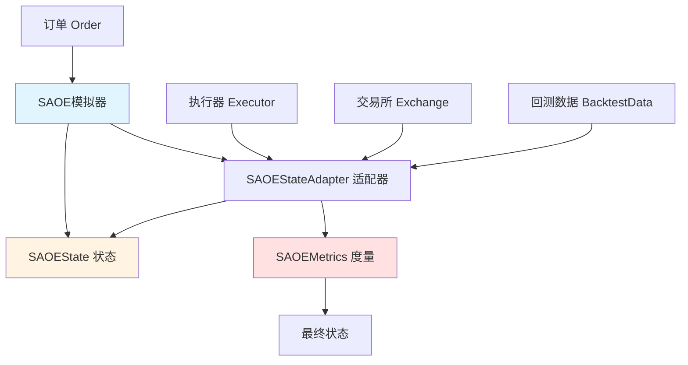

# 单资产订单执行状态模块

## 模块概述

`qlib.rl.order_execution.state` 模块定义了强化学习环境中单资产订单执行（SAOE, Single Asset Order Execution）的核心数据结构，包括状态和度量信息。该模块是 Qlib 强化学习订单执行系统的基础组件，提供了：

- **SAOEMetrics**: 订单执行过程中累积的各种度量指标
- **SAOEState**: 强化学习环境的状态表示

这些数据结构被用于：
- 跟踪订单执行的进度和结果
- 记录市场信息和策略执行情况
- 计算价格优势（PA）和订单完成率（FFR）等关键指标
- 为强化学习智能体提供环境状态信息

## 核心类

### 1. SAOEMetrics

`SAOEMetrics` 是一个类型字典（TypedDict），用于存储单资产订单执行过程中的累积度量指标。

```python
class SAOEMetrics(TypedDict):
    """SAOE在一段时间内累积的度量指标。
    可以按天累积，也可以按一段时间（如30分钟）累积，甚至按每分钟单独计算。
    """
```

#### 字段说明

| 字段名 | 类型 | 说明 |
|--------|------|------|
| `stock_id` | `str` | 股票代码 |
| `datetime` | `pd.Timestamp \| pd.DatetimeIndex` | 记录的时间点（在DataFrame中作为索引） |
| `direction` | `int` | 订单方向：0表示卖出，1表示买入 |
| `market_volume` | `np.ndarray \| float` | 该时间段内的市场总成交量 |
| `market_price` | `np.ndarray \| float` | 成交价格。如果是时间段，则是平均市场价格 |
| `amount` | `np.ndarray \| float` | 策略打算交易的总数量 |
| `inner_amount` | `np.ndarray \| float` | 低层策略打算交易的总数量（可能大于amount，例如为确保完成率） |
| `deal_amount` | `np.ndarray \| float` | 实际生效的数量（必须小于等于inner_amount） |
| `trade_price` | `np.ndarray \| float` | 策略的平均成交价格 |
| `trade_value` | `np.ndarray \| float` | 交易总价值。简单模拟中 trade_value = deal_amount * price |
| `position` | `np.ndarray \| float` | 该时段结束后剩余的持仓 |
| `ffr` | `np.ndarray \| float` | 完成每日订单的百分比 |
| `pa` | `np.ndarray \| float` | 相对于基准线的价格优势（相对于使用TWAP策略执行订单时的交易价格）。单位是BP（基点，1/10000） |

**重要说明**：
- 类型提示针对单个元素，但在很多情况下，这些字段可以被向量化
- 例如，`market_volume` 可以是浮点数列表或 ndarray，而不仅仅是单个浮点数

### 2. SAOEState

`SAOEState` 是一个命名元组（NamedTuple），用于存储 SAOE 模拟器的状态。

```python
class SAOEState(NamedTuple):
    """持有SAOE模拟器状态的数据结构。"""
```

#### 字段说明

| 字段名 | 类型 | 说明 |
|--------|------|------|
| `order` | `Order` | 当前处理的订单对象 |
| `cur_time` | `pd.Timestamp` | 当前时间，例如 9:30 |
| `cur_step` | `int` | 当前步数，例如 0 |
| `position` | `float` | 当前剩余待执行的数量 |
| `history_exec` | `pd.DataFrame` | 执行历史记录（见 `SingleAssetOrderExecution.history_exec`） |
| `history_steps` | `pd.DataFrame` | 步骤历史记录（见 `SingleAssetOrderExecution.history_steps`） |
| `metrics` | `Optional[SAOEMetrics]` | 每日度量指标，仅在交易处于"完成"状态时可用 |
| `backtest_data` | `BaseIntradayBacktestData` | 包含在状态中的回测数据。实际上目前只需要此数据的时间索引。包含完整数据以便实现依赖原始数据的算法（如VWAP）。解释器可以按需使用，但应注意不要泄露未来数据 |
| `ticks_per_step` | `int` | 每步包含多少tick |
| `ticks_index` | `pd.DatetimeIndex` | 全天交易tick，未按订单切片（在数据中定义）。例如 [9:30, 9:31, ..., 14:59] |
| `ticks_for_order` | `pd.DatetimeIndex` | 按订单切片的交易tick，例如 [9:45, 9:46, ..., 14:44] |

## 类关系图

```mermaid
classDiagram
    class SAOEMetrics {
        +str stock_id

        +pd.Timestamp|pd.DatetimeIndex datetime
        +int direction
        +np.ndarray|float market_volume
        +np.ndarray|float market_price
        +np.ndarray|float amount
        +np.ndarray|float inner_amount
        +np.ndarray|float deal_amount
        +np.ndarray|float trade_price
        +np.ndarray|float trade_value
        +np.ndarray|float position
        +np.ndarray|float ffr
        +np.ndarray|float pa
    }

    class SAOEState() {
        +Order order
        +pd.Timestamp cur_time
        +int cur_step
        +float position
        +pd.DataFrame history_exec
        +pd.DataFrame history_steps
        +Optional[SAOEMetrics] metrics
        +BaseIntradayBacktestData backtest_data
        +int ticks_per_step
        +pd.DatetimeIndex ticks_index
        +pd.DatetimeIndex ticks_for_order
    }

    class Order {
        +str stock_id
        +float amount
        +OrderDir direction
        +pd.Timestamp start_time
        +pd.Timestamp end_time
        +float deal_amount
        +Optional[float] factor
    }

    class BaseIntradayBacktestData {
        <<abstract>>
        +get_deal_price() pd.Series
        +get_volume() pd.Series
        +get_time_index() pd.DatetimeIndex
    }

    SAOEState --> Order : 包含
    SAOEState --> SAOEMetrics : 可能包含
    SAOEState --> BaseIntradayBacktestData : 包含
```

## 数据流图



## 使用示例

### 示例1：创建和访问 SAOEState

```python
import pandas as pd
from qlib.backtest import Order, OrderDir
from qlib.rl.order_execution.state import SAOEState

# 创建一个订单
order = Order(
    stock_id="SH600000",
    amount=1000.0,
    direction=OrderDir.BUY,
    start_time=pd.Timestamp("2024-01-01 09:30:00"),
    end_time=pd.Timestamp("2024-01-01 14:59:00"),
)

# 创建 SAOEState（通常由模拟器自动创建）
state = SAOEState(
    order=order,
    cur_time=pd.Timestamp("2024-01-01 09:30:00"),
    cur_step=0,
    position=1000.0,
    history_exec=pd.DataFrame(),
    history_steps=pd.DataFrame(),
    metrics=None,
    backtest_data=backtest_data,  # 某个 BaseIntradayBacktestData 实例
    ticks_per_step=30,
    ticks_index=pd.date_range("09:30", "14:59", freq="1min"),
    ticks_for_order=pd.date_range("09:30", "14:59", freq="1min"),
)

# 访问状态信息
print(f"当前时间: {state.cur_time}")
print(f"当前步骤: {state.cur_step}")
print(f"剩余持仓: {state.position}")
print(f"订单数量: {state.order.amount}")
```

### 示例2：访问 SAOEMetrics

```python
import pandas as pd
import numpy as np
from qlib.rl.order_execution.state import SAOEMetrics

# 创建度量指标（通常由模拟器自动计算）
metrics = SAOEMetrics(
    stock_id="SH600000",
    datetime=pd.Timestamp("2024-01-01 09:30:00"),
    direction=1,  # 买入
    market_volume=np.array([1000, 1500, 2000]),
    market_price=np.array([10.0, 10.1, 10.2]),
    amount=1000.0,
    inner_amount=1000.0,
    deal_amount=950.0,
    trade_price=10.05,
    trade_value=9547.5,
    position=50.0,
    ffr=0.95,  # 95%完成率
    pa=-5.0,   # -5 BP的价格优势
)

# 访问度量指标
print(f"订单完成率 (FFR): {metrics['ffr'] * 100:.2f}%")
print(f"价格优势 (PA): {metrics['pa']} BP")
print(f"实际成交数量: {metrics['deal_amount']}")
print(f"平均成交价格: {metrics['trade_price']}")
```

### 示例3：在强化学习环境中使用 SAOEState

```python
from qlib.rl.order_execution import SingleAssetOrderExecution
from qlib.backtest import Order, OrderDir

# 创建订单
order = Order(
    stock_id="SH600000",
    amount=10000.0,
    direction=OrderDir.BUY,
    start_time=pd.Timestamp("2024-01-01 09:30:00"),
    end_time=pd.Timestamp("2024-01-01 14:59:00"),
)

# 创建模拟器
simulator = SingleAssetOrderExecution(
    order=order,
    executor_config={"class": "Executor", "module_path": "qlib.contrib.executor"},
    exchange_config={"freq": "1min", "start_time": "2024-01-01", "end_time": "2024-01-01"},
    qlib_config={"provider_uri": "~/.qlib/qlib_data/cn_data", "region": "cn"},
)

# 获取当前状态
state = simulator.get_state()
print(f"当前时间: {state.cur_time}")
print(f"剩余持仓: {state.position}")
print(f"订单方向: {state.order.direction}")

# 执行动作
while not simulator.done():
    action = some_policy.predict(state)  # 由策略决定交易数量
    simulator.step(action)
    state = simulator.get_state()
    print(f"步骤 {state.cur_step}: 剩余 {state.position}")

# 交易完成后，可以访问最终的度量指标
if state.metrics is not None:
    print(f"最终完成率: {state.metrics['ffr']}")
    print(f"价格优势: {state.metrics['pa']} BP")
```

## 相关模块

### 核心依赖

- **`qlib.backtest.Order`**: 订单类，定义了要执行的基本订单信息
- **`qlib.rl.data.base.BaseIntradayBacktestData`**: 回测数据基类，提供市场数据接口
- **`qlib.backtest.decision.OrderDir`**: 订单方向枚举（买入/卖出）

### 相关实现

- **`qlib.rl.order_execution.simulator_qlib.SingleAssetOrderExecution`**: 使用 Qlib 回测工具实现的 SAOE 模拟器
- **`qlib.rl.order_execution.simulator_simple`**: 简单版 SAOE 模拟器
- **`qlib.rl.order_execution.strategy.SAOEStateAdapter`**: 状态适配器，负责维护和更新状态
- **`qlib.rl.order_execution.interpreter`**: 状态和动作解释器，用于将原始数据转换为模型输入/输出

### 使用场景

这些数据结构主要用于以下场景：

1. **强化学习训练**: 作为环境状态输入到神经网络策略
2. **订单执行算法**: 跟踪执行进度和性能指标
3. **回测和评估**: 记录详细的执行历史和结果
4. **策略分析**: 计算和比较不同执行策略的性能

## 注意事项

1. **时间处理**:
   - `cur_time` 始终在订单的 `start_time` 和 `end_time` 范围内
   - `ticks_index` 是全天的时间序列，而 `ticks_for_order` 是订单有效时间范围内的时间序列

2. **状态转换**:
   - `metrics` 字段仅在交易完成后（done状态）才有值
   - 每次执行步骤后，`position` 会减少已成交的数量

3. **数据泄露风险**:
   - 使用 `backtest_data` 时需要小心，避免使用未来数据
   - 解释器在处理状态时应确保因果性

4. **度量指标计算**:
   - `pa`（价格优势）的计算可能存在数据泄露风险（相对于TWAP基准）
   - 在真实环境中应谨慎使用这些指标

## 参考

- [Qlib 官方文档 - 强化学习](https://github.com/microsoft/qlib/blob/main/docs/contrib/rl.md)
- [订单执行策略相关论文](https://arxiv.org/abs/2106.05823)
- Qlib 回测系统文档
