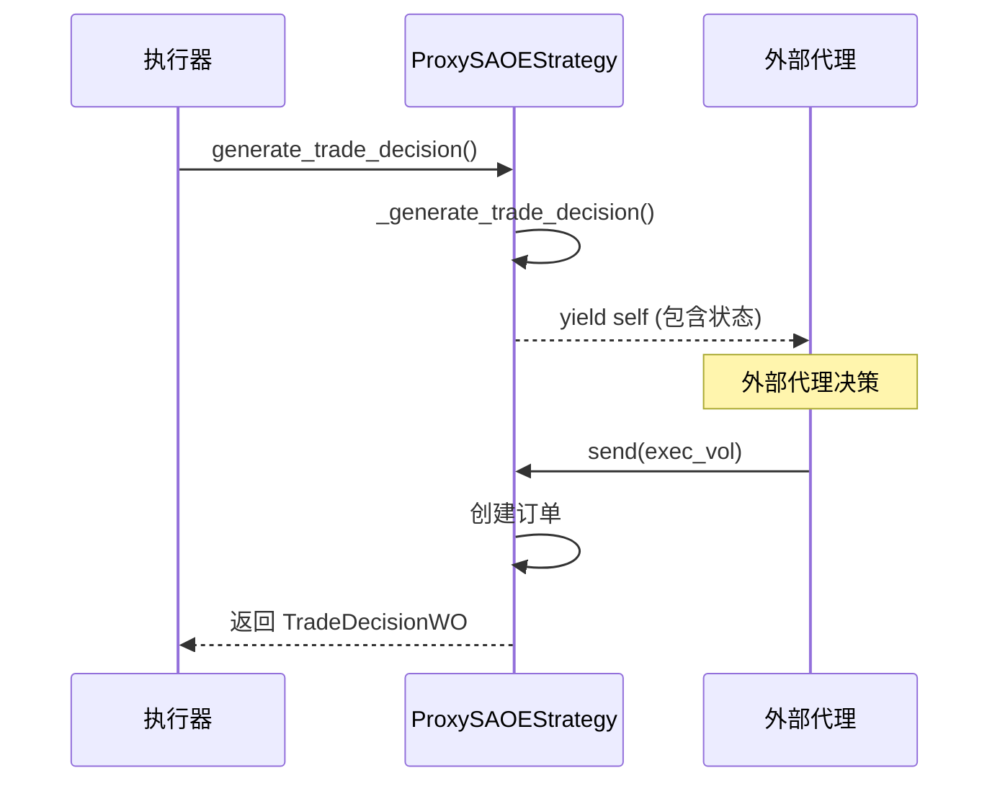
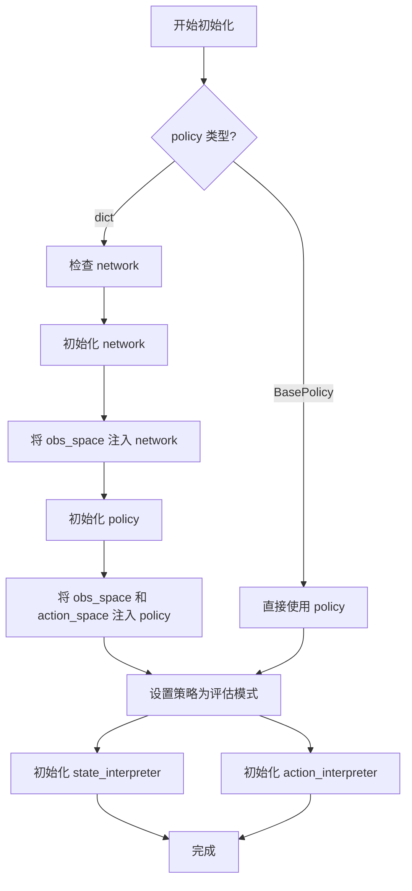
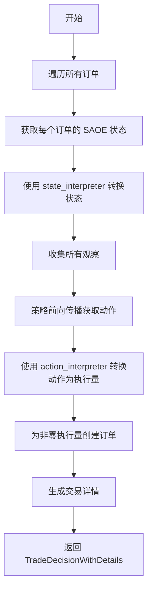
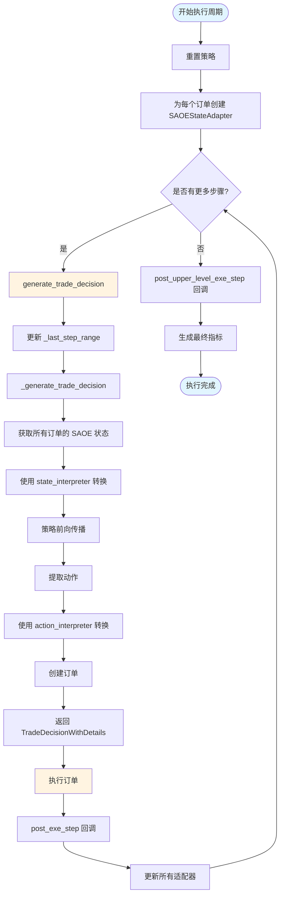

# order_execution.strategy 模块

## 模块概述

`qlib.rl.order_execution.strategy` 模块提供了基于强化学习的订单执行策略实现。该模块主要用于算法交易中的执行优化，通过强化学习模型智能地拆分大额订单，以降低市场冲击成本并提高执行效率。

该模块的核心功能包括：

- **状态管理**：通过 `SAOEStateAdapter` 维护订单执行过程中的环境状态
- **策略基类**：提供基于 SAOE（State-Action-Order-Execution）状态空间的强化学习策略基础框架
- **代理策略**：`ProxySAOEStrategy` 允许外部代理直接参与决策
- **解释器集成**：`SAOEIntStrategy` 集成状态和动作解释器，实现完整的 RL 流程

### 核心概念

1. **SAOE 状态**：单资产订单执行（Single Asset Order Execution）状态，包含订单信息、当前时间、剩余仓位、历史执行记录等
2. **TWAP 基准**：使用时间加权平均价格（TWAP）作为基准来评估执行质量
3. **价格优势（Price Advantage, PA）**：衡量实际执行价格相对于 TWAP 价格的优劣

---

## 辅助函数

### `_get_all_timestamps`

生成从开始时间到结束时间的时间戳序列。

```python
def _get_all_timestamps(
    start: pd.Timestamp,
    end: pd.Timestamp,
    granularity: pd.Timedelta = ONE_MIN,
    include_end: bool = True,
) -> pd.DatetimeIndex
```

**参数**

| 参数名 | 类型 | 必需 | 说明 |
|--------|------|------|------|
| `start` | `pd.Timestamp` | 是 | 起始时间 |
| `end` | `pd.Timestamp` | 是 | 结束时间 |
| `granularity` | `pd.Timedelta` | 否 | 时间粒度，默认为 1 分钟 |
| `include_end` | `bool` | 否 | 是否包含结束时间，默认为 `True` |

**返回值**

- `pd.DatetimeIndex`：生成的时间戳序列

**示例**

```python
import pandas as pd
from qlib.constant import ONE_MIN

timestamps = _get_all_timestamps(
    start=pd.Timestamp("2023-01-01 09:30:00"),
    end=pd.Timestamp("2023-01-01 10:00:00"),
    granularity=ONE_MIN * 5,  # 5分钟粒度
    include_end=True
)
# 返回从 09:30 到 10:00 之间所有 5 分钟间隔的时间戳
```

---

### `fill_missing_data`

填充数据中的缺失值。

```python
def fill_missing_data(
    original_data: np.ndarray,
    fill_method: Callable = np.nanmedian,
) -> np.ndarray
```

**参数**

| 参数名 | 类型 | 必需 | 说明 |
|--------|------|------|------|
| `original_data` | `np.ndarray` | 是 | 原始数据，可能包含缺失值 |
| `fill_method` | `Callable` | 否 | 填充方法，默认使用 `np.nanmedian`（中位数） |

**返回值**

- `np.ndarray`：填充后的数据，所有 NaN 被替换

**示例**

```python
import numpy as np

data = np.array([1.0, 2.0, np.nan, 4.0, 5.0])
filled_data = fill_missing_data(data)
# 使用中位数填充 NaN
```

---

## 核心类

### `SAOEStateAdapter`

维护订单执行环境的状态适配器。该类接收执行结果并根据执行器（executor）和交易所（exchange）的额外信息更新其内部状态。

```python
class SAOEStateAdapter
```

**功能概述**

`SAOEStateAdapter` 是 SAOE 状态管理器的核心实现，负责：

1. 跟踪订单执行过程中的剩余仓位
2. 记录每次执行的市场价格和成交量
3. 计算执行指标（如价格优势、完成度等）
4. 生成 SAOEState 对象供 RL 策略使用

#### 构造方法

```python
def __init__(
    self,
    order: Order,
    trade_decision: BaseTradeDecision,
    executor: BaseExecutor,
    exchange: Exchange,
    ticks_per_step: int,
    backtest_data: IntradayBacktestData,
    data_granularity: int = 1,
) -> None
```

**参数说明**

| 参数名 | 类型 | 必需 | 说明 |
|--------|------|------|------|
| `order` | `Order` | 是 | 待执行的目标订单对象 |
| `trade_decision` | `BaseTradeDecision` | 是 | 交易决策对象，包含执行参数 |
| `executor` | `BaseExecutor` | 是 | 执行器，用于获取交易账户信息 |
| `exchange` | `Exchange` | 是 | 交易所模拟器，用于获取市场数据 |
| `ticks_per_step` | `int` | 是 | 每个决策步包含的 tick 数量 |
| `backtest_data` | `IntradayBacktestData` | 是 | 回测数据，包含价格和成交量信息 |
| `data_granularity` | `int` | 否 | 数据粒度（分钟），默认为 1 |

#### 实例属性

| 属性名 | 类型 | 说明 |
|--------|------|------|
| `position` | `float` | 当前剩余未执行的仓位 |
| `order` | `Order` | 原始订单对象 |
| `executor` | `BaseExecutor` | 执行器引用 |
| `exchange` | `Exchange` | 交易所引用 |
| `backtest_data` | `IntradayBacktestData` | 回测数据引用 |
| `twap_price` | `float` | TWAP 基准价格 |
| `history_exec` | `pd.DataFrame` | 历史执行记录（每个 tick） |
| `history_steps` | `pd.DataFrame` | 历史步骤记录（每个决策步） |
| `metrics` | `SAOEMetrics | None` | 最终执行指标 |
| `cur_time` | `pd.Timestamp` | 当前时间 |
| `ticks_per_step` | `int` | 每步的 tick 数量 |
| `data_granularity` | `int` | 数据粒度 |

#### 方法

##### `update`

根据执行结果更新适配器状态。

```python
def update(
    self,
    execute_result: list,
    last_step_range: Tuple[int, int],
) -> None
```

**参数**

| 参数名 | 类型 | 说明 |
|--------|------|------|
| `execute_result` | `list` | 执行结果列表，每个元素为 `(order, _, __, ___)` |
| `last_step_range` | `Tuple[int, int]` | 上一步的索引范围 `(start_idx, end_idx)` |

**功能**

1. 从执行结果中提取成交量分布
2. 从交易所获取市场价格和成交量
3. 计算执行指标（PA、FFR 等）
4. 更新历史记录
5. 减少剩余仓位
6. 推进当前时间

**示例**

```python
# 假设 adapter 已初始化
execute_result = [
    (order_1, success_1, deal_amount_1, msg_1),
    (order_2, success_2, deal_amount_2, msg_2),
]
adapter.update(execute_result, last_step_range=(0, 29))
```

##### `generate_metrics_after_done`

在整个执行完成后生成最终指标。

```python
def generate_metrics_after_done(self) -> None
```

**功能**

- 基于所有历史执行记录计算最终指标
- 结果存储在 `self.metrics` 属性中

**示例**

```python
# 在所有执行步骤完成后调用
adapter.generate_metrics_after_done()
final_metrics = adapter.metrics
print(final_metrics.pa)  # 打印价格优势
print(final_metrics.ffr)  # 打印完成度
```

##### `saoe_state`（属性）

获取当前的 SAOE 状态。

```python
@property
def saoe_state(self) -> SAOEState
```

**返回值**

- `SAOEState`：包含订单、时间、仓位、历史记录等完整状态

**示例**

```python
state = adapter.saoe_state
print(state.position)  # 剩余仓位
print(state.cur_time)  # 当前时间
print(state.history_steps)  # 历史步骤
```

---

### `SAOEStrategy`

基于强化学习的策略基类，使用 SAOEState 作为状态空间。

```python
class SAOEStrategy(RLStrategy)
```

**功能概述**

`SAOEStrategy` 是所有基于 SAOE 状态空间的 RL 策略的基类，提供：

1. 状态适配器管理（每个订单一个适配器）
2. 执行结果追踪和处理
3. 决策生成的统一接口
4. 上层和下层执行的回调机制

#### 构造方法

```python
def __init__(
    self,
    policy: BasePolicy,
    outer_trade_decision: BaseTradeDecision | None = None,
    level_infra: LevelInfrastructure | None = None,
    common_infra: CommonInfrastructure | None = None,
    data_granularity: int = 1,
    **kwargs: Any,
) -> None
```

**参数说明**

| 参数名 | 类型 | 必需 | 说明 |
|--------|------|------|------|
| `policy` | `BasePolicy` | 是 | 强化学习策略 |
| `outer_trade_decision` | `BaseTradeDecision \| None` | 否 | 上层交易决策，默认为 `None` |
| `level_infra` | `LevelInfrastructure \| None` | 否 | 层级基础设施，默认为 `None` |
| `common_infra` | `CommonInfrastructure \| None` | 否 | 公共基础设施，默认为 `None` |
| `data_granularity` | `int` | 否 | 数据粒度（分钟），默认为 1 |
| `**kwargs` | `Any` | 否 | 其他参数传递给父类 |

#### 实例属性

| 属性名 | 类型 | 说明 |
|--------|------|------|
| `_data_granularity` | `int` | 数据粒度 |
| `adapter_dict` | `Dict[tuple, SAOEStateAdapter]` | 订单到适配器的映射字典 |
| `_last_step_range` | `Tuple[int, int]` | 上一步的索引范围 |

#### 方法

##### `reset`

重置策略状态并初始化适配器。

```python
def reset(
    self,
    outer_trade_decision: BaseTradeDecision | None = None,
    **kwargs: Any
) -> None
```

**参数**

| 参数名 | 类型 | 说明 |
|--------|------|------|
| `outer_trade_decision` | `BaseTradeDecision \| None` | 新的交易决策 |
| `**kwargs` | `Any` | 其他参数 |

**功能**

1. 清空适配器字典
2. 重置最后步范围
3. 如果提供了新决策，为每个订单创建适配器

##### `get_saoe_state_by_order`

获取指定订单的 SAOE 状态。

```python
def get_saoe_state_by_order(self, order: Order) -> SAOEState
```

**参数**

| 参数名 | 类型 | 说明 |
|--------|------|------|
| `order` | `Order` | 目标订单 |

**返回值**

- `SAOEState`：该订单的当前状态

##### `post_upper_level_exe_step`

上层执行步骤完成后的回调。

```python
def post_upper_level_exe_step(self) -> None
```

**功能**

- 为所有适配器生成最终指标
- 在整个执行周期结束时调用

##### `post_exe_step`

下层执行步骤完成后的回调。

```python
def post_exe_step(self, execute_result: Optional[list]) -> None
```

**参数**

| 参数名 | 类型 | 说明 |
|--------|------|------|
| `execute_result` | `Optional[list]` | 执行结果列表 |

**功能**

- 将执行结果分发给对应的适配器
- 每个适配器调用 `update()` 方法

##### `generate_trade_decision`

生成交易决策（包装方法）。

```python
def generate_trade_decision(
    self,
    execute_result: list | None = None,
) -> Union[BaseTradeDecision, Generator[Any, Any, BaseTradeDecision]]
```

**参数**

| 参数名 | 类型 | 说明 |
|--------|------|------|
| `execute_result` | `list \| None` | 上一步的执行结果 |

**返回值**

- `Union[BaseTradeDecision, Generator]`：交易决策或生成器

**功能**

1. 更新 `_last_step_range`
2. 调用子类实现的 `_generate_trade_decision()`
3. 处理生成器情况

**注意**

- 子类应重写 `_generate_trade_decision()` 而不是此方法

##### `_generate_trade_decision`

生成交易决策（由子类实现）。

```python
def _generate_trade_decision(
    self,
    execute_result: list | None = None,
) -> Union[BaseTradeDecision, Generator[Any, Any, BaseTradeDecision]]
```

**参数**

| 参数名 | 类型 | 说明 |
|--------|------|------|
| `execute_result` | `list \| None` | 执行结果 |

**返回值**

- `Union[BaseTradeDecision, Generator]`：生成的决策

**注意**

- 这是一个抽象方法，子类必须实现

---

### `ProxySAOEStrategy`

代理策略，使用 SAOEState。它被称为"代理"策略，因为它自身不做任何决策，而是在需要生成决策时将环境信息 yield 出去，让外部代理做出决策。

```python
class ProxySAOEStrategy(SAOEStrategy)
```

**功能概述**

`ProxySAOEStrategy` 提供了一种与外部代理交互的机制：

1. 在决策时 yield 自己（包含完整环境状态）
2. 外部代理通过 `send()` 方法发送执行量
3. 策略将执行量转换为订单并返回

这允许在策略外部实现复杂的决策逻辑，如与人类交互、多智能体协调等。

#### 构造方法

```python
def __init__(
    self,
    outer_trade_decision: BaseTradeDecision | None = None,
    level_infra: LevelInfrastructure | None = None,
    common_infra: CommonInfrastructure | None = None,
    **kwargs: Any,
) -> None
```

**参数说明**

| 参数名 | 类型 | 必需 | 说明 |
|--------|------|------|------|
| `outer_trade_decision` | `BaseTradeDecision \| None` | 否 | 上层交易决策 |
| `level_infra` | `LevelInfrastructure \| None` | 否 | 层级基础设施 |
| `common_infra` | `CommonInfrastructure \| None` | 否 | 公共基础设施 |
| `**kwargs` | `Any` | 否 | 其他参数 |

**注意**

- `policy` 参数固定为 `None`，因为决策由外部代理完成

#### 方法

##### `_generate_trade_decision`

生成交易决策（使用生成器）。

```python
def _generate_trade_decision(
    self,
    execute_result: list | None = None
) -> Generator[Any, Any, BaseTradeDecision]
```

**参数**

| 参数名 | 类型 | 说明 |
|--------|------|------|
| `execute_result` | `list \| None` | 执行结果 |

**返回值**

- `Generator`：生成器对象

**工作流程**



**使用示例**

```python
# 创建策略
strategy = ProxySAOEStrategy(
    outer_trade_decision=trade_decision,
    level_infra=level_infra,
)

# 生成决策（第一次调用）
decision_gen = strategy.generate_trade_decision()

# 生成器挂起，可以获取状态
strategy_instance = next(decision_gen)
state = strategy_instance.get_saoe_state_by_order(order)

# 外部代理决策
exec_volume = 100.0  # 基于某种策略决定

# 发送执行量并获取决策
decision = decision_gen.send(exec_volume)
```

##### `reset`

重置策略状态。

```python
def reset(
    self,
    outer_trade_decision: BaseTradeDecision | None = None,
    **kwargs: Any
) -> None
```

**参数**

| 参数名 | 类型 | 说明 |
|--------|------|------|
| `outer_trade_decision` | `BaseTradeDecision \| None` | 新的交易决策 |
| `**kwargs` | `Any` | 其他参数 |

**功能**

1. 调用父类 reset
2. 提取并保存唯一的订单

---

### `SAOEIntStrategy`

基于 SAOE 状态的带有解释器的策略。

```python
class SAOEIntStrategy(SAOEStrategy)
```

**功能概述**

`SAOEIntStrategy` 是最常用的 RL 策略实现，它集成了：

1. **状态解释器**：将 SAOEState 转换为模型可观察的状态
2. **动作解释器**：将模型输出转换为执行量
3. **强化学习策略**：使用 Tianshou 的 BasePolicy 进行决策

#### 构造方法

```python
def __init__(
    self,
    policy: dict | BasePolicy,
    state_interpreter: dict | StateInterpreter,
    action_interpreter: dict | ActionInterpreter,
    network: dict | torch.nn.Module | None = None,
    outer_trade_decision: BaseTradeDecision | None = None,
    level_infra: LevelInfrastructure | None = None,
    common_infra: CommonInfrastructure | None = None,
    **kwargs: Any,
) -> None
```

**参数说明**

| 参数名 | 类型 | 必需 | 说明 |
|--------|------|------|------|
| `policy` | `dict \| BasePolicy` | 是 | 策略配置或策略实例 |
| `state_interpreter` | `dict \| StateInterpreter` | 是 | 状态解释器配置或实例 |
| `action_interpreter` | `dict \| ActionInterpreter` | 是 | 动作解释器配置或实例 |
| `network` | `dict \| torch.nn.Module \| None` | 否 | 网络配置或实例（当 policy 为 dict 时需要） |
| `outer_trade_decision` | `BaseTradeDecision \| None` | 否 | 上层交易决策 |
| `level_infra` | `LevelInfrastructure \| None` | 否 | 层级基础设施 |
| `common_infra` | `CommonInfrastructure \| None` | 否 | 公共基础设施 |
| `**kwargs` | `Any` | 否 | 其他参数 |

**初始化流程**



**示例**

```python
from tianshou.policy import DQNPolicy

# 使用配置初始化
strategy = SAOEIntStrategy(
    policy={
        "class": DQNPolicy,
        "kwargs": {
            "lr": 0.001,
            "gamma": 0.99,
        }
    },
    state_interpreter={
        "class": SAOEStateInterpreter,
        "kwargs": {...}
    },
    action_interpreter={
        "class": SAOEActionInterpreter,
        "kwargs": {...}
    },
    network={
        "class": torch.nn.Sequential,
        "kwargs": {...}
    },
    data_granularity=1,
)

# 使用已初始化的实例
strategy = SAOEIntStrategy(
    policy=existing_policy,
    state_interpreter=existing_state_interp,
    action_interpreter=existing_action_interp,
)
```

#### 实例属性

| 属性名 | 类型 | 说明 |
|--------|------|------|
| `_state_interpreter` | `StateInterpreter` | 状态解释器 |
| `_action_interpreter` | `ActionInterpreter` | 动作解释器 |
| `_policy` | `BasePolicy` | RL 策略 |

#### 方法

##### `reset`

重置策略状态。

```python
def reset(
    self,
    outer_trade_decision: BaseTradeDecision | None = None,
    **kwargs: Any
) -> None
```

**参数**

| 参数名 | 类型 | 说明 |
|--------|------|------|
| `outer_trade_decision` | `BaseTradeDecision \| None` | 新的交易决策 |
| `**kwargs` | `Any` | 其他参数 |

##### `_generate_trade_decision`

生成交易决策（核心方法）。

```python
def _generate_trade_decision(
    self,
    execute_result: list | None = None
) -> BaseTradeDecision
```

**参数**

| 参数名 | 类型 | 说明 |
|--------|------|------|
| `execute_result` | `list \| None` | 上一步的执行结果 |

**返回值**

- `BaseTradeDecision`：生成的交易决策

**工作流程**



**决策生成过程详解**

```python
# 1. 获取所有订单的状态
states = []
obs_batch = []
for decision in self.outer_trade_decision.get_decision():
    order = decision
    state = self.get_saoe_state_by_order(order)
    states.append(state)

    # 2. 将状态转换为观察
    obs_batch.append({
        "obs": self._state_interpreter.interpret(state)
    })

# 3. 策略前向传播
with torch.no_grad():
    policy_out = self._policy(Batch(obs_batch))

# 4. 提取动作
act = policy_out.act.numpy()

# 5. 将动作转换为执行量
exec_vols = [
    self._action_interpreter.interpret(s, a)
    for s, a in zip(states, act)
]

# 6. 创建订单
order_list = []
for decision, exec_vol in zip(
    self.outer_trade_decision.get_decision(),
    exec_vols
):
    if exec_vol != 0:
        order = decision
        order_list.append(
            oh.create(order.stock_id, exec_vol, order.direction)
        )
```

##### `_generate_trade_details`

生成交易详情数据框。

```python
def _generate_trade_details(
    self,
    act: np.ndarray,
    exec_vols: List[float]
) -> pd.DataFrame
```

**参数**

| 参数名 | 类型 | 说明 |
|--------|------|------|
| `act` | `np.ndarray` | 动作数组 |
| `exec_vols` | `List[float]` | 执行量列表 |

**返回值**

- `pd.DataFrame`：包含交易详情的数据框

**数据框列**

| 列名 | 说明 |
|------|------|
| `instrument` | 股票代码 |
| `datetime` | 决策时间 |
| `freq` | 时间频率 |
| `rl_exec_vol` | RL 决定的执行量 |
| `rl_action` | RL 原始动作（可选） |

---

## 使用示例

### 示例 1：使用 SAOEIntStrategy 进行订单执行

```python
from qlib.rl.order_execution.state import SAOEState
from qlib.contrib.strategy.signal_strategy import TopkDropoutStrategy
from tianshou.policy import DQNPolicy
import torch.nn as nn

# 1. 定义网络
network = nn.Sequential(
    nn.Linear(128, 256),
    nn.ReLU(),
    nn.Linear(256, 128),
    nn.ReLU(),
    nn.Linear(128, 10),
)

# 2. 创建策略
strategy = SAOEIntStrategy(
    policy={
        "class": DQNPolicy,
        "kwargs": {
            "lr": 0.001,
            "gamma": 0.99,
        }
    },
    state_interpreter={
        "class": SAOEStateInterpreter,
        "kwargs": {
            "features": ["price", "volume", "vwap"],
        }
    },
    action_interpreter={
        "class": SAOEActionInterpreter,
        "kwargs": {
            "max_trade_ratio": 0.1,
        }
    },
    network=network,
    data_granularity=1,
)

# 3. 设置交易决策
order = Order(
    stock_id="AAPL",
    amount=10000,  # 卖出 10000 股
    start_time=pd.Timestamp("2023-01-01 09:30:00"),
    end_time=pd.Timestamp("2023-01-01 10:00:00"),
    direction=Order.SELL,
)

trade_decision = TradeDecisionWO([order], strategy)

# 4. 重置策略
strategy.reset(outer_trade_decision=trade_decision)

# 5. 生成决策（在回测循环中）
for step in range(num_steps):
    decision = strategy.generate_trade_decision()
    # 执行决策...

# 6. 获取最终指标
strategy.post_upper_level_exe_step()
for adapter in strategy.adapter_dict.values():
    print(f"Price Advantage: {adapter.metrics.pa}")
    print(f"Fulfillment Ratio: {adapter.metrics.ffr}")
```

### 示例 2：使用 ProxySAOEStrategy 进行交互式决策

```python
# 创建代理策略
proxy_strategy = ProxySAOEStrategy(
    outer_trade_decision=trade_decision,
    level_infra=level_infra,
)

proxy_strategy.reset(outer_trade_decision=trade_decision)

# 交互式决策
decision_gen = = proxy_strategy.generate_trade_decision()
strategy_instance = next(decision_gen)

# 获取当前状态
state = strategy_instance.get_saoe_state_by_order(order)
print(f"剩余仓位: {state.position}")
print(f"当前时间: {state.cur_time}")

# 模拟人类或外部决策
remaining_position = state.position
exec_volume = min(remaining_position * 0.1, 1000)  # 每次最多 1000 股

# 发送决策
decision = decision_gen.send(exec_volume)
```

### 示例 3：多个订单并行执行

```python
# 创建多个订单
orders = [
    Order(
    stock_id="AAPL",
        amount=10000,
        start_time=pd.Timestamp("2023-01-01 09:30:00"),
        end_time=pd.Timestamp("2023-01-01 10:00:00"),
        direction=Order.SELL,
    ),
    Order(
        stock_id="MSFT",
        amount=8000,
        start_time=pd.Timestamp("2023-01-01 09:30:00"),
        end_time=pd.Timestamp("2023-01-01 10:00:00"),
        direction=Order.SELL,
    ),
]

trade_decision = TradeDecisionWO(orders, strategy)

# 策略会自动为每个订单创建适配器
strategy.reset(outer_trade_decision=trade_decision)

# 获取每个订单的状态
for order in orders:
    state = strategy.get_saoe_state_by_order(order)
    print(f"{order.stock_id}: 剩余 {state.position}")
```

---

## 完整决策流程图



---

## 相关模块

文档应包含对以下模块的简要说明和交叉引用：

- [`qlib.rl.order_execution.state`](../state.md)：SAOE 状态和指标定义
- [`qlib.rl.interpreter`](../../interpreter.md)：状态和动作解释器接口
- [`qlib.backtest`](../../../backtest/)：回测基础设施
- [`qlib.strategy.base`](../../../strategy/base.md)：策略基类

---

## 注意事项

1. **数据粒度一致性**：`ticks_per_step` 必须是 `data_granularity` 的整数倍
2. **执行量约束**：确保执行量总和不超过订单总金额
3. **缺失值处理**：市场价格和成交量可能包含缺失值，使用 `fill_missing_data` 处理
4. **策略模式**：RL 策略应在评估模式下使用（`policy.eval()`）
5. **线程安全**：当前实现不是线程安全的，多线程环境需要额外同步

---

## 性能优化建议

1. **批量处理**：`SAOEIntStrategy` 已经支持批量状态处理
2. **预计算**：TWAP 价格在初始化时计算并缓存
3. **内存管理**：历史记录使用 pandas DataFrame，注意内存使用
4. **避免重复计算**：通过适配器缓存计算结果
