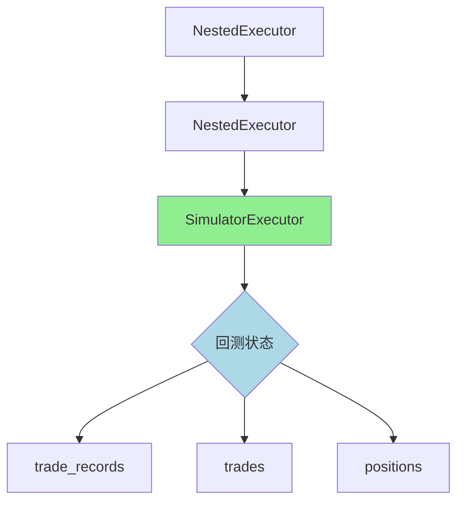

# utils.py - 订单执行工具函数

## 模块概述

`qlib.rl.order_execution.utils` 模块提供了一系列用于强化学习订单执行的工具函数。该模块主要包含以下功能：

- **DataFrame追加操作**：提供安全的数据框追加方法，替代已弃用的 `pandas.DataFrame.append`
- **价格优势计算**：根据买卖方向计算执行价格相对于基准价格的优势（以基点为单位）
- **执行器获取**：从嵌套执行器结构中获取底层的模拟器执行器

这些工具函数主要用于强化学习订单执行策略中，用于评估交易执行质量、处理交易数据以及访问模拟器执行器。

---

## 函数说明

### `dataframe_append`

安全地向DataFrame追加数据，替代已弃用的 `pandas.DataFrame.append` 方法。

**函数签名：**
```python
def dataframe_append(df: pd.DataFrame, other: Any) -> pd.DataFrame
```

**参数：**

| 参数名 | 类型 | 说明 |
|--------|------|------|
| `df` | `pd.DataFrame` | 原始DataFrame，必须包含datetime索引 |
| `other` | `Any` | 要追加的数据，可以是字典、DataFrame或其他可转换为DataFrame的对象 |

**返回值：**
- `pd.DataFrame` - 合并后的新DataFrame，索引名称为 "datetime"

**功能说明：**

该函数实现了DataFrame的追加操作，与已弃用的 `DataFrame.append` 方法功能相同：

1. 将 `other` 参数转换为DataFrame
2. 设置索引为 "datetime" 列
3. 使用 `pd.concat` 沿行方向（axis=0）合并两个DataFrame
4. 返回合并后的DataFrame

**使用示例：**

```python
import pandas as pd
from qlib.rl.order_execution.utils import dataframe_append

# 创建原始DataFrame
df = pd.DataFrame({
    'datetime': ['2023-01-01', '2023-01-02'],
    'price': [100.0, 101.0],
    'volume': [1000, 1500]
}).set_index('datetime')

# 追加新数据
new_data = {
    'datetime': ['2023-01-03'],
    'price': [102.0],
    'volume': [2000]
}

result = dataframe_append(df, new_data)
print(result)
```

**输出示例：**
```
            price  volume
datetime
2023-01-01  100.0    1000
2023-01-02  101.0    1500
2023-01-03  102.0    2000
```

---

### `price_advantage`

计算交易执行价格相对于基准价格的优势，以基点（basis points）为单位表示。

**函数签名：**
```python
def price_advantage(
    exec_price: float_or_ndarray,
    baseline_price: float,
    direction: OrderDir | int,
) -> float_or_ndarray
```

**参数：**

| 参数名 | 类型 | 说明 |
|--------|------|------|
| `exec_price` | `float_or_ndarray` | 执行价格，可以是单个浮点数或NumPy数组 |
| `baseline_price` | `float` | 基准价格（如开盘价、VWAP等） |
| `direction` | `OrderDir | int` | 订单方向，`OrderDir.BUY` 或 `OrderDir.SELL` |

**返回值：**
- `float_or_ndarray` - 价格优势（以基点为单位，1个基点 = 0.01%）

**功能说明：**

价格优势衡量的是交易执行相对于基准价格的改善程度，计算公式为：

- **买入方向**：`优势 = (1 - 执行价格/基准价格) * 10000`
  - 买入价格越低，优势越大（正数）
  - 买入价格高于基准时，优势为负数

- **卖出方向**：`优势 = (执行价格/基准价格 - 1) * 10000`
  - 卖出价格越高，优势越大（正数）
  - 卖出价格低于基准时，优势为负数

**特殊处理：**
1. 当 `baseline_price` 为 0 时（数据异常），返回 0 或与 `exec_price` 形状相同的零数组
2. 使用 `np.nan_to_num` 将NaN值替换为0.0
3. 支持标量和数组输入

**使用示例：**

```python
import numpy as np
from qlib.backtest.decision import OrderDir
from qlib.rl.order_execution.utils import price_advantage

# 示例1：买入订单优势计算
buy_exec_price = 99.5
baseline_price = 100.0
advantage_buy = price_advantage(buy_exec_price, baseline_price, OrderDir.BUY)
print(f"买入优势: {advantage_buy} 基点")  # 输出: 买入优势: 50.0 基点

# 示例2：卖出订单优势计算
sell_exec_price = 100.8
advantage_sell = price_advantage(sell_exec_price, baseline_price, OrderDir.SELL)
print(f"卖出优势: {advantage_sell} 基点")  # 输出: 卖出优势: 80.0 基点

# 示例3：批量计算
exec_prices = np.array([99.0, 99.5, 100.0, 100.5, 101.0])
advantages = price_advantage(exec_prices, baseline_price, OrderDir.BUY)
print(f"批量优势: {advantages}")
# 输出: 批量优势: [100.  50.   0.  -50. -100.]

# 示例4：异常数据处理
bad_baseline = 0.0
safe_advantage = price_advantage(99.0, bad_baseline, OrderDir.BUY)
print(f"异常数据优势: {safe_advantage}")  # 输出: 异常数据优势: 0.0
```

**价格优势解读：**

| 场景 | 买入优势 | 卖出优势 | 含义 |
|------|---------|---------|------|
| 正数 | 正数 | 正数 | 执行优于基准 |
| 零 | 零 | 零 | 执行价格等于基准 |
| 负数 | 负数 | 负数 | 执行劣于基准（滑点） |

**应用场景：**

- 评估算法交易策略的执行质量
- 比较不同执行算法的绩效
- 计算滑点成本
- 强化学习策略的奖励函数设计

---

### `get_simulator_executor`

从执行器层级结构中获取底层的模拟器执行器（`SimulatorExecutor`）。

**函数签名：**
```python
def get_simulator_executor(executor: BaseExecutor) -> SimulatorExecutor
```

**参数：**

| 参数名 | 类型 | 说明 |
|--------|------|------|
| `executor` | `BaseExecutor` | 顶层执行器，可能是 `NestedExecutor` 或 `SimulatorExecutor` |

**返回值：**
- `SimulatorExecutor` - 最底层的模拟器执行器

**功能说明：**

该函数用于穿透嵌套执行器结构，直接获取用于回测模拟的 `SimulatorExecutor`。执行器层级结构如下：

```
NestedExecutor
  └── NestedExecutor
        └── SimulatorExecutor
```

**执行过程：**
1. 检查执行器是否为 `NestedExecutor` 类型
2. 如果是，递归访问其 `inner_executor` 属性
3. 重复直到找到非嵌套的执行器
4. 断言找到的执行器是 `SimulatorExecutor` 类型
5. 返回该执行器

**使用示例：**

```python
from qlib.backtest.executor import NestedExecutor, SimulatorExecutor
from qlib.rl.order_execution.utils import get_simulator_executor

# 示例1：直接使用SimulatorExecutor
sim_executor = SimulatorExecutor()
result1 = get_simulator_executor(sim_executor)
print(f"执行器类型: {type(result1).__name__}")
# 输出: 执行器类型: SimulatorExecutor

# 示例2：从嵌套结构中获取
inner = SimulatorExecutor()
outer = NestedExecutor(inner_executor=inner)
outermost = NestedExecutor(inner_executor=outer)

result2 = get_simulator_executor(outermost)
print(f"获取的执行器类型: {type(result2).__name__}")
# 输出: 获取的执行器类型: SimulatorExecutor
print(f"是否为同一个对象: {result2 is inner}")
# 输出: 是否为同一个对象: True

# 示例3：访问模拟器状态
# 假设 executor 是从回测引擎获取的
# sim_executor = get_simulator_executor(executor)
# trade_records = sim_executor.trade_records
# trades = sim_executor.trades
```

**执行器层级结构图：**



**应用场景：**

- 从回测引擎中访问交易记录
- 获取模拟器内的持仓信息
- 在强化学习环境中访问历史交易数据
- 调试和可视化回测结果

---

## 完整使用示例

### 示例：强化学习订单执行环境中的工具函数使用

```python
import pandas as pd
import numpy as np
from qlib.backtest.decision import OrderDir
from qlib.backtest.executor import SimulatorExecutor
from qlib.rl.order_execution.utils import (
    dataframe_append,
    price_advantage,
    get_simulator_executor
)

# 1. 准备交易数据
trade_data = pd.DataFrame({
    'datetime': pd.date_range('2023-01-01', periods=5),
    'exec_price': [99.5, 99.8, 100.0, 100.3, 100.7],
    'baseline_price': [100.0] * 5,
    'direction': [OrderDir.BUY, OrderDir.BUY, OrderDir.BUY,
                  OrderDir.SELL, OrderDir.SELL]
}).set_index('datetime')

print("交易数据:")
print(trade_data)
print()

# 2. 计算每笔交易的价格优势
advantages = price_advantage(
    trade_data['exec_price'].values,
    trade_data['baseline_price'].iloc[0],
    OrderDir.BUY  # 假设都是买入
)

trade_data['advantage_bps'] = advantages
print("带价格优势的交易数据:")
print(trade_data)
print()

# 3. 追加新的交易记录
new_trades = {
    'datetime': [pd.Timestamp('2023-01-06')],
    'exec_price': [101.0],
    'baseline_price': [100.0],
    'direction': [OrderDir.SELL],
    'advantage_bps': [price_advantage(101.0, 100.0, OrderDir.SELL)]
}

trade_data = dataframe_append(trade_data, new_trades)
print("追加后的交易数据:")
print(trade_data)
print()

# 4. 模拟从执行器获取数据
executor = SimulatorExecutor()
sim_executor = get_simulator_executor(executor)
print(f"获取的模拟器执行器: {type(sim_executor).__name__}")
```

### 示例：评估执行策略绩效

```python
import numpy as np
from qlib.backtest.decision import OrderDir
from qlib.rl.order_execution.utils import price_advantage

def evaluate_execution_quality(
    exec_prices: np.ndarray,
    baseline_prices: np.ndarray,
    directions: list[OrderDir]
) -> dict:
    """评估执行策略的质量"""
    total_advantage = 0.0
    count = 0

    for i, (exec_price, baseline_price, direction) in enumerate(
        zip(exec_prices, baseline_prices, directions)
    ):
        advantage = price_advantage(exec_price, baseline_price, direction)
        total_advantage += advantage
        count += 1

    avg_advantage = total_advantage / count if count > 0 else 0.0

    return {
        'total_trades': count,
        'average_advantage_bps': avg_advantage,
        'total_advantage_bps': total_advantage,
    }

# 测试数据
exec_prices = np.array([99.5, 100.2, 99.8, 100.5])
baseline_prices = np.array([100.0, 100.0, 100.0, 100.0])
directions = [OrderDir.BUY, OrderDir.BUY, OrderDir.BUY, OrderDir.SELL]

# 评估执行质量
metrics = evaluate_execution_quality(exec_prices, baseline_prices, directions)

print("执行策略绩效评估:")
print(f"总交易次数: {metrics['total_trades']}")
print(f"平均优势: {metrics['average_advantage_bps']:.2f} 基点")
print(f"总优势: {metrics['total_advantage_bps']:.2f} 基点")
```

---

## 相关模块

### 依赖模块

| 模块 | 用途 |
|------|------|
| `qlib.backtest.decision` | 提供 `OrderDir` 枚举（订单方向） |
| `qlib.backtest.executor` | 提供执行器基类和模拟器执行器 |
| `qlqlib.constant` | 提供类型常量 |

### 使用本模块的模块

| 模块 | 用途 |
|------|------|
| `qlib.rl.order_execution.env` | 强化学习订单执行环境 |
| `qlib.rl.order_execution.strategy` | 订单执行策略实现 |

---

## 注意事项

1. **`dataframe_append` 性能**：由于每次都创建新的DataFrame，频繁使用可能影响性能。对于大数据量，建议使用列表收集数据后一次性创建DataFrame。

2. **`price_advantage` 异常处理**：当 `baseline_price` 为 0 时返回 0，这可能是数据异常的信号。调用者应检查数据的完整性。

3. **`get_simulator_executor` 断言**：如果传入的执行器层级不包含 `SimulatorExecutor`，会触发断言错误。确保传入的执行器结构正确。

4. **基点计算**：`price_advantage` 返回的值以基点（1/10000）为单位，显示时可能需要格式化为小数百分比。

---

## 参考资料

- [Qlib官方文档 - 订单执行](https://qlib.readthedocs.io/)
- [强化学习在量化交易中的应用](https://arxiv.org/abs/1711.08847)
- [交易执行算法优化](https://www.investopedia.com/terms/t/trading-algorithm.asp)
