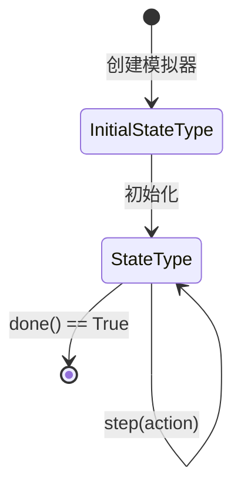

# qlib.rl.seed 模块文档

## 模块概述

`qlib.rl.seed` 模块定义了初始状态的类型定义。

在单资产订单执行场景中，主要的 seed 是订单（order）。

## 类型定义

### InitialStateType

```python
InitialStateType = TypeVar("InitialStateType")
```

**说明**：用于创建模拟器的数据类型。

## 设计说明

### 状态的生命周期



### 与模拟器的关系

```python
from qlib.rl.simulator import Simulator
from qlib.rl.seed import InitialStateType

# InitialStateType 是用于创建 Simulator 的数据类型
# 具体的实现由子类定义

# 例如：订单执行场景
Order = {
    'symbol': 'AAPL',
    'amount': 1000,
    'direction': 'buy',
    'start_time': '2020-01-01',
    'end_time': '2020-01-31'
}

# 使用初始状态创建模拟器
simulator = MySimulator(initial_state=Order)
```

## 应用场景

### 1. 订单执行

```python
# 单资产订单执行的初始状态
order_seed = {
    'symbol': 'AAPL',
    'amount': 1000,
    'direction': 'buy',
    'price_limit': None,
    'time_limit': '2020-01-31 23:59:59'
}

simulator = OrderExecutionSimulator(order_seed)
```

### 2. 投资组合管理

```python
# 投资组合管理的初始状态
portfolio_seed = {
    'initial_capital': 1000000,
    'symbols': ['AAPL', 'MSFT', 'GOOGL'],
    'start_date': '2020-01-01',
    'rebalance_frequency': 'monthly',
    'universe': list_of_symbols
}

simulator = PortfolioSimulator(portfolio_seed)
```

### 3. 算法交易

```python
# 算法交易的初始状态
algo_seed = {
    'strategy_params': {...},
    'market_data_config': {...},
    'risk_limits': {...},
    'execution_config': {...}
}

simulator = AlgoTradingSimulator(algo_seed)
```

## 扩展指南

### 定义自定义初始状态

```python
from typing import TypedDict, TypeVar

class MyInitialState(TypedDict):
    """自定义初始状态类型"""
    param1: str
    param2: float
    config: dict

# 使用自定义类型
MyInitialStateType = TypeVar("MyInitialStateType", bound=MyInitialState)
```

## 注意事项

1. **类型安全**：建议使用类型提示来明确初始状态的结构
2. **验证**：在模拟器构造函数中验证初始状态的有效性
3. **不可变性**：如果可能，考虑使用不可变的数据结构

## 相关文档

- [simulator.md](./simulator.md) - 模拟器文档
- [__init__.md](./__init__.md) - RL 模块概览
