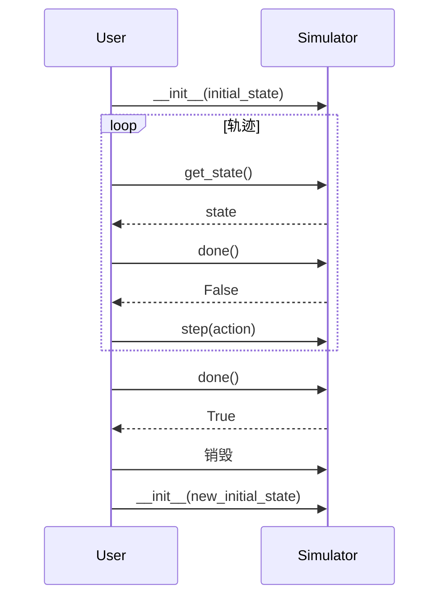
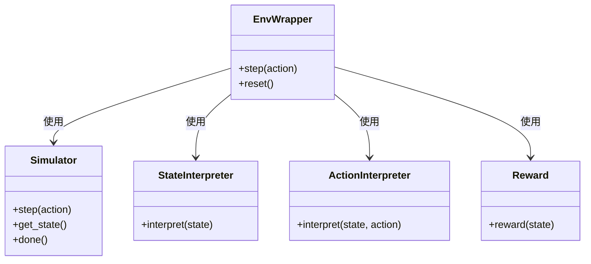

# qlib.rl.simulator 模块文档

## 模块概述

`qlib.rl.simulator` 模块定义了模拟器接口，这是 QLib 强化学习框架的核心组件之一。

模拟器负责环境模拟，定义状态转移逻辑。它是 MDP（马尔可夫决策过程）中的环境部分。

## 主要组件

### Simulator

```python
class Simulator(Generic[InitialStateType, StateType, ActType])
```

**说明**：模拟器基类，使用初始状态初始化，通过 `step(action)` 进行状态转移。

模拟器遵循以下设计原则：

1. **唯一修改方式**：只能通过 `step(action)` 修改模拟器的内部状态
2. **只读访问**：通过 `simulator.get_state()` 读取状态
3. **终止检查**：通过 `simulator.done()` 检查是否结束

#### 类型参数

| 类型参数 | 说明 |
|---------|------|
| `InitialStateType` | 用于创建模拟器的初始数据类型 |
| `StateType` | 模拟器内部状态的类型 |
| `ActType` | 模拟器接受的动作类型 |

#### 属性

| 属性名 | 类型 | 说明 |
|--------|------|------|
| `env` | `Optional[EnvWrapper]` | 环境包装器的弱引用，在特殊情况下可能有用。不鼓励使用，因为容易引发错误。 |

#### 方法

##### `__init__(initial: InitialStateType, **kwargs: Any) -> None`

**说明**：构造函数，使用初始状态初始化模拟器。

**参数**：
- `initial`: 初始状态数据
**- `**kwargs`**: 其他配置参数

**实现**：默认不做任何操作，子类可以覆盖

##### `step(action: ActType) -> None`

**说明**：**抽象方法**，接收动作并更新内部状态。

**参数**：
- `action`: 动作，类型为 `ActType`

**行为**：
- 更新模拟器的内部状态
- 不返回任何值（返回 `None`）
- 更新后的状态可以通过 `simulator.get_state()` 获取

**抛出**：`NotImplementedError` - 如果子类未实现此方法

##### `get_state() -> StateType`

**说明**：**抽象方法**，获取模拟器的当前状态。

**返回**：模拟器的当前状态，类型为 `StateType`

**抛出**：`NotImplementedError` - 如果子类未实现此方法

##### `done() -> bool`

**说明**：**抽象方法**，检查模拟器是否处于终止状态。

**返回**：
- `True`: 模拟器处于终止状态
- `False`: 模拟器继续运行

**行为**：
- 当模拟器处于终止状态时，不应再接收任何 `step` 请求
- 由于模拟器是临时的，要重置模拟器，应该销毁旧的并创建新的

**抛出**：`NotImplementedError` - 如果子类未实现此方法

## 类型定义

| 类型变量 | 说明 |
|---------|------|
| `StateType` | 模拟器状态类型，存储模拟过程中所有有用的数据 |
| `ActType` | 模拟器端的动作类型 |

## 设计原则

### 1. 短生命周期

模拟器是临时的（ephemeral）：
- 生命周期始于初始状态
- 终于轨迹结束
- 轨迹结束后，模拟器被回收



### 2. 状态封装

- 内部状态只能通过 `step(action)` 修改
- 外部只能通过 `get_state()` 读取
- 不允许直接访问内部属性

### 3. 类型共享

不同的模拟器可以共享相同的 `StateType`：
- 当它们处理相同任务但使用不同模拟实现时
- 可以安全地共享 MDP 中的其他组件

## 使用示例

### 基本模拟器实现

```python
from qlib.rl.simulator import Simulator
from typing import TypedDict

class SimpleState(TypedDict):
    count: int
    max_steps: int

class SimpleSimulator(Simulator[int, SimpleState, str]):
    """简单的计数模拟器"""

    def __init__(self, initial: int, max_steps: int = 10):
        self.count = 0
        self.max_steps = max_steps

    def step(self, action: str) -> None:
        if action == 'increment':
            self.count += 1
        elif action == 'decrement':
            self.count -= 1

    def get_state(self) -> SimpleState:
        return {
            'count': self.count,
            'max_steps': self.max_steps
        }

    def done(self) -> bool:
        return self.count >= self.max_steps
```

### 使用模拟器

```python
# 创建模拟器
simulator = SimpleSimulator(initial=0, max_steps=5)

# 运行模拟
while not simulator.done():
    state = simulator.get_state()
    print(f"Current count: {state['count']}")

    # 简单策略：一直递增
    action = 'increment'
    simulator.step(action)

print("Simulation done!")
```

### 金融模拟器示例

```python
from qlib.rl.simulator import Simulator
from typing import Dict, Any

class OrderState(Dict[str, Any]):
    pass

class OrderSimulator(Simulator[Dict, OrderState, Dict]):
    """订单执行模拟器"""

    def __init__(self, initial: Dict, **kwargs):
        self.order = initial.copy()
        self.executed_amount = 0
        self.current_step = 0
        self.max_steps = 100

    def step(self, action: Dict) -> None:
        # action: {'amount': float, 'price': float}
        trade_amount = min(action['amount'], self.order['amount'] - self.executed_amount)
        self.executed_amount += trade_amount
        self.current_step += 1

    def get_state(self) -> OrderState:
        return {
            'order': self.order,
            'executed_amount': self.executed_amount,
            'remaining_amount': self.order['amount'] - self.executed_amount,
            'step': self.current_step,
            'done': self.done()
        }

    def done(self) -> bool:
        return self.executed_amount >= self.order['amount'] or self.current_step >= self.max_steps
```

## 高级用法

### 带环境引用的模拟器

```python
class AdvancedSimulator(Simulator):
    def __init__(self, initial, **kwargs):
        super().__init__(initial, **kwargs)
        # 注意：不鼓励直接使用 self.env

    def step(self, action):
        # 如果需要访问环境，可以通过 self.env
        if self.env is not None:
            # 例如：记录一些统计信息
            pass

        # 主要逻辑
        ...
```

### 共享上下文

如果模拟器需要在不同实例间共享上下文（例如加速），可以通过环境包装器的弱引用实现：

```python
class ContextAwareSimulator(Simulator):
    def __init__(self, initial, **kwargs):
        super().__init__(initial, **kwargs)
        self.cache = self._load_shared_cache()

    def _load_shared_cache(self):
        # 通过 env 访问共享缓存
        if self.env and hasattr(self.env, 'shared_cache'):
            return self.env.shared_cache
        return {}
```

## 模拟器与其他组件的关系



## 最佳实践

### 1. 状态设计

```python
# 好的做法：使用清晰的数据结构
@dataclass
class SimulatorState:
    position: float
    cash: float
    portfolio_value: float
    time: datetime
    done: bool

class GoodSimulator(Simulator):
    def get_state(self) -> SimulatorState:
        return SimulatorState(
            position=self.position,
            cash=self.cash,
            ...
        )

# 坏的做法：直接返回复杂对象
class BadSimulator(Simulator):
    def get_state(self):
        return self  # 不应该直接返回自己
```

### 2. 动作验证

```python
class ValidatingSimulator(Simulator):
    def step(self, action):
        # 验证动作的有效性
        if not self._validate_action(action):
            raise ValueError(f"Invalid action: {action}")

        # 执行动作
        self._execute_action(action)

    def _validate_action(self, action) -> bool:
        # 实现验证逻辑
        return True
```

### 3. 资源管理

```python
class ResourceManagingSimulator(Simulator):
    def __init__(self, initial, **kwargs):
        super().__init__(initial, **kwargs)
        self.data_source = self._create_data_source()

    def __del__(self):
        # 清理资源
        if hasattr(self, 'data_source'):
            self.data_source.close()
```

## 注意事项

1. **状态不可变性**：解释器和奖励函数不应修改返回的状态
2. **动作有效性**：应在 `step` 中验证动作的有效性
3. **资源清理**：注意在模拟器销毁时清理资源
4. **性能考虑**：`get_state` 和 `step` 会频繁调用，应保持高效
5. **避免循环引用**：小心通过 `self.env` 创建循环引用

## 相关文档

- [__init__.md](./__init__.md) - RL 模块概览
- [seed.md](./seed.md) - 初始状态定义
- [interpreter.md](./interpreter.md) - 解释器文档
- [reward.md](./reward.md) - 奖励计算文档
