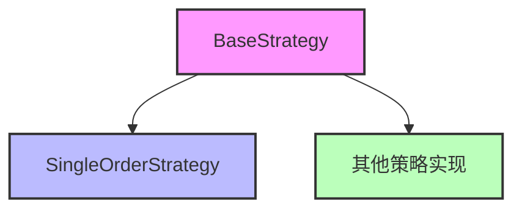
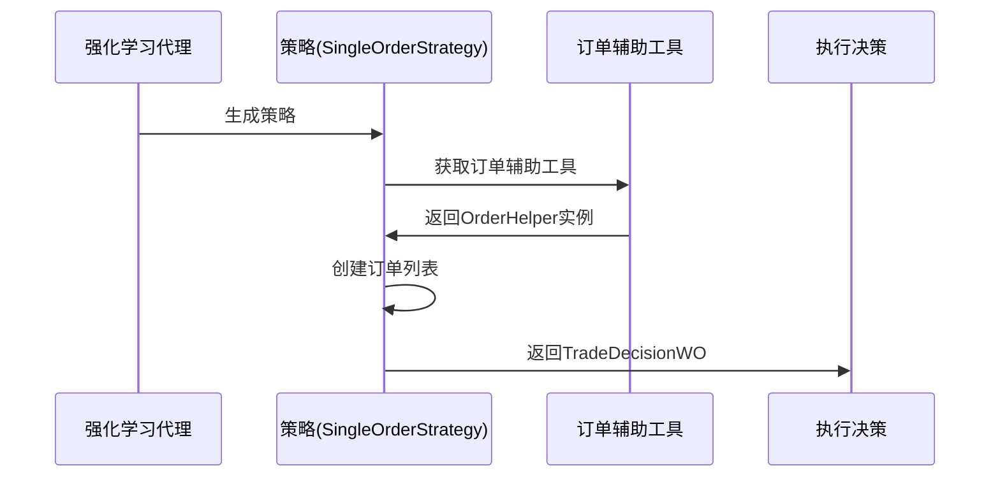

# QLib强化学习策略模块

## 模块概述

`qlib.rl.strategy` 模块是QLib量化投资平台中强化学习交易策略的核心接口层，提供了构建和执行交易决策的基础架构。该模块定义了策略抽象基类和具体实现，支持强化学习代理与回测引擎的交互，是连接强化学习模型与实际交易执行的关键组件。

## 核心组件

### 1. 策略基类继承关系



### 2. SingleOrderStrategy类

#### 类定义

```python
class SingleOrderStrategy(BaseStrategy):
    """策略用于生成恰好包含一个订单的交易决策。"""

    def __init__(
        self,
        order: Order,
        trade_range: TradeRange | None = None,
    ) -> None:
        super().__init__()
        self._order = order
        self._trade_range = trade_range

    def generate_trade_decision(self, execute_result: list | None = None) -> TradeDecisionWO:
        oh: OrderHelper = self.common_infra.get("trade_exchange").get_order_helper()
        order_list = [
            oh.create(
                code=self._order.stock_id,
                amount=self._order.amount,
                direction=self._order.direction,
            ),
        ]
        return TradeDecisionWO(order_list, self, self._trade_range)
```

#### 功能说明

`SingleOrderStrategy` 是一个简单但实用的策略实现，专门用于处理只包含单个订单的交易决策场景。它是 `BaseStrategy` 的子类，提供了以下核心功能：

1. **订单封装**：将单个订单对象作为策略的核心参数
2. **决策生成**：根据传入的订单信息生成交易决策
3. **交易范围管理**：支持可选的交易范围设置
4. **与回测引擎交互**：通过基础设施访问订单辅助工具

#### 构造函数参数

| 参数名 | 类型 | 描述 | 默认值 |
|--------|------|------|--------|
| `order` | `Order` | 要执行的订单对象，包含股票代码、数量和方向等信息 | 必填 |
| `trade_range` | `TradeRange \| None` | 交易决策的时间范围，定义了订单的有效期和执行条件 | `None` |

#### 主要方法

**generate_trade_decision**

```python
def generate_trade_decision(self, execute_result: list | None = None) -> TradeDecisionWO:
```

功能：生成包含单个订单的交易决策

参数：
- `execute_result`: 上一次执行结果，用于策略调整（当前版本未使用）
- 返回值：`TradeDecisionWO` 类型的交易决策对象，包含订单列表和策略信息

## 使用示例

### 1. 基础使用方法

```python
from qlib.backtest import Order
from qlib.rl.strategy import SingleOrderStrategy

# 创建订单对象
order = Order(
    stock_id="000001.SZ",  # 股票代码
    amount=1000,          # 数量
    direction=Order.BUY   # 方向（买入）
)

# 创建单订单策略
strategy = SingleOrderStrategy(order=order)

# 生成交易决策
trade_decision = strategy.generate_trade_decision()
```

### 2. 配合回测引擎使用

```python
from qlib.backtest import Order
from qlib.rl.strategy import SingleOrderStrategy
from qlib.backtest.exchange import Exchange
from qlib.backtest.decision import TradeRange

# 创建订单对象
order = Order(
    stock_id="000001.SZ",
    amount=1000,
    direction=Order.BUY
)

# 定义交易范围（可选）
trade_range = TradeRange(start_time="2023-01-01", end_time="2023-01-05")

# 创建策略实例
strategy = SingleOrderStrategy(order=order, trade_range=trade_range)

# 在回测过程中使用策略
# 注意：实际使用需要完整的回测基础设施
exchange = Exchange()  # 模拟回测交易所
strategy.common_infra = {"trade_exchange": exchange}  # 设置基础设施

trade_decision = strategy.generate_trade_decision()
```

### 3. 在强化学习训练中的应用

```python
from qlib.backtest import Order
from qlib.rl.strategy import SingleOrderStrategy
from qlib.rl.agent import BaseAgent
import numpy as np

class SimpleRLAgent(BaseAgent):
    """简单的强化学习代理"""

    def act(self, state: np.ndarray) -> SingleOrderStrategy:
        # 根据状态决定交易决策
        if state[0] > 0.5:
            direction = Order.BUY
        else:
            direction = Order.SELL

        order = Order(
            stock_id="000001.SZ",
            amount=1000,
            direction=direction
        )

        return SingleOrderStrategy(order=order)

# 训练和评估过程（简化示例）
agent = SimpleRLAgent()
state = np.random.rand(10)  # 模拟状态
strategy = agent.act(state)
```

## 策略架构设计

### 交易决策流程



### 基础设施依赖

`SingleOrderStrategy` 依赖QLib的回测基础设施，通过 `common_infra` 属性获取以下关键组件：

- **trade_exchange**：回测交易所实例，提供订单执行环境
- **order_helper**：订单辅助工具，用于创建和管理订单
- **risk_manager**：风险管理器（可选），用于控制交易风险

## 策略扩展建议

虽然 `SingleOrderStrategy` 提供了基础功能，但在实际应用中，您可能需要扩展策略类以满足更复杂的交易需求：

1. **多订单策略**：继承 `BaseStrategy` 实现包含多个订单的决策
2. **条件执行策略**：根据市场条件动态调整订单参数
3. **风险管理策略**：集成风险控制逻辑
4. **强化学习驱动策略**：将策略与强化学习模型结合

## 总结

`qlib.rl.strategy` 模块提供了构建量化交易策略的核心框架，`SingleOrderStrategy` 作为基础实现，展示了策略类的基本结构和功能。该模块的设计注重与强化学习代理和回测引擎的交互，为开发复杂的量化交易策略提供了良好的基础架构。
