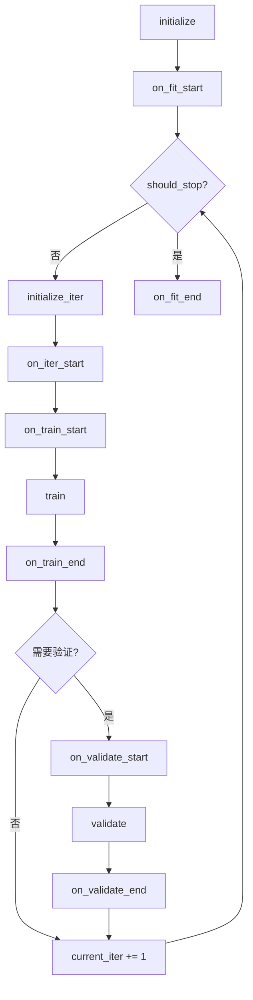
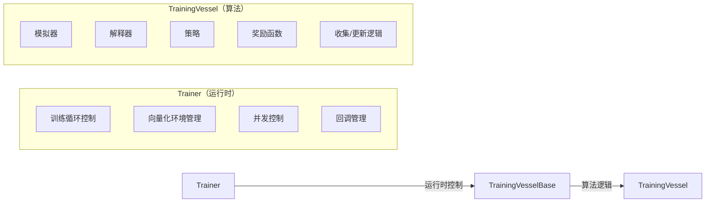
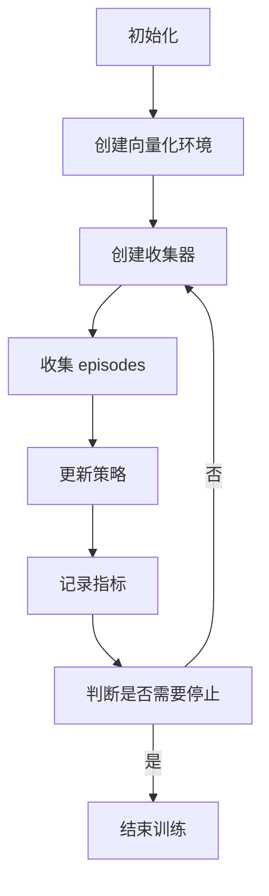

# QLib RL 训练器模块

## 模块概述

`qlib.rl.trainer` 模块提供了强化学习训练、测试和推理的核心工具，包括训练器、训练容器和回调机制。该模块基于 Tianshou 强化学习框架构建，提供了高度抽象的 API，简化了策略训练和回测过程。

## 核心组件

### 导出模块列表

```python
from .api import backtest, train
from .callbacks import Checkpoint, EarlyStopping, MetricsWriter
from .trainer import Trainer
from .vessel import TrainingVessel, TrainingVesselBase
```

## 主要类和函数

### 1. `Trainer` 类

**文件位置**: `/home/firewind0/qlib/qlib/rl/trainer/trainer.py`

#### 类定义
```python
class Trainer:
    """
    用于在特定任务上训练策略的工具类。

    与传统深度学习训练器不同，此训练器的迭代单位是"收集"（collect），而非" epoch"或" mini-batch"。
    在每次收集中，:class:`Collector` 收集一定数量的策略-环境交互，并将其积累到重放缓冲区中，
    然后使用此缓冲区作为"数据"来训练策略。

    参数
    ----------
    max_iters
        停止训练前的最大迭代次数。
    val_every_n_iters
        每 n 次迭代（训练收集）执行一次验证。
    logger
        记录回测结果的日志器。必须提供，否则所有信息将丢失。
    finite_env_type
        有限环境实现类型。
    concurrency
        并行工作者数量。
    fast_dev_run
        创建一个子集用于调试。具体实现取决于训练容器。
    """
```

#### 核心属性
- `should_stop`: 控制是否停止训练的标志
- `metrics`: 训练/验证/测试过程中产生的数值指标
- `current_iter`: 当前训练迭代次数
- `loggers`: 日志器列表

#### 主要方法

| 方法名 | 功能描述 |
|--------|---------|
| `fit(vessel)` | 训练 RL 策略 |
| `test(vessel)` | 测试 RL 策略 |
| `state_dict()` | 获取当前训练状态字典（用于保存检查点） |
| `load_state_dict(state_dict)` | 从状态字典加载训练状态 |
| `venv_from_iterator(iterator)` | 从迭代器创建向量化环境 |

#### 训练流程



---

### 2. `TrainingVesselBase` 类

**文件位置**: `/home/firewind0/qlib/qlib/rl/trainer/vessel.py`

#### 类定义
```python
class TrainingVesselBase(Generic[InitialStateType, StateType, ActType, ObsType, PolicyActType]):
    """
    包含模拟器、解释器和策略的容器，将被发送到训练器。
    该类控制训练的算法相关部分，而训练器负责运行时部分。
    """
```

#### 核心属性
- `simulator_fn`: 模拟器工厂函数
- `state_interpreter`: 状态解释器
- `action_interpreter`: 动作解释器
- `policy`: 策略对象
- `reward`: 奖励函数
- `trainer`: 关联的训练器对象

#### 主要方法

| 方法名 | 功能描述 |
|--------|---------|
| `assign_trainer(trainer)` | 分配训练器（使用弱引用） |
| `train_seed_iterator()` | 创建训练种子迭代器（可返回上下文管理器） |
| `val_seed_iterator()` | 创建验证种子迭代器（可返回上下文管理器） |
| `test_seed_iterator()` | 创建测试种子迭代器（可返回上下文管理器） |
| `train(vector_env)` | 实现一次训练迭代 |
| `validate(vector_env)` | 验证策略 |
| `test(vector_env)` | 测试策略 |
| `state_dict()` | 获取状态字典（用于检查点） |
| `load_state_dict(state_dict)` | 加载状态字典（恢复检查点） |

---

### 3. `TrainingVessel` 类

**文件位置**: `/home/firewind0/qlib/qlib/rl/trainer/vessel.py`

#### 类定义
```python
class TrainingVessel(TrainingVesselBase):
    """
    训练容器的默认实现。

    ``__init__`` 接受初始状态序列，以便创建迭代器。
    ``train``、``validate``、``test`` 各执行一次收集（训练时还会更新策略）。
    """
```

#### 初始化参数

```python
def __init__(
    self,
    *,
    simulator_fn: Callable[[InitialStateType], Simulator[InitialStateType, StateType, ActType]],
    state_interpreter: StateInterpreter[StateType, ObsType],
    action_interpreter: ActionInterpreter[StateType, PolicyActType, ActType],
    policy: BasePolicy,
    reward: Reward,
    train_initial_states: Sequence[InitialStateType] | None = None,
    val_initial_states: Sequence[InitialStateType] | None = None,
    test_initial_states: Sequence[InitialStateType] | None = None,
    buffer_size: int = 20000,
    episode_per_iter: int = 1000,
    update_kwargs: Dict[str, Any] = cast(Dict[str, Any], None),
):
    """
    参数
    ----------
    simulator_fn
        模拟器工厂函数
    state_interpreter
        状态解释器
    action_interpreter
        动作解释器
    policy
        策略对象
    reward
        奖励函数
    train_initial_states
        训练初始状态序列
    val_initial_states
        验证初始状态序列
    test_initial_states
        测试初始状态序列
    buffer_size
        重放缓冲区大小
    episode_per_iter
        每次迭代收集的 episodes 数量
    update_kwargs
        策略更新参数
    """
```

#### 核心方法

```python
def train(self, vector_env: FiniteVectorEnv) -> Dict[str, Any]:
    """创建收集器并收集 `episode_per_iter` 个 episodes，在收集到的重放缓冲区上更新策略。"""
```

---

### 4. `Callback` 类

**文件位置**: `/home/firewind0/qlib/qlib/rl/trainer/callbacks.py`

#### 类定义
```python
class Callback:
    """所有回调的基类。"""
```

#### 回调钩子方法

| 方法名 | 触发时机 |
|--------|---------|
| `on_fit_start` | 在整个 fit 过程开始前 |
| `on_fit_end` | 在整个 fit 过程结束后 |
| `on_train_start` | 每次训练收集开始时 |
| `on_train_end` | 训练结束时 |
| `on_validate_start` | 每次验证开始时 |
| `on_validate_end` | 验证结束时 |
| `on_test_start` | 每次测试开始时 |
| `on_test_end` | 测试结束时 |
| `on_iter_start` | 每次迭代（收集）开始时 |
| `on_iter_end` | 每次迭代结束后（current_iter 已递增） |
| `state_dict()` | 获取回调的状态字典（用于检查点） |
| `load_state_dict()` | 从状态字典加载回调状态（恢复检查点） |

---

### 5. `EarlyStopping` 回调

**文件位置**: `/home/firewind0/qlib/qlib/rl/trainer/callbacks.py`

#### 类定义
```python
class EarlyStopping(Callback):
    """
    当监控指标停止改善时停止训练。

    实现参考: https://github.com/keras-team/keras/blob/v2.9.0/keras/callbacks.py#L1744-L1893
    """
```

#### 初始化参数

```python
def __init__(
    self,
    monitor: str = "reward",
    min_delta: float = 0.0,
    patience: int = 0,
    mode: Literal["min", "max"] = "max",
    baseline: float | None = None,
    restore_best_weights: bool = False,
):
    """
    参数
    ----------
    monitor
        监控的指标名称（默认："reward"）
    min_delta
        最小改善幅度
    patience
        容忍没有改善的迭代次数
    mode
        监控模式（"min" 或 "max"）
    baseline
        基准值
    restore_best_weights
        是否在停止时恢复最佳权重
    """
```

---

### 6. `MetricsWriter` 回调

**文件位置**: `/home/firewind0/qlib/qlib/rl/trainer/callbacks.py`

#### 类定义
```python
class MetricsWriter(Callback):
    """将训练指标转储到文件。"""
```

#### 初始化参数

```python
def __init__(self, dirpath: Path) -> None:
    """
    参数
    ----------
    dirpath
        保存指标文件的目录
    """
```

#### 功能描述

- 在每个训练结束时将训练指标保存到 `train_result.csv`
- 在每个验证结束时将验证指标保存到 `validation_result.csv`

---

### 7. `Checkpoint` 回调

**文件位置**: `/home/firewind0/qlib/qlib/rl/trainer/callbacks.py`

#### 类定义
```python
class Checkpoint(Callback):
    """定期保存检查点以实现持久化和恢复。

    参考: https://github.com/PyTorchLightning/pytorch-lightning/blob/bfa8b7be/pytorch_lightning/callbacks/model_checkpoint.py
    """
```

#### 初始化参数

```python
def __init__(
    self,
    dirpath: Path,
    filename: str = "{iter:03d}.pth",
    save_latest: Literal["link", "copy"] | None = "link",
    every_n_iters: int | None = None,
    time_interval: int | None = None,
    save_on_fit_end: bool = True,
):
    """
    参数
    ----------
    dirpath
        保存检查点的目录
    filename
        检查点文件名（支持格式化）
    save_latest
        如何保存最新检查点（"link"、"copy" 或 None）
    every_n_iters
        每隔 n 次迭代保存一次检查点
    time_interval
        保存检查点的最大时间间隔（秒）
    save_on_fit_end
        是否在 fit 结束时保存检查点
    """
```

#### 文件名格式化支持

文件名可以包含格式化选项，例如：`{iter:03d}-{reward:.2f}.pth`

支持的参数：
- `iter`: 迭代次数（int）
- `metrics`: trainer.metrics 中的指标
- `time`: 时间字符串（格式：%Y%m%d%H%M%S）

---

### 8. `train` 函数

**文件位置**: `/home/firewind0/qlib/qlib/rl/trainer/api.py`

#### 函数定义
```python
def train(
    simulator_fn: Callable[[InitialStateType], Simulator],
    state_interpreter: StateInterpreter,
    action_interpreter: ActionInterpreter,
    initial_states: Sequence[InitialStateType],
    policy: BasePolicy,
    reward: Reward,
    vessel_kwargs: Dict[str, Any],
    trainer_kwargs: Dict[str, Any],
) -> None:
    """
    使用 RL 框架提供的并行性训练策略。

    实验性 API。参数可能会在不久后更改。
    """
```

#### 参数说明

| 参数名 | 类型 | 功能描述 |
|--------|------|---------|
| `simulator_fn` | 工厂函数 | 接收初始种子，返回模拟器 |
| `state_interpreter` | StateInterpreter | 解释模拟器的状态 |
| `action_interpreter` | ActionInterpreter | 解释策略动作 |
| `initial_states` | 序列 | 要迭代的初始状态，每个状态运行一次 |
| `policy` | BasePolicy | 要训练的策略 |
| `reward` | Reward | 奖励函数 |
| `vessel_kwargs` | 字典 | 传递给 TrainingVessel 的参数，如 episode_per_iter |
| `trainer_kwargs` | 字典 | 传递给 Trainer 的参数，如 finite_env_type、concurrency |

#### 使用示例

```python
from qlib.rl.trainer import train
from qlib.rl.simulator import Simulator
from qlib.rl.interpreter import StateInterpreter, ActionInterpreter
from qlib.rl.reward import Reward
from tianshou.policy import BasePolicy

# 定义组件
def create_simulator(initial_state):
    # 返回模拟器实例
    return Simulator(...)

state_interpreter = StateInterpreter(...)
action_interpreter = ActionInterpreter(...)
policy = BasePolicy(...)
reward = Reward(...)

# 配置训练
initial_states = [1, 2, 3, 4, 5]  # 示例初始状态
vessel_kwargs = {
    "buffer_size": 20000,
    "episode_per_iter": 1000
}
trainer_kwargs = {
    "max_iters": 100,
    "val_every_n_iters": 10,
    "finite_env_type": "subproc",
    "concurrency": 4
}

# 开始训练
train(
    simulator_fn=create_simulator,
    state_interpreter=state_interpreter,
    action_interpreter=action_interpreter,
    initial_states=initial_states,
    policy=policy,
    reward=reward,
    vessel_kwargs=vessel_kwargs,
    trainer_kwargs=trainer_kwargs
)
```

---

### 9. `backtest` 函数

**文件位置**: `/home/firewind0/qlib/qlib/rl/trainer/api.py`

#### 函数定义
```python
def backtest(
    simulator_fn: Callable[[InitialStateType], Simulator],
    state_interpreter: StateInterpreter,
    action_interpreter: ActionInterpreter,
    initial_states: Sequence[InitialStateType],
    policy: BasePolicy,
    logger: LogWriter | List[LogWriter],
    reward: Reward | None = None,
    finite_env_type: FiniteEnvType = "subproc",
    concurrency: int = 2,
) -> None:
    """
    使用 RL 框架提供的并行性进行回测。

    实验性 API。参数可能会在不久后更改。
    """
```

#### 参数说明

| 参数名 | 类型 | 功能描述 |
|--------|------|---------|
| `simulator_fn` | 工厂函数 | 接收初始种子，返回模拟器 |
| `state_interpreter` | StateInterpreter | 解释模拟器的状态 |
| `action_interpreter` | ActionInterpreter | 解释策略动作 |
| `initial_states` | 序列 | 要迭代的初始状态，每个状态运行一次 |
| `policy` | BasePolicy | 要测试的策略 |
| `logger` | LogWriter | 记录回测结果的日志器（必须提供） |
| `reward` | Reward | 可选奖励函数（仅用于测试和记录） |
| `finite_env_type` | str | 有限环境实现类型 |
| `concurrency` | int | 并行工作者数量 |

#### 使用示例

```python
from qlib.rl.trainer import backtest
from qlib.rl.simulator import Simulator
from qlib.rl.interpreter import StateInterpreter, ActionInterpreter
from qlib.rl.reward import Reward
from tianshou.policy import BasePolicy
from qlib.rl.utils import LogWriter

# 定义组件
def create_simulator(initial_state):
    return Simulator(...)

state_interpreter = StateInterpreter(...)
action_interpreter = ActionInterpreter(...)
policy = BasePolicy(...)
reward = Reward(...)

# 配置回测
test_states = [6, 7, 8, 9, 10]
logger = LogWriter(...)

# 执行回测
backtest(
    simulator_fn=create_simulator,
    state_interpreter=state_interpreter,
    action_interpreter=action_interpreter,
    initial_states=test_states,
    policy=policy,
    logger=logger,
    reward=reward,
    finite_env_type="subproc",
    concurrency=4
)
```

---

## 完整使用示例

### 1. 基础训练示例

```python
from qlib.rl.trainer import Trainer, TrainingVessel
from qlib.rl.simulator import Simulator
from qlib.rl.interpreter import StateInterpreter, ActionInterpreter
from qlib.rl.reward import Reward
from tianshou.policy import BasePolicy

# 1. 定义组件
def create_simulator(initial_state):
    return Simulator(...)

state_interpreter = StateInterpreter(...)
action_interpreter = ActionInterpreter(...)
policy = BasePolicy(...)
reward = Reward(...)

# 2. 创建训练容器
vessel = TrainingVessel(
    simulator_fn=create_simulator,
    state_interpreter=state_interpreter,
    action_interpreter=action_interpreter,
    policy=policy,
    reward=reward,
    train_initial_states=[1, 2, 3, 4, 5],
    val_initial_states=[6, 7, 8],
    test_initial_states=[9, 10],
    buffer_size=20000,
    episode_per_iter=1000,
)

# 3. 配置训练器
trainer = Trainer(
    max_iters=100,
    val_every_n_iters=10,
    finite_env_type="subproc",
    concurrency=4
)

# 4. 训练
trainer.fit(vessel)
```

### 2. 带回调的训练示例

```python
from qlib.rl.trainer import Trainer, TrainingVessel
from qlib.rl.trainer.callbacks import EarlyStopping, Checkpoint, MetricsWriter
from pathlib import Path

# 创建输出目录
log_dir = Path("logs/rl_test")
log_dir.mkdir(parents=True, exist_ok=True)

# 定义回调
callbacks = [
    EarlyStopping(monitor="val/reward", patience=5, mode="max"),
    Checkpoint(dirpath=log_dir / "checkpoints"),
    MetricsWriter(dirpath=log_dir)
]

# 配置训练器
trainer = Trainer(
    max_iters=100,
    val_every_n_iters=10,
    callbacks=callbacks,
    finite_env_type="subproc",
    concurrency=4
)
```

---

## 关键架构概念

### 训练器与训练容器的职责分离



### 迭代流程



---

## 设计特点

1. **模块化架构**: 清晰分离运行时控制（Trainer）和算法逻辑（TrainingVessel）
2. **并行计算支持**: 内置对向量化环境的支持，支持多进程和多线程
3. **灵活的回调系统**: 提供丰富的钩子方法，方便扩展功能
4. **检查点机制**: 完整的状态保存和恢复功能
5. **与 Tianshou 集成**: 基于成熟的 Tianshou RL 框架
6. **类型安全**: 全面的类型注解支持

---

## 性能优化建议

1. **环境并发**: 根据 CPU 核心数量选择适当的 concurrency 值
2. **有限环境类型**:
   - `subproc`: 适用于计算密集型模拟器
   - `threading`: 适用于 I/O 密集型模拟器
   - `dummy`: 单线程（调试用）
3. **批量大小**: 根据内存和计算资源调整 episode_per_iter 和 buffer_size
4. **快速开发**: 使用 fast_dev_run 参数创建小数据集进行调试

---

## 版本兼容性说明

当前模块使用以下主要依赖：
- Tianshou (>=0.4.9)
- PyTorch (>=1.9)
- QLib (>=0.8)

实验性 API 可能在未来版本中更改，使用时请注意。
