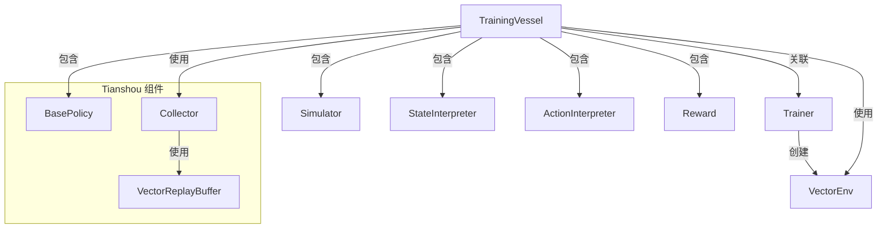
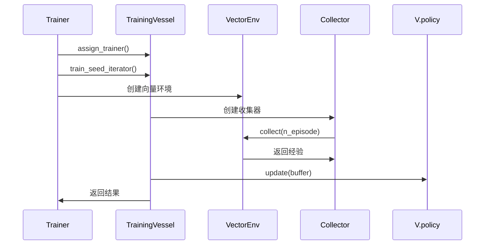

# QLib RL 训练容器模块文档

## 模块概述

`vessel.py` 是 QLib 强化学习框架的核心组件之一，提供了训练容器（Training Vessel）的抽象和实现。训练容器负责包裹强化学习算法的核心组件（模拟器、解释器、策略、奖励函数等），并定义训练过程的核心逻辑。它与训练器（Trainer）配合工作，容器负责算法相关部分，而训练器负责运行时管理。

## 核心类与接口

### 1. SeedIteratorNotAvailable 异常类

```python
class SeedIteratorNotAvailable(BaseException):
    pass
```

**功能**：当训练、验证或测试的种子迭代器不可用时抛出的异常。

## 2. TrainingVesselBase 基类

```python
class TrainingVesselBase(
    Generic[InitialStateType, StateType, ActType, ObsType, PolicyActType]
):
```

### 类概述

训练容器的抽象基类，定义了训练容器的核心接口和框架。它充当算法部分与运行时管理部分之间的桥梁。

### 核心属性

| 属性 | 类型 | 描述 |
|------|------|------|
| `simulator_fn` | `Callable[[InitialStateType], Simulator]` | 模拟器工厂函数，用于创建环境模拟器 |
| `state_interpreter` | `StateInterpreter[StateType, ObsType]` | 状态解释器，将模拟器状态转换为策略可接受的观察 |
| `action_interpreter` | `ActionInterpreter[StateType, PolicyActType, ActType]` | 动作解释器，将策略输出转换为模拟器可接受的动作 |
| `policy` | `BasePolicy` | Tianshou 策略对象，负责决策 |
| `reward` | `Reward` | 奖励函数，计算环境反馈 |
| `trainer` | `Trainer` | 训练器对象，通过弱引用访问 |

### 主要方法

#### assign_trainer

```python
def assign_trainer(self, trainer: Trainer) -> None:
    """分配训练器到容器"""
    self.trainer = weakref.proxy(trainer)
```

**功能**：将训练器对象分配给容器，使用弱引用来避免循环引用。

#### train_seed_iterator

```python
def train_seed_iterator(self) -> ContextManager[Iterable[InitialStateType]] | Iterable[InitialStateType]:
    """创建训练种子迭代器

    如果返回上下文管理器，整个训练过程将在 with-block 中执行，
    迭代器会在训练结束后自动关闭。
    """
    raise SeedIteratorNotAvailable("Seed iterator for training is not available.")
```

**功能**：获取训练初始状态的迭代器。子类必须实现此方法。

#### val_seed_iterator

```python
def val_seed_iterator(self) -> ContextManager[Iterable[InitialStateType]] | Iterable[InitialStateType]:
    """创建验证种子迭代器"""
    raise SeedIteratorNotAvailable("Seed iterator for validation is not available.")
```

**功能**：获取验证初始状态的迭代器。子类必须实现此方法。

#### test_seed_iterator

```python
def test_seed_iterator(self) -> ContextManager[Iterable[InitialStateType]] | Iterable[InitialStateType]:
    """创建测试种子迭代器"""
    raise SeedIteratorNotAvailable("Seed iterator for testing is not available.")
```

**功能**：获取测试初始状态的迭代器。子类必须实现此方法。

#### train

```python
def train(self, vector_env: BaseVectorEnv) -> Dict[str, Any]:
    """实现训练迭代逻辑

    在强化学习中，一次迭代通常指一次收集（collect）操作。
    """
    raise NotImplementedError()
```

**功能**：执行一次训练迭代。子类必须实现此方法。

#### validate

```python
def validate(self, vector_env: FiniteVectorEnv) -> Dict[str, Any]:
    """实现验证逻辑"""
    raise NotImplementedError()
```

**功能**：对策略进行一次验证。子类必须实现此方法。

#### test

```python
def test(self, vector_env: FiniteVectorEnv) -> Dict[str, Any]:
    """实现测试逻辑"""
    raise NotImplementedError()
```

**功能**：在测试环境上评估策略。子类必须实现此方法。

#### log

```python
def log(self, name: str, value: Any) -> None:
    """记录日志"""
    if isinstance(value, (np.ndarray, list)):
        value = np.mean(value)
    _logger.info(f"[Iter {self.trainer.current_iter + 1}] {name} = {value}")
```

**功能**：记录训练过程中的日志信息。如果值是数组或列表，会计算平均值。

#### log_dict

```python
def log_dict(self, data: Dict[str, Any]) -> None:
    """批量记录日志"""
    for name, value in data.items():
        self.log(name, value)
```

**功能**：批量记录字典格式的日志数据。

#### state_dict

```python
def state_dict(self) -> Dict:
    """保存容器状态到字典"""
    return {"policy": self.policy.state_dict()}
```

**功能**：获取容器的状态字典，用于保存检查点。

#### load_state_dict

```python
def load_state_dict(self, state_dict: Dict) -> None:
    """从状态字典恢复容器状态"""
    self.policy.load_state_dict(state_dict["policy"])
```

**功能**：从状态字典加载容器状态，用于恢复检查点。

## 3. TrainingVessel 类

```python
class TrainingVessel(TrainingVesselBase):
    """训练容器的默认实现

    接受初始状态序列，创建迭代器。`train`、`validate`、`test` 方法
    各自执行一次收集操作（训练时还会更新策略）。

    训练时，初始状态会无限重复，收集器控制每次迭代的 episode 数量。
    验证和测试时，初始状态只会使用一次。
    """
```

### 构造函数

```python
def __init__(
    self,
    *,
    simulator_fn: Callable[[InitialStateType], Simulator[InitialStateType, StateType, ActType]],
    state_interpreter: StateInterpreter[StateType, ObsType],
    action_interpreter: ActionInterpreter[StateType, PolicyActType, ActType],
    policy: BasePolicy,
    reward: Reward,
    train_initial_states: Sequence[InitialStateType] | None = None,
    val_initial_states: Sequence[InitialStateType] | None = None,
    test_initial_states: Sequence[InitialStateType] | None = None,
    buffer_size: int = 20000,
    episode_per_iter: int = 1000,
    update_kwargs: Dict[str, Any] = cast(Dict[str, Any], None),
):
```

**参数**：
- `simulator_fn`：模拟器工厂函数
- `state_interpreter`：状态解释器
- `action_interpreter`：动作解释器
- `policy`：策略对象
- `reward`：奖励函数
- `train_initial_states`：训练初始状态序列
- `val_initial_states`：验证初始状态序列
- `test_initial_states`：测试初始状态序列
- `buffer_size`：回放缓冲区大小（默认 20000）
- `episode_per_iter`：每次训练迭代的 episode 数量（默认 1000）
- `update_kwargs`：策略更新参数

### 核心方法实现

#### train_seed_iterator

```python
def train_seed_iterator(self) -> ContextManager[Iterable[InitialStateType]] | Iterable[InitialStateType]:
    """创建训练种子迭代器"""
    if self.train_initial_states is not None:
        _logger.info("Training initial states collection size: %d", len(self.train_initial_states))
        train_initial_states = self._random_subset("train", self.train_initial_states, self.trainer.fast_dev_run)
        return DataQueue(train_initial_states, repeat=-1, shuffle=True)
    return super().train_seed_iterator()
```

**功能**：返回训练初始状态的迭代器，使用 DataQueue 实现无限重复和随机打乱。

#### val_seed_iterator

```python
def val_seed_iterator(self) -> ContextManager[Iterable[InitialStateType]] | Iterable[InitialStateType]:
    """创建验证种子迭代器"""
    if self.val_initial_states is not None:
        _logger.info("Validation initial states collection size: %d", len(self.val_initial_states))
        val_initial_states = self._random_subset("val", self.val_initial_states, self.trainer.fast_dev_run)
        return DataQueue(val_initial_states, repeat=1)
    return super().val_seed_iterator()
```

**功能**：返回验证初始状态的迭代器，只使用一次。

#### test_seed_iterator

```python
def test_seed_iterator(self) -> ContextManager[Iterable[InitialStateType]] | Iterable[InitialStateType]:
    """创建测试种子迭代器"""
    if self.test_initial_states is not None:
        _logger.info("Testing initial states collection size: %d", len(self.test_initial_states))
        test_initial_states = self._random_subset("test", self.test_initial_states, self.trainer.fast_dev_run)
        return DataQueue(test_initial_states, repeat=1)
    return super().test_seed_iterator()
```

**功能**：返回测试初始状态的迭代器，只使用一次。

#### train

```python
def train(self, vector_env: FiniteVectorEnv) -> Dict[str, Any]:
    """执行训练迭代"""
    self.policy.train()

    with vector_env.collector_guard():
        collector = Collector(
            self.policy, vector_env, VectorReplayBuffer(self.buffer_size, len(vector_env)), exploration_noise=True
        )

        if self.trainer.fast_dev_run is not None:
            episodes = self.trainer.fast_dev_run
        else:
            episodes = self.episode_per_iter

        col_result = collector.collect(n_episode=episodes)
        update_result = self.policy.update(sample_size=0, buffer=collector.buffer, **self.update_kwargs)
        res = {**col_result, **update_result}
        self.log_dict(res)
        return res
```

**功能**：执行一次训练迭代，包括收集经验和更新策略。使用 Tianshou 的 Collector 和 VectorReplayBuffer。

#### validate

```python
def validate(self, vector_env: FiniteVectorEnv) -> Dict[str, Any]:
    """执行验证"""
    self.policy.eval()

    with vector_env.collector_guard():
        test_collector = Collector(self.policy, vector_env)
        res = test_collector.collect(n_step=INF * len(vector_env))
        self.log_dict(res)
        return res
```

**功能**：对策略进行验证，评估其在验证环境上的性能。

#### test

```python
def test(self, vector_env: FiniteVectorEnv) -> Dict[str, Any]:
    """执行测试"""
    self.policy.eval()

    with vector_env.collector_guard():
        test_collector = Collector(self.policy, vector_env)
        res = test_collector.collect(n_step=INF * len(vector_env))
        self.log_dict(res)
        return res
```

**功能**：在测试环境上评估策略的最终性能。

#### _random_subset

```python
@staticmethod
def _random_subset(name: str, collection: Sequence[T], size: int | None) -> Sequence[T]:
    """随机选择子集用于快速开发测试"""
    if size is None:
        return collection
    order = np.random.permutation(len(collection))
    res = [collection[o] for o in order[:size]]
    _logger.info(
        "Fast running in development mode. Cut %s initial states from %d to %d.",
        name,
        len(collection),
        len(res),
    )
    return res
```

**功能**：随机选择初始状态的子集，用于快速开发测试模式。

## 使用示例

### 基本用法

```python
from qlib.rl.trainer.vessel import TrainingVessel
from qlib.rl.simulator import Simulator
from qlib.rl.interpreter import StateInterpreter, ActionInterpreter
from qlib.rl.reward import Reward
from tianshou.policy import DQNPolicy

# 初始化训练容器
vessel = TrainingVessel(
    simulator_fn=lambda x: Simulator(...),
    state_interpreter=StateInterpreter(...),
    action_interpreter=ActionInterpreter(...),
    policy=DQNPolicy(...),
    reward=Reward(...),
    train_initial_states=train_states,
    val_initial_states=val_states,
    test_initial_states=test_states,
    buffer_size=20000,
    episode_per_iter=1000
)

# 训练器会自动调用容器的方法
# trainer = Trainer(vessel)
# trainer.run()
```

### 自定义训练容器

```python
class MyTrainingVessel(TrainingVesselBase):
    def train(self, vector_env: BaseVectorEnv) -> Dict[str, Any]:
        # 自定义训练逻辑
        self.policy.train()
        # 实现自己的收集和更新逻辑
        return {"loss": 0.1, "reward": 1.2}

    def validate(self, vector_env: FiniteVectorEnv) -> Dict[str, Any]:
        # 自定义验证逻辑
        self.policy.eval()
        # 实现自己的验证逻辑
        return {"val_reward": 0.9}
```

## 架构设计



## 核心工作流程



## 开发建议

1. **继承扩展**：通过继承 TrainingVesselBase 可以实现自定义的训练逻辑
2. **日志记录**：使用 self.log() 和 self.log_dict() 方法记录训练过程
3. **检查点**：通过 state_dict() 和 load_state_dict() 实现训练状态的保存和恢复
4. **快速测试**：设置 fast_dev_run 参数可以快速验证代码逻辑

## 常见问题

### Q: 如何自定义训练逻辑？
A: 继承 TrainingVesselBase 类并实现 train() 方法，在方法中实现自己的收集和更新逻辑。

### Q: 如何处理大规模训练数据？
A: 使用 DataQueue 或其他数据加载器实现训练数据的批量加载和预处理，确保内存使用合理。

### Q: 如何调整训练超参数？
A: 通过 TrainingVessel 的 __init__ 方法调整 buffer_size、episode_per_iter 和 update_kwargs 等参数。
