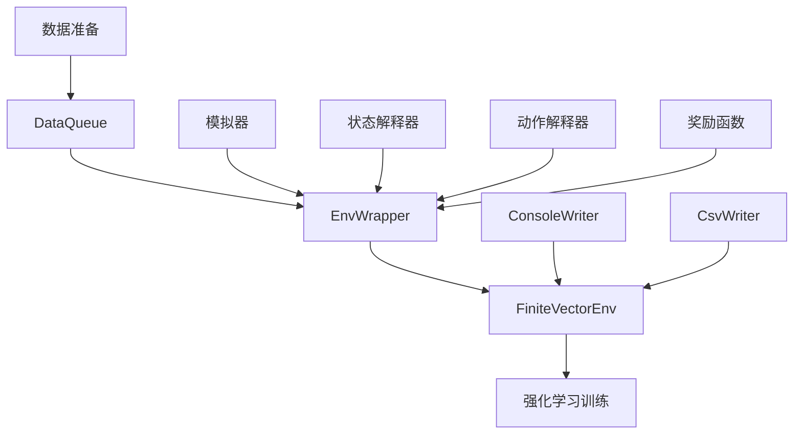
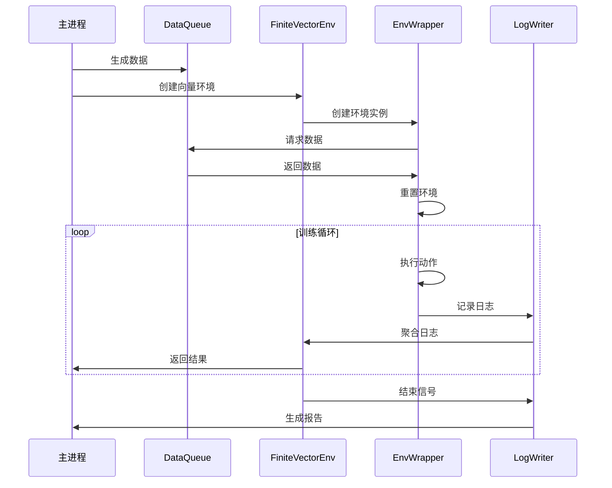

# QLib RL 工具模块

## 模块概述

`qlib.rl.utils` 是 QLib 强化学习框架中的核心工具库，提供了强化学习训练和评估过程中所需的基础组件和工具类。该模块包含数据管理、环境封装、日志系统和向量环境支持等关键功能，为构建复杂的强化学习应用提供了基础架构。

## 核心组件

### 1. 数据队列管理

#### DataQueue

```python
from qlib.rl.utils import DataQueue
```

DataQueue 是一个用于在主进程和子进程之间高效传递数据的队列管理类。它允许主进程作为生产者生成数据，多个子进程作为消费者并行处理数据。

**主要功能：**
- 自动管理数据队列的生命周期
- 支持数据重复迭代和洗牌
- 提供多进程数据加载支持
- 自动处理队列清理和资源释放

**参数说明：**
- `dataset`: 数据集，必须实现 `__len__` 和 `__getitem__` 方法
- `repeat`: 数据迭代次数，`-1` 表示无限循环
- `shuffle`: 是否洗牌数据
- `producer_num_workers`: 数据加载的并发工作进程数
- `queue_maxsize`: 队列最大容量，默认自动设置为 CPU 核心数

**使用示例：**

```python
from qlib.rl.utils import DataQueue
from torch.utils.data import Dataset

class MyDataset(Dataset):
    def __init__(self, data):
        self.data = data

    def __len__(self):
        return len(self.data)

    def __getitem__(self, idx):
        return self.data[idx]

# 创建数据集
dataset = MyDataset([1, 2, 3, 4, 5])

# 使用 DataQueue 管理数据
data_queue = DataQueue(dataset, repeat=2, shuffle=True)

with data_queue:
    # 在子进程中消费数据
    for data in data_queue:
        print(data)
```

---

### 2. 环境封装

#### EnvWrapper

```python
from qlib.rl.utils import EnvWrapper
```

EnvWrapper 是 QLib 强化学习框架的核心环境封装类，它将 QLib 的模拟器、解释器和奖励函数等组件封装成符合 OpenAI Gym 接口的环境对象。

**主要功能：**
- 将 QLib 模拟器与强化学习策略连接
- 处理状态和动作的转换
- 管理环境的生命周期
- 收集和记录训练过程中的信息

**参数说明：**
- `simulator_fn`: 模拟器工厂函数
- `state_interpreter`: 状态解释器，将模拟器状态转换为策略可理解的观察
- `action_interpreter`: 动作解释器，将策略输出转换为模拟器可执行的动作
- `seed_iterator`: 种子迭代器，用于生成环境的初始状态
- `reward_fn`: 奖励函数，计算每个步骤的奖励
- `aux_info_collector`: 辅助信息收集器
- `logger`: 日志收集器

**使用示例：**

```python
from qlib.rl.utils import EnvWrapper
from qlib.rl.simulator import Simulator
from qlib.rl.interpreter import StateInterpreter, ActionInterpreter
from qlib.rl.reward import Reward

# 定义模拟器
class MySimulator(Simulator):
    # 实现模拟器逻辑
    pass

# 定义状态和动作解释器
class MyStateInterpreter(StateInterpreter):
    # 实现状态转换逻辑
    pass

class MyActionInterpreter(ActionInterpreter):
    # 实现动作转换逻辑
    pass

# 定义奖励函数
class MyReward(Reward):
    # 实现奖励计算逻辑
    pass

# 创建环境工厂函数
def env_factory():
    simulator = MySimulator()
    state_interpreter = MyStateInterpreter()
    action_interpreter = MyActionInterpreter()
    reward = MyReward()

    return EnvWrapper(
        simulator_fn=lambda: simulator,
        state_interpreter=state_interpreter,
        action_interpreter=action_interpreter,
        seed_iterator=None,
        reward_fn=reward
    )

# 使用环境
env = env_factory()
obs = env.reset()
for _ in range(10):
    action = env.action_space.sample()
    next_obs, reward, done, info = env.step(action)
    if done:
        obs = env.reset()
```

#### EnvWrapperStatus

```python
from qlib.rl.utils import EnvWrapperStatus
```

EnvWrapperStatus 是一个类型定义，用于表示强化学习环境的状态信息。它包含了当前步骤、是否结束、初始状态以及观察、动作和奖励的历史记录。

**字段说明：**
- `cur_step`: 当前步骤数
- `done`: 是否结束
- `initial_state`: 初始状态
- `obs_history`: 观察历史
- `action_history`: 动作历史
- `reward_history`: 奖励历史

---

### 3. 向量环境支持

#### vectorize_env

```python
from qlib.rl.utils import vectorize_env
```

vectorize_env 是一个用于创建向量环境的辅助函数。它支持多种并行化策略，包括 dummy（单进程）、subproc（多进程）和 shmem（共享内存）。

**主要功能：**
- 创建并行执行的向量环境
- 支持多种并行化策略
- 自动处理环境的生命周期管理
- 提供统一的接口访问多个环境

**参数说明：**
- `env_factory`: 环境工厂函数，用于创建单个环境
- `env_type`: 环境类型，可选 "dummy"、"subproc" 或 "shmem"
- `concurrency`: 并发环境数量
- `logger`: 日志写入器

**使用示例：**

```python
from qlib.rl.utils import vectorize_env, ConsoleWriter

# 使用之前定义的 env_factory
console_writer = ConsoleWriter(log_every_n_episode=10)

# 创建包含 4 个并行环境的向量环境
vec_env = vectorize_env(
    env_factory=env_factory,
    env_type="subproc",
    concurrency=4,
    logger=console_writer
)

# 使用向量环境
with vec_env.collector_guard():
    # 重置所有环境
    obs = vec_env.reset()

    for _ in range(100):
        # 随机选择动作
        actions = [env.action_space.sample() for env in vec_env]
        next_obs, rewards, dones, infos = vec_env.step(actions)

        # 打印奖励
        print(f"Rewards: {rewards}")
```

#### FiniteEnvType

```python
from qlib.rl.utils import FiniteEnvType
```

FiniteEnvType 是一个类型别名，表示有限向量环境的类型。它支持以下三种类型：
- "dummy": 单进程向量环境（调试用）
- "subproc": 多进程向量环境
- "shmem": 共享内存向量环境（最快）

---

### 4. 日志系统

#### LogCollector

```python
from qlib.rl.utils import LogCollector
```

LogCollector 是日志收集器，负责在每个环境工作进程中收集训练过程中的信息。它支持不同级别的日志，并在每个步骤结束时重置收集到的信息。

**主要功能：**
- 收集训练过程中的各种信息
- 支持不同级别的日志
- 自动处理日志的重置和清除
- 优化网络传输开销

**参数说明：**
- `min_loglevel`: 最小日志级别，低于该级别的日志将被忽略

**使用示例：**

```python
from qlib.rl.utils import LogCollector, LogLevel

# 创建日志收集器，只收集 INFO 级别及以上的日志
logger = LogCollector(min_loglevel=LogLevel.INFO)

# 收集日志
logger.add_scalar("reward", 0.8, loglevel=LogLevel.INFO)
logger.add_string("status", "running", loglevel=LogLevel.PERIODIC)

# 获取收集到的日志
logs = logger.logs()
print(logs)
```

#### LogWriter

```python
from qlib.rl.utils import LogWriter
```

LogWriter 是日志写入器的基类，负责将收集到的日志写入到不同的输出设备。它提供了统一的接口，支持多种日志输出方式。

**主要功能：**
- 处理训练过程中的日志
- 支持不同级别的日志过滤
- 提供 episode 和 step 级别的回调
- 支持状态的保存和加载

**使用示例：**

```python
from qlib.rl.utils import LogWriter

class MyLogWriter(LogWriter):
    def log_episode(self, length: int, rewards: list[float], contents: list[dict[str, Any]]) -> None:
        # 处理 episode 结束时的日志
        total_reward = sum(rewards)
        print(f"Episode length: {length}, Total reward: {total_reward}")

    def log_step(self, reward: float, contents: dict[str, Any]) -> None:
        # 处理每个步骤的日志
        print(f"Step reward: {reward}, Contents: {contents}")

# 使用自定义日志写入器
writer = MyLogWriter()
```

#### LogLevel

```python
from qlib.rl.utils import LogLevel
```

LogLevel 是一个枚举类型，表示不同级别的日志。它定义了以下级别：

- `DEBUG`: 调试级别，只在调试模式下显示
- `PERIODIC`: 周期性级别，定期显示
- `INFO`: 信息级别，重要的日志信息
- `CRITICAL`: 严重级别，日志写入器必须处理

#### ConsoleWriter

```python
from qlib.rl.utils import ConsoleWriter
```

ConsoleWriter 是 LogWriter 的子类，负责将日志输出到控制台。它支持周期性输出和统计信息的展示。

**主要功能：**
- 将日志输出到控制台
- 支持周期性显示
- 自动计算统计信息（平均值、总和等）
- 提供可定制的输出格式

**参数说明：**
- `log_every_n_episode`: 每多少个 episode 输出一次日志
- `total_episodes`: 总 episode 数（用于进度显示）
- `float_format`: 浮点数格式字符串
- `counter_format`: 计数器格式字符串
- `loglevel`: 日志级别

**使用示例：**

```python
from qlib.rl.utils import ConsoleWriter

# 创建控制台日志写入器
writer = ConsoleWriter(
    log_every_n_episode=20,
    total_episodes=1000,
    float_format=":.4f",
    counter_format=":4d"
)

# 设置前缀
writer.prefix = "[Training]"
```

#### CsvWriter

```python
from qlib.rl.utils import CsvWriter
```

CsvWriter 是 LogWriter 的子类，负责将训练过程中的日志保存到 CSV 文件中。它支持自动创建和管理 CSV 文件。

**主要功能：**
- 将日志保存到 CSV 文件
- 自动处理文件的创建和写入
- 支持 episode 级别的日志聚合
- 提供结构化的日志存储

**参数说明：**
- `output_dir`: 输出目录
- `loglevel`: 日志级别

**使用示例：**

```python
from qlib.rl.utils import CsvWriter
from pathlib import Path

# 创建 CSV 日志写入器
output_dir = Path("logs")
writer = CsvWriter(output_dir=output_dir)

# 使用写入器
# 训练过程中会自动创建 logs/result.csv 文件
```

#### LogBuffer

```python
from qlib.rl.utils import LogBuffer
```

LogBuffer 是 LogWriter 的子类，负责将日志保留在内存中。它支持回调函数，并在 episode 结束时提供聚合后的信息。

**主要功能：**
- 内存中的日志缓存
- 支持 episode 级别的日志聚合
- 提供回调函数机制
- 支持统计信息的计算

**参数说明：**
- `callback`: 回调函数，在 episode 结束或 collect 结束时调用
- `loglevel`: 日志级别

**使用示例：**

```python
from qlib.rl.utils import LogBuffer

# 定义回调函数
def log_callback(on_episode: bool, on_collect: bool, buffer: LogBuffer):
    if on_episode:
        # 处理 episode 结束
        metrics = buffer.episode_metrics()
        print(f"Episode metrics: {metrics}")
    elif on_collect:
        # 处理 collect 结束
        metrics = buffer.collect_metrics()
        print(f"Collect metrics: {metrics}")

# 创建日志缓冲器
buffer = LogBuffer(callback=log_callback)
```

---

## 使用场景与架构

### 典型工作流程



### 多组件协作



---

## 代码示例：完整的训练流程

```python
from qlib.rl.utils import (
    DataQueue,
    EnvWrapper,
    vectorize_env,
    ConsoleWriter,
    LogLevel
)
from qlib.rl.simulator import Simulator
from qlib.rl.interpreter import StateInterpreter, ActionInterpreter
from qlib.rl.reward import Reward
from torch.utils.data import Dataset

# 1. 定义数据集
class MyDataset(Dataset):
    def __init__(self, size):
        self.data = list(range(size))

    def __len__(self):
        return len(self.data)

    def __getitem__(self, idx):
        return self.data[idx]

# 2. 定义模拟器
class MySimulator(Simulator):
    def __init__(self, initial_state=None):
        self.initial_state = initial_state
        self.current_state = initial_state
        self.done = False

    def get_state(self):
        return self.current_state

    def step(self, action):
        # 简单的模拟器逻辑
        self.current_state += action
        if self.current_state >= 10:
            self.done = True

    def done(self):
        return self.done

# 3. 定义解释器和奖励函数
class MyStateInterpreter(StateInterpreter):
    @property
    def observation_space(self):
        from gym import spaces
        return spaces.Box(low=0, high=10, shape=(1,))

    def __call__(self, state):
        return state

class MyActionInterpreter(ActionInterpreter):
    @property
    def action_space(self):
        from gym import spaces
        return spaces.Discrete(2)  # 0 或 1

    def __call__(self, state, action):
        return action

class MyReward(Reward):
    def __call__(self, state):
        if state >= 10:
            return 1.0
        return 0.1

# 4. 创建环境工厂
def env_factory():
    def simulator_fn(initial_state):
        return MySimulator(initial_state)

    state_interpreter = MyStateInterpreter()
    action_interpreter = MyActionInterpreter()
    reward = MyReward()

    return EnvWrapper(
        simulator_fn=simulator_fn,
        state_interpreter=state_interpreter,
        action_interpreter=action_interpreter,
        seed_iterator=None,
        reward_fn=reward
    )

# 5. 主训练函数
def main():
    # 创建数据集和数据队列
    dataset = MyDataset(100)
    data_queue = DataQueue(dataset, repeat=10, shuffle=True)

    # 创建日志写入器
    console_writer = ConsoleWriter(
        log_every_n_episode=10,
        total_episodes=1000,
        float_format=":.4f",
        loglevel=LogLevel.INFO
    )

    # 创建向量环境
    vec_env = vectorize_env(
        env_factory=env_factory,
        env_type="subproc",
        concurrency=4,
        logger=console_writer
    )

    # 开始训练
    with vec_env.collector_guard():
        obs = vec_env.reset()

        for step in range(10000):
            # 随机选择动作
            import numpy as np
            actions = np.random.randint(0, 2, size=vec_env.env_num)

            # 执行动作
            next_obs, rewards, dones, infos = vec_env.step(actions)

            # 处理结束的环境
            for i, done in enumerate(dones):
                if done:
                    print(f"Episode {console_writer.episode_count} finished with reward {rewards[i]}")

            obs = next_obs

    print("Training completed!")

if __name__ == "__main__":
    main()
```

---

## 总结

`qlib.rl.utils` 模块提供了强化学习训练所需的核心工具和组件。从数据管理到环境封装，再到日志系统，该模块提供了完整的基础设施支持。这些组件设计灵活，易于扩展，可以帮助开发者快速构建复杂的强化学习应用。

该模块的主要优势包括：
1. 高效的数据管理和传输机制
2. 统一的环境接口和向量环境支持
3. 完整的日志系统，支持多种输出方式
4. 灵活的架构设计，易于扩展和定制
5. 与 QLib 其他组件的良好集成

通过合理使用这些工具，开发者可以专注于算法和策略的设计，而无需关心底层的实现细节。
