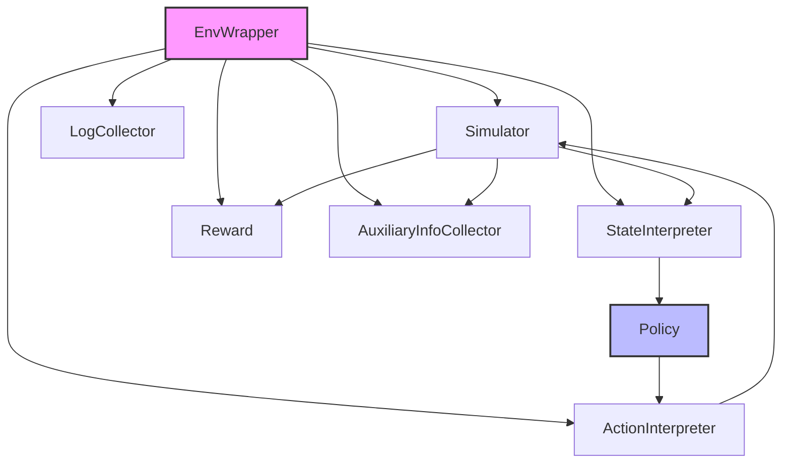
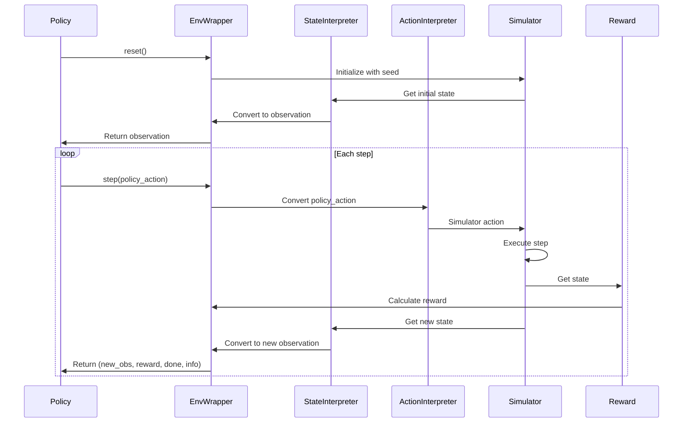

# QLib RL 环境包装器

## 模块概述

`env_wrapper.py` 是 QLib 强化学习模块的核心组件，实现了一个符合 OpenAI Gym 接口的 RL 环境包装器 `EnvWrapper`。该模块将 QLib 量化投资框架的各个组件（模拟器、状态解释器、动作解释器、奖励计算）有机地结合在一起，提供了一个标准的 RL 环境接口，方便与主流强化学习库（如 Tianshou）集成使用。

## 类型定义

### InfoDict

```python
class InfoDict(TypedDict):
    """The type of dict that is used in the 4th return value of ``env.step()``."""

    aux_info: dict
    """Any information depends on auxiliary info collector."""
    log: Dict[str, Any]
    """Collected by LogCollector."""
```

**功能说明**：`env.step()` 方法返回的第 4 个值的类型定义，包含辅助信息和日志信息。

**字段说明**：
- `aux_info`：由辅助信息收集器（AuxiliaryInfoCollector）收集的额外信息
- `log`：由日志收集器（LogCollector）收集的日志信息

### EnvWrapperStatus

```python
class EnvWrapperStatus(TypedDict):
    """
    This is the status data structure used in EnvWrapper.
    The fields here are in the semantics of RL.
    For example, ``obs`` means the observation fed into policy.
    ``action`` means the raw action returned by policy.
    """

    cur_step: int
    done: bool
    initial_state: Optional[Any]
    obs_history: list
    action_history: list
    reward_history: list
```

**功能说明**：EnvWrapper 使用的状态数据结构，包含 RL 语义的字段。

**字段说明**：
- `cur_step`：当前步骤数
- `done`：是否结束标志
- `initial_state`：初始状态
- `obs_history`：观测历史列表
- `action_history`：动作历史列表
- `reward_history`：奖励历史列表

## 核心类：EnvWrapper

### 类定义

```python
class EnvWrapper(
    gym.Env[ObsType, PolicyActType],
    Generic[InitialStateType, StateType, ActType, ObsType, PolicyActType],
):
    """Qlib-based RL environment, subclassing ``gym.Env``.
    A wrapper of components, including simulator, state-interpreter, action-interpreter, reward.
```

**功能说明**：基于 QLib 的 RL 环境，继承自 `gym.Env`，是包含模拟器、状态解释器、动作解释器和奖励计算的组件包装器。

**泛型类型参数**：
- `InitialStateType`：初始状态类型
- `StateType`：模拟器状态类型
- `ActType`：模拟器动作类型
- `ObsType`：策略观测类型
- `PolicyActType`：策略动作类型

### 构造函数

```python
def __init__(
    self,
    simulator_fn: Callable[..., Simulator[InitialStateType, StateType, ActType]],
    state_interpreter: StateInterpreter[StateType, ObsType],
    action_interpreter: ActionInterpreter[StateType, PolicyActType, ActType],
    seed_iterator: Optional[Iterable[InitialStateType]],
    reward_fn: Reward | None = None,
    aux_info_collector: AuxiliaryInfoCollector[StateType, Any] | None = None,
    logger: LogCollector | None = None,
) -> None:
```

**功能说明**：初始化 EnvWrapper 实例。

**参数说明**：
- `simulator_fn`：模拟器工厂函数，当提供 seed_iterator 时，工厂函数接受一个种子参数；否则接受零参数
- `state_interpreter`：状态-观测转换器，将模拟器状态转换为策略可接受的观测
- `action_interpreter`：策略-模拟器动作转换器，将策略返回的动作转换为模拟器可接受的动作
- `seed_iterator`：种子迭代器，用于为模拟器提供初始状态
- `reward_fn`：奖励计算函数，可选，默认无奖励（返回0.0）
- `aux_info_collector`：辅助信息收集器，可选，收集额外信息
- `logger`：日志收集器，可选，用于收集环境运行过程中的日志信息

**内部逻辑**：
1. 为所有组件设置对 EnvWrapper 的弱引用，避免循环引用
2. 初始化组件属性
3. 处理 seed_iterator 参数（None 表示无种子，SEED_INTERATOR_MISSING 表示无种子迭代器）
4. 初始化状态属性

### 属性方法

#### action_space

```python
@property
def action_space(self) -> Space:
    return self.action_interpreter.action_space
```

**功能说明**：获取动作空间，返回动作解释器的动作空间。

#### observation_space

```python
@property
def observation_space(self) -> Space:
    return self.state_interpreter.observation_space
```

**功能说明**：获取观测空间，返回状态解释器的观测空间。

### 核心方法

#### reset

```python
def reset(self, **kwargs: Any) -> ObsType:
    """
    Try to get a state from state queue, and init the simulator with this state.
    If the queue is exhausted, generate an invalid (nan) observation.
    """
```

**功能说明**：重置环境状态，获取新的初始状态并初始化模拟器。

**参数说明**：
- `**kwargs`：可选参数，传递给模拟器初始化

**返回值**：策略可接受的观测值

**内部逻辑**：
1. 检查是否可以获取新的种子（状态）
2. 重置日志收集器
3. 初始化模拟器（根据是否有种子参数）
4. 初始化 EnvWrapper 状态
5. 计算初始观测并保存到历史记录中
6. 处理种子迭代器耗尽的情况，返回 NaN 观测

#### step

```python
def step(self, policy_action: PolicyActType, **kwargs: Any) -> Tuple[ObsType, float, bool, InfoDict]:
    """Environment step.

    See the code along with comments to get a sequence of things happening here.
    """
```

**功能说明**：执行环境步骤，处理策略动作并返回新的观测、奖励、结束标志和信息字典。

**参数说明**：
- `policy_action`：策略返回的原始动作
- `**kwargs`：可选参数，传递给模拟器步骤方法

**返回值**：包含观测值、奖励、结束标志和信息字典的元组

**内部逻辑**：
1. 检查环境是否已耗尽
2. 重置日志收集器
3. 保存策略动作到历史记录
4. 转换策略动作到模拟器可接受的动作
5. 更新当前步骤计数
6. 执行模拟器步骤
7. 检查是否结束
8. 获取新状态并计算观测
9. 计算奖励
10. 收集辅助信息
11. 记录 RL 特定的日志（步数、奖励等）
12. 返回结果

#### render

```python
def render(self, mode: str = "human") -> None:
    raise NotImplementedError("Render is not implemented in EnvWrapper.")
```

**功能说明**：渲染环境，当前未实现。

## 架构设计

### 组件交互图



### 数据流程



## 使用示例

### 基本使用步骤

```python
from qlib.rl.utils.env_wrapper import EnvWrapper
from qlib.rl.simulator import Simulator
from qlib.rl.interpreter import StateInterpreter, ActionInterpreter
from qlib.rl.reward import Reward

# 1. 实现模拟器
class MySimulator(Simulator):
    # 模拟器实现...
    pass

# 2. 实现状态解释器
class MyStateInterpreter(StateInterpreter):
    # 状态转换实现...
    pass

# 3. 实现动作解释器
class MyActionInterpreter(ActionInterpreter):
    # 动作转换实现...
    pass

# 4. 实现奖励函数
class MyReward(Reward):
    # 奖励计算实现...
    pass

# 5. 创建 EnvWrapper 实例
env = EnvWrapper(
    simulator_fn=lambda seed: MySimulator(seed),
    state_interpreter=MyStateInterpreter(),
    action_interpreter=MyActionInterpreter(),
    seed_iterator=range(100),  # 100个不同的初始状态
    reward_fn=MyReward(),
)

# 6. 使用环境（符合 Gym 接口）
obs = env.reset()
done = False
total_reward = 0

while not done:
    # 策略选择动作
    policy_action = ...

    # 执行动作
    new_obs, reward, done, info = env.step(policy_action)

    total_reward += reward
    obs = new_obs

print(f"Episode finished. Total reward: {total_reward}")
```

### 与 Tianshou 集成示例

```python
from tianshou.data import Collector
from tianshou.env import SubprocVectorEnv
from tianshou.policy import DQNPolicy

# 创建多个并行环境
def make_env():
    return EnvWrapper(
        simulator_fn=lambda seed: MySimulator(seed),
        state_interpreter=MyStateInterpreter(),
        action_interpreter=MyActionInterpreter(),
        seed_iterator=range(100),
        reward_fn=MyReward(),
    )

# 创建4个并行环境
envs = SubprocVectorEnv([make_env for _ in range(4)])

# 初始化策略（示例使用 DQN）
policy = DQNPolicy(...)

# 创建数据收集器
collector = Collector(policy, envs)

# 收集训练数据
result = collector.collect(n_step=1000)
print(f"Collected {result['n/st']} steps, total rewards: {result['rews'].sum()}")

# 训练策略
policy.train(...)
```

## 实现细节

### 弱引用机制

```python
for obj in [state_interpreter, action_interpreter, reward_fn, aux_info_collector]:
    if obj is not None:
        obj.env = weakref.proxy(self)  # type: ignore
```

**设计意图**：使用弱引用机制的原因：
1. 逻辑上组件应该能够独立于 EnvWrapper 存在
2. 避免循环引用
3. 简化组件序列化
4. 环境被销毁时组件不会保留引用

### 种子迭代器处理

```python
if seed_iterator is None:
    # In this case, there won't be any seed for simulator
    self.seed_iterator = SEED_INTERATOR_MISSING
else:
    self.seed_iterator = iter(seed_iterator)
```

**设计意图**：
- `SEED_INTERATOR_MISSING` 表示无种子迭代器（不是 None，因为 None 表示迭代器已耗尽）
- `iter(seed_iterator)` 确保我们可以多次迭代种子序列

### 观测空间验证

当种子迭代器耗尽时，会生成 NaN 观测：

```python
return generate_nan_observation(self.observation_space)
```

这确保了即使环境耗尽，也能返回符合形状的有效观测。

## 总结

EnvWrapper 是 QLib 强化学习模块的核心组件，它将 QLib 的各个组件（模拟器、状态解释器、动作解释器、奖励计算）统一封装到一个符合 OpenAI Gym 接口的环境类中。这种设计使得 QLib 量化投资框架能够与主流强化学习库无缝集成，为开发量化投资策略提供了强大的支持。

EnvWrapper 通过泛型类型参数和模块化设计，提供了高度的灵活性，允许开发者根据不同的需求实现自定义的模拟器、解释器和奖励函数。同时，它还提供了完整的状态管理、历史记录和日志收集功能，便于调试和性能分析。
