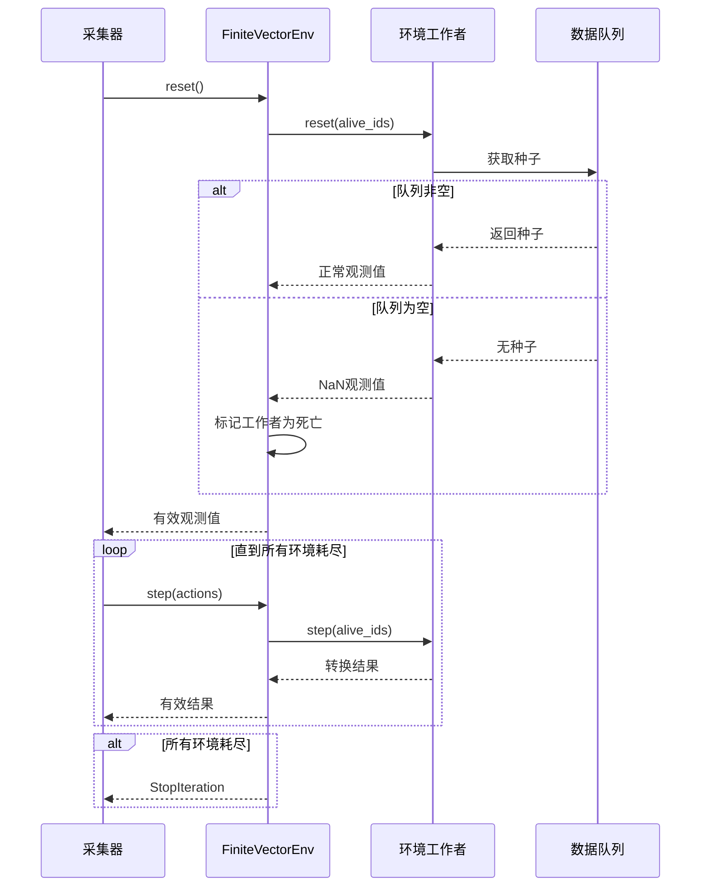

# finite_env 模块文档

## 模块概述

`finite_env.py` 模块是 Qlib 强化学习框架的核心组件之一，主要用于支持向量化环境（Vectorized Environment）中的有限环境（Finite Environment）场景。该模块解决了 Tianshou 框架在处理有限数据源时的一个关键问题：确保数据队列中的每个种子（seed）被恰好一个环境工作者消费。

### 设计背景

本模块的设计动机来源于 [Tianshou issue #322](https://github.com/thu-ml/tianshou/issues/322)。在典型的强化学习训练或推理中，当使用向量化环境时，Tianshou 原生的实现可能会导致某些种子被重复消费或丢失，特别是当数据队列中的种子数量少于并发工作者数量时。

### 核心特性

1. **精确种子消费**：确保每个种子被恰好一个环境消费
2. **特殊观测值协议**：使用 NaN 观测值作为环境耗尽的信号
3. **日志收集**：支持从子环境工作者显式收集日志
4. **灵活的向量化类型**：支持 dummy、subproc 和 shmem 三种并行模式

### 工作原理



---

## 类型定义

### FiniteEnvType

```python
FiniteEnvType = Literal["dummy", "subproc", "shmem"]
```

向量化环境类型的字面量类型定义，支持三种类型：
- `"dummy"`: 单进程串行执行（`FiniteDummyVectorEnv`）
- `"subproc"`: 多进程并行执行（`FiniteSubprocVectorEnv`）
- `"shmem"`: 共享内存多进程执行（`FiniteShmemVectorEnv`）

---

## 工具函数

### fill_invalid

```python
def fill_invalid(obj: int | float | bool | T) -> T
```

用无效值填充对象，用于生成表示环境耗尽的特殊观测值。

**参数说明：**
- `obj`: 要填充的对象，可以是标量（int、float、bool）或复合类型（dict、list、tuple、np.ndarray）

**返回值：**
- 填充了无效值的对象，结构与输入保持一致

**填充规则：**
- 浮点数类型 → 填充为 `np.nan`
- 整数类型 → 填充为该类型的最大值（`np.iinfo(dtype).max`）
- 布尔类型 → 转换为数组后按整数处理
- 字典 → 递归填充每个值
- 列表/元组 → 递归填充每个元素

**使用示例：**

```python
import numpy as np

# 填充浮点数数组
arr = np.array([1.0, 2.0, 3.0])
result = fill_invalid(arr)
# 结果: array([nan, nan, nan])

# 填充整数数组
arr_int = np.array([1, 2, 3], dtype=np.int32)
result_int = fill_invalid(arr_int)
# 结果: array([2147483647, 2147483647, 2147483647], dtype=int32)

# 填充字典
data = {"a": 1.0, "b": [2, 3], "c": (True, False)}
result_dict = fill_invalid(data)
# 结果: {"a": nan, "b": [2147483647, 2147483647], "c": (2147483647, 2147483647)}
```

---

### is_invalid

```python
def is_invalid(arr: int | float | bool | T) -> bool
```

检查对象是否为无效值（即是否由 `fill_invalid` 生成）。

**参数说明：**
- `arr`: 要检查的对象

**返回值：**
- `True` 如果对象是无效值，否则 `False`

**判断规则：**
- 浮点数组 → 所有元素都是 `np.nan`
- 整数数组 → 所有元素都是该类型的最大值
- 字典 → 所有值都是无效值
- 列表/元组 → 所有元素都是无效值
- 标量 → 转换为数组后检查

**使用示例：**

```python
import numpy as np

# 检查无效浮点数数组
nan_arr = np.array([np.nan, np.nan])
print(is_invalid(nan_arr))  # 输出: True

# 检查无效整数数组
max_int = np.iinfo(np.int32).max
int_arr = np.array([max_int, max_int], dtype=np.int32)
print(is_invalid(int_arr))  # 输出: True

# 检查有效数组
valid_arr = np.array([1.0, 2.0])
print(is_invalid(valid_arr))  # 输出: False
```

---

### generate_nan_observation

```python
def generate_nan_observation(obs_space: gym.Space) -> Any
```

生成表示环境未接收到种子的 NaN 观测值。

**参数说明：**
- `obs_space`: Gym 观测空间，用于确定观测值的结构

**返回值：**
- 具有与观测空间样本相同结构，但填充了无效值的观测值

**说明：**
此函数假设观测值结构复杂且包含浮点类型数据。如果观测空间不包含浮点类型，此逻辑可能不适用。

**使用示例：**

```python
import gym
from gym import spaces

# 创建观测空间
obs_space = spaces.Dict({
    "image": spaces.Box(low=0, high=255, shape=(84, 84, 3), dtype=np.uint8),
    "vector": spaces.Box(low=-1, high=1, shape=(10,), dtype=np.float32)
})

# 生成 NaN 观测值
nan_obs = generate_nan_observation(obs_space)
# nan_obs["image"] 全为 255
# nan_obs["vector"] 全为 nan
```

---

### check_nan_observation

```python
def check_nan_observation(obs: Any) -> bool
```

检查观测值是否由 `generate_nan_observation` 生成。

**参数说明：**
- `obs`: 要检查的观测值

**返回值：**
- `True` 如果观测值是 NaN 观测值，否则 `False`

**使用示例：**

```python
# 假设 env 是一个 Gym 环境
obs = env.reset()

# 检查是否为 NaN 观测值
if check_nan_observation(obs):
    print("环境已耗尽，无更多数据")
else:
    print("获得有效观测值")
```

---

## 核心类

### FiniteVectorEnv

```python
class FiniteVectorEnv(BaseVectorEnv)
```

支持有限数据源的向量化环境基类，继承自 Tianshou 的 `BaseVectorEnv`。

#### 设计原理

`FiniteVectorEnv` 通过以下机制实现精确的种子消费：

1. **特殊观测值协议**：单个环境（通常是 `EnvWrapper`）从队列读取数据，当队列耗尽时生成 NaN 观测值
2. **活跃环境追踪**：维护 `_alive_env_ids` 集合来跟踪哪些环境工作者仍在活跃
3. **结果过滤**：从所有工作者收集观测值，只选择非 NaN 的观测值
4. **终止信号**：当所有环境都耗尽时，抛出 `StopIteration` 异常

#### 初始化方法

```python
def __init__(
    self,
    logger: LogWriter | list[LogWriter] | None,
    env_fns: list[Callable[..., gym.Env]],
    **kwargs: Any
) -> None
```

**参数说明：**
- `logger`: 日志写入器，用于收集子环境的日志
- `env_fns`: 环境工厂函数列表，每个函数创建一个 Gym 环境实例
- `**kwargs`: 传递给父类的额外参数

**属性说明：**
- `_logger`: 日志写入器列表
- `_alive_env_ids`: 活跃环境 ID 的集合
- `_default_obs`, `_default_info`, `_default_rew`: 默认的观测值、信息和奖励（用于填充已死亡环境的输出）
- `_zombie`: 标记环境是否已完全耗尽
- `_collector_guarded`: 标记是否在 `collector_guard` 上下文中

**使用示例：**

```python
from qlib.rl.utils import FiniteDummyVectorEnv, LogWriter

# 创建日志写入器
logger = LogWriter()

# 创建环境工厂函数
def create_env():
    return MyCustomEnvironment()

# 创建向量化环境
env_fns = [create_env for _ in range(4)]  # 4个并发环境
vec_env = FiniteDummyVectorEnv(logger, env_fns)
```

---

#### collector_guard

```python
@contextmanager
def collector_guard(self) -> Generator[FiniteVectorEnv, None, None]
```

采集器的上下文管理器，推荐在每次采集时使用。

**功能说明：**
1. 捕获并忽略 `StopIteration` 异常，这是 FiniteEnv 发出的停止信号
2. 通知日志记录器采集的开始和结束

**使用示例：**

```python
from tianshou.data import Collector

# 假设 policy、vec_env、train_envs 已定义
collector = Collector(policy, vec_env, train_envs)

# 使用 guard 包裹采集过程
INF = float('inf')
with vec_env.collector_guard():
    result = collector.collect(n_episode=INF)
    # 当环境耗尽时，collect() 会正常返回而不会抛出异常
```

**注意事项：**
- 如果不使用此 guard，可能会遇到意外的 `StopIteration` 异常或日志丢失
- 即使在 guard 内部，`reset()` 方法仍会在未受 guard 保护时发出警告

---

#### reset

```python
def reset(
    self,
    id: int | List[int] | np.ndarray | None = None,
) -> np.ndarray
```

重置环境。

**参数说明：**
- `id`: 要重置的环境 ID，可以是单个 ID、ID 列表或数组，`None` 表示重置所有环境

**返回值：**
- 重置后的观测值数组

**执行流程：**
1. 检查是否在 `collector_guard` 上下文中，否则发出警告
2. 重置活跃环境集合（如需要）
3. 只重置仍活跃的环境
4. 过滤掉返回 NaN 观测值的环境，将其标记为非活跃
5. 记录重置日志
6. 用默认观测值填充已死亡环境的输出
7. 如果所有环境都已死亡，抛出 `StopIteration`

**使用示例：**

```python
# 重置所有环境
obs = vec_env.reset()

# 重置指定环境
obs = vec_env.reset(id=[0, 2])  # 只重置 ID 为 0 和 2 的环境
```

---

#### step

```python
def step(
    self,
    action: np.ndarray,
    id: int | List[int] | np.ndarray | None = None,
) -> Tuple[np.ndarray, np.ndarray, np.ndarray, np.ndarray]
```

在环境中执行动作。

**参数说明：**
- `action`: 动作数组，形状为 `(num_envs, ...)`
- `id`: 要执行动作的环境 ID，`None` 表示所有环境

**返回值：**
- 元组 `(obs, rew, done, info)`，包含观测值、奖励、终止标志和信息字典

**执行流程：**
1. 只在活跃环境中执行动作
2. 后处理观测值，过滤 NaN 观测值
3. 记录步骤日志
4. 用默认值填充已死亡环境的输出
5. 返回堆叠的结果

**使用示例：**

```python
import numpy as np

# 假设 action_shape 是每个环境的动作形状
action_shape = (3,)  # 示例：3维动作
actions = np.random.rand(4, *action_shape)  # 4个环境的随机动作

# 执行一步
obs, rew, done, info = vec_env.step(actions)
```

---

#### _reset_alive_envs

```python
def _reset_alive_envs(self) -> None
```

重置活跃环境集合。如果没有活跃环境，则将所有环境标记为活跃。

**内部方法，不建议外部调用。**

---

#### _postproc_env_obs

```python
@staticmethod
def _postproc_env_obs(obs: Any) -> Optional[Any]
```

后处理环境观测值，为共享内存向量环境保留的方法，用于恢复空观测值。

**参数说明：**
- `obs`: 原始观测值

**返回值：**
- 如果是 NaN 观测值则返回 `None`，否则返回原始观测值

---

#### 默认值管理方法

```python
def _set_default_obs(self, obs: Any) -> None
def _set_default_info(self, info: Any) -> None
def _set_default_rew(self, rew: Any) -> None
def _get_default_obs(self) -> Any
def _get_default_info(self) -> Any
def _get_default_rew(self) -> Any
```

用于设置和获取默认观测值、信息和奖励的方法。这些默认值用于填充已死亡环境的输出，以保持与 Tianshou 缓冲区和批次系统的兼容性。

---

### FiniteDummyVectorEnv

```python
class FiniteDummyVectorEnv(FiniteVectorEnv, DummyVectorEnv)
```

结合 `FiniteVectorEnv` 功能的 `DummyVectorEnv`，在单进程中串行执行多个环境。

**适用场景：**
- 调试和开发
- 环境实例化开销较小
- 需要确定性执行顺序

---

### FiniteSubprocVectorEnv

```python
class FiniteSubprocVectorEnv(FiniteVectorEnv, SubprocVectorEnv)
```

结合 `FiniteVectorEnv` 功能的 `SubprocVectorEnv`，使用多进程并行执行环境。

**适用场景：**
- 环境计算密集
- 需要真正的并行执行
- 环境间不需要共享状态

---

### FiniteShmemVectorEnv

```python
class FiniteShmemVectorEnv(FiniteVectorEnv, ShmemVectorEnv)
```

结合 `FiniteVectorEnv` 功能的 `ShmemVectorEnv`，使用共享内存的多进程环境。

**适用场景：**
- 需要高效的数据传输
- 观测值较大
- 环境间通过共享内存通信

---

## 工厂函数

### vectorize_env

```python
def vectorize_env(
    env_factory: Callable[..., gym.Env],
    env_type: FiniteEnvType,
    concurrency: int,
    logger: LogWriter | List[LogWriter],
) -> FiniteVectorEnv
```

创建向量化环境的辅助函数，可以用于替代普通的 VectorEnv。

**参数说明：**
- `env_factory`: 用于实例化单个 `gym.Env` 的可调用对象，所有并发工作者使用相同的工厂函数
- `env_type`: 环境类型，"dummy"、"subproc" 或 "shmem"
- `concurrency`: 并发环境工作者数量
- `logger`: 日志写入器

**返回值：**
- 创建好的 `FiniteVectorEnv` 实例

**相比普通 VectorEnv 的额外功能：**
1. 检查 NaN 观测值并在发现时终止工作者
2. 提供日志记录器来显式收集环境工作者的日志

**警告：**
请不要为 `env_factory` 使用 lambda 表达式，因为它可能会创建错误共享的实例。

**使用示例：**

```python
from qlib.rl.utils import vectorize_env, LogWriter

# 正确：定义命名函数
def env_factory():
    return EnvWrapper(...)

# 错误：不要使用 lambda
# vectorize_env(lambda: EnvWrapper(...), ...)

# 创建向量化环境
logger = LogWriter()
vec_env = vectorize_env(
    env_factory=env_factory,
    env_type="subproc",  # 使用多进程
    concurrency=8,       # 8个并发工作者
    logger=logger
)
```

**迁移指南：**

从 Tianshou 原生 VectorEnv 迁移：

```python
# 之前
from tianshou.env import DummyVectorEnv
vec_env = DummyVectorEnv([lambda: gym.make(task) for _ in range(env_num)])

# 之后
from qlib.rl.utils import vectorize_env, LogWriter

def env_factory():
    return gym.make(task)

logger = LogWriter()
vec_env = vectorize_env(env_factory, "dummy", env_num, logger)
```

---

## 完整使用示例

### 基本用法

```python
import gym
from tianshou.data import Collector
from tianshou.policy import RandomPolicy
from qlib.rl.utils import vectorize_env, LogWriter

# 1. 定义环境工厂
def create_env():
    # 假设这是一个有限环境，会在某个时刻耗尽
    class MyFiniteEnv(gym.Env):
        def __init__(self):
            super().__init__()
            self.observation_space = gym.spaces.Box(low=-1, high=1, shape=(4,))
            self.action_space = gym.spaces.Discrete(2)
            self.step_count = 0
            self.max_steps = 10

        def reset(self):
            self.step_count = 0
            return self.observation_space.sample()

        def step(self, action):
            self.step_count += 1
            done = self.step_count >= self.max_steps
            return self.observation_space.sample(), 1.0, done, {}

    return MyFiniteEnv()

# 2. 创建日志写入器
logger = LogWriter()

# 3. 创建向量化环境
vec_env = vectorize_env(
    env_factory=create_env,
    env_type="dummy",
    concurrency=2,
    logger=logger
)

# 4. 创建策略和采集器
policy = RandomPolicy()
collector = Collector(policy, vec_env)

# 5. 使用 guard 采集数据直到环境耗尽
INF = float('inf')
with vec_env.collector_guard():
    result = collector.collect(n_episode=INF)
    print(f"采集到 {result['n/ep']} 个回合")
    print(f"总步数: {result['n/st']}")
```

### 与数据队列集成

```python
from qlib.rl.utils import DataQueue, EnvWrapper, FiniteVectorEnv

# 假设我们有一个数据队列
data_queue = DataQueue([
    {"data": "sample1"},
    {"data": "sample2"},
    {"data": "sample3"},
    # 更多数据...
])

# 创建环境包装器
def create_env():
    return EnvWrapper(data_queue, ...)

# 创建有限向量化环境
vec_env = FiniteDummyVectorEnv(
    logger=LogWriter(),
    env_fns=[create_env for _ in range(4)]
)

# 采集所有数据
with vec_env.collector_guard():
    collector.collect(n_episode=float('inf'))
```

---

## 注意事项和最佳实践

1. **始终使用 collector_guard**：在调用 `collector.collect()` 时始终使用 `collector_guard()` 上下文管理器，以正确处理 `StopIteration` 异常和日志收集。

2. **避免 lambda 作为 env_factory**：使用命名函数而非 lambda 表达式作为环境工厂，以避免实例共享问题。

3. **选择合适的环境类型**：
   - 开发调试：使用 `"dummy"`
   - 计算密集型环境：使用 `"subproc"`
   - 大数据传输：使用 `"shmem"`

4. **并发数设置**：并发数应根据任务性质和可用资源合理设置，并非越大越好。

5. **日志收集**：利用 `LogWriter` 来收集和分析环境执行过程中的日志信息。

6. **有限 vs 无限队列**：
   - 有限队列（通常用于推理）：采集无限多回合直到环境自行耗尽
   - 无限队列（通常用于训练）：设置回合数或步数限制，数据会随机排序

---

## 相关模块

- [`qlib.rl.utils.log`](./log.md) - 日志写入器模块
- [`qlib.rl.utils.data_queue`](./data_queue.md) - 数据队列模块
- [`qlib.rl.utils.env_wrapper`](./env_wrapper.md) - 环境包装器模块
- [Tianshou VectorEnv 文档](https://tianshou.readthedocs.io/en/master/api/tianshou.env.html#vectorenv)

---

## 参考文献

- [Tianshou issue #322](https://github.com/thu-ml/tianshou/issues/322)
- [Tianshou 官方文档](https://tianshou.readthedocs.io/)
