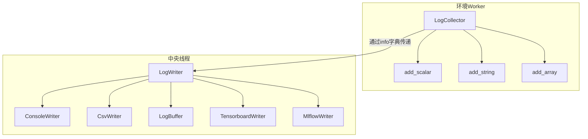

# QLib RL 日志工具模块

## 模块概述

该模块提供了RL训练过程中的日志收集和写入功能，实现了分布式日志系统。主要包含以下核心组件：

- **LogLevel**: 日志级别枚举类，定义了不同重要性的日志级别
- **LogCollector**: 在环境 worker 中收集日志的工具
- **LogWriter**: 中央线程中处理日志的基类，包含多个具体实现
- **LogBuffer**: 内存缓冲日志写入器
- **ConsoleWriter**: 控制台日志写入器
- **CsvWriter**: CSV文件日志写入器
- 未实现的写入器: PickleWriter, TensorboardWriter, MlflowWriter

## 架构设计



## 类定义

### LogLevel 枚举类

日志级别枚举，定义了RL训练过程中不同重要性的日志级别。

```python
class LogLevel(IntEnum):
    """Log-levels for RL training.
    The behavior of handling each log level depends on the implementation of :class:`LogWriter`.
    """

    DEBUG = 10
    """If you only want to see the metric in debug mode."""

    PERIODIC = 20
    """If you want to see the metric periodically."""

    INFO = 30
    """Important log messages."""

    CRITICAL = 40
    """LogWriter should always handle CRITICAL messages"""
```

### LogCollector 类

在每个环境worker中收集日志的工具，收集到的日志会通过env.step()的info字典传递到中央线程。

```python
class LogCollector:
    """Logs are first collected in each environment worker,
    and then aggregated to stream at the central thread in vector env.
    """

    def __init__(self, min_loglevel: int | LogLevel = LogLevel.PERIODIC) -> None:
        """初始化LogCollector

        Parameters
        ----------
        min_loglevel
            最小日志级别，低于此级别的日志将不会被收集，用于优化网络/管道流量
        """

    def reset(self) -> None:
        """清除所有已收集的内容"""

    def add_string(self, name: str, string: str, loglevel: int | LogLevel = LogLevel.PERIODIC) -> None:
        """添加字符串类型的日志

        Parameters
        ----------
        name
            日志名称
        string
            字符串内容
        loglevel
            日志级别，默认PERIODIC
        """

    def add_scalar(self, name: str, scalar: Any, loglevel: int | LogLevel = LogLevel.PERIODIC) -> None:
        """添加标量类型的日志，会自动转换为float类型

        Parameters
        ----------
        name
            日志名称
        scalar
            标量值，可以是数值类型或具有item()方法的对象
        loglevel
            日志级别，默认PERIODIC
        """

    def add_array(self, name: str, array: np.ndarray | pd.DataFrame | pd.Series,
                 loglevel: int | LogLevel = LogLevel.PERIODIC) -> None:
        """添加数组类型的日志

        Parameters
        ----------
        name
            日志名称
        array
            数组对象，可以是numpy数组、pandas DataFrame或Series
        loglevel
            日志级别，默认PERIODIC
        """

    def add_any(self, name: str, obj: Any, loglevel: int | LogLevel = LogLevel.PERIODIC) -> None:
        """添加任意类型的日志，仅支持pickle可序列化的对象

        Parameters
        ----------
        name
            日志名称
        obj
            任意对象
        loglevel
            日志级别，默认PERIODIC
        """

    def logs(self) -> Dict[str, np.ndarray]:
        """获取所有收集到的日志

        Returns
        -------
        Dict[str, np.ndarray]
            日志字典，所有值已转换为numpy数组
        """
```

### LogWriter 基类

日志写入器基类，在中央线程中处理由LogCollector收集的日志。

```python
class LogWriter(Generic[ObsType, ActType]):
    """Base class for log writers, triggered at every reset and step by finite env.
    """

    episode_count: int
    """Episode计数器"""

    step_count: int
    """Step计数器"""

    global_step: int
    """全局Step计数器，不会在clear()中重置"""

    global_episode: int
    """全局Episode计数器，不会在clear()中重置"""

    active_env_ids: Set[int]
    """活跃的环境ID集合"""

    episode_lengths: Dict[int, int]
    """环境ID到Episode长度的映射"""

    episode_rewards: Dict[int, List[float]]
    """环境ID到Episode奖励列表的映射"""

    episode_logs: Dict[int, list]
    """环境ID到Episode日志的映射"""

    def __init__(self, loglevel: int | LogLevel = LogLevel.PERIODIC) -> None:
        """初始化LogWriter

        Parameters
        ----------
        loglevel
            处理的最小日志级别，低于此级别的日志将被丢弃
        """

    def clear(self):
        """清除所有指标，使日志器可重用"""

    def state_dict(self) -> dict:
        """保存日志器状态到字典"""

    def load_state_dict(self, state_dict: dict) -> None:
        """从字典加载日志器状态"""

    @staticmethod
    def aggregation(array: Sequence[Any], name: str | None = None) -> Any:
        """将step-wise指标聚合为episode-wise指标

        Parameters
        ----------
        array
            要聚合的数组
        name
            指标名称，用于特殊处理（如reward求和）

        Returns
        -------
        Any
            聚合后的值
        """

    def log_episode(self, length: int, rewards: List[float], contents: List[Dict[str, Any]]) -> None:
        """Episode结束时触发的回调

        Parameters
        ----------
        length
            Episode长度
        rewards
            Episode每个step的奖励列表
        contents
            Episode每个step的日志内容
        """

    def log_step(self, reward: float, contents: Dict[str, Any]) -> None:
        """每个step触发的回调

        Parameters
        ----------
        reward
            该step的奖励
        contents
            该step的日志内容
        """

    def on_env_step(self, env_id: int, obs: ObsType, rew: float, done: bool, info: InfoDict) -> None:
        """有限环境的step回调"""

    def on_env_reset(self, env_id: int, _: ObsType) -> None:
        """有限环境的reset回调"""

    def on_env_all_ready(self) -> None:
        """所有环境准备好运行时的回调"""

    def on_env_all_done(self) -> None:
        """所有环境完成时的回调"""
```

### LogBuffer 类

内存缓冲日志写入器，保留所有数值指标在内存中，并支持回调功能。

```python
class LogBuffer(LogWriter):
    """Keep all numbers in memory.
    """

    def __init__(self, callback: Callable[[bool, bool, LogBuffer], None],
                 loglevel: int | LogLevel = LogLevel.PERIODIC):
        """初始化LogBuffer

        Parameters
        ----------
        callback
            回调函数，接受三个参数：
            - on_episode: 是否在Episode结束时调用
            - on_collect: 是否在Collect结束时调用
            - log_buffer: LogBuffer实例
        loglevel
            处理的最小日志级别
        """

    def episode_metrics(self) -> dict[str, float]:
        """获取最新Episode的数值指标

        Returns
        -------
        dict[str, float]
            最新Episode的指标字典
        """

    def collect_metrics(self) -> dict[str, float]:
        """获取最新Collect的聚合指标

        Returns
        -------
        dict[str, float]
            聚合后的指标字典
        """
```

### ConsoleWriter 类

控制台日志写入器，定期将日志输出到控制台。

```python
class ConsoleWriter(LogWriter):
    """Write log messages to console periodically.
    """

    prefix: str
    """日志前缀"""

    def __init__(self, log_every_n_episode: int = 20,
                 total_episodes: int | None = None,
                 float_format: str = ":.4f",
                 counter_format: str = ":4d",
                 loglevel: int | LogLevel = LogLevel.PERIODIC) -> None:
        """初始化ConsoleWriter

        Parameters
        ----------
        log_every_n_episode
            每多少个Episode输出一次日志
        total_episodes
            总Episode数（用于进度显示）
        float_format
            浮点数格式
        counter_format
            计数器格式
        loglevel
            处理的最小日志级别
        """

    def generate_log_message(self, logs: Dict[str, float]) -> str:
        """生成日志消息

        Parameters
        ----------
        logs
            日志字典

        Returns
        -------
        str
            格式化后的日志字符串
        """
```

### CsvWriter 类

CSV文件日志写入器，将所有Episode日志写入CSV文件。

```python
class CsvWriter(LogWriter):
    """Dump all episode metrics to a ``result.csv``.
    """

    SUPPORTED_TYPES = (float, str, pd.Timestamp)

    def __init__(self, output_dir: Path, loglevel: int | LogLevel = LogLevel.PERIODIC) -> None:
        """初始化CsvWriter

        Parameters
        ----------
        output_dir
            输出目录路径
        loglevel
            处理的最小日志级别
        """
```

## 使用示例

### 基本使用示例

```python
import numpy as np
from qlib.rl.utils.log import LogCollector, LogBuffer, ConsoleWriter, LogLevel

def log_callback(on_episode: bool, on_collect: bool, buffer: LogBuffer):
    if on_episode:
        print("Episode metrics:", buffer.episode_metrics())
    if on_collect:
        print("Collect metrics:", buffer.collect_metrics())

# 创建日志收集器和写入器
collector = LogCollector(min_loglevel=LogLevel.INFO)
buffer = LogBuffer(callback=log_callback)
console_writer = ConsoleWriter(log_every_n_episode=10)

# 模拟训练过程
for episode in range(50):
    collector.reset()

    # 收集日志
    collector.add_scalar("reward", np.random.rand(), LogLevel.INFO)
    collector.add_scalar("loss", np.random.rand() * 0.1, LogLevel.DEBUG)
    collector.add_string("status", "success", LogLevel.PERIODIC)

    # 模拟step
    for step in range(10):
        collector.add_scalar("step_reward", np.random.rand(), LogLevel.INFO)
        # 模拟通过info传递日志

    # 写入日志
    buffer.log_episode(10, [0.1]*10, [collector.logs()])
    console_writer.log_episode(10, [0.1]*10, [collector.logs()])
```

### 在RL训练中的完整示例

```python
from qlib.rl.utils.log import LogCollector, ConsoleWriter, LogLevel
from qlib.rl.utils.env_wrapper import InfoDict

# 在环境中创建日志收集器
collector = LogCollector(min_loglevel=LogLevel.PERIODIC)
collector.reset()

# 在训练循环中
for episode in range(100):
    state = env.reset()
    done = False

    while not done:
        # 选择动作
        action = agent.select_action(state)
        next_state, reward, done, info = env.step(action)

        # 收集日志
        collector.add_scalar("reward", reward)
        collector.add_scalar("q_value", agent.get_q_value(state))

        # 传递到中央线程（通过info）
        info["log"] = collector.logs()
        collector.reset()

        state = next_state

# 在中央线程中处理日志
writer = ConsoleWriter(log_every_n_episode=20)
writer.log_episode(...)
```

## 未实现的组件

- **PickleWriter**: 将日志保存到pickle文件的写入器
- **TensorboardWriter**: 将日志写入TensorBoard事件文件的写入器
- **MlflowWriter**: 将日志添加到MLflow的写入器

## 代码优化建议

1. **性能优化**: LogCollector可以添加批量收集方法，减少频繁的字典操作
2. **代码重复**: LogBuffer、ConsoleWriter和CsvWriter中的log_episode方法有重复代码，可以提取公共方法
3. **类型检查**: 可以添加更多类型检查和错误处理
4. **扩展性**: LogWriter基类的回调机制可以更加灵活
5. **文档完善**: 部分方法的文档字符串可以更详细

## 输入输出示例

### 控制台输出示例

```
[Step   20]  reward 0.8765 (0.8542)  loss 0.0432 (0.0512)
[Step   40]  reward 0.9123 (0.8876)  loss 0.0345 (0.0468)
[Step   60]  reward 0.8456 (0.8654)  loss 0.0567 (0.0498)
```

### CSV文件内容示例

```csv
reward,loss,status
0.8765,0.0432,success
0.9123,0.0345,success
0.8456,0.0567,success
```

## 总结

该模块提供了完整的RL训练日志系统，支持多环境并行训练的分布式日志收集和写入。通过LogCollector在worker中高效收集日志，然后在中央线程中通过LogWriter的不同实现进行处理，满足了多种日志输出需求。
