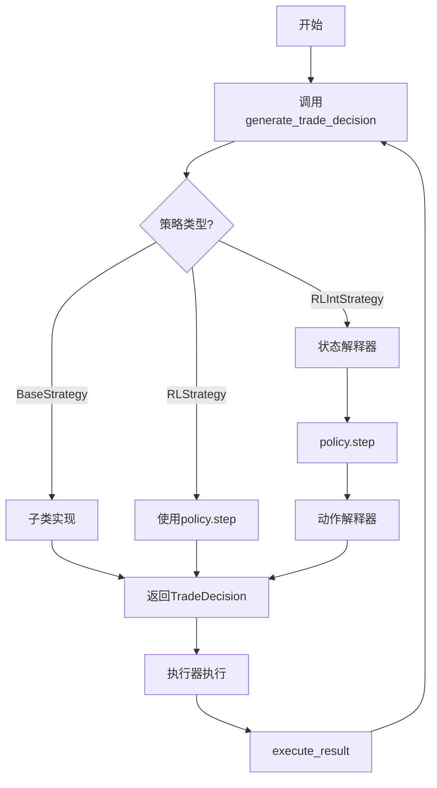
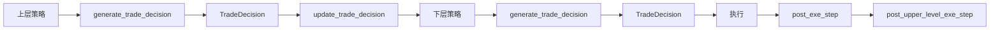

# strategy/base.py 模块文档

## 文件概述
定义了Qlib中所有交易策略的基类，包括基础策略类、强化学习策略类以及带解释器的强化学习策略类。

## 类与函数

### BaseStrategy 类
策略基类，所有交易策略的基础接口

**继承关系：**
- 无继承（基类）

**主要属性：**
- `level_infra`: 级别共享基础设施，包括交易日历等
- `common_infra`: 通用基础设施，包括交易账户、交易所等
- `outer_trade_decision`: 外层策略的交易决策，用于嵌套执行
- `_trade_exchange`: 当前策略使用的交易所

**主要方法：**

1. `__init__(outer_trade_decision, level_infra, common_infra, trade_exchange)`
   - 初始化策略
   - 参数：
     - `outer_trade_decision`: 外层策略的交易决策（可选）
     - `level_infra`: 级别基础设施（可选）
     - `common_infra`: 通用基础设施（可选）
     - `trade_exchange`: 交易所实例（可选）

2. `reset(level_infra, common_infra, outer_trade_decision, **kwargs)`
   - 重置策略状态
   - 可由子类重写以实现自定义重置逻辑

3. `generate_trade_decision(execute_result=None) -> BaseTradeDecision | Generator`
   - 生成交易决策（抽象方法，必须由子类实现）
   - 参数：
     - `execute_result`: 上次执行的结果
   - 返回：交易决策对象或生成器

4. `get_data_cal_avail_range(rtype="full") -> Tuple[int, int]`
   - 获取策略可用的数据日历范围
   - 参数：
     - `rtype`: 范围类型（"full"或"step"）
   - 返回：(起始索引, 结束索引)

5. `update_trade_decision(trade_decision, trade_calendar) -> Optional[BaseTradeDecision]` (静态方法)
   - 更新交易决策，用于跨层级通信
   - 返回：更新后的交易决策或None

6. `alter_outer_trade_decision(outer_trade_decision) -> BaseTradeDecision`
   - 修改外层策略的交易决策
   - 返回：修改后的交易决策

7. `post_upper_level_exe_step()`
   - 上层执行器执行完成后的钩子函数

8. `post_exe_step(execute_result)`
   - 执行器执行完成后的钩子函数

**属性访问：**
- `executor`: 获取执行器
- `trade_calendar`: 获取交易日历管理器
- `trade_position`: 获取当前持仓
- `trade_exchange`: 获取交易所实例（优先级：实例参数 > 通用基础设施）

---

### RLStrategy 类
基于强化学习的策略基类

**继承关系：**
- 继承自 `BaseStrategy`

**主要属性：**
- `policy`: 强化学习策略

**主要方法：**

1. `__init__(policy, outer_trade_decision, level_infra, common_infra, **kwargs)`
   - 初始化强化学习策略
   - 参数：
     - `policy`: 强化学习策略实例
     - 其他参数同 `BaseStrategy`

---

### RLIntStrategy 类
带有状态和动作解释器的强化学习策略

**继承关系：**
- 继承自 `RLStrategy`

**主要属性：**
- `policy`: 强化学习策略
- `state_interpreter`: 状态解释器，将执行结果转换为RL状态
- `action_interpreter`: 动作解释器，将RL动作转换为交易订单

**主要方法：**

1. `__init__(policy, state_interpreter, action_interpreter, outer_trade_decision, level_infra, common_infra, **kwargs)`
   - 初始化带解释器的强化学习策略
   - 参数：
     - `policy`: 强化学习策略实例
     - `state_interpreter`: 状态解释器（dict或实例）
     - `action_interpreter`: 动作解释器（dict或实例）
     - 其他参数同 `BaseStrategy`

2. `generate_trade_decision(execute_result=None) -> BaseTradeDecision`
   - 生成交易决策
   - 流程：
     1. 将执行结果通过状态解释器转换为状态
     2. 策略根据状态生成动作
     3. 将动作通过动作解释器转换为交易决策
   - 返回：交易决策对象

## 策略执行流程

## 嵌套执行流程

## 与其他模块的关系
- `qlib.backtest.decision`: 提供交易决策基类 `BaseTradeDecision`
- `qlib.backtest.exchange`: 提供交易所类 `Exchange`
- `qlib.backtest.position`: 提供持仓类 `BasePosition`
- `qlib.backtest.executor`: 提供执行器类 `BaseExecutor`
- `qlib.rl.interpreter`: 提供状态和动作解释器
