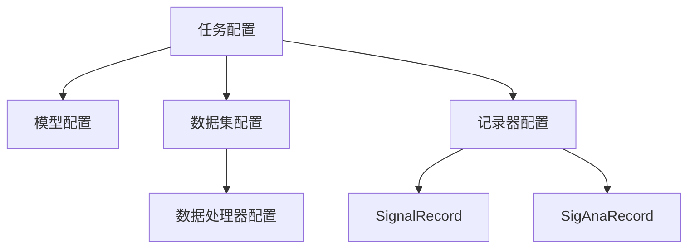

# tests/config.py 模块文档

## 文件概述
提供Qlib工作流和模型的预设配置，包括数据处理器、模型、记录器配置等。

## 预设常量

### 市场标记
```python
CSI300_MARKET = "csi300"    # CSI300市场标记
CSI100_MARKET = "csi100"    # CSI100市场标记
CSI300_BENCH = "SH000300"  # CSI300基准
```

### 数据集类名
```python
DATASET_ALPHA158_CLASS = "Alpha158"    # Alpha158数据集类
DATASET_ALPHA360_CLASS = "Alpha360"    # Alpha360数据集类
```

## 预设配置

### GBDT_MODEL
**LightGBM模型配置**
```python
GBDT_MODEL = {
    "class": "LGBModel",
    "module_path": "qlib.contrib.model.gbdt",
    "kwargs": {
        "loss": "mse",
        "colsample_bytree": 0.8879,
        "learning_rate": 0.0421,
        "subsample": 0.8789,
        "lambda_l1": 205.6999,
        "lambda_l2": 580.9768,
        "max_depth": 8,
        "num_leaves": 210,
        "num_threads": 20,
    },
}
```

---

### SA_RC
**信号分析记录器配置**
```python
SA_RC = {
    "class": "SigAnaRecord",
    "module_path": "qlib.workflow.record_temp",
}
```

---

### RECORD_CONFIG
**记录器配置列表**
```python
RECORD_CONFIG = [
    {
        "class": "SignalRecord",
        "module_path": "qlib.workflow.record_temp",
        "kwargs": {
            "dataset": "<DATASET>",
            "model": "<MODEL>",
        },
    },
    SA_RC,
]
```

## 配置生成函数

### get_data_handler_config 函数
**签名：**
```python
get_data_handler_config(
    start_time="2008-01-01",
    end_time="2020-08-01",
    fit_start_time="<dataset.kwargs.segments.train.0>",
    fit_end_time="<dataset.kwargs.segments.train.1>",
    instruments=CSI300_MARKET
) -> dict
```

**功能：** 生成数据处理器配置

**参数：**
- `start_time`: 数据开始时间
- `end_time`: 数据结束时间
- `fit_start_time`: 拟合开始时间（支持占位符）
- `fit_end_time`: 拟合结束时间（支持占位符）
- `instruments`: 标的代码池

**返回：** 数据处理器配置字典

---

### get_dataset_config 函数
**签名：**
```python
get_dataset_config(
    dataset_class=DATASET_ALPHA158_CLASS,
    train=("2008-01-01", "2014-12-31"),
    valid=("2015-01-01", "2016-12-31"),
    test=("2017-01-01", "2020-08-01"),
    handler_kwargs={"instruments": CSI300_MARKET}
) -> dict
```

**功能：** 生成数据集配置

**参数：**
- `dataset_class`: 数据集类名
- `train`: 训练集时间范围
- `valid`: 验证集时间范围
- `test`: 测试集时间范围
- `handler_kwargs`: 传递给数据处理器参数

**返回：** 数据集配置字典

---

### get_gbdt_task 函数
**签名：** `get_gbdt_task(dataset_kwargs={}, handler_kwargs={"instruments": CSI300_MARKET}) -> dict`

**功能：** 生成GBDT任务配置

**参数：**
**- `dataset_kwargs`: 数据集参数
- `handler_kwargs`: 数据处理器参数

**返回：** 任务配置字典

---

### get_record_lgb_config 函数
**签名：** `get_record_lgb_config(dataset_kwargs={}, handler_kwargs={"instruments": CSI300_MARKET}) -> dict`

**功能：** 生成LightGBM记录器配置

**参数：**
- `dataset_kwargs`: 数据集参数
- `handler_kwargs`: 数据处理器参数

**返回：** 任务配置字典

---

### get_record_xgboost_config 函数
**签名：** `get_record_xgboost_config(dataset_kwargs={}, handler_kwargs={"instruments": CSI300_MARKET}) -> dict`

**功能：** 生成XGBoost记录器配置

**参数：**
- `dataset_kwargs`: 数据集参数
- `handler_kwargs`: 数据处理器参数

**返回：** 任务配置字典

## 预设完整配置

### CSI300配置
```python
CSI300_DATASET_CONFIG = get_dataset_config(handler_kwargs={"instruments": CSI300_MARKET})
CSI300_GBDT_TASK = get_gbdt_task(handler_kwargs={"instruments": CSI300_MARKET})
```

### CSI100配置
```python
CSI100_RECORD_XGBOOST_TASK_CONFIG = get_record_xgboost_config(
    handler_kwargs={"instruments": CSI100_MARKET}
)
CSI100_RECORD_LGB_TASK_CONFIG = get_record_lgb_config(
    handler_kwargs={"instruments": CSI100_MARKET}
)
```

### 滚动配置（Rolling Online Management）
```python
ROLLING_HANDLER_CONFIG = {
    "start_time": "2013-01-01",
    "end_time": "2020-09-25",
    "fit_start_time": "2013-01-01",
    "fit_end_time": "2014-12-31",
    "instruments": CSI100_MARKET,
}

ROLLING_DATASET_CONFIG = {
    "train": ("2013-01-01", "2014-12-31"),
    "valid": ("2015-01-01", "2015-12-31"),
    "test": ("2016-01-01", "2020-07-10"),
}

CSI100_RECORD_XGBOOST_TASK_CONFIG_ROLLING = get_record_xxboost_config(
    dataset_kwargs=ROLLING_DATASET_CONFIG, handler_kwargs=ROLLING_HANDLER_CONFIG
)
CSI100_RECORD_LGB_TASK_CONFIG_ROLLING = get_record_lgb_config(
    dataset_kwargs=ROLLING_DATASET_CONFIG, handler_kwargs=ROLLING_HANDLER_CONFIG
)
```

### 在线管理配置（Online Management Simulate）
```python
ONLINE_HANDLER_CONFIG = {
    "start_time": "2018-01-01",
    "end_time": "2018-10-31",
    "fit_start_time": "2018-01-01",
    "fit_end_time": "2018-03-31",
    "instruments": CSI100_MARKET,
}

ONLINE_DATASET_CONFIG = {
    "train": ("2018-01-01", "2018-03-31"),
    "valid": ("2018-04-01", "2018-05-31"),
    "test": ("2018-06-01", "2018-09-10"),
}

CSI100_RECORD_XGBOOST_TASK_CONFIG_ONLINE = get_record_xgboost_config(
    dataset_kwargs=ONLINE_DATASET_CONFIG, handler_kwargs=ONLINE_HANDLER_CONFIG
)
CSI100_RECORD_LGB_TASK_CONFIG_ONLINE = get_record_lgb_config(
    dataset_kwargs=ONLINE_DATASET_CONFIG, handler_kwargs=ONLINE_HANDLER_CONFIG
)
```

## 配置层次结构



## 占位符系统

配置中支持以下占位符（会在运行时解析）：
- `<DATASET>`: 引用数据集对象
- `<MODEL>`: 引用模型对象
- `<dataset.kwargs.segments.train.0>`: 引用训练集开始时间
- `<dataset.kwargs.segments.train.1>`: 引用训练集结束时间

## 使用示例

### 基本使用
```python
from qlib.tests.config import (
    get_data_handler_config,
    get_dataset_config,
    get_gbdt_task,
    CSI300_GBDT_TASK
)

# 使用预设任务配置
task_config = CSI300_GBDT_TASK

# 自定义配置
handler_config = get_data_handler_config(
    start_time="2010-01-01",
    end_time="2020-12-31",
    instruments="csi300"
)

dataset_config = get_dataset_config(
    dataset_class="Alpha360",
    train=("2010-01-01", "2015-12-31"),
    valid=("2016-01-01", "2017-12-31"),
    test=("2018-01-01", "2020-12-31"),
    handler_kwargs={"instruments": handler_config["instruments"]}
)
```

## 与其他模块的关系
- `qlib.contrib.model.gbdt`: LGBModel
- `qlib.contrib.data.handler`: Alpha158, Alpha360
- `qlib.workflow.record_temp`: SignalRecord, SigAnaRecord
