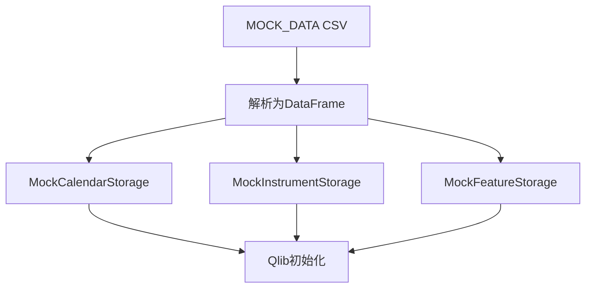
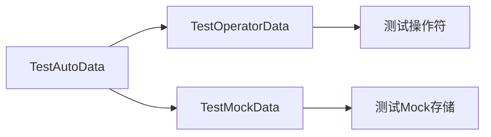

# tests/data.py 模块文档

## 文件概述
提供测试数据、Mock存储类和测试基类，用于Qlib的单元测试和集成测试。

## Mock数据

### MOCK_DATA
**功能：** CSV格式的Mock股票数据

**包含字段：**
- id: 股票ID
- symbol: 股票代码
- datetime: 时间戳
- interval: 时间间隔
- volume: 成交量
- open: 开盘价
- high: 最高价
- low: 最低价
- close: 收盘价

**数据特征：**
- 两个股票：`0050`和`1101`
- 时间范围：
  - `0050`: 2021-12-01 到 2022-02-26
  - `1101`: 2022-01-03 到 2022-02-21
- 日频数据（interval=day）

---

### MOCK_DF
**功能：** 从MOCK_DATA解析的DataFrame

## Mock存储类

### MockStorageBase 类
**功能：** Mock存储基类

**主要属性：**
- `df`: Mock数据的DataFrame

---

### MockCalendarStorage 类
**功能：** Mock日历存储

**继承关系：**
- 继承自 `MockStorageBase`
- 实现 `CalendarStorage` 接口

**主要方法：**

1. `__init__(**kwargs)`
   - 初始化Mock日历
   - 从df提取唯一的datetime列

2. `@property data -> List[CalVT]`
   - 返回日历数据列表

3. `__getitem__(i: Union[int, slice]) -> Union[CalVT, List[CalVT]]`
   - 支持整数和切片索引

4. `__len__() -> int`
   - 返回日历长度

---

### MockInstrumentStorage 类
**功能：** Mock标的存储

**继承关系：**
- 继承自 `MockStorageBase`
- 实现 `InstrumentStorage` 接口

**主要方法：**

1. `__init__(**kwargs)`
   - 初始化Mock标的存储
   - 从df构建标的到时间范围映射

2. `@property data -> Dict[InstKT, InstVT]`
   - 返回标的映射字典
   - 值格式：`{symbol: [(start_time, end_time), ...]}`

3. `__getitem__(k: InstKT) -> InstVT`
   - 获取指定标的的时间范围

4. `__len__() -> int`
   - 返回标的数量

---

### MockFeatureStorage 类
**功能：** Mock特征存储

**继承关系：**
- 继承自 `MockStorageBase`
- 实现 `FeatureStorage` 接口

**主要属性：**
- `field`: 特征字段名

**主要方法：**

1. `__init__(instrument, field, freq, db_region=None, **kwargs)`
   - 初始化Mock特征存储
   - 从df提取指定标的特征数据
   - 重新索引以匹配日历

2. `@property data -> pd.Series`
   - 返回特征数据Series

3. `@property start_index -> Union[int, None]`
   - 返回数据起始索引（如果数据非空）

4. `@property end_index -> Union[int, None]`
   - 返回数据结束索引（如果数据非空）

5. `__getitem__(i: Union[int, slice]) -> Union[Tuple[int, float], pd.Series]`
   - 支持整数和切片索引
   - 返回值或Series

6. `__len__() -> int`
   - 返回特征数据长度

## 测试基类

### TestAutoData 类
**功能：** 自动数据测试基类

**主要属性：**
- `_setup_kwargs`: 额外设置参数
- `provider_uri`: 简单数据路径
- `provider_uri_1day`: 全日频数据路径
- `provider_uri_1min`: 分钟频数据路径

**主要方法（类方法）：**

1. `setUpClass(cls, enable_1d_type="simple", enable_1min=False)`
   - 设置测试类
   - 下载/加载测试数据
   - 初始化Qlib
   - 参数：
     - `enable_1d_type`: 日频数据类型（"simple"或"full"）
     - `enable_1min`: 是否启用分钟频数据

**使用的数据集：**
- 简单数据（simple）：`qlib_data_simple`
- 全日频数据（full）：`qlib_data`
- 分钟频数据：`qlib_data`（1min）

---

### TestOperatorData 类
**功能：** 操作符数据测试基类

**继承关系：**
- 继承自 `TestAutoData`

**主要属性：**
- `instruments_d`: 标的字典
- `cal`: 日历
- `start_time`: 开始时间
- `end_time`: 结束时间
- `inst`: 测试标的
- `ans`: 测试答案

**主要方法（类方法）：**
- `setUpClass`: 设置测试数据
  - 使用`NameDFilter`过滤标的
  - 加载CS300标的
  - 设置2005-01-01到2005-12-31的数据范围

---

### TestMockData 类
**功能：** Mock数据测试基类

**主要属性（类级别）：**
- `_setup_kwargs`: 测试设置参数
  ```python
  _setup_kwargs = {
      "calendar_provider": {
          "class": "LocalCalendarProvider",
          "module_path": "qlib.data.data",
          "kwargs": {
              "backend": {
                  "class": "MockCalendarStorage",
                  "module_path": "qlib.tests",
              }
          },
      },
      "instrument_provider": {
          "class": "LocalInstrumentProvider",
          "module_path": "qlib.data.data",
          "kwargs": {
              "backend": {
                  "class": "MockInstrumentStorage",
                  "module_path": "qlib.tests",
              }
          },
      },
      "feature_provider": {
          "class": "LocalFeatureProvider",
          "module_path": "qlib.data.data",
          "kwargs": {
              "backend": {
                  "class": "MockFeatureStorage",
                  "module_path": "qlib.tests",
              }
          },
      },
  }
  ```

**主要方法（类方法）：**
- `setUpClass`: 设置测试
  - 使用Mock存储类初始化Qlib
  - 区域设置为台湾（REG_TW）

## Mock数据特点

### 日历数据
- 唯一时间戳的列表
- 支持整数和切片索引

### 标的数据
- 标的代码到时间范围映射
- 格式：`{symbol: [(start, end), ...]}`

### 特征数据
- 基于股票代码和特征
- 支持open, high, low, close, volume等字段
- 重新索引以匹配日历

## 使用示例

### 使用Mock存储
```python
from qlib.tests.data import MockCalendarStorage, MockInstrumentStorage, MockFeatureStorage
from qlib.data import D

# 初始化Qlib使用Mock存储
import qlib
from qlib.tests.data import TestMockData

class MyTest(TestMockData):
    @classmethod
    def setUpClass(cls):
        super().setUpClass()
        # 现在可以使用D访问Mock数据

    def test_something(self):
        # 访问数据
        cal = D.calendar("2020-01-01", "2020-12-31")
        assert len(cal) > 0
```

### 使用测试基类
```python
from qlib.tests.data import TestAutoData
import unittest

class MyDataTest(TestAutoData):
    @classmethod
    def setUpClass(cls):
        # 使用简单日频数据
        super().setUpClass(enable_1d_type="simple")

    def test_feature(self):
        # 测试特征加载
        pass
```

## Mock数据流程



## 测试数据结构



## 与其他模块的关系
- `qlib.data.storage`: CalendarStorage, InstrumentStorage, FeatureStorage接口
- `qlib.data.data`: Cal, DatasetD
- `qlib.data.filter`: NameDFilter
- `qlib.constant`: REG_CN, REG_TW
- `unittest`: Python测试框架
