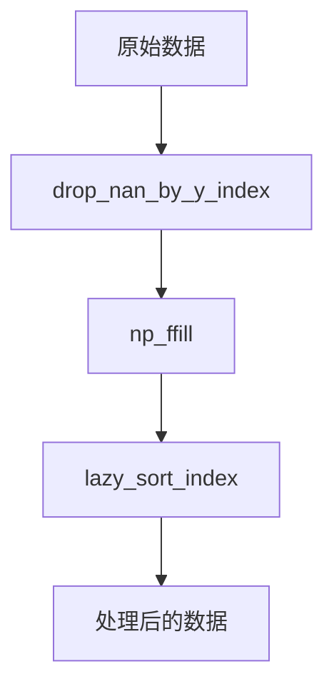
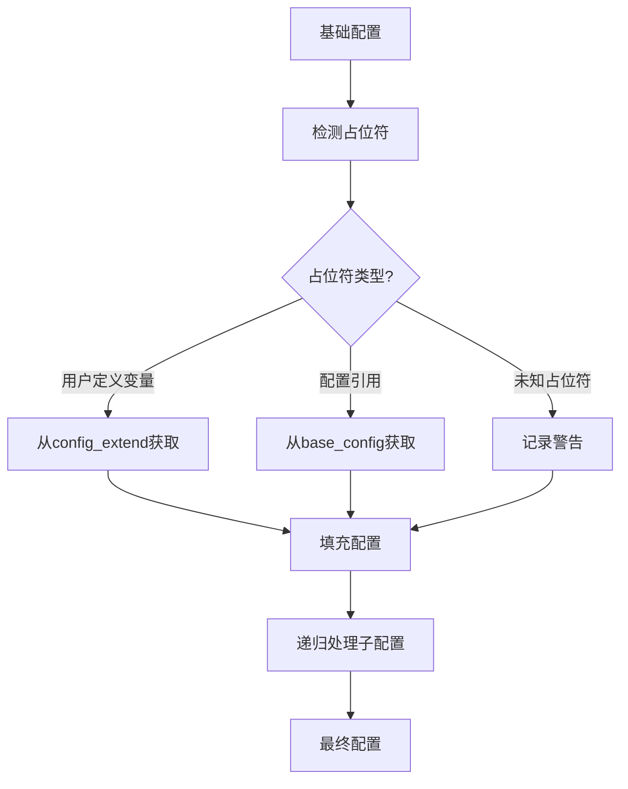

# utils/__init__.py 模块文档

## 文件概述
Qlib的工具函数模块，提供了大量通用工具函数，包括数据处理、文件操作、模块加载、时间处理、并行计算等功能。

## 工具函数分类

### 数据处理相关函数
1. `read_bin(file_path, start_index, end_index) -> pd.Series`
   - 从二进制文件读取数据
   - 支持范围读取，提高大数据的读取效率

2. `np_ffill(arr: np.array)`
   - 对1D numpy数组进行前向填充
   - 使用向量化操作提高性能

3. `drop_nan_by_y_index(x, y, weight=None)`
   - 根据y的非NaN行索引过滤数据
   - 返回过滤后的x, y, weight

4. `lazy_sort_index(df: pd.DataFrame, axis=0) -> pd.DataFrame`
   - 懒惰性排序DataFrame索引
   - 避免已排序数据的重复排序

### 时间处理相关函数
1. `is_tradable_date(cur_date) -> bool`
   - 判断给定日期是否为可交易日期

2. `get_date_by_shift(trading_date, shift, future=False, clip_shift=True, freq="day", align=None)`
   - 获取偏移指定天数的交易日
   - 支持向前（负shift）和向后（正shift）偏移

3. `get_next_trading_date(trading_date, future=False) -> pd.Timestamp`
   - 获取下一个交易日

4. `get_pre_trading_date(trading_date, future=False) -> pd.Timestamp`
   - 获取上一个交易日

5. `get_date_range(trading_date, left_shift=0, right_shift=0, future=False)`
   - 获取偏移范围内的交易日历

6. `transform_end_date(end_date=None, freq="day")`
   - 处理各种格式的结束日期
   - 如果end_date为None、-1或大于最大交易日，返回最后一个交易日

7. `split_pred(pred, number=None, split_date=None)`
   - 将预测数据文件分为两部分
   - 支持按天数或按日期分割

### 数据库相关函数
1. `get_period_list(first, last, quarterly) -> List[int]`
   - 生成给定范围内的期间列表
   - 支持年频和季度频

2. `get_period_offset(first_year, period, quarterly) -> int`
   - 计算期间在数据中的偏移量

3. `read_period_data(index_path, data_path, period, cur_date_int, quarterly, last_period_index=None)`
   - 从PIT数据库读取特定期间的数据
   - 只使用cur_date之前或当天的更新信息

### 搜索相关函数
1. `lower_bound(data, val, level=0)`
   - 多字段列表的下界查找

2. `upper_bound(data, val, level=0)`
   - 多字段列表的上界查找

### 配置处理相关函数
1. `parse_config(config)`
   - 解析配置文件或配置字符串
   - 支持YAML格式和字符串解析

2. `update_config(base_config: dict, ext_config: Union[dict, List[dict]]) -> dict`
   - 递归更新配置
   - 支持`S_DROP`标记删除配置项

3. `fill_placeholder(config: dict, config_extend: dict) -> dict`
   - 填充配置中的占位符
   - 支持从其他配置引用值和从自身配置提取值

4. `get_item_from_obj(config: dict, name_path: str) -> object`
   - 根据路径从嵌套配置中获取值
   - 例如：`"dataset.kwargs.segments.train.1"`

### 模块加载相关函数
1. `get_module_by_module_path(module_path) -> Module`
   - 根据模块路径加载模块
   - 支持字符串模块名、.py文件路径或已加载的模块对象

2. `split_module_path(module_path: str) -> Tuple[str, str]`
   - 分割模块路径为模块名和类名
   - 例如：`"a.b.c.ClassName"` → `("a.b.c", "ClassName")`

3. `get_callable_kwargs(config: InstConf, default_module=None) -> (type, dict)`
   - 从配置提取类/函数和参数
   - 支持多种配置格式

4. `init_instance_instance_by_config(config: InstConf, default_module=None, accept_types=(), try_kwargs={}, **kwargs) -> Any`
   - 根据配置初始化实例
   - 支持类路径、pickle文件、对象实例等多种方式

5. `find_all_classes(module_path, cls: type) -> List[type]`
   - 递归查找模块中所有继承自指定类的类
   - 包括子包中的类

### HTTP相关函数
1. `requests_with_retry(url, retry=5, **kwargs)`
   - 带重试的HTTP请求
   - 默认重试5次，超时1秒

### 字符串和字段处理函数
1. `parse_field(field)`
   - 解析特征字段表达式
   - 将`$close`转换为`Feature("close")`等

2. `remove_repeat_field(fields)`
   - 移除重复的字段

3. `remove_fields_space(fields: [list, str, tuple])`
   - 移除字段中的空格

4. `normalize_cache_fields(fields: [list, tuple])`
   - 规范化缓存字段（去空格、去重、排序）

5. `normalize_cache_instruments(instruments)`
   - 规范化缓存的标的代码

6. `code_to_fname(code: str)`
   - 股票代码转换为文件名
   - 处理Windows保留字问题

7. `fname_to_code(fname: str)`
   - 文件名转换为股票代码

### 辅助工具函数
1. `hash_args(*args)`
   - 对参数进行哈希计算
   - 用于缓存键的生成

2. `compare_dict_value(src_data: dict, dst_data: dict)`
   - 比较两个字典的差异

3. `flatten_dict(d, parent_key="", sep=".") -> dict`
   - 展平嵌套字典
   - 支持字符串分隔符或元组键

4. `time_to_slc_point(t: Union[None, str, pd.Timestamp]) -> Union[None, pd.Timestamp]`
   - 将各种时间格式转换为统一的pd.Timestamp格式

5. `exists_qlib_data(qlib_dir) -> bool`
   - 检查Qlib数据目录是否完整
   - 检查日历、标的、特征等必需文件

6. `check_qlib_data(qlib_config)`
   - 检查Qlib数据的格式是否正确
   - 验证标的文件列数是否为3

### 装饰器函数
1. `auto_filter_kwargs(func: Callable, warning=True) -> Callable`
   - 自动过滤函数不接受的参数
   - 当传入参数不被函数接受时发出警告

### 类相关
1. `Wrapper` 类
   - 用于需要在qlib.init期间设置的对象的包装类
   - 延迟加载，避免循环导入

2. `register_wrapper(wrapper, cls_or_obj, module_path=None)`
   - 将类或对象注册到包装器

### 数据加载函数
1. `load_dataset(path_or_obj, index_col=[0, 1])`
   - 从多种格式加载数据集
   - 支持h5、pkl、csv格式

### Redis相关函数
1. `get_redis_connection()`
   - 获取Redis连接实例
   - 使用配置中的host、port、db和password

2. `can_use_cache() -> bool`
   - 检查Redis连接是否可用

### 常量
- `S_DROP = "__DROP__"`: 配置更新中用于删除值的标记
- `is_deprecated_lexsorted_pandas`: Pandas版本兼容性标志
- `FLATTEN_TUPLE = "_FLATTEN_TUPLE"`: 展平字典时使用元组键的标记

## 数据处理流程图

## 配置填充流程

## 与其他模块的关系
- `qlib.config`: 配置管理
- `qlib.data`: 数据访问
- `qlib.log`: 日志记录
- `qlib.utils.file`: 文件操作
- `qlib.utils.mod`: 模块加载
- `qlib.utils.serial`: 序列化
- `qlib.utils.resam`: 重采样
- `qlib.utils.time`: 时间处理
