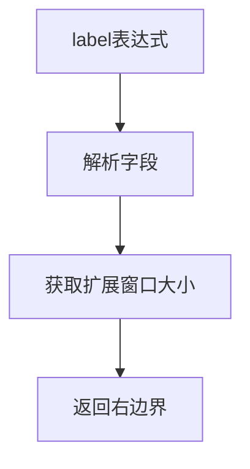
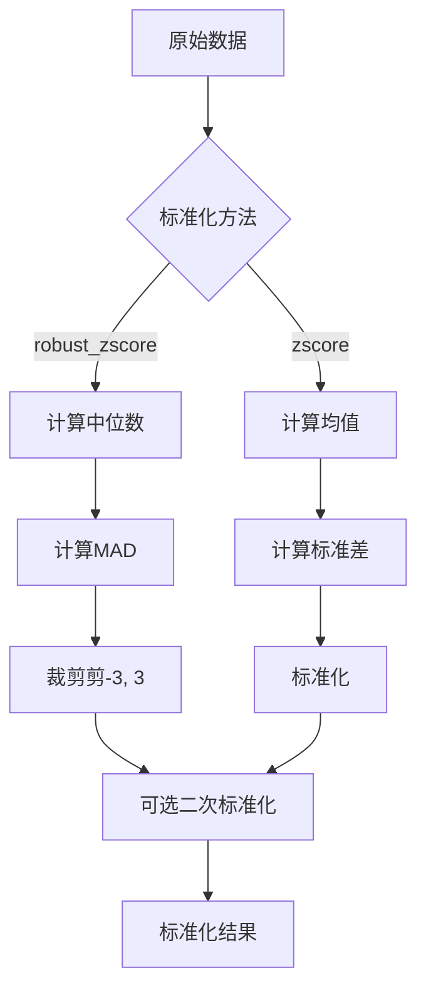

# utils/data.py 模块文档

## 文件概述
提供数据处理的工具函数，包括标准化、配置更新等操作。

## 函数

### robust_zscore(x: pd.Series, zscore=False)
**功能：** 鲁棒Z-Score标准化

**参数：**
- `x`: 输入数据（pd.Series）
- `zscore`: 是否进行标准Z-Score标准化（默认False）

**算法：**
1. 使用中位数替代均值：`x = x - x.median()`
2. 计算MAD（绝对中位数偏差）：`mad = x.abs().median()`
3. 标准化并裁剪：`x = np.clip(x / mad / 1.4826, -3, 3)`
4. 如果zscore=True，进行标准Z-Score标准化

**返回：** 标准化后的数据

**数学公式：**
```
标准差 = MAD × 1.4826
标准化值 = (x - 中位数) / 标准差
裁剪值 = clip(标准化值, -3, 3)
```

---

### zscore(x: Union[pd.Series, pd.DataFrame])
**功能：** 标准Z-Score标准化

**参数：**
- `x`: 输入数据（Series或DataFrame）

**算法：**
```
标准化值 = (x - x.mean()) / x.std()
```

**返回：** 标准化后的数据

---

### deepcopy_basic_type(obj: object) -> object
**功能：** 深度复制基础类型对象，不复制复杂对象

**参数：**
- `obj`: 要复制的对象

**说明：**
- 支持tuple、list、dict的递归复制
- 其他类型直接返回原对象
- **注意：不能处理递归对象**

**返回：** 复制后的对象

**使用场景：** 生成Qlib任务并共享handler时，避免复制复杂数据

---

### update_config(base_config: dict, ext_config: Union[dict, List[dict]]) -> dict
**功能：** 基于ext_config更新base_config

**参数：**
- `base_config`: 基础配置
- `ext_config`: 扩展配置（单个dict或list）

**规则：**
1. 如果ext_config的key不在base_config中：
   - 如果值不是`S_DROP`，则添加到base_config
2. 如果key在base_config中且两者都是dict：
   - 递归更新嵌套配置
3. 如果ext_config的值是`S_DROP`：
   - 从base_config中删除该key
4. 其他情况：
   - 直接替换base_config中的值

**返回：** 更新后的配置（不修改原base_config）

**示例：**
```python
bc = {"a": "xixi"}
ec = {"b": "haha"}
new_bc = update_config(bc, ec)  # {'a': 'xixi', 'b': 'haha'}
print(update_config(new_bc, {"b": S_DROP}))  # {'a': 'xixi'}
```

---

### guess_horizon(label: List)
**功能：** 通过解析label猜测预测horizon

**参数：**
- `label`: 标签表达式列表

**返回：** 预测的horizon值

**算法流程：**


## 常量
- `S_DROP = "__DROP__"`: 用于配置更新中删除值的特殊标记

## 数据标准化流程



## 与其他模块的关系
- `qlib.data.data.DatasetProvider`: 用于guess_horizon函数
