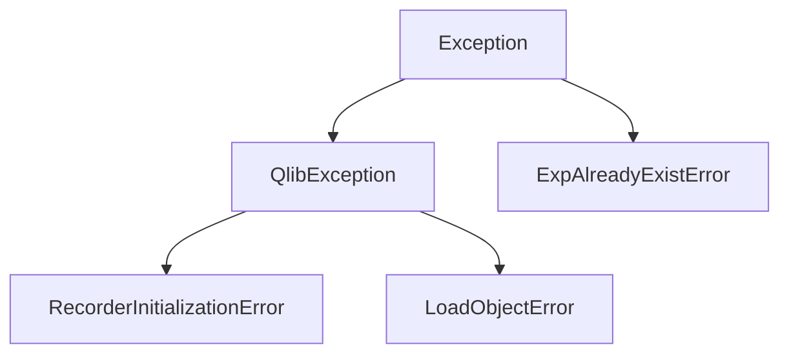

# utils/exceptions.py 模块文档

## 文件概述
定义Qlib的自定义异常类。

## 异常类

### QlibException
**功能：** Qlib的基础异常类

**继承关系：**
- 继承自 `Exception`

**说明：** 所有Qlib异常的基类，提供统一的异常处理接口

---

### RecorderInitializationError
**功能：** Recorder初始化错误

**继承关系：**
- 继承自 `QlibException`

**说明：** 当尝试重新初始化已存在的实验时抛出

---

### LoadObjectError
**功能：** 加载对象错误

**继承关系：**
- 继承自 `QlibException`

**说明：** 当Recorder无法加载对象时抛出

---

### ExpAlreadyExistError
**功能：** 实验已存在错误

**继承关系：**
- 继承自 `Exception`（直接继承）

**说明：** 当尝试创建已存在的实验时抛出

## 异常继承关系图

## 异常使用场景

1. **RecorderInitializationError**
   - 场景：在实验运行期间调用`qlib.init()`导致recorder丢失
   - 解决：使用`skip_if_reg=True`参数

2. **LoadObjectError**
   - 场景：从Recorder加载模型或数据失败
   - 解决：检查文件是否存在、权限是否正确

3. **ExpAlreadyExistError**
   - 场景：创建同名的实验
   - 解决：检查实验名称或删除旧实验

## 与其他模块的关系
- `qlib.workflow.expm`: 使用这些异常
- `qlib.contrib.model`: 模型加载时使用异常
