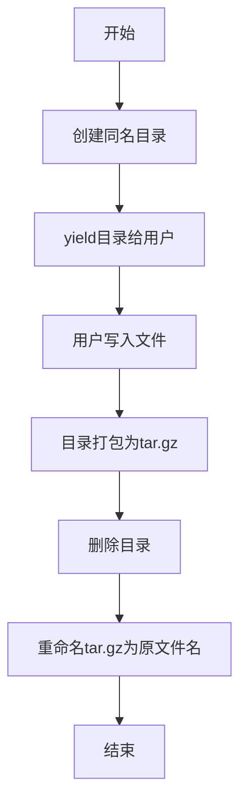

# utils/file.py 模块文档

## 文件概述
提供文件和目录操作的实用函数，包括路径创建、多部分文件保存、归档处理等。

## 函数

### get_or_create_path(path: Optional[str] = None, return_dir: bool = False) -> str
**功能：** 获取或创建文件/目录路径

**参数：**
- `path`: 路径字符串或None（None时创建临时路径）
- `return_dir`: True表示创建目录，False表示创建文件

**逻辑：**
1. 如果path为None：
   - 在`~/tmp`目录创建临时路径
2. 如果return_dir=True：
   - 创建目录（如果不存在）
3. 如果return_dir=False：
   - 创建文件的父目录

**返回：** 最终的路径

---

### save_multiple_parts_file(filename, format="gztar")
**功能：** 保存多部分文件为归档（上下文管理器）

**参数：**
- `filename`: 最终归档文件的路径
- `format`: 归档格式（"zip", "tar", "gztar", "bztar", "xztar"）

**实现流程：**
```
1. 创建临时目录（与filename同名）
2. 用户在临时目录中创建文件
3. 将临时目录打包为归档文件
4. 删除临时目录
5. 将归档文件重命名为filename
```

**使用示例：**
```python
with save_multiple_parts_file('~/tmp/test_file') as filename_dir:
    for i in range(10):
        temp_path = os.path.join(filename_dir, f'test_doc_{i}')
        with open(temp_path, 'w') as fp:
            fp.write(str(i))
```

**流程图：**


---

### unpack_archive_with_buffer(buffer, format="gztar")
**功能：** 从字节缓冲区解压归档（上下文管理器）

**参数：**
- `buffer`: 归档文件的字节数据
- `format`: 归档格式

**实现流程：**
```
1. 在~/tmp目录创建临时文件
2. 将buffer写入临时文件
3. 将临时文件重命名为tar.gz
4. 创建临时目录
5. 解压tar.gz到临时目录
6. yield临时目录路径给用户
7. 清理：删除tar.gz文件和临时目录
```

**使用示例：**
```python
with open('test_unpack.tar.gz', 'rb') as fp:
    buffer = fp.read()
with unpack_archive_with_buffer(buffer) as temp_dir:
    for f_n in os.listdir(temp_dir):
        print(f_n)
```

---

### get_tmp_file_with_buffer(buffer)
**功能：** 从字节缓冲区创建临时文件（上下文管理器）

**参数：**
- `buffer`: 文件内容的字节数据

**说明：** 在上下文退出时自动删除临时文件

**返回：** 临时文件路径

---

### get_io_object(file: Union[IO, str, Path], *args, **kwargs) -> IO
**功能：** 提供获取IO对象的统一接口（上下文管理器）

**参数：**
- `file`: 文件对象、字符串路径或Path对象
- `*args`, `**kwargs`: 传递给文件打开的参数

**逻辑：**
- 如果是IO对象，直接使用
-   如果是字符串，转换为Path
- 使用Path.open打开文件

**返回：** IO对象

## 使用场景

1. **save_multiple_parts_file**
   - 保存模型为多个部分，然后打包为单个文件
   - 避免大文件一次性写入

2. **unpack_archive_with_buffer**
   - 从网络下载归档后解压
   - 避免磁盘上保存临时归档文件

3. **get_tmp_file_with_buffer**
   - 处理内存字节数据需要文件接口的情况

4. **get_io_object**
   - 统一处理文件路径和文件对象
   - 提高代码灵活性

## 与其他模块的关系
- `qlib.log`: 日志记录
