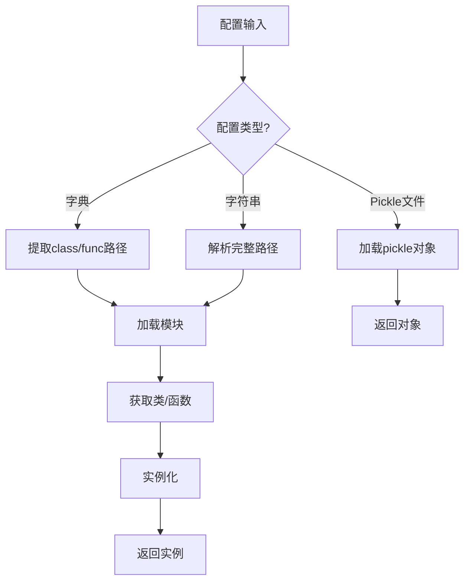

# utils/mod.py 模块文档

## 文件概述
提供模块和类的动态加载功能，包括模块导入、类实例化、模块遍历等操作。

## 函数

### get_module_by_module_path(module_path: Union[str, ModuleType]) -> Module
**功能：** 根据模块路径加载模块

**参数：**
- `module_path`: 模块路径或ModuleType对象

**支持的输入格式：**
1. Python模块名：`"a.b.c"`
2. .py文件路径：`"/path/to/module.py"`
3. 已加载的ModuleType对象

**处理逻辑：**
1. 如果是None，抛出ModuleNotFoundError
2. 如果是ModuleType，直接返回
3. 如果是.py文件：
   - 从文件路径加载模块
   - 使用`importlib.util.spec_from_file_location`
4. 其他情况：
   - 使用`importlib.import_module`

**返回：** 加载的模块对象

**示例：**
```python
# 模块名
mod = get_module_by_module_path("qlib.data.dataset")

# .py文件
mod = get_module_by_module_path("/path/to/my_module.py")

# ModuleType对象
import numpy as np
mod = get_module_by_module_path(np)
```

---

### split_module_path(module_path: str) -> Tuple[str, str]
**功能：** 分割模块路径为模块名和类名

**参数：**
- `module_path`: 格式如`"a.b.c.ClassName"`

**返回：** 元组`(module_name, class_name)`

**示例：**
```python
split_module_path("a.b.c.ClassName")  # ("a.b.c", "ClassName")
split_module_path("ClassName")  # ("", "ClassName")
```

---

### get_callable_kwargs(config: InstConf, default_module=None) -> (type, dict)
**功能：** 从配置提取类/函数及其参数

**参数：**
- `config`: 配置信息（dict或str）
- `default_module`: 默认模块（当config未指定module_path时使用）

**支持的配置格式：**
1. 完整路径字符串：`"a.b.c.ClassName"`
2. 分离配置：`{"class": "ClassName", "module_path": "a.b.c"}`
3. 类对象：`{"class": ClassName}`
4. 纯字符串：`ClassName`（需配合default_module）

**处理逻辑：**
```
1. 识别配置中的"class"或"func"键
2. 如果是字符串：
   a. 分割模块路径和类名
   b. 如果模块路径为空，使用default_module
   c. 加载模块并获取类/函数
3. 如果是对象，直接使用
4. 提取kwargs参数（默认为空dict）
```

**返回：** (类/函数对象, 参数字典)

**示例：**
```python
# 方式1：完整路径
cls, kwargs = get_callable_kwargs("qlib.contrib.model.gbdt.LGBModel")

# 方式2：分离配置
config = {
    "class": "LGBModel",
    "module_path": "qlib.contrib.model.gbdt",
    "kwargs": {"loss": "mse"}
}
cls, kwargs = get_callable_kwargs(config)

# 方式3：使用default_module
from qlib.contrib import model
cls, kwargs = get_callable_kwargs("LGBModel", default_module=model.gbdt)
```

---

### get_cls_kwargs(config, default_module=None) -> (type, dict)
**功能：** `get_callable_kwargs`的别名（向后兼容）

**说明：** 仅为兼容性保留，功能与`get_callable_kwargs`相同

---

### init_instance_by_config(config: InstConf, default_module=None, accept_types=(), try_kwargs={}, **kwargs) -> Any
**功能：** 根据配置初始化对象实例

**参数：**
- `config`: 配置信息（dict、str、object、Path）
- `default_module`: 默认模块
- `accept_types`: 如果config是指定类型，直接返回
- `try_kwargs`: 尝试传入的kwargs（失败时回退）
- `**kwargs`: 额外kwargs

**支持的配置格式：**
1. 字典配置（通过get_callable_kwargs解析）
2. 字符串类路径：`"a.b.c.ClassName"`
3. Pickle文件路径：`"file:///path/to/obj.pkl"`
4. Path对象：指向pickle文件
5. accept_types中的对象实例

**处理流程：**
```
1. 检查是否为accept_types中的类型，是则直接返回
2. 如果是字符串或Path且为pickle文件：
   a. 解析file://协议
   b. 使用restricted_pickle_load安全加载
3. 使用get_callable_kwargs获取类和kwargs
4. 尝试用try_kwargs初始化
   a. 失败则用kwargs初始化
   b. 处理重复参数错误
```

**返回：** 初始化的对象实例

**示例：**
```python
# 字典配置
config = {
    "class": "LGBModel",
    "module_path": "qlib.contrib.model.gbdt",
    "kwargs": {"loss": "mse"}
}
model = init_instance_by_config(config)

# pickle文件
model = init_instance_by_config("file:///path/to/model.pkl")

# 直接对象
model = init_instance_by_config(some_model, accept_types=ModelBase)
```

---

### class_casting(obj: object, cls: type)
**功能：** Python的类型转换上下文管理器（上下文管理器）

**参数：**
- `obj`: 要转换的对象
- `cls`: 目标类类型

**说明：** Python不提供向下类型转换机制，此函数使用trick实现

**使用方式：**
```python
with class_casting(obj, TargetClass):
    # 在此块中，obj的类型临时变为TargetClass
    obj.some_method()
# 离开块后，恢复原类型
```

**实现原理：**
1. 保存对象的原始类
2. 修改`obj.__class__`为目标类
3. yield
4. 恢复`obj.__class__`为原始类

---

### find_all_classes(module_path: Union[str, ModuleType], cls: type) -> List[type]
**功能：** 递归查找模块中所有继承自指定类的类

**参数：**
- `module_path`: 模块路径或ModuleType对象
- `cls`: 基类

**查找逻辑：**
1. 加载模块
2. 检查模块所有属性
3. 收集所有是cls子类的类（包括cls本身）
4. 如果模块是包（有`__path__`）：
   - 递归搜索所有子模块

**返回：** 类列表

**示例：**
```python
from qlib.data.dataset.handler import DataHandler
classes = find_all_classes("qlib.contrib.data.handler", DataHandler)
# 返回：[Alpha158, Alpha158vwap, Alpha360, Alpha360vwap, DataHandlerLP]
```

## 模块加载流程



## 安全注意事项
- 使用`restricted_pickle_load`加载pickle文件
- 防止任意代码执行
- 模块加载使用标准的importlib接口

## 与其他模块的关系
- `qlib.typehint`: 类型定义
- `qlib.utils.pickle_utils`: pickle安全加载
