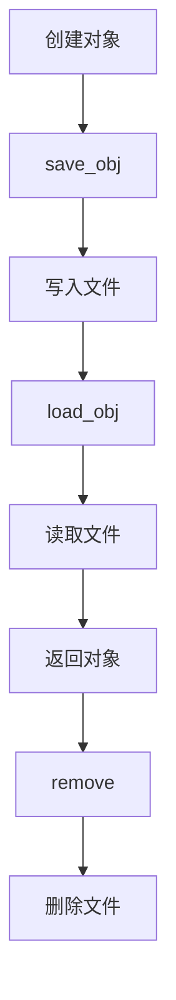

# utils/objm.py 模块文档

## 文件概述
提供对象管理功能，支持将对象持久化到文件系统或其他存储后端。

## 核心类

### ObjManager 类
**功能：** 对象管理器的基类（抽象类）

**主要方法：**

1. `save_obj(obj: object, name: str)`
   - 保存对象
   - 参数：
     - `obj`: 要保存的对象
     - `name`: 对象名称
   - 说明：抽象方法，子类必须实现

2. `save_objs(obj_name_l)`
   - 批量保存对象
   - 参数：
     - `obj_name_l`: `(对象, 名称)`的列表
   - 说明：抽象方法，子类必须实现

3. `load_obj(name: str) -> object`
   - 加载对象
   - 参数：
     - `name`: 对象名称
   - 返回：加载的对象
   - 说明：抽象方法，子类必须实现

4. `exists(name: str) -> bool`
   - 检查对象是否存在
   - 参数：
     - `name`: 对象名称
   - 返回：是否存在
   - 说明：抽象方法，子类必须实现

5. `list() -> list`
   - 列出所有对象
   - 返回：对象列表
   - 说明：抽象方法，子类必须实现

6. `remove(fname=None)`
   - 删除对象
   - 参数：
     - `fname`: 文件名（可选），None表示删除所有对象
   - 说明：抽象方法，子类必须实现

---

### FileManager 类
**功能：** 基于文件系统的对象管理器

**继承关系：**
- 继承自 `ObjManager`

**主要属性：**
- `path`: 存储路径（Path对象）

**主要方法：**

1. `__init__(path=None)`
   - 初始化文件管理器
   - 参数：
     - `path`: 存储路径（可选），None时自动创建临时路径
   - 说明：
     - 如果path为None，使用tempfile创建临时目录
     - 路径使用Qlib配置的`file_manager_path`作为前缀

2. `create_path() -> str`
   - 创建默认路径
   - 返回：路径字符串
   - 说明：使用`tempfile.mkdtemp`创建带有指定前缀的临时目录

3. `save_obj(obj, name)`
   - 保存对象到文件
   - 实现：
     ```python
     with (self.path / name).open("wb") as f:
         pickle.dump(obj, f, protocol=C.dump_protocol_version)
     ```

4. `save_objs(obj_name_l)`
   - 批量保存对象
   - 实现：遍历列表调用`save_obj`

5. `load_obj(name) -> object`
   - 从文件加载对象
   - 实现：
     ```python
     with (self.path / name).open("rb") as f:
         return restricted_pickle_load(f)
     ```
   - 说明：使用安全的pickle加载

6. `exists(name) -> bool`
   - 检查文件是否存在
   - 实现：`(self.path / name).exists()`

7. `list() -> list`
   - 列出所有文件
   - 实现：`list(self.path.iterdir())`

8. `remove(fname=None)`
   - 删除文件或整个目录
   - 参数：
     - `fname`: 文件名，None表示删除所有
   - 实现：
     - 如果fname为None：删除所有文件和目录
     - 否则：删除指定文件

## 使用示例

```python
# 创建文件管理器
fm = FileManager(path="~/.qlib/models")

# 保存对象
model = train_model()
fm.save_obj(model, "my_model.pkl")

# 批量保存
fm.save_objs([
    (model1, "model1.pkl"),
    (model2, "model2.pkl")
])

# 加载对象
loaded_model = fm.load_obj("my_model.pkl")

# 检查对象是否存在
if fm.exists("my_model.pkl"):
    print("模型已存在")

# 列出所有对象
for obj in fm.list():
    print(obj)

# 删除对象
fm.remove("my_model.pkl")

# 删除所有
fm.remove()
```

## 对象生命周期



## 安全特性
- 使用`restricted_pickle_load`安全加载对象
- 防止任意代码执行
- 使用配置的pickle协议版本

## 与其他模块的关系
- `qlib.config`: 获取配置（dump_protocol_version, file_manager_path）
- `qlib.utils.pickle_utils`: 安全的pickle加载
