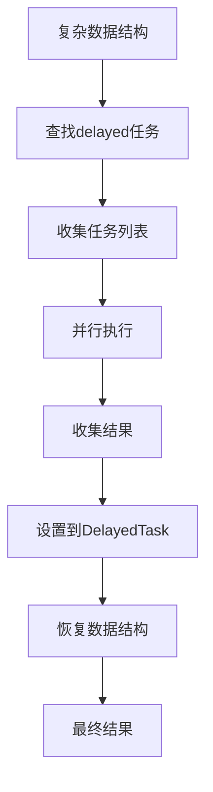

# utils/paral.py 模块文档

## 文件概述
提供并行计算功能，包括并行任务执行、异步调用、复杂数据结构的并行处理等。

## 类与函数

### ParallelExt 类
**功能：** 扩展的joblib.Parallel类

**继承关系：**
- 继承自 `joblib.Parallel`

**主要方法：**

1. `__init__(*args, **kwargs)`
   - 初始化并行执行器
   - 参数：
     - `maxtasksperchild`: 每个子进程的最大任务数（可选）
   - 说明：
     - 支持joblib 1.5.0前后的不同API
     - joblib 1.5.0+使用`_backend_kwargs`
     - joblib 1.5.0-使用`_backend_args`

---

### datetime_groupby_apply 函数
**签名：**
```python
datetime_groupby_apply(df, apply_func, axis=0, level="datetime", resample_rule="ME", n_jobs=-1)
```

**功能：** 对日期时间级别索引应用分组聚合

**参数：**
- `df`: 要处理的DataFrame
- `apply_func`: 应用函数或pandas方法名
- `axis`: 日期时间所在的轴（默认0）
- `level`: 日期时间级别的名称（默认"datetime"）
- `resample_rule`: 重采样规则（默认"ME"，按月）
- `n_jobs`: 并行任务数（默认-1，使用所有CPU）

**处理流程：**
1. 如果n_jobs=1：使用单线程执行
2. 否则：
   - 按resample_rule重采样数据
   - 使用ParallelExt并行执行分组聚合
   - 合并结果并排序索引

**返回：** pd.DataFrame

**示例：**
```python
# 按月聚合（并行）
result = datetime_groupby_apply(df, "mean", resample_rule="ME", n_jobs=4)

# 使用字符串方法
result = datetime_groupby_apply(df, "sum", resample_rule="D", n_jobs=2)
```

---

### AsyncCaller 类
**功能：** 简化异步调用的执行器

**使用场景：**
- 使日志记录等函数异步执行
- 用于MLflowRecorder的log_params等函数

**主要属性：**
- `_q`: 任务队列
- `_stop`: 停止标志
- `_t`: 工作线程

**主要方法：**

1. `__init__()`
   - 初始化异步调用器
   - 自动启动工作线程

2. `close()`
   - 发送停止信号到队列

3. `run()`
   - 工作线程的主循环
   - 持续从队列获取任务并执行
   - 主动检查主线程状态避免死锁

4. `__call__(func, *args, **kwargs)`
   - 异步调用函数
   - 使用`functools.partial`创建部分函数
   - 放入队列等待执行

5. `wait(close=True)`
   - 等待所有任务完成
   - 参数：
     - `close`: 是否在等待前关闭（默认True）

6. `async_dec(ac_attr)` (静态方法)
   - 装饰器工厂函数
   - 用于将方法转换为异步执行
   - 参数：
     - `ac_attr`: 异步调用器属性名
   - 说明：如果对象有异步调用器，使用它执行

**常量：**
- `STOP_MARK = "__STOP"`: 停止标记

---

### DelayedTask 类
**功能：** 延迟任务的基类（抽象类）

**主要方法：**

1. `get_delayed_tuple()` (抽象方法)
   - 获取joblib.delayed创建的元组
   - 必须由子类实现

2. `set_res(res)`
   - 设置任务执行结果

3. `get_replacement()` (抽象方法)
   - 获取用于替换延迟任务的对象
   - 必须由子类实现

---

### DelayedTuple 类
**功能：** 包装joblib.delayed元组

**继承关系：**
- 继承自 `DelayedTask`

**主要属性：**
- `delayed_tpl`: joblib.delayed创建的元组
- `res`: 执行结果

**主要方法：**
- `get_delayed_tuple()`: 返回delayed_tpl
- `get_replacement()`: 返回res

---

### DelayedDict 类
**功能：** 用于构造字典的延迟任务

**继承关系：**
- 继承自 `DelayedTask`

**设计目的：**
- 立即获取字典键
- 所有值的计算耗时且在单个函数中完成

**主要属性：**
- `key_l`: 键列表
- `delayed_tpl`: joblib.delayed元组
- `res`: 执行结果（自动设置）

**主要方法：**
- `get_delayed_tuple()`: 返回delayed_tpl
- `get_replacement()`: 返回`dict(zip(key_l, res))`

---

### is_delayed_tuple 函数
**签名：** `is_delayed_tuple(obj) -> bool`

**功能：** 检查对象是否为joblib.delayed元组

**判断条件：**
- 是tuple类型
- 长度为3
- 第一个元素是callable

---

### _replace_and_get_dt 函数
**签名：** `_replace_and_get_dt(complex_iter)`

**功能：** 在复杂数据结构中查找并替换delayed任务

**参数：**
- `complex_iter`: 复杂数据结构（list、tuple、dict）

**处理逻辑：**
```
1. 如果是DelayedTask，添加到结果列表
2. 如果是delayed_tuple，包装为DelayedTuple并添加
3. 如果是list/tuple，递归处理每个元素
4. 如果是dict，递归处理每个值
5. 其他情况，直接返回
```

**返回：** (处理后的数据结构, delayed任务列表)

**警告：** 可能因循环引用导致无限循环

---

### _recover_dt 函数
**签名：** `_recover_dt(complex_iter)`

**功能：** 将DelayedTask替换为其执行结果

**参数：**
- `complex_iter`: 复杂数据结构

**处理逻辑：**
```
1. 如果是DelayedTask，返回get_replacement()
2. 如果是list/tuple，递归处理
3. 如果是dict，递归处理每个值
4. 其他情况，直接返回
```

**返回：** 恢复后的数据结构

**警告：** 可能因循环引用导致无限循环

---

### complex_parallel 函数
**签名：** `complex_parallel(paral: Parallel, complex_iter)`

**功能：** 并行执行复杂数据结构中的所有delayed任务

**参数：**
- `paral`: joblib.Parallel实例
- `complex_iter`: 复杂数据结构（只探索list、tuple、dict）

**执行流程：**
```
1. 使用_replace_and_get_dt查找所有delayed任务
2. 并行执行所有delayed任务
3. 将执行结果设置到各个DelayedTask
4. 使用_recover_dt恢复数据结构
5. 返回恢复后的数据结构
```

**返回：** 所有delayed任务被替换为执行结果的复杂数据结构

**示例：**
```python
from joblib import Parallel, delayed

# 构造复杂数据结构
complex_iter = {
    "a": delayed(sum)([1, 2, 3]),
    "b": [1, 2, delayed(sum)([10, 1])]
}

# 并行执行
result = complex_parallel(Parallel(), complex_iter)
# 结果: {'a': 6, 'b': [1, 2, 11]}
```

---

### call_in_subproc 类
**功能：** 在子进程中调用函数（类装饰器）

**设计目的：**
- 避免重复运行函数时的内存泄漏
- 在子进程中运行确保内存独立

**主要属性：**
- `func`: 要包装的函数
- `qlib_config`: Qlib配置（可选）

**主要方法：**

1. `__init__(func: Callable, qlib_config: QlibConfig = None)`
   - 初始化包装器

2. `_func_mod(*args, **kwargs)`
   - 修改初始函数，添加Qlib初始化
   - 如果qlib_config不为None，初始化Qlib

3. `__call__(*args, **kwargs)`
   - 在子进程中执行函数
   - 使用`concurrent.futures.ProcessPoolExecutor`
   - 最多1个工作进程

**示例：**
```python
# 创建子进程执行器
executor = call_in_subproc(my_function, qlib_config=some_config)

# 调用（在子进程中执行）
result = executor(arg1, arg2, kwarg1=value1)
```

## 并行处理流程



## 异步调用流程


## 与其他模块的关系
- `joblib`: 并行执行后端
- `qlib.config`: Qlib配置
- `concurrent.futures`: 进程池执行
