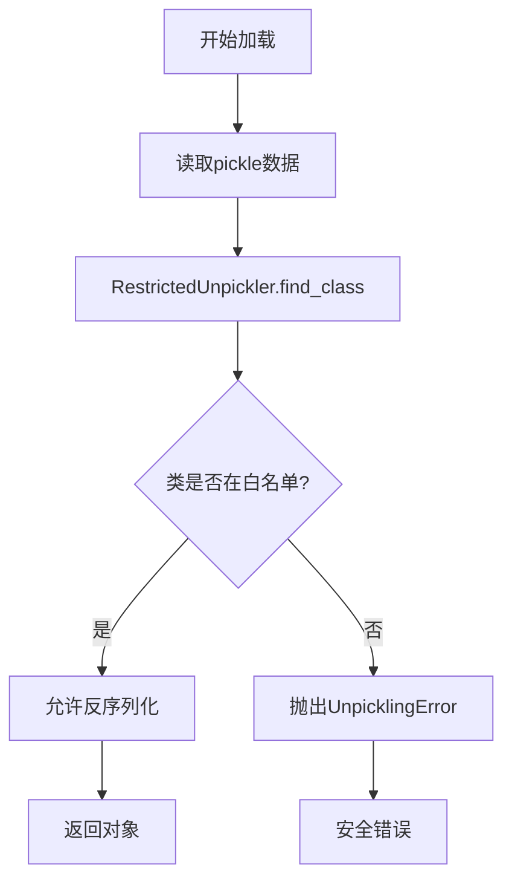

# utils/pickle_utils.py 模块文档

## 文件概述
提供安全的pickle序列化工具，防止通过反序列化执行任意代码。这是Qlib的安全增强功能。

## 安全背景
**为什么需要安全的pickle？**
- 标准的`pickle.load()`可以反序列化任意对象
- 恶意构造的pickle文件可以执行任意代码
- 安全攻击可以通过pickle注入恶意代码
- Qlib使用这些工具来限制反序列化的类

## 安全类

### RestrictedUnpickler 类
**功能：** 自定义的Unpickler，只允许白名单中的类被反序列化

**继承关系：**
- 继承自 `pickle.Unpickler`

**主要方法：**

1. `find_class(self, module: str, name: str)`
   - 重写find_class方法以限制允许的类
   - 参数：
     - `module`: 模块名
     - `name`: 类名
   - 检查逻辑：
     1. 检查模块是否以信任前缀开头（pandas、numpy）
     2. 检查是否在显式白名单中
     3. 以上都不满足则抛出`pickle.UnpicklingError`
   - 返回：类对象（如果安全）

**安全机制：**
1. **信任前缀：** 任何以"pandas"或"numpy"开头的模块
2. **显式白名单：** Qlib内部使用的安全类
3. **拒绝其他：** 任何不在白名单中的类被拒绝

## 安全白名单

### SAFE_PICKLE_CLASSES
**类型：** `Set[Tuple[str, str]]`

**包含的类：**

**Python内置类型：**
- `builtins.slice`
- `builtins.range`
- `builtins.dict`
- `builtins.list`
- `builtins.tuple`
- `builtins.set`
- `builtins.frozenset`
- `builtins.bytearray`
- `builtins.bytes`
- `builtins.str`
- `builtins.int`
- `builtins.float`
- `builtins.bool`
- `builtins.complex`
- `builtins.type`
- `builtins.property`

**常用工具类：**
- `datetime.datetime`
- `datetime.date`
- `datetime.time`
- `datetime.timedelta`
- `datetime.timezone`
- `decimal.Decimal`
- `collections.OrderedDict`
- `collections.defaultdict`
- `collections.Counter`
- `collections.namedtuple`
- `enum.Enum`
- `pathlib.Path`
- `pathlib.PosixPath`
- `pathlib.WindowsPath`

**Qlib内部类：**
- `qlib.data.dataset.handler.DataHandler`
- `qlib.data.dataset.handler.DataHandlerLP`
- `qlib.data.dataset.loader.StaticDataLoader`

### TRUSTED_MODULE_PREFIXES
**类型：** `tuple`

**信任的模块前缀：**
- `"pandas"`
`- "numpy"`

## 安全函数

### restricted_pickle_load 函数
**签名：** `restricted_pickle_load(file: BinaryIO) -> Any`

**功能：** 安全地从文件加载pickle数据

**参数：**
- `file`: 以二进制模式打开的文件对象

**返回：** 反序列化的Python对象

**异常：**
- `pickle.UnpicklingError`: 如果pickle包含被禁止的类

**安全保证：**
- 只允许白名单中的类被反序列化
- 防止任意代码执行

**示例：**
```python
with open("data.pkl", "rb") as f:
    data = restricted_pickle_load(f)
```

---

### restricted_pickle_loads 函数
**签名：** `restricted_pickle_loads(data: bytes) -> Any`

**功能：** 安全地从字节加载pickle数据

**参数：**
- `data`: 包含pickle数据的字节对象

**返回：** 反序列化的Python对象

**异常：**
- `pickle.UnpicklingError`: 如果pickle包含被禁止的类

**示例：**
```python
data = b'\\x80\\x04\\x95...'
obj = restricted_pickle_loads(data)
```

---

### add_safe_class 函数
**签名：** `add_safe_class(module: str, name: str) -> None`

**功能：** 向白名单添加安全类

**参数：**
- `module`: 模块名（如`'my_package.my_module'）
- `name`: 类名（如`'MyClass'`）

**警告：**
- ⚠️ 只添加你完全控制且信任的类
- ⚠️ 添加外部包的类可能引入安全风险
- ⚠️ 谨慎使用此函数

**示例：**
```python
add_safe_class('my_package.models', 'CustomModel')
```

---

### get_safe_classes 函数
**签名：** `get_safe_classes() -> Set[Tuple[str, str]]`

**功能：** 获取当前安全白名单的副本

**返回：** 白名单集合的副本

## 安全比较

| 特性 | 标准pickle | RestrictedUnpickler |
|------|-----------|---------------------|
| 任意代码执行 | ❌ 可能 | ✅ 不可能 |
| 类白名单 | ❌ 无 | ✅ 严格 |
| 安全性 | ❌ 低 | ✅ 高 |
| 兼容性 | ✅ 高 | ⚠️ 受限 |

## 使用场景

### 推荐用法
```python
# 加载模型（安全）
with open("model.pkl", "rb") as f:
    model = restricted_pickle_load(f)

# 加载配置（安全）
import io
data_bytes = io.BytesIO(config_data)
config = restricted_pickle_loads(data_bytes.read())
```

### 不推荐用法
```python
# ❌ 不安全 - 可能执行任意代码
import pickle
with open("data.pkl", "rb") as f:
    data = pickle.load(f)

# ❌ 不安全 - 同上
data = pickle.loads(data_bytes)
```

## 安全最佳实践

1. **始终使用`restricted_pickle_load`** 而不是`pickle.load`
2. **谨慎使用`add_safe_class`** 只添加信任的类
3. **验证数据来源** 确保pickle文件来自可信来源
4. **定期审查白名单** 移除不再需要的类
5. **考虑替代方案** 如JSON、msgpack等更安全的格式

## 安全流程



## 与其他模块的关系
- `pickle`: Python pickle模块
- `dill`: 可选的pickle后端（更强大但风险更大）
- `qlib.config`: 配置管理
- `qlib.utils.objm`: 对象管理
