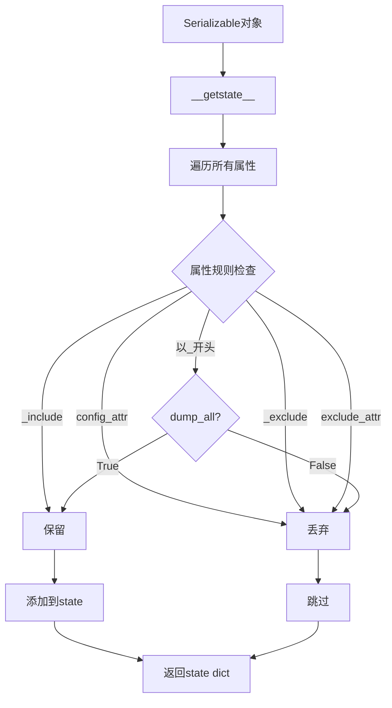

# utils/serial.py 模块文档

## 文件概述
提供可序列化对象的基类，支持自定义序列化行为，控制哪些属性在序列化时被保存。

## 核心类

### Serializable 类
**功能：** 改变pickle行为的基类

**设计目的：**
- 区分用户不想保存的属性
- 例如：可学习的DataHandler只想保存参数而不保存数据

**属性保存规则（优先级从高到低）：**
1. 在`config_attr`列表中 → 始终丢弃
2. 在`_include`列表中 → 始终保留
3. 在`_exclude`列表中 → 始终丢弃
4. 在`exclude_attr`列表中 → 始终丢弃
5. 名称不以`_`开头 → 保留
6. 名称以`_`开头 → 如果`dump_all`为True则保留，否则丢弃

**主要属性：**

1. `pickle_backend = "pickle"`: pickle后端类型
   - 可选值: "pickle" 或 "dill"
   - "dill"可以pickle更多的Python对象

2. `default_dump_all = False`: 默认是否dump所有内容

3. `config_attr = ["_include", "_exclude"]`: 配置属性列表

4. `exclude_attr = []`: exclude_attr优先级低于`_exclude`

5. `include_attr = []`: include_attr优先级低于`_include`

6. `FLAG_KEY = "_qlib_serial_flag"`: 序列化标志键

**主要方法：**

1. `__init__()`
   - 初始化可序列化对象
   - 设置`_dump_all`为`default_dump_all`
   - 初始化`_exclude`为None

2. `_is_kept(key) -> bool`
   - 判断属性是否应该被保留
   - 参数：`key` - 属性名
   - 返回：是否保留（根据优先级规则）

3. `__getstate__() -> dict`
   - 序列化状态（重写pickle方法）
   - 返回：满足`_is_kept`规则的属性字典

4. `__setstate__(state: dict)`
   - 反序列化状态（重写pickle方法）
   - 更新对象的`__dict__`

5. `config(recursive=False, **kwargs)`
   - 配置序列化对象
   - 参数：
     - `recursive`: 是否递归配置
     - `kwargs`:
       - `dump_all`: 是否dump所有对象
       - `exclude`: 要排除的属性列表
       - `include`: 要包含的属性列表
   - 说明：
     - 递归时会遍历所有属性
     - 使用FLAG_KEY防止循环

6. `to_pickle(path: Union[Path, str], **kwargs)`
   - 将自身序列化到pickle文件
   - 参数：
     - `path`: 保存路径
     - `kwargs`: 传递给`config`的参数
   - 实现：
     ```python
     self.config(**kwargs)
     with Path(path).open("wb") as f:
         self.get_backend().dump(self, f, protocol=C.dump_protocol_version)
     ```

7. `load(cls, filepath)` (类方法)
   - 从文件加载序列化类
   - 参数：`filepath` - 文件路径
   - 返回：类型为cls的实例
   - 异常：如果不是指定类型，抛出TypeError

8. `get_backend(cls)` (类方法)
   - 获取实际的pickle后端模块
   - 返回：pickle或dill模块（基于pickle_backend）

9. `general_dump(obj, path: Union[Path, str])` (静态方法)
   - 通用的dump方法
   - 参数：
     - `obj`: 要dump的对象
     - `path`: 目标路径
   - 实现：
     - 如果是Serializable，调用to_pickle
     - 否则使用标准pickle.dump

**属性访问：**
- `dump_all`: 是否dump所有对象（读取`_dump_all`）

## 使用示例

### 基本使用
```python
class MyModel(Serializable):
    def __init__(self):
        super().__init__()
        self.data = [...]  # 大数据，不想保存
        self.params = {...}  # 参数，想保存

    def train(self):
        self.data = load_large_data()
        # 训练逻辑...
        self.params = train_result

# 保存时只保存params
model = MyModel()
model.train()
model.to_pickle("model.pkl")  # 只保存params

# 加载
loaded_model = MyModel.load("model.pkl")
```

### 使用include/exclude
```python
class MyModel(Serializable):
    def __init__(self):
        super().__init__()
        self._large_data = [...]  # 默认不保存
        self.params = {}
        self._temp = []  # 不保存

# 保存指定属性
model.to_pickle("model.pkl", include=["params"])

# 排除指定属性
model.to_pickle("model.pkl", exclude=["_large_data"])
```

### 使用dump_all
```python
# 保存所有内容
model.to_pickle("model.pkl", dump_all=True)

# 全局配置
class MyModel(Serializable):
    default_dump_all = True  # 默认保存所有
```

### 递归配置
```python
class Container(Serializable):
    def __init__(self):
        super().__init__()
        self.model = MyModel()

# 递归配置所有对象
container.to_pickle("container.pkl", recursive=True, exclude=["data"])
```

### 使用dill后端
```python
class MyModel(Serializable):
    pickle_backend = "dill"  # 使用dill而非pickle
```

## 序列化流程



## 属性优先级

```mermaid
graph TD
    A[属性] --> B{在config_attr?}
    B -->|是| Z[丢弃]
    B -->'否| C{在_include?}
    C -->|是| Y[保留]
    C -->'否| D{在_exclude?}
    D -->|是| Z
    D -->'否| E{在exclude_attr?}
    E -->|是| Z
    E -->'否| F{以_开头?}
    F -->|是| G{dump_all?}
    F -->'否| Y
    G -->|True| Y
    G -->'否| Z
```

## 安全注意事项

### pickle后端选择
| 后端 | 能力 | 安全性 | 使用场景 |
|------|------|--------|----------|
| pickle | 标准 | 高 | 一般用途 |
| dill | 强大 | 低 | 复杂对象 |

### 推荐做法
1. **默认使用pickle** 更安全
2. **谨慎使用dill** 只在必要时
3. **控制dump_all** 避免保存不必要的数据
4. **使用include/exclude** 精确控制序列化内容
5. **测试序列化** 确保可以正确加载

## 与其他模块的关系
- `qlib.config`: 配置管理（dump_protocol_version）
- `pickle`: Python pickle模块
- `dill`: 可选的pickle后端
