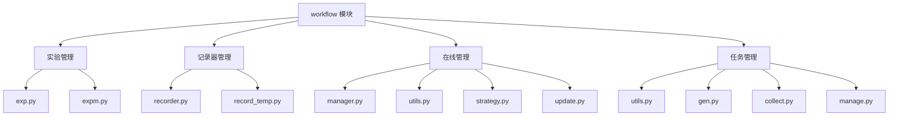

# qlib/workflow 目录文档总结

## 概述

`qlib/workflow/` 目录提供了完整的工作流管理功能，包括实验管理、记录器管理、在线策略管理和任务管理。

## 文件列表

### 核心模块

| 文件 | 描述 | 文档 |
|------|------|------|
| `exp.py` | 实验管理（Experiment、MLflowExperiment） | [exp.py.md](exp.py.md) |
| `expm.py` | 实验管理器（ExpManager、MLflowExpManager） | [expm.py.md](expm.py.md) |
| `recorder.py` | 记录器管理（Recorder、MLflowRecorder） | [recorder.py.md](recorder.py.md) |
| `record_temp.py` | 记录模板（各种记录模板类） | [record_temp.py.md](record_temp.py.md) |
| `utils.py` | 工作流工具函数（实验退出处理） | [utils.py.md](utils.py.md) |

### 在线管理模块

| 文件 | 描述 | 文档 |
|------|------|------|
| `online/manager.py` | 在线管理器 | [online/manager.py.md](online/manager.py.md) |
| `online/utils.py` | 在线工具（OnlineTool、OnlineToolR） | [online/utils.py.md](online/utils.py.md) |
| `online/strategy.py` | 在线策略（OnlineStrategy、RollingStrategy） | [online/strategy.py.md](online/strategy.py.md) |
| `online/update.py` | 更新器（RMDLoader、RecordUpdater、PredUpdater、LabelUpdater） | [online/update.py.md](online/update.py.md) |

### 任务管理模块

| 文件 | 描述 | 文档 |
|------|------|------|
| `task/utils.py` | 任务管理工具（TimeAdjuster、MongoDB 连接等） | [task/task_management.md](task/task_management.md) |
| `task/gen.py` | 任务生成器（TaskGen、RollingGen、MultiHorizonGenBase） | [task/task_management.md](task/task_management.md) |
| `task/collect.py` | 结果收集器（Collector、RecorderCollector、MergeCollector） | [task/task_management.md](task/task_management.md) |
| `task/manage.py` | 任务生命周期管理（TaskManager） | [task/task_management.md](task/task_management.md) |

## 主要功能

### 1. 实验管理

- **实验（Experiment/MLflowExperiment）**：
  - 管理单个实验
  - 创建、启动、结束记录器
  - 记录参数、指标、标签
  - 保存和加载工件

- **实验管理器（ExpManager/MLflowExpManager）**：
  - 管理多个实验
  - 创建、删除、搜索实验
  - 管理默认 URI 和活跃 URI

### 2. 记录管理

- **记录器（Recorder/MLflowRecorder）**：
  - 记录实验结果
  - 支持异步日志记录
  - 自动记录未提交代码和环境变量

- **记录模板（RecordTemp 及其子类）**：
  - SignalRecord: 生成信号预测
  - SigAnaRecord: 生成信号分析（IC、IR）
  - PortAnaRecord: 生成投资组合分析（回测）
  - MultiPassPortAnaRecord: 多次回测的投资组合分析

### 3. 在线管理

- **在线管理器（OnlineManager）**：
  - 管理在线策略
  - 支持在线交易和回测模拟
  - 处理例程（routine）和信号准备

- **在线工具（OnlineTool/OnlineToolR）**：
  - 管理"在线"模型
  - 设置和更新在线模型

- **在线策略（OnlineStrategy/RollingStrategy）**：
  - 定义如何生成任务
  - 定义如何更新模型
  - 定义如何准备信号

- **更新器（RMDLoader、RecordUpdater、PredUpdater、LabelUpdater）**：
  - 更新预测和标签
  - 支持历史依赖
  - 避免未来信息泄露

### 4. 任务管理

- **任务管理器（TaskManager）**：
  - 管理任务生命周期
  - 使用 MongoDB 存储
  - 支持并发执行
  - 确保任务唯一性

- **任务生成器（TaskGen、RollingGen、MultiHorizonGenBase）**：
  - 基于模板生成多个任务
  - 支持滚动窗口
  - 支持多视野

- **收集器（Collector、RecorderCollector、MergeCollector）**：
  - 从记录器收集结果
  - 支持合并、分组、平均等操作

- **工具函数（TimeAdjuster、get_mongodb、list_recorders）**：
  - 时间调整和对齐
  - MongoDB 连接
  - 记录器列表和过滤

## 架构图



## 使用场景

### 场景 1：基本实验

```python
from qlib.workflow import R
from qlib.workflow.recorder import Recorder

# 启动实验
R.start_exp(experiment_name="my_exp", recorder_name="run_001")

# 获取记录器
recorder = R.get_recorder()

# 记录参数和
recorder.log_params(model="LightGBM", learning_rate=0.01)
recorder.log_metrics(accuracy=0.95, loss=0.05)

# 结束实验
R.end_exp(recorder_status=Recorder.STATUS_FI)
```

### 场景 2：使用记录模板

```python
from qlib.workflow.record_temp import (
    SignalRecord,
    SigAnaRecord,
    PortAnaRecord
)

# 生成信号预测
signal_record = SignalRecord(
    model=my_model,
    dataset=my_dataset,
    recorder=recorder
)
signal_record.generate()

# 生成信号分析
signal_ana_record = SigAnaRecord(recorder=recorder)
signal_ana_record.generate()

# 生成回测分析
port_ana_record = PortAnaRecord(
    recorder=recorder,
    config=config
)
port_ana_record.generate()
```

### 场景 3:,在线交易

```python
from qlib.workflow.online.manager import OnlineManager
from qlib.workflow.online.strategy import RollingStrategy

# 创建在线策略
strategy = RollingStrategy(
    name_id="my_strategy",
    task_template=task_template,
    rolling_gen=rolling_gen
)

# 创建在线管理器
manager = OnlineManager(
    strategies=strategy,
    trainer=my_trainer,
    begin_time="2021-01-01"
)

# 首次训练
manager.first_train()

# 在线交易循环
for day in trading_days:
    manager.routine(cur_time=day)
    signals = manager.get_signals()
    # 执行交易逻辑...
```

### 场景 4：回测模拟

```python
# 创建在线管理器
manager = OnlineManager(
    strategies=strategy,
    trainer=my_trainer,
    begin_time="2021-01-01"
)

# 模拟历史数据
signals = manager.simulate(
    end_time="2021-12-31",
    frequency="day"
)

# 分析模拟结果
print(signals)
```

### 场景 5：任务管理

```python
from qlib.workflow.task.manage import TaskManager, run_task

# 创建任务管理器
tm = TaskManager("my_task_pool")

# 创建任务
task_def = {
    "model": {...},
    "dataset": {...}
}
task_id = tm.create_task([task_def])[0]

# 运行任务
def train_func(task_def, **kwargs):
    model = train(task_def)
    return model

run_task(
    task_func=train_func,
    task_pool="my_task_pool",
    before_status=TaskManager.STATUS_WAITING,
    after_status=TaskManager.STATUS_DONE
)
```

## MongoDB 配置

使用 TaskManager 之前必须配置 MongoDB：

```python
import qlib

# 方式 1：在 qlib.init() 中配置
mongo_conf = {
    "task_url": "mongodb://localhost:27017/",
    "task_db_name": "rolling_db"
}
qlib.init(..., mongo=mongo_conf)

# 方式 2：在 C["mongo"] 中配置
from qlib.config import C
C["mongo"] = {
    "task_url": "mongodb://localhost:27017/",
    "task_db_name": "rolling_db"
}
```

## 注意事项

1. **MLflow 配置**：
   - 使用 `qlib.init()` 配置 MLflow tracking URI
   - 实验管理器与全局配置共享默认 URI

2. **记录器管理**：
   - 支持异步日志记录以提高性能
   - 自动记录未提交代码和环境变量
   - 参数值长度限制为 1000

3. **在线管理**：
   - 支持在线交易和回测模拟两种模式
   - 使用 DelayTrainer 可以并行训练所有任务
   - 信号会自动更新

4. **任务管理**：
   - 必须先配置 MongoDB
   - 支持并发任务执行
   - 确保每个任务只使用一次

5. **时间处理**：
   - TimeAdjuster 用于对齐日期到交易日历
   - 支持滑动和扩展两种滚动方式
   - 可以避免未来信息泄露

6. **数据更新**：
   - 支持更新预测和标签
   - 可以指定历史依赖长度
   - 避免未来信息泄露
