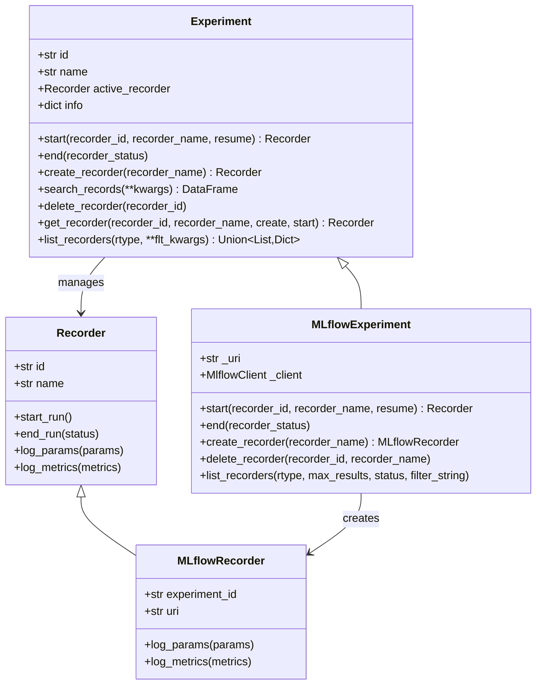

# qlib/workflow/exp.py

## 模块概述

`exp.py` 模块提供了实验管理功能，类似于 MLflow 的实验管理 API接口。该模块定义了实验和记录器的抽象接口及其 MLflow 实现，用于管理和跟踪机器学习实验。

该模块的主要功能包括：
- 创建、启动、结束实验
- 管理实验下的记录器（Recorder）
- 搜索和删除记录器
- 记录实验参数、指标和标签

## 类说明

### Experiment

实验基类，提供了实验管理的抽象接口。API 设计与 MLflow 类似。

#### 构造方法参数

| 参数名 | 类型 | 说明 |
|--------|------|------|
| id | str | 实验的唯一标识符 |
| name | str | 实验的名称 |

#### 属性

| 属性名 | 类型 | 说明 |
|--------|------|------|
| id | str | 实验的唯一标识符 |
| name | str | 实验的名称 |
| active_recorder | Recorder | 当前活跃的记录器，同一时间只能有一个记录器运行 |
| info | dict | 实验信息字典，包含类名、ID、名称、活跃记录器ID和所有记录器列表 |

#### 重要方法

##### start()

启动实验并设置为活跃状态，同时创建一个新的记录器。

```python
def start(self, *, recorder_id=None, recorder_name=None, resume=False) -> Recorder
```

**参数：**

| 参数名 | 类型 | 说明 |
|--------|------|------|
| recorder_id | str, 可选 | 要创建的记录器的ID |
| recorder_name | str, 可选 | 要创建的记录器的名称 |
| resume | bool | 是否恢复第一个记录器，默认为 False |

**返回值：**
- `Recorder`: 活跃的记录器对象

**示例：**
```python
# 启动实验并创建新记录器
active_recorder = experiment.start(recorder_name="my_recorder")

# 恢复已有记录器
active_recorder = experiment.start(recorder_id="recorder_id", resume=True)
```

##### end()

结束实验。

```python
def end(self, recorder_status=Recorder.STATUS_S)
```

**参数：**

| 参数名 | 类型 | 说明 |
|--------|------|------|
| recorder_status | str | 结束时设置记录器的状态，可选值：<br> - `Recorder.STATUS_S` (SCHEDULED)<br> - `Recorder.STATUS_R` (RUNNING)<br> - `Recorder.STATUS_FI` (FINISHED)<br> - `Recorder.STATUS_F` (FAILED) |

**示例：**
```python
# 成功结束实验
experiment.end(recorder_status=Recorder.STATUS_FI)

# 失败结束实验
experiment.end(recorder_status=Recorder.STATUS_F)
```

##### create_recorder()

为实验创建一个新的记录器。

```python
def create_recorder(self, recorder_name=None) -> Recorder
```

**参数：**

| 参数名 | 类型 | 说明 |
|--------|------|------|
| recorder_name | str, 可选 | 要创建的记录器的名称 |

**返回值：**
- `Recorder`: 记录器对象

**示例：**
```python
recorder = experiment.create_recorder(recorder_name="my_recorder")
```

##### search_records()

根据搜索条件获取符合条件记录器的 Pandas DataFrame。

```python
def search_records(self, **kwargs) -> pd.DataFrame
```

**返回值：**
- `pd.DataFrame`: 记录器的 DataFrame，每个指标、参数和标签都扩展到各自的列中（metrics.*、params.*、tags.*）。对于没有特定指标、参数或标签的记录，其值分别为 (NumPy) NaN、None 或 None。

##### delete_recorder()

删除指定的记录器。

```python
def delete_recorder(self, recorder_id)
```

**参数：**

| 参数名 | 类型 | 说明 |
|--------|------|------|
| recorder_id | str | 要删除的记录器的ID |

##### get_recorder()

为用户获取一个记录器。

```python
def get_recorder(self, recorder_id=None, recorder_name=None, create: bool = True, start: bool = False) -> Recorder
```

**参数：**

| 参数名 | 类型 | 说明 |
|--------|------|------|
| recorder_id | str, 可选 | 记录器的ID |
| recorder_name | str, 可选 | 记录器的名称 |
| create | bool | 如果记录器之前未被创建，是否自动创建新记录器，默认为 True |
| start | bool | 如果创建了新记录器，是否启动它，默认为 False |

**返回值：**
- `Recorder`: 记录器对象

**逻辑说明：**

当 `create=True`：
- 如果存在活跃记录器：
  - 未指定 ID 或名称：返回活跃记录器
  - 指定 ID 或名称：返回指定记录器。未找到则创建新记录器。如果 `start=True`，记录器设为活跃状态
- 如果不存在活跃记录器：
  - 未指定 ID 或名称：创建新记录器
  - 指定 ID 或名称：返回指定记录器。未找到则创建新记录器。如果 `start=True`，记录器设为活跃状态

当 `create=False`：
- 如果存在活跃记录器：
  - 未指定 ID 或名称：返回活跃记录器
  - 指定 ID 或名称：返回指定记录器。未找到则抛出错误
- 如果不存在活跃记录器：
  - 未指定 ID 或名称：抛出错误
  - 指定 ID 或名称：返回指定记录器。未找到则抛出错误

**示例：**
```python
# 获取当前活跃记录器
recorder = experiment.get_recorder()

# 获取指定记录器，不存在则创建
recorder = experiment.get_recorder(recorder_name="my_recorder", create=True)

# 获取指定记录器，不存在则报错
recorder = experiment.get_recorder(recorder_id="recorder_123", create=False)

# 获取并启动新记录器
recorder = experiment.get_recorder(recorder_name="new_recorder", create=True, start=True)
```

##### list_recorders()

列出该实验中所有现有的记录器。

```python
def list_recorders(self, rtype: Literal["dict", "list"] = "dict", **flt_kwargs) -> Union[List[Recorder], Dict[str, Recorder]]
```

**参数：**

| 参数名 | 类型 | 说明 |
|--------|------|------|
| rtype | Literal["dict", "list"] | 返回类型：<br> - `"dict"`: 返回字典（ID -> Recorder）<br> - `"list"`: 返回 Recorder 列表 |
| **flt_kwargs | dict | 过滤记录器的条件，例如 `status=Recorder.STATUS_FI` |

**返回值：**
- 如果 `rtype == "dict"`: 返回记录器信息字典（ID -> Recorder）
- 如果 `rtype == "list"`: 返回 Recorder 列表

**示例：**
```python
# 列出所有记录器（字典形式）
recorders_dict = experiment.list_recorders()

# 列出所有记录器（列表形式）
recorders_list = experiment.list_recorders(rtype="list")

# 列出已完成的记录器
finished_recorders = experiment.list_recorders(status=Recorder.STATUS_FI)
```

---

### MLflowExperiment

使用 MLflow 实现的实验类，继承自 `Experiment`。

#### 构造方法参数

| 参数名 | 类型 | 说明 |
|--------|------|------|
| id | str | 实验的唯一标识符 |
| name | str | 实验的名称 |
| uri | str | MLflow tracking server 的 URI |

#### 属性

| 属性名 | 类型 | 说明 |
|--------|------|------|
| id | str | 实验的唯一标识符 |
| name | str | 实验的名称 |
| _uri | str | MLflow tracking server 的 URI |
| _client | MlflowClient | MLflow 客户端实例 |

#### 重要方法

##### start()

启动实验并创建一个新的记录器或恢复已有的记录器。

```python
def start(self, *, recorder_id=None, recorder_name=None, resume=False) -> Recorder
```

**参数：**

| 参数名 | 类型 | 说明 |
|--------|------|------|
| recorder_id | str, 可选 | 记录器的ID |
| recorder_name | str, 可选 | 记录器的名称 |
| resume | bool | 是否恢复第一个记录器，默认为 False |

**返回值：**
- `Recorder`: 活跃的记录器对象

**示例：**
```python
# 启动实验并创建新记录器
active_recorder = mlexp.start(recorder_name="my_recorder")

# 恢复已有记录器
active_recorder = mlexp.start(recorder_id="recorder_id", resume=True)
```

##### end()

结束实验并结束活跃的记录器。

```python
def end(self, recorder_status=Recorder.STATUS_S)
```

**参数：**

| 参数名 | 类型 | 说明 |
|--------|------|------|
| recorder_status | str | 结束时设置记录器的状态 |

##### create_recorder()

创建一个新的 MLflow 记录器。

```python
def create_recorder(self, recorder_name=None) -> MLflowRecorder
```

**参数：**

| 参数名 | 类型 | 说明 |
|--------|------|------|
| recorder_name | str, 可选 | 记录器的名称 |

**返回值：**
- `MLflowRecorder`: MLflow 记录器对象

##### delete_recorder()

删除指定的记录器。

```python
def delete_recorder(self, recorder_id=None, recorder_name=None)
```

**参数：**

| 参数名 | 类型 | 说明 |
|--------|------|------|
| recorder_id | str, 可选 | 要删除的记录器的ID |
| recorder_name | str, 可选 | 要删除的记录器的名称 |

**注意：** 必须提供至少一个参数（ID 或 名称）。

**示例：**
```python
# 通过 ID 删除记录器
mlexp.delete_recorder(recorder_id="recorder_123")

# 通过名称删除记录器
mlexp.delete_recorder(recorder_name="my_recorder")
```

##### list_recorders()

列出该实验中所有现有的记录器。

```python
def list_recorders(
    self,
    rtype: Literal["dict", "list"] = "dict",
    max_results: int = 50000,
    status: Union[str, None] = None,
    filter_string: str = ""
) -> Union[List[Recorder], Dict[str, Recorder]]
```

**参数：**

| 参数名 | 类型 | 说明 |
|--------|------|------|
| rtype | Literal["dict", "list"] | 返回类型 |
| max_results | int | 返回结果的数量限制，默认 50000（MLflow 最大限制） |
| status | str, 可选 | 基于状态过滤结果的条件。`None` 表示不过滤 |
| filter_string | str | MLflow 支持的过滤字符串，如 `'params."my_param"="a" and tags."my_tag"="b"'`，可用于减少返回的运行数量 |

**返回值：**
- 如果 `rtype == "dict"`: 返回记录器信息字典（ID -> Recorder）
- 如果 `rtype == "list"`: 返回 Recorder 列表

**注意：** 默认排序方式是按 start_time 降序，然后按 run_id 排序。

**示例：**
```python
# 列出所有记录器
recorders = mlexp.list_recorders()

# 列出已完成的记录器
finished_recorders = mlexp.list_recorders(status=Recorder.STATUS_FI)

# 使用过滤字符串筛选
recorders = mlexp.list_recorders(filter_string='params."model"="LightGBM"')
```

## 使用示例

### 基本使用

```python
from qlib.workflow.exp import MLflowExperiment

# 创建 MLflow 实验
experiment = MLflowExperiment(
    id="exp_001",
    name="my_experiment",
    uri="mlruns"
)

# 启动实验
recorder = experiment.start(recorder_name="run_001")

# 记录参数和指标
recorder.log_params({"learning_rate": 0.01, "epochs": 100})
recorder.log_metrics({"accuracy": 0.95, "loss": 0.05})

# 结束实验
experiment.end(recorder_status=Recorder.STATUS_FI)
```

### 列出和搜索记录器

```python
# 列出所有记录器
all_recorders = experiment.list_recorders()

# 列出已完成的记录器
finished_recorders = experiment.list_recorders(
    rtype="list",
    status=Recorder.STATUS_FI
)

# 搜索记录
records_df = experiment.search_records()
```

### 删除记录器

```python
# 删除指定记录器
experiment.delete_recorder(recorder_id="recorder_123")
```

## 类关系图



## 常量

| 常量名 | 值 | 说明 |
|--------|-----|------|
| Experiment.RT_D | "dict" | 返回类型为字典 |
| Experiment.RT_L | "list" | 返回类型为列表 |
| MLflowExperiment.UNLIMITED | 50000 | MLflow 可列出的最大记录数（MLflow 限制） |

## 注意事项

1. **MLflow 限制：** MLflow 最多只能列出 50,000 条记录，这是 MLflow 的硬性限制
2. **活跃记录器：** 同一时间只能有一个活跃记录器运行
3. **恢复记录器：** 使用 `resume=True` 时会恢复第一个匹配的记录器，而不是创建新的
4. **记录器名称唯一性：** 通过名称获取记录器时，如果存在多个同名记录器，只会返回最新的一个
