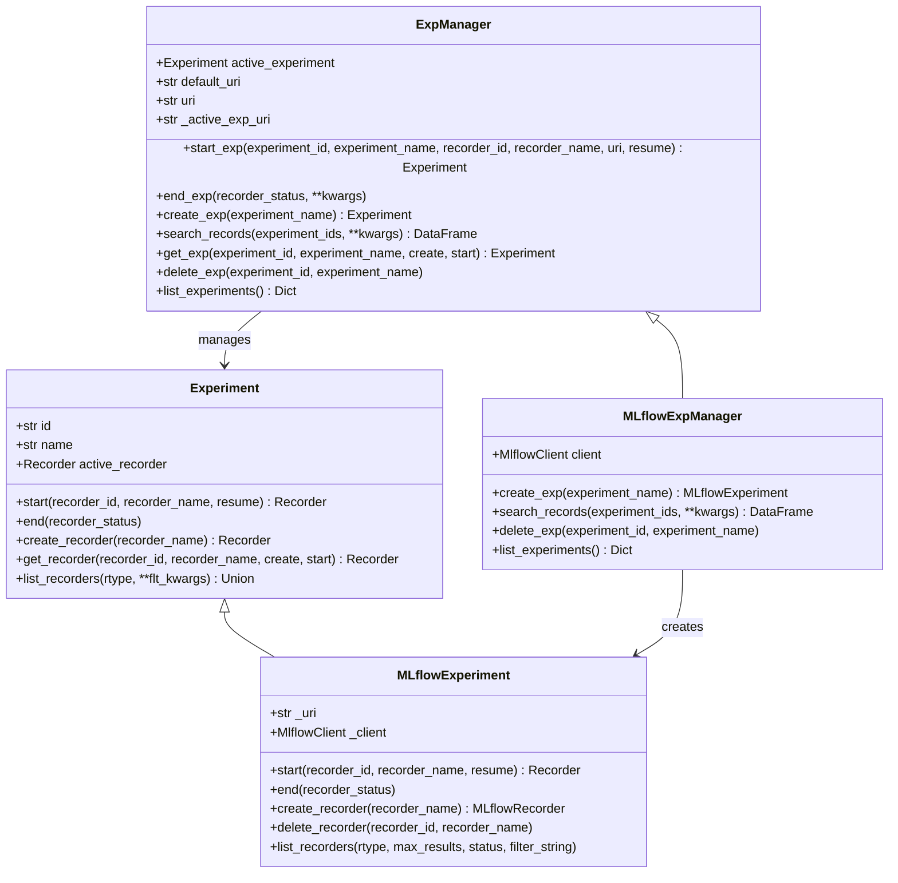
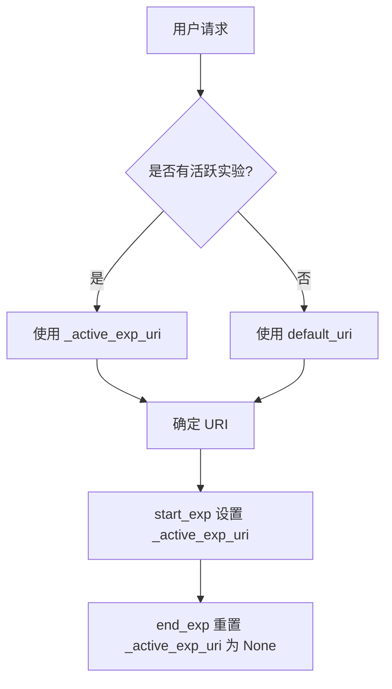

# qlib/workflow/expm.py

## 模块概述

`expm.py` 模块提供了实验管理器功能，用于管理和创建多个实验。API 设计与 MLflow 类似。该模块定义了实验管理器的抽象接口及其 MLflow 实现。

该模块的主要功能包括：
- 管理多个实验
- 创建、启动、结束实验
- 获取和删除实验
- 搜索实验记录
- 管理 URI（默认 URI 和活跃实验 URI）

## 设计说明

`ExpManager` 被设计为单例，类似于全局配置 `C`。用户可以从不同的 URI 获取不同的实验，然后比较它们的记录。

`ExpManager` 与全局配置 `C` 共享一个名为 **default uri** 的变量。

当用户启动实验时，可能希望将 URI 设置为特定的 URI（在此期间会覆盖 **default uri**），然后取消设置 **specific uri** 并回退到 **default uri**。`ExpManager._active_exp_uri` 就是那个 **specific uri**。

## 类说明

### ExpManager

实验管理器基类，提供了实验管理的抽象接口。

#### 构造方法参数

| 参数名 | 类型 | 说明 |
|--------|------|------|
| uri | str | MLflow tracking server 的默认 URI |
| default_exp_name | str, 可选 | 默认实验名称 |

#### 属性

| 属性名 | 类型 | 说明 |
|--------|------|------|
| active_experiment | Experiment | 当前活跃的实验，同一时间只能有一个活跃实验 |
| default_uri | str | 默认的 tracking URI（从 C.exp_manager 读取/设置） |
| uri | str | 当前跟踪 URI（优先使用活跃实验 URI，否则使用默认 URI） |
| _active_exp_uri | str | 当前活跃实验的特定 URI（内部使用） |

#### 重要方法

##### start_exp()

启动一个实验。该方法首先获取或创建一个实验，然后将其设置为活跃状态。

```python
def start_exp(
    self,
    *,
    experiment_id: Optional[Text] = None,
    experiment_name: Optional[Text] = None,
    recorder_id: Optional[Text] = None,
    recorder_name: Optional[Text] = None,
    uri: Optional[Text] = None,
    resume: bool = False,
    **kwargs,
) -> Experiment
```

**参数：**

| 参数名 | 类型 | 说明 |
|--------|------|------|
| experiment_id | str, 可选 | 要启动的实验 ID |
| experiment_name | str, 可选 | 要启动的实验名称 |
| recorder_id | str, 可选 | 要启动的记录器 ID |
| recorder_name | str, 可选 | 要启动的记录器名称 |
| uri | str, 可选 | 当前的跟踪 URI（会覆盖默认 URI） |
| resume | bool | 是否恢复实验和记录器，默认为 False |

**返回值：**
- `Experiment`: 活跃的实验对象

**示例：**
```python
# 启动实验并创建新记录器
exp = manager.start_exp(experiment_name="my_exp", recorder_name="run_001")

# 恢复已有实验

exp = manager.start_exp(experiment_id="exp_id", resume=True)

# 使用特定 URI 启动实验
exp = manager.start_exp(experiment_name="my_exp", uri="mlruns_backup")
```

##### end_exp()

结束一个活跃的实验。

```python
def end_exp(self, recorder_status: Text = Recorder.STATUS_S, **kwargs)
```

**参数：**

| 参数名 | 类型 | 说明 |
|--------|------|------|
| recorder_status | str | 实验的活跃记录器的状态，默认为 Recorder.STATUS_S |
| **kwargs | dict | 其他参数 |

**示例：**
```python
# 成功结束实验
manager.end_exp(recorder_status=Recorder.STATUS_FI)

# 失败结束实验
manager.end_exp(recorder_status=Recorder.STATUS_F)
```

##### create_exp()

创建一个新的实验。

```python
def create_exp(self, experiment_name: Optional[Text] = None) -> Experiment
```

**参数：**

| 参数名 | 类型 | 说明 |
|--------|------|------|
| experiment_name | str, 可选 | 实验名称，必须唯一 |

**返回值：**
- `Experiment`: 实验对象

**异常：**
- `ExpAlreadyExistError`: 如果实验名称已存在

**示例：**
```python
exp = manager.create_exp(experiment_name="my_new_experiment")
```

##### search_records()

根据搜索条件获取符合条件记录器的 Pandas DataFrame。

```python
def search_records(self, experiment_ids=None, **kwargs) -> pd.DataFrame
```

**参数：**

| 参数名 | 类型 | 说明 |
|--------|------|------|
| experiment_ids | list, 可选 | 要搜索的实验 ID 列表 |
| **kwargs | dict | 其他搜索条件 |

**返回值：**
- `pd.DataFrame`: 记录器的 DataFrame

##### get_exp()

获取一个实验。该方法包括获取活跃实验，以及获取或创建特定实验。

```python
def get_exp(self, *, experiment_id=None, experiment_name=None, create: bool = True, start: bool = False) -> Experiment
```

**参数：**

| 参数名 | 类型 | 说明 |
|--------|------|------|
| experiment_id | str, 可选 | 要返回的实验 ID |
| experiment_name | str, 可选 | 要返回的实验名称 |
| create | bool | 如果实验之前未被创建，是否自动创建新实验，默认为 True |
| start | bool | 如果创建了新实验，是否启动它，默认为 False |

**返回值：**
- `Experiment`: 实验对象

**逻辑说明：**

当 `create=True`：
- 如果存在活跃实验：
  - 未指定 ID 或名称：返回活跃实验
  - 指定 ID 或名称：返回指定实验。未找到则创建新实验。如果 `start=True`，实验设为活跃状态
- 如果不存在活跃实验：
  - 未指定 ID 或名称：创建默认实验
  - 指定 ID 或名称：返回指定实验。未找到则创建新实验。如果 `start=True`，实验设为活跃状态

当 `create=False`：
- 如果存在活跃实验：
  - 未指定 ID 或名称：返回活跃实验
  - 指定 ID 或名称：返回指定实验。未找到则抛出错误
- 如果不存在活跃实验：
  - 未指定 ID 或名称：如果默认实验存在则返回它，否则抛出错误
  - 指定 ID 或名称：返回指定实验。未找到则抛出错误

**示例：**
```python
# 获取当前活跃实验
exp = manager.get_exp()

# 获取指定实验，不存在则创建
exp = manager.get_exp(experiment_name="my_exp", create=True)

# 获取指定实验，不存在则报错
exp = manager.get_exp(experiment_id="exp_123", create=False)

# 获取并启动新实验
exp = manager.get_exp(experiment_name="new_exp", create=True, start=True)
```

##### delete_exp()

删除一个实验。

```python
def delete_exp(self, experiment_id=None, experiment_name=None)
```

**参数：**

| 参数名 | 类型 | 说明 |
|--------|------|------|
| experiment_id | str, 可选 | 要删除的实验 ID |
| experiment_name | str, 可选 | 要删除的实验名称 |

**示例：**
```python
# 通过 ID 删除实验
manager.delete_exp(experiment_id="exp_123")

# 通过名称删除实验
manager.delete_exp(experiment_name="my_exp")
```

##### list_experiments()

列出所有现有的实验。

```python
def list_experiments(self) -> Dict[str, Experiment]
```

**返回值：**
- `Dict[str, Experiment]`: 实验信息字典（名称 -> 实验）

**示例：**
```python
all_experiments = manager.list_experiments()
for name, exp in all_experiments.items():
    print(f"Experiment: {name}, ID: {exp.id}")
```

---

### MLflowExpManager

使用 MLflow 实现的实验管理器，继承自 `ExpManager`。

#### 构造方法参数

继承自 `ExpManager`：
- `uri`: MLflow tracking server 的默认 URI
- `default_exp_name`: 默认实验名称

#### 属性

| 属性名 | 类型 | 说明 |
|--------|------|------|
| active_experiment | Experiment | 当前活跃的实验 |
| default_uri | str | 默认的 tracking URI |
| uri | str | 当前跟踪 URI |
| client | MlflowClient | MLflow 客户端实例（每次访问时创建） |

#### 重要方法

##### client

MLflow 客户端属性，每次访问时创建一个新的客户端实例。

```python
@property
def client(self) -> MlflowClient
```

**返回值：**
- `MlflowClient`: MLflow 跟踪客户端

**注意：** 测试表明创建新客户端的速度足够快。

##### create_exp()

创建一个新的 MLflow 实验。

```python
def create_exp(self, experiment_name: Optional[Text] = None) -> MLflowExperiment
```

**参数：**

| 参数名 | 类型 | 说明 |
|--------|------|------|
| experiment_name | str | 实验名称，必须唯一且不为 None |

**返回值：**
- `MLflowExperiment`: MLflow 实验对象

**异常：**
- `ExpAlreadyExistError`: 如果实验名称已存在
- `MlflowException`: 其他 MLflow 错误

##### search_records()

根据搜索条件获取符合条件记录器的 Pandas DataFrame。

```python
def search_records(self, experiment_ids=None, **kwargs) -> pd.DataFrame
```

**参数：**

| 参数名 | 类型 | 说明 |
|--------|------|------|
| experiment_ids | list, 可选 | 要搜索的实验 ID 列表 |
| filter_string | str, 可选 | MLflow 支持的过滤字符串 |
| run_view_type | int, 可选 | 运行视图类型 |
| max_results | int, 可选 | 最大返回结果数，默认 100000 |
| order_by | str, 可选 | 排序条件 |

**返回值：**
- `pd.DataFrame`: 记录器的 DataFrame

##### delete_exp()

删除指定的实验。

```python
def delete_exp(self, experiment_id=None, experiment_name=None)
```

**参数：**

| 参数名 | 类型 | 说明 |
|--------|------|------|
| experiment_id | str, 可选 | 要删除的实验 ID |
| experiment_name | str, 可选 | 要删除的实验名称 |

**注意：** 必须提供至少一个参数（ID 或 名称）。

**示例：**
```python
# 通过 ID 删除实验
manager.delete_exp(experiment_id="exp_123")

# 通过名称删除实验
manager.delete_exp(experiment_name="my_exp")
```

##### list_experiments()

列出所有现有的实验。

```python
def list_experiments(self) -> Dict[str, Experiment]
```

**返回值：**
- `Dict[str, Experiment]`: 实验信息字典（名称 -> 实验）

**注意：** 只返回活跃状态的实验（不包括已删除的实验）。

**示例：**
```python
all_experiments = manager.list_experiments()
for name, exp in all_experiments.items():
    print(f"Experiment: {name}, ID: {exp.id}")
```

## 使用示例

### 基本使用

```python
from qlib.workflow.expm import MLflowExpManager
from qlib.workflow.recorder import Recorder

# 创建 MLflow 实验管理器
manager = MLflowExpManager(
    uri="mlruns",
    default_exp_name="default_experiment"
)

# 启动实验
exp = manager.start_exp(
    experiment_name="my_experiment",
    recorder_name="run_001"
)

# 获取记录器
recorder = exp.get_recorder()

# 记录参数和指标
recorder.log_params({"learning_rate": 0.01, "epochs": 100})
recorder.log_metrics({"accuracy": 0.95, "loss": 0.05})

# 结束实验
manager.end_exp(recorder_status=Recorder.STATUS_FI)
```

### 列出和搜索实验

```python
# 列出所有实验
all_experiments = manager.list_experiments()
for name, exp in all_experiments.items():
    print(f"Experiment: {name}, ID: {exp.id}")

# 搜索记录
records_df = manager.search_records(experiment_ids=["exp_001"])
```

### 创建和删除实验

```python
# 创建新实验
exp = manager.create_exp(experiment_name="new_experiment")

# 删除实验
manager.delete_exp(experiment_name="old_experiment")
```

### 使用不同的 URI

```python
# 使用特定 URI 启动实验
exp = manager.start_exp(
    experiment_name="my_exp",
    uri="mlruns_backup"
)
```

### 获取实验

```python
# 获取当前活跃实验
exp = manager.get_exp()

# 获取指定实验
exp = manager.get_exp(experiment_name="my_experiment")

# 获取指定实验（不存在则创建）
exp = manager.get_exp(experiment_name="new_exp", create=True)
```

## 类关系图



## URI 管理流程



## 并发控制

`ExpManager` 使用文件锁来处理并发创建实验的情况：

1. 对于 `file://` 协议的 URI：使用 `FileLock` 确保线程安全
2. 对于其他协议（如 `http://`）：使用双重检查模式避免创建冲突

**示例代码说明：**
```python
# 对于 file 协议，使用文件锁
if pr.scheme == "file":
    with FileLock(...):
        return self.create_exp(experiment_name), True

# 对于其他协议，使用双重检查
try:
    return self.create_exp(experiment_name), True
except ExpAlreadyExistError:
    return self._get_exp(...), False
```

## 注意事项

1. **单例模式：** `ExpManager` 设计为单例，但可以有多个不同 URI 的实验
2. **URI 共享：** `ExpManager` 与全局配置 `C` 共享 `default_uri`
3. **活跃实验：** 同一时间只能有一个活跃实验运行
4. **MLflow 版本兼容性：** `list_experiments()` 方法会根据 MLflow 版本选择合适的方法调用（MLflow 2.x 使用 `search_experiments`，1.x 使用 `list_experiments`）
5. **已删除实验：** `list_experiments()` 只返回活跃状态的实验，不包括已删除的实验
6. **实验名称唯一性：** 创建实验时，实验名称必须唯一，否则会抛出 `ExpAlreadyExistError`
7. **实验 ID 类型：** MLflow 的 `experiment_id` 必须是字符串类型
