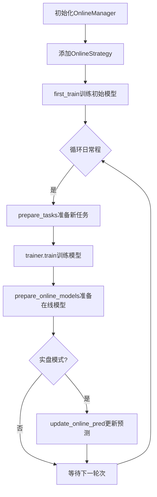

# workflow/online/__init__.py 模块文档

## 文件概述

本模块为空文件，online子模块的包标识文件。

## 子模块

- **manager.py** - OnlineManager，管理在线策略和运行
- **strategy.py** - OnlineStrategy，定义在线策略
- **update.py** - Updater，更新预测和标签
- **utils.py** - OnlineTool，管理在线模型

## 功能概述

online模块提供完整的在线交易管理功能：

1. **OnlineManager** - 管理多个在线策略，模拟历史或运行实盘交易
2. **OnlineStrategy** - 定义如何生成任务、更新模型和准备信号
3. **Updater** - 更新预测和标签等工件到最新日期
4. **OnlineTool** - 管理在线模型的状态（在线/离线）

## 使用场景

| 场景 | Trainer类型 | 说明 |
|------|-----------|------|
| 实盘交易 | Trainer | Trainer帮助训练模型，每个策略逐任务训练 |
| 实盘交易 | DelayTrainer | DelayTrainer跳过具体训练，直到所有任务准备完毕 |
| 模拟/回测 | Trainer | 行为与实盘+Trainer相同，但用于模拟 |
| 模拟/回测 | DelayTrainer | 支持多任务训练，所有任务可在模拟结束后并行训练 |

## 工作流程

## 注意事项

1. **四种使用场景**：实盘+Trainer、实盘+DelayTrainer、模拟+Trainer、模拟+DelayTrainer
2. **延迟训练**：DelayTrainer允许并行训练所有任务，适用于无时间依赖的模型
3. **信号准备**：所有预测结束时间之前的信号都会被正确准备
4. **时间对齐**：使用TimeAdjuster处理日历对齐和时间段调整
