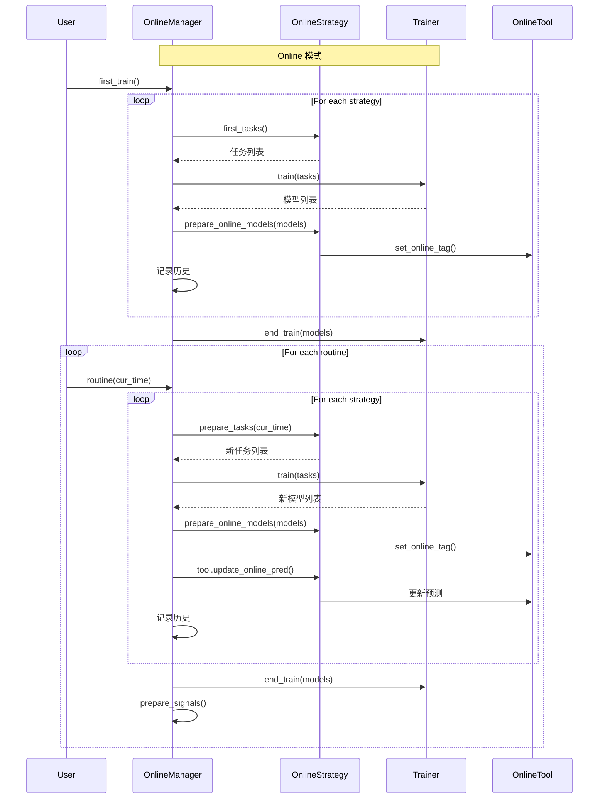
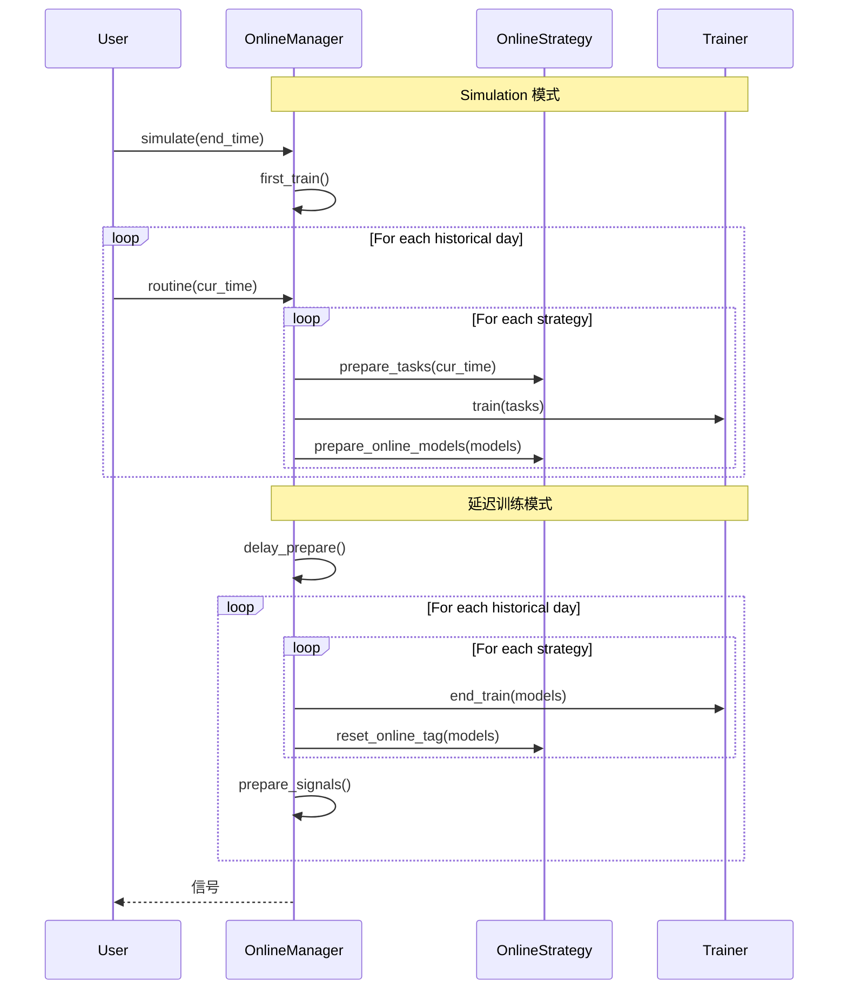

# qlib/workflow/online/manager.py

## 模块概述

`manager.py` 模块提供了 `OnlineManager` 类，用于管理一组在线策略（Online Strategy）并动态运行它们。

随着时间的变化，决策模型也会发生变化。该模块将这些贡献模型称为"在线"（online）模型。在每个例程（如每天或每分钟）中，在线模型可能会发生变化，需要更新它们的预测。因此，该模块提供了一系列方法来控制这个过程。

该模块还提供了一种方法来模拟历史中的在线策略，这意味着您可以验证您的策略或找到更好的策略。

## 使用场景说明

有 4 种使用不同训练器的情况：

| 情况 | 描述 |
|------|------|
| Online + Trainer | 进行实时例程时，Trainer 帮助训练模型。它将按任务和策略逐个训练模型 |
| Online + DelayTrainer | DelayTrainer 会跳过具体训练，直到所有任务被不同策略准备完毕。这使得用户可以在 `routine` 或 `first_train` 结束时并行训练所有任务 |
| Simulation + Trainer | 行为与 `Online + Trainer` 相同。唯一区别是用于模拟/回测而不是在线交易 |
| Simulation + DelayTrainer | 当您的模型没有任何时间依赖时，可以使用 DelayTrainer 进行多任务处理。这意味着所有例程中的所有任务都可以在模拟结束时真正训练。信号将基于是否有新模型上线而在不同时间段准备完毕 |

## 类说明

### OnlineManager

OnlineManager 可以管理带有 Online Strategy 的在线模型，并提供哪些模型在什么时间在线的历史记录。

#### 类属性

| 属性名 | 值 | | 说明 |
|--------|-----|------|------|
| STATUS_SIMULATING | "simulating" | 调用 `simulate` 时的状态 |
| STATUS_ONLINE | "online" | 正常状态，用于在线交易 |

#### 构造方法参数

| 参数名 | 类型 | 说明 |
|--------|------|------|
| strategies | OnlineStrategy or List[OnlineStrategy] | OnlineStrategy 实例或 OnlineStrategy 列表 |
| trainer | Trainer, 可选 | 用于训练任务的训练器，默认为 TrainerR |
| begin_time | str or pd.Timestamp, 可选 | OnlineManager 将在此时间开始，默认为使用最新日期 |
| freq | str | 数据频率，默认为 "day" |

#### 属性

| 属性名 | 类型 | 说明 |
|--------|------|------|
| strategies | List[OnlineStrategy] | 在线策略列表 |
| trainer | Trainer | 训练器实例 |
| begin_time | pd.Timestamp | 开始时间 |
| cur_time | pd.Timestamp | 当前时间 |
| history | dict | 在线模型历史记录，格式为 {pd.Timestamp: {strategy: [online_models]}} |
| signals | pd.Series or pd.DataFrame | 准备的交易信号 |
| status | str | 当前状态 |

#### 重要方法

##### first_train()

从每个策略的 first_tasks 方法获取任务并训练它们。如果使用 DelayTrainer，可以在每个策略的 first_tasks 完成后一起完成训练。

```python
def first_train(self, strategies: List[OnlineStrategy] = None, model_kwargs: dict = {})
```

**参数：**

| 参数名 | 类型 | 说明 |
|--------|------|------|
| strategies | List[OnlineStrategy], 可选 | 策略列表（添加策略时需要此参数），默认使用默认策略 |
| model_kwargs | dict | `prepare_online_models` 的参数 |

**示例：**
```python
# 首次训练
manager.first_train()

# 为新策略首次训练
manager.first_train(strategies=[new_strategy], model_kwargs={"key": "value"})
```

##### routine()

每个策略的典型更新过程并记录在线历史。

```python
def routine(
    self,
    cur_time: Union[str, pd.Timestamp] = None,
    task_kwargs: dict = {},
    model_kwargs: dict = {},
    signal_kwargs: dict = {},
):
```

**参数：**

| 参数名 | 类型 | 说明 |
|--------|------|------|
| cur_time | str or pd.Timestamp, 可选 | 在此时间运行 routine 方法，默认为最新日期 |
| task_kwargs | dict | `prepare_tasks` 的参数 |
| model_kwargs | dict | `prepare_online_models` 的参数 |
| signal_kwargs | dict | `prepare_signals` 的参数 |

**说明：**
- 典型的更新过程（如每天或每月）：
  - 更新预测 → 准备任务 → 准备在线模型 → 准备信号
- 如果使用 DelayTrainer，可以在每个策略的 prepare_tasks 完成后一起完成训练

**示例：**
```python
# 运行日常例程
manager.routine(
    cur_time="2021-01-01",
    task_kwargs={"param": "value"},
    model_kwargs={"param": "value"},
    signal_kwargs={"param": "value"}
)
```

##### get_collector()

获取 `Collector` 实例以从每个策略收集结果。此收集器可以作为信号准备的基础。

```python
def get_collector(self, **kwargs) -> MergeCollector
```

**参数：**

| 参数名 | 类型 | 说明 |
|--------|------|------|
| **kwargs | dict | `get_collector` 的参数 |

**返回值：**
- `MergeCollector`: 用于合并其他收集器的收集器

**示例：**
```python
# 获取收集器
collector = manager.get_collector()
```

##### add_strategy()

向 OnlineManager 添加一些新策略。

```python
def add_strategy(self, strategies: Union[OnlineStrategy, List[OnlineStrategy]])
```

**参数：**

| 参数名 | 类型 | 说明 |
|--------|------|------|
| strategies | OnlineStrategy or List[OnlineStrategy] | OnlineStrategy 列表 |

**示例：**
```python
# 添加单个策略
manager.add_strategy(new_strategy)

# 添加多个策略
manager.add_strategy([strategy1, strategy2])
```

##### prepare_signals()

在准备完上一个例程的数据后，可以准备下一个例程的交易信号。

```python
def prepare_signals(self, prepare_func: Callable = AverageEnsemble(), over_write=False) -> pd.DataFrame
```

**参数：**

| 参数名 | 类型 | 说明 |
|--------|------|------|
| prepare_func | Callable, 可选 | 从收集后的字典获取信号的函数，默认为 AverageEnsemble()，MergeCollector 收集的结果必须是 {xxx: pred} |
| over_write | bool | 如果为 True，新信号将覆盖；如果为 False，新信号将附加到信号末尾，默认为 False |

**返回值：**
- `pd.DataFrame`: 信号

**说明：**
- 给定一组预测，这些预测结束时间之前的所有信号都将准备完毕
- 即使最新信号已存在，最新计算结果也将被覆盖

**示例：**
```python
# 准备信号（使用默认的 AverageEnsemble）
signals = manager.prepare_signals()

# 使用自定义准备函数
def custom_prepare_func(collector_result):
    # 自定义信号准备逻辑
    return processed_signals

signals = manager.prepare_signals(prepare_func=custom_prepare_func)

# 覆盖现有信号
signals = manager.prepare_signals(over_write=True)
```

##### get_signals()

获取准备好的在线信号。

```python
def get_signals(self) -> Union[pd.Series, pd.DataFrame]
```

**返回值：**
- `pd.Series`: 每个日期一个信号
- `pd.DataFrame`: 多个信号，例如买卖操作使用不同的交易信号

**示例：**
```python
# 获取信号
signals = manager.get_signals()
print(signals)
```

##### simulate()

从当前时间开始，此方法将模拟 OnlineManager 中的每个例程直到结束时间。

```python
def simulate(
    self, end_time=None, frequency="day", task_kwargs={}, model_kwargs={}, signal_kwargs={}
) -> Union[pd.Series, pd.DataFrame]:
```

**参数：**

| 参数名 | 类型 | 说明 |
|--------|------|------|
| end_time | str or pd.Timestamp | 模拟结束时间 |
| frequency | str | 日历频率，默认为 "day" |
| task_kwargs | dict | `prepare_tasks` 的参数 |
| model_kwargs | dict | `prepare_online_models` 的参数 |
| signal_kwargs | dict | `prepare_signals` 的参数 |

**返回值：**
- `pd.Series`: 每个日期一个信号
- `pd.DataFrame`: 多个信号

**说明：**
- 考虑到并行训练，模型和信号可以在所有例程模拟后准备
- 延迟训练方式可以是 `DelayTrainer`，延迟准备信号方式可以是 `delay_prepare`

**示例：**
```python
# 模拟历史数据
signals = manager.simulate(
    end_time="2021-12-31",
    frequency="day"
)
```

##### delay_prepare()

如果有东西等待准备，则准备所有模型和信号。

```python
def delay_prepare(self, model_kwargs={}, signal_kwargs={})
```

**参数：**

| 参数名 | 类型 | 说明 |
|--------|------|------|
| model_kwargs | dict | `end_train` 的参数 |
| signal_kwargs | dict | `prepare_signals` 的参数 |

**说明：**
- 此方法尚未以正确的方式实现
- 用于支持模拟/回测在线策略而没有时间依赖
- 所有操作可以在最后并行完成

## 使用示例

### 基本在线交易示例

```python
from qlib.workflow.online.manager import OnlineManager
from qlib.workflow.online.strategy import RollingStrategy

# 创建在线策略
strategy = RollingStrategy(
    name_id="my_strategy",
    task_template=task_template,
    rolling=rolling_gen
)

# 创建在线管理器
manager = OnlineManager(
    strategies=strategy,
    trainer=my_trainer,
    begin_time="2021-01-01",
    freq="day"
)

# 首次训练
manager.first_train()

# 在线交易循环
for day in online_trading_days:
    manager.routine(cur_time=day)
    # 使用 manager.get_signals() 获取交易信号
    signals = manager.get_signals()
    # 执行交易逻辑...
```

### 模拟历史示例

```python
# 创建在线管理器
manager = OnlineManager(
    strategies=strategy,
    trainer=my_trainer,
    begin_time="2021-01-01",
    freq="day"
)

# 模拟历史数据
signals = manager.simulate(
    end_time="2021-12-31",
    frequency="day"
)

# 分析模拟结果
print(signals)
```

### 添加新策略示例

```python
# 创建新策略
new_strategy = RollingStrategy(
    name_id="new_strategy",
    task_template=task_template,
    rolling=rolling_gen
)

# 添加到管理器
manager.add_strategy(new_strategy)
```

### 自定义信号准备示例

```python
# 自定义信号准备函数
def custom_prepare_func(collector_result):
    # collector_result 是 MergeCollector 收集的结果
    # 自定义处理逻辑
    return processed_signals

# 准备信号
signals = manager.prepare_signals(prepare_func=custom_prepare_func)
```

## 工作流程



## 模拟流程



## 注意事项

1. **状态管理：**
   - `STATUS_ONLINE`: 正常状态，用于在线交易
   - `STATUS_SIMULATING`: 模拟状态，用于历史回测

2. **历史记录：**
   - `history` 字典记录了每个时间点每个策略的在线服务模型
   - 格式为 `{pd.Timestamp: {strategy: [online_models]}}`

3. **延迟操作：**
   - 使用 DelayTrainer 时，某些操作会被延迟到最后
   - 这允许并行训练以提高效率

4. **时间处理：**
   - `begin_time` 和 `cur_time` 用于跟踪当前时间
   - 如果未指定，默认使用日历中的最新日期

5. **信号准备：**
   - `prepare_signals` 可以使用自定义函数准备信号
   - 可以覆盖现有信号或附加到末尾

6. **模拟模式：**
   - 模拟时会降低日志级别以减少输出
   - 模拟完成后会恢复日志级别
