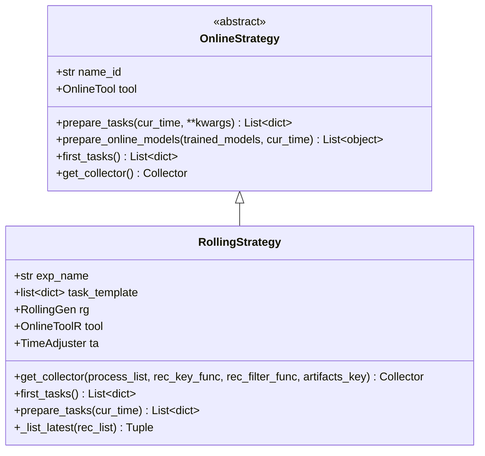

# qlib/workflow/online/strategy.py

## 模块概述

`strategy.py` 模块提供了在线服务（online serving）的元素 `OnlineStrategy` 类。

## 类说明

### OnlineStrategy

OnlineStrategy 与 Online Manager 一起工作，响应如何生成任务、更新模型和准备信号。

#### 构造方法参数

| 参数 | 类型 | 说明 |
|------|------|------|
| name_id | str | 唯一名称或 ID |

**注意：**
- 此模块**必须**使用 `Trainer` 来完成模型训练
- 可以通过 `trainer` 参数传入 Trainer 实例

#### 重要方法

##### prepare_tasks()

在例程结束后，检查是否需要基于 cur_time（None 表示最新）准备和训练一些新任务。返回等待训练的新任务。

```python
def prepare_tasks(self, cur_time, **kwargs) -> List[dict]
```

**参数：**

| 参数 | 类型 | 说明 |
|------|------|------|
| cur_time | pd.Timestamp | 当前时间 |
| **kwargs | dict | 其他参数 |

**返回值：**
- `List[dict]`: 新任务列表

**说明：**
- 这是一个抽象方法，子类必须实现
- 可以通过 `OnlineTool.online_models` 找到最后的在线模型

##### prepare_online_models()

从训练好的模型中选择一些模型并将它们设置为在线模型。

```python
def prepare_online_models(self, trained_models, cur_time=None) -> List[object]
```

**参数：**

| 参数 | 类型 | 说明 |
|------|------|------|
| trained_models | list | 模型列表 |
| cur_time | pd.Timestamp, 可选 | 当前时间，默认为 None |

**返回值：**
- `List[object]`: 在线模型列表

**说明：**
- 这是将所有训练好的模型设置为在线的典型实现
- 可以重写此方法以实现复杂方法
- 可以通过 `OnlineTool.online_models` 找到最后的在线模型
- 重置所有在线模型为训练好的模型
- 如果没有训练好的模型，则不执行任何操作

**注意：** 当前实现非常简单。以下是一个更接近实际场景的更复杂情况：
1. 在 `test_start` 之前的一天训练新模型（时间戳 `T`）
2. 在 `test_start` 切换模型（通常在时间戳 `T + 1`）

##### first_tasks()

首先生成一系列任务并返回它们。

```python
def first_tasks(self) -> List[dict]
```

**返回值：**
- `List[dict]`: 任务列表

**说明：**
- 这是一个抽象方法，子类必须实现

##### get_collector()

获取 `Collector` 实例以收集此策略的不同结果。

```python
def get_collector(self) -> Collector
```

**返回值：**
- `Collector`: 收集器实例

**说明：**
- 这是一个抽象方法，子类必须实现
- 例如：
  1. 从 Recorder 中收集预测
  2. 从文本文件中收集信号

---

### RollingStrategy

此示例策略始终使用最新的滚动模型作为在线模型。

#### 构造方法参数

| 参数 | 类型 | 说明 |
|------|------|------|
| name_id | str | 唯一名称或 ID。也将是 Experiment 的名称 |
| task_template | dict or List[dict] | task_template 列表或单个模板，将用于使用 rolling_gen 生成许多任务 |
| rolling_gen | RollingGen | RollingGen 实例 |

**假设：**
- `name_id`、实验名称和 trainer 的实验名称相同

#### 重要方法

##### get_collector()

获取 `Collector` 实例以收集结果。返回的收集器必须区分不同模型中的结果。

```python
def get_collector(self, process_list=[RollingGroup()], rec_key_func=None, rec_filter_func=None, artifacts_key=None) -> Collector
```

**参数：**

| 参数 | 类型 | 说明 |
|------|------|------|
| process_list | list, 可选 | 处理函数列表，默认为 [RollingGroup()] |
| rec_key_func | Callable, 可选 | 获取记录器键的函数。如果为 None，使用记录器 ID |
| rec_filter_func | Callable, 可选 | 通过返回 True 或 False 过滤记录器 |
| artifacts_key | List[str], 可选 | 要获取的工件键。如果为 None，获取所有工件 |

**返回值：**
- `Collector`: 收集器实例

**假设：**
- 模型可以基于模型名称和滚动测试段进行区分
- 如果不想要此假设，请实现您自己的方法或使用另一个 rec_key_func

**示例：**
```python
from qlib.workflow.online.strategy import RollingStrategy

# 创建滚动策略
strategy = RollingStrategy(
    name_id="my_strategy",
    task_template=task_template,
    rolling_gen=rolling_gen
)

# 获取收集器
collector = strategy.get_collector()
```

##### first_tasks()

使用 rolling_gen 基于 task_template 生成不同的任务。

```python
def first_tasks(self) -> List[dict]
```

**返回值：**
- `List[dict]`: 任务列表

**示例：**
```python
# 首次生成任务
tasks = strategy.first_tasks()
print(f"Generated {len(tasks)} tasks")
```

##### prepare_tasks()

基于 cur_time（None 表示最新）准备新任务。

```python
def prepare_tasks(self, cur_time) -> List[dict]
```

**参数：**

| 参数 | 类型 | 说明 |
|------|------|------|
| cur_time | pd.Timestamp | 当前时间 |

**返回值：**
- `List[dict]`: 新任务列表

**说明：**
- 可以通过 `OnlineToolR.online_models` 找到最后的在线模型

**示例：**
```python
# 准备当前时间的新任务
tasks = strategy.prepare_tasks(cur_time="2021-01-01")
print(f"Prepared {len(tasks)} new tasks")
```

## 使用示例

### 基本 OnlineStrategy

```python
from qlib.workflow.online.strategy import OnlineStrategy

class MyStrategy(OnlineStrategy):
    def prepare_tasks(self, cur_time, **kwargs):
        # 准备新任务的逻辑
        return tasks

    def first_tasks(self):
        # 首次生成任务的逻辑
        return tasks

    def get_collector(self):
        # 获取收集器的逻辑
        return collector

# 创建策略
strategy = MyStrategy(name_id="my_strategy")
```

### 滚动策略

```python
from qlib.workflow.online.strategy import RollingStrategy
from qlib.workflow.task.gen import RollingGen

# 创建滚动生成器
rolling_gen = RollingGen(step=30, rtype=RollingGen.ROLL_OL)

# 创建滚动策略
strategy = RollingStrategy(
    name_id="my_rolling_strategy",
    task_template={
        "model": {
            "class": "LGBModel",
            "module_path": "qlib.contrib.model.gbdt"
        },
        "dataset": {
            "class": "DatasetH",
            "module_path": "qlib.data.dataset"
        }
    },
    rolling_gen=rolling_gen
)

# 获取收集器
collector = strategy.get_collector()

# 首次生成任务
tasks = strategy.first_tasks()

# 准备新任务
new_tasks = strategy.prepare_tasks(cur_time="2021-01-01")
```

## 类关系图



## 注意事项

1. **策略设计：**
   - `OnlineStrategy` 是基类，子类必须实现抽象方法
   - `RollingStrategy` 是一个示例实现

2. **时间管理：**
   - `prepare_tasks` 使用 `cur_time` 参数来确定何时准备新任务
   - 如果不指定 `cur_time`，则使用最新日期

3. **模型管理：**
   - `prepare_online_models` 负责设置在线模型
   - 默认实现将所有训练好的模型设置为在线

4. **收集器：**
   - `get_collector` 返回的收集器必须区分不同模型的结果
   - `RollingStrategy` 假设模型可以基于模型名称和滚动测试段进行区分

5. **任务生成：**
   - `first_tasks` 用于首次生成任务
   - `prepare_tasks` 用于在例程中准备新任务

6. **滚动策略：**
   - 使用 `RollingGen` 生成不同的时间段
   - 总是使用最新的滚动模型作为在线模型
