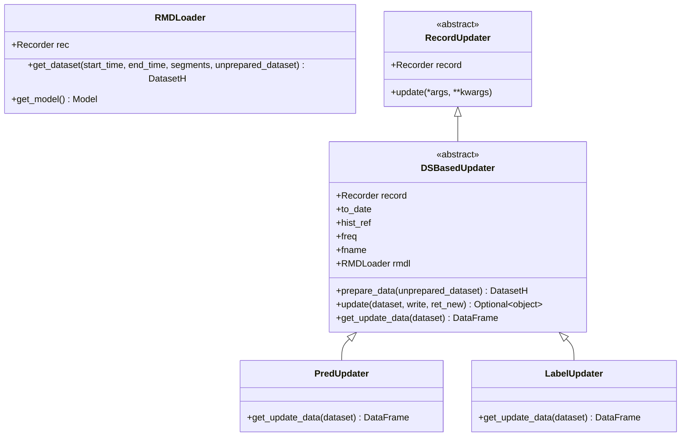
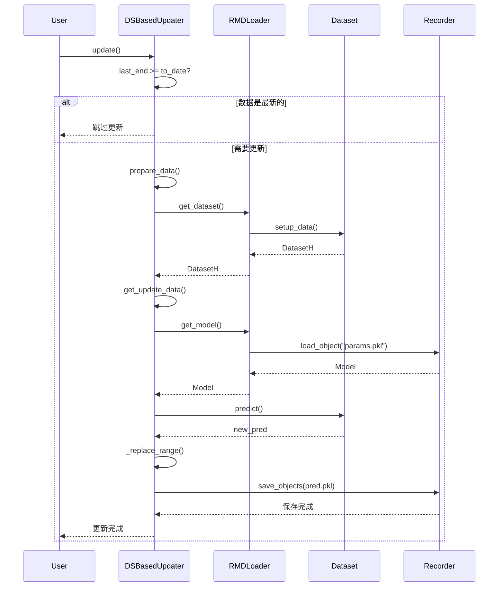

# qlib/workflow/online/update.py

## 模块概述

`update.py` 模块提供了当股票数据更新时更新工件（如预测）的功能。

## 类说明

### RMDLoader

Recorder Model Dataset Loader（记录器模型数据集加载器）

#### 构造方法参数

| 参数 | 类型 | 说明 |
|------|------|------|
| rec | Recorder | 记录器实例 |

#### 重要方法

##### get_dataset()

加载、配置和设置数据集。此数据集用于推理。

```python
def get_dataset(
    self, start_time, end_time, segments=None, unprepared_dataset: Optional[DatasetH] = None
) -> DatasetH
```

**参数：**

| 参数 | 类型 | 说明 |
|------|------|------|
| start_time | str or pd.Timestamp | 底层数据的开始时间 |
| end_time | str or pd.Timestamp | 底层数据的结束时间 |
| segments | dict, 可选 | 数据集的段配置。由于时间序列数据集（TSDatasetH），测试段可能不同于 start_time 和 end_time |
| unprepared_dataset | DatasetH, 可选 | 如果用户不想从记录器加载数据集，请指定用户的数据集 |

**返回值：**
- `DatasetH`: DatasetH 实例

**示例：**
```python
from qlib.workflow.online.update import RMDLoader

# 创建加载器
loader = RMDLoader(recorder=my_recorder)

# 加载数据集
dataset = loader.get_dataset(
    start_time="2021-01-01",
    end_time="2021-12-31"
)

# 使用未准备的数据集
dataset = loader.get_dataset(
    start_time="2021-01-01",
    end_time="2021-12-31",
    unprepared_dataset=my_dataset
)
```

##### get_model()

获取模型。

```python
def get_model(self) -> Model
```

**返回值：**
- `Model`: 模型实例

**示例：**
```python
model = loader.get_model()
```

---

### RecordUpdater

更新特定记录器的抽象基类。

#### 构造方法参数

| 参数 | 类型 | 说明 |
|------|------|------|
| record | Recorder | 记录器实例 |
| *args | any | 其他位置参数 |
| **kwargs | dict | 其他关键字参数 |

#### 重要方法

##### update()

更新特定记录器的信息。

```python
def update(self, *args, **kwargs)
```

**参数：**

| 参数 | 类型 | 说明 |
|------|------|------|
| *args | any | 位置参数 |
| **kwargs | dict | 关键字参数 |

**说明：**
- 这是一个抽象方法，子类必须实现

---

### DSBasedUpdater

基于数据集的更新器。

#### 功能说明

- 提供基于 Qlib Dataset 的数据更新功能

#### 假设

- 基于 Qlib dataset
- 要更新的数据是多级索引的 pd.DataFrame。例如标签、预测

**数据格式示例：**

```
                                    LABEL0
            datetime   instrument
            2021-05-10 SH600000    0.006965
                       SH600004    0.003407
            ...                         ...
            2021-05-28 SZ300498    0.015748
                       SZ300676   -0.001321
```

#### 构造方法参数

| 参数 | 类型 | 说明 |
|------|------|------|
| record | Recorder | 记录器实例 |
| to_date | str or pd.Timestamp, 可选 | 更新预测到此日期 |
| from_date | str or pd.Timestamp, 可选 | 从此日期开始更新 |
| hist_ref | int, 可选 | 有时数据集会有历史依赖。留给用户设置历史依赖的长度。如果用户未指定此参数，Updater 将尝试自动加载数据集以确定 hist_ref |
| freq | str | 频率，默认为 "day" |
| fname | str | 文件名，默认为 "pred.pkl" |
| loader_cls | type | 用于加载模型和数据集的类，默认为 RMDLoader |

**预期行为：**

- 如果 `to_date` 大于日历中的最大日期，数据将更新到最新日期
- 如果 `from_date` 之前或 `to_date` 之后有数据，则只有 `from_date` 和 `to_date` 之间的数据会受到影响

**注意：**
- `start_time` 不包括在 `hist_ref` 中；因此 `hist_ref` 在大多数情况下为 `step_len - 1`

#### 重要方法

##### prepare_data()

加载数据集。

```python
def prepare_data(self, unprepared_dataset: Optional[DatasetH] = None) -> DatasetH
```

**参数：**

| 参数 | 类型 | 说明 |
|------|------|------|
| unprepared_dataset | DatasetH, 可选 | 如果指定，则直接准备数据集；否则，加载并准备 |

**返回值：**
- `DatasetH`: DatasetH 实例

**说明：**
- 如果指定 `unprepared_dataset`，则准备数据集直接
- 否则：
  - 自动获取历史依赖（如果未指定）
  - 分离此函数将使其更容易重用

**示例：**
```python
# 准备数据集（自动加载）
dataset = updater.prepare_data()

# 使用未准备的数据集
dataset = updater.prepare_data(unprepared_dataset=my_dataset)
```

##### update()

更新信息。

```python
def update(self, dataset: DatasetH = None, write: bool = True, ret_new: bool = False) -> Optional[object]
```

**参数：**

| 参数 | 类型 | 说明 |
|------|------|------|
| dataset | DatasetH, 可选 | DatasetH 实例。如果为 None，则再次准备 |
| write | bool | 是否执行写入操作，默认为 True |
| ret_new | bool | 是否返回更新后的数据，默认为 False |

**返回值：**
- `Optional[object]`: 更新后的数据集（如果 `ret_new=True`）

**说明：**
- 如果数据已是最新的，则跳过更新
- 如果未指定数据集，则准备数据集（用于重用）
- 调用 `get_update_data` 获取更新后的数据
- 如果 `write=True`，则保存更新后的数据

**注意：**
以下问题尚未解决：
```
RuntimeError: Attempting to deserialize object on a CUDA device but torch.cuda.is_available() is False. If you are running on a CPU-only machine, please use torch.load with map_location=torch.device('cpu') to map your storages to CPU.
```
参考：https://github.com/pytorch/pytorch/issues/16797

**示例：**
```python
# 更新并保存
updater.update(dataset=dataset)

# 更新但不保存
updater.update(dataset=dataset, write=False=False)

# 更新并返回新数据
new_data = updater.update(dataset=dataset, ret_new=True)
```

##### get_update_data()

基于给定的数据集返回更新后的数据。

```python
def get_update_data(self, dataset: Dataset) -> pd.DataFrame
```

**参数：**

| 参数 | 类型 | 说明 |
|------|------|------|
| dataset | Dataset | 数据集实例 |

**返回值：**
- `pd.DataFrame`: 更新后的数据

**说明：**
- 这是一个抽象方法，子类必须实现

**注意：**
`get_update_data` 和 `update` 的区别：
- `get_update_data` 只包括一些数据特定功能
- `update` 包括一些常规例程步骤（例如准备数据集、检查）

---

### PredUpdater

更新记录器中的预测。

#### 构造方法参数

继承自 `DSBasedUpdater`，使用相同的参数。

#### 重要方法

##### get_update_data()

基于给定的数据集返回更新后的预测数据。

```python
def get_update_data(self, dataset: Dataset) -> pd.DataFrame
```

**参数：**

| 参数 | 类型 | 说明 |
|------|------|------|
| dataset | Dataset | 数据集实例 |

**返回值：**
- `pd.DataFrame`: 更新后的预测数据

**说明：**
- 加载模型
- 使用模型预测新数据
- 替换旧数据中的相应范围

**示例：**
```python
from qlib.workflow.online.update import PredUpdater

# 创建预测更新器
pred_updater = PredUpdater(
    record=my_recorder,
    to_date="2021-12-31"
)

# 更新预测
pred_updater.update()
```

---

### LabelUpdater

更新记录器中的标签。

#### 功能说明

- 标签从 `record_temp.SignalRecord` 生成

#### 构造方法参数

继承自 `DSBasedUpdater`，使用相同的参数。注意 `fname` 默认为 "label.pkl"。

#### 重要方法

##### get_update_data()

基于给定的数据集返回更新后的标签数据。

```python
def get_update_data(self, dataset: Dataset) -> pd.DataFrame
```

**参数：**

| 参数 | 类型 | 说明 |
|------|------|------|
| dataset | Dataset | 数据集实例 |

**返回值：**
- `pd.DataFrame`: 更新后的标签数据

**说明：**
- 使用 `SignalRecord.generate_label` 生成新标签
- 替换旧数据中的相应范围

**示例：**
```python
from qlib.workflow.online.update import LabelUpdater

# 创建标签更新器
label_updater = LabelUpdater(
    record=my_recorder,
    to_date="2021-12-31"
)

# 更新标签
label_updater.update()
```

## 使用示例

### 更新预测

```python
from qlib.workflow.online.update import PredUpdater

# 创建预测更新器
pred_updater = PredUpdater(
    record=my_recorder,
    to_date="2021-12-31",
    from_date="2021-01-01"
)

# 更新预测
pred_updater.update()

# 更新预测并返回新数据
new_pred = pred_updater.update(ret_new=True)
```

### 更新标签

```python
from qlib.workflow.online.update import LabelUpdater

# 创建标签更新器
label_updater = LabelUpdater(
    record=my_recorder,
    to_date="2021-12-31"
)

# 更新标签
label_updater.update()
```

### 使用自定义数据集

```python
from qlib.workflow.online.update import PredUpdater

# 创建更新器
updater = PredUpdater(
    record=my_recorder,
    to_date="2021-12-31"
)

# 准备数据集
dataset = updater.prepare_data(unprepared_dataset=my_dataset)

# 使用准备好的数据集更新
updater.update(dataset=dataset)
```

### 指定历史依赖

```python
from qlib.workflow.online.update import PredUpdater

# 创建更新器，指定历史依赖长度
updater = PredUpdater(
    record=my_recorder,
    to_date="2021-12-31",
    hist_ref=10  # 使用 10 个历史数据点
)

# 更新预测
updater.update()
```

## 类关系图



## 数据更新流程



## 注意事项

1. **数据集加载：**
   - `RMDLoader` 用于加载模型和数据集
   - 数据集用于推理
   - 可以使用未准备的数据集

2. **更新器类型：**
   - `RecordUpdater`: 抽象基类
   - `DSBasedUpdater`: 基于数据集的更新器
   - `PredUpdater`: 更新预测
   - `LabelUpdater`: 更新标签

3. **时间范围：**
   - `to_date`: 更新到此日期
   - `from_date`: 从此日期开始更新
   - 如果未指定 `from_date`，则从最后一个数据点之后开始

4. **历史依赖：**
   - `hist_ref`: 历史依赖长度
   - 如果未指定，会自动从数据集确定
   - `start_time` 不包括在 `hist_ref` 中

5. **数据格式：**
   - 数据必须是多级索引的 pd.DataFrame
   - 索引通常包括 "datetime" 和 "instrument"

6. **写入控制：**
   - `write=True`: 执行写入操作
   - `write=False`: 只执行更新，不保存

7. **返回控制：**
   - `ret_new=True`: 返回更新后的数据
   - `ret_new=False`: 不返回数据

8. **GPU/CPU 兼容性：**
   - 在 GPU 上训练的模型可能无法在 CPU 上加载
   - 需要使用适当的 map_location 参数
