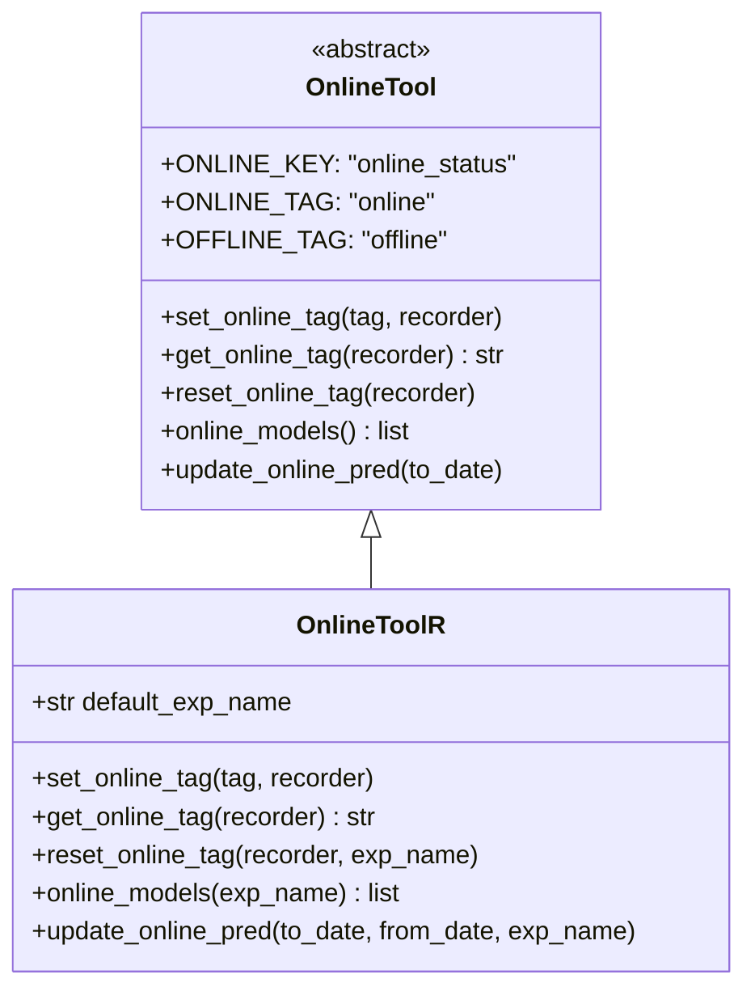

# qlib/workflow/online/utils.py

## 模块概述

`utils.py` 模块提供了 `OnlineTool` 和 `OnlineToolR` 类，用于设置和取消设置一系列"在线"（online）模型。

"在线"模型是在某些时间点的决策模型，可以随时间变化而改变。这允许我们使用高效的子模型作为市场风格变化。

## 类说明

### OnlineTool

OnlineTool 将管理包含模型记录器的实验中的"在线"模型。

#### 类属性

| 属性名 | 值 | | 说明 |
|--------|-----|------|------|
| ONLINE_KEY | "online_status" | 记录器中的在线状态键 |
| ONLINE_TAG | "online" | 'online' 模型标记 |
| OFFLINE_TAG | "offline" | 'offline' 模型标记，不用于在线服务 |

#### 构造方法参数

无参数。

#### 重要方法

##### set_online_tag()

将标记设置到模型以标记是否在线。

```python
def set_online_tag(self, tag, recorder: Union[list, object])
```

**参数：**

| 参数名 | 类型 | 说明 |
|--------|------|------|
| tag | str | `ONLINE_TAG` 或 `OFFLINE_TAG` 中的标记 |
| recorder | list or object | 模型的记录器 |

##### get_online_tag()

给定模型记录器并返回其在线标记。

```python
def get_online_tag(self, recorder: object) -> str
```

**参数：**

| 参数 | 类型 | 说明 |
|------|------|------|
| recorder | object | 模型的记录器 |

**返回值：**
- `str`: 在线标记

##### reset_online_tag()

离线所有模型并将记录器设置为 'online'。

```python
def reset_online_tag(self, recorder: Union[list, object]])
```

**参数：**

| 参数 | 类型 | 说明 |
|------|------|------|
| recorder | list or object | 要重置为 'online' 的记录器 |

##### online_models()

获取当前"在线"模型。

```python
def online_models(self) -> list
```

**返回值：**
- `list`: "在线"模型列表

##### update_online_pred()

将"在线"模型的预测更新到指定日期。

```python
def update_online_pred(self, to_date=None)
```

**参数：**

| 参数 | 类型 | 说明 |
|------|------|------|
| to_date | pd.Timestamp | 此日期之前的预测将被更新。None 表示更新到最新 |

---

### OnlineToolR

基于 (R)ecorder 的 OnlineTool 实现。

#### 构造方法参数

| 参数 | 类型 | 说明 |
|------|------|------|
| default_exp_name | str, 可选 | 默认实验名称 |

#### 重要方法

##### set_online_tag()

将标记设置到模型的记录器以标记是否在线。

```python
def set_online_tag(self, tag, recorder: Union[Recorder, List]])
```

**参数：**

| 参数 | 类型 | 说明 |
|------|------|------|
| tag | str | `ONLINE_TAG`、`NEXT_ONLINE_TAG` 或 `OFFLINE_TAG` 中的标记 |
| recorder | Recorder or List[Recorder] | Recorder 列表或 Recorder 实例 |

**示例：**
```python
from qlib.workflow.online.utils import OnlineToolR

tool = OnlineToolR(default_exp_name="my_exp")

# 设置单个模型为在线
tool.set_online_tag("online", recorder)

# 设置多个模型为在线
tool.set_online_tag("online", [recorder1, recorder2])

# 设置模型为离线
tool.set_online_tag("offline", recorder)
```

##### get_online_tag()

给定模型记录器并返回其在线标记。

```python
def get_online_tag(self, recorder: Recorder) -> str
```

**参数：**

| 参数 | 类型 | 说明 |
|------|------|------|
| recorder | Recorder | Recorder 实例 |

**返回值：**
- `str`: 在线标记（默认为 "offline"）

**示例：**
```python
tag = tool.get_online_tag(recorder)
print(f"Model status: {tag}")  # "online" 或 "offline"
```

##### reset_online_tag()

离线所有模型并将记录器设置为 'online'。

```python
def reset_online_tag(self, recorder: Union[Recorder, List], exp_name: str = None)
```

**参数：**

| 参数 | 类型 | 说明 |
|------|------|------|
| recorder | Recorder or List[Recorder] | 要重置为 'online' 的记录器 |
| exp_name | str, 可选 | 实验名称。如果为 None，则使用 default_exp_name |

**说明：**
- 先将所有模型设置为离线
- 然后将指定记录器设置为在线

**示例：**
```python
# 重置单个模型为在线，其他为离线
tool.reset_online_tag(recorder, exp_name="my_exp")

# 重置多个模型为在线，其他为离线
tool.reset_online_tag([recorder1, recorder2], exp_name="my_exp")
```

##### online_models()

获取当前"在线"模型。

```python
def online_models(self, exp_name: str = None) -> list
```

**参数：**

| 参数 | 类型 | 说明 |
|------|------|------|
| exp_name | str, 可选 | 实验名称。如果为 None，则使用 default_exp_name |

**返回值：**
- `list`: "在线"模型列表

**示例：**
```python
# 获取所有在线模型
online_models = tool.online_models(exp_name="my_exp")
print(f"Online models: {len(online_models)}")
```

##### update_online_pred()

将在线模型的预测更新到指定日期。

```python
def update_online_pred(self, to_date=None, from_date=None, exp_name: str = None)
```

**参数：**

| 参数 | 类型 | 说明 |
|------|------|------|
| to_date | pd.Timestamp | 此日期之前的预测将被更新。None 表示更新到日历中的最新时间 |
| from_date | pd.Timestamp | 从此日期开始更新 |
| exp_name | str, 可选 | 实验名称。如果为 None，则使用 default_exp_name |

**说明：**
- 获取所有在线模型
- 对每个在线模型，更新其预测
- 跳过没有预测文件的记录器

**示例：**
```python
# 更新所有在线模型的预测到最新日期
tool.update_online_pred(exp_name="my_exp")

# 更新到指定日期
tool.update_online_pred(to_date="2021-12-31", exp_name="my_exp")

# 更新指定日期范围
tool.update_online_pred(
    from_date="2021-01-01",
    to_date="2021-12-31",
    exp_name="my_exp"
)
```

## 使用示例

### 基本使用

```python
from qlib.workflow.online.utils import OnlineToolR

# 创建在线工具
tool = OnlineToolR(default_exp_name="my_exp")

# 设置模型为在线
tool.set_online_tag("online", my_recorder)

# 获取在线模型
online_models = tool.online_models()
print(f"Online models: {len(online_models)}")

# 更新在线模型预测
tool.update_online_pred()
```

### 管理多个模型

```python
# 获取所有记录器
all_recorders = list_all_recorders()

# 设置部分模型为在线
online_recorders = all_recorders[:10]
tool.set_online_tag("online", online_recorders)

# 重置为新的在线模型
new_online_recorders = all_recorders[10:20]
tool.reset_online_tag(new_online_recorders, exp_name="my_exp")
```

## 类关系图



## 注意事项

1. **标记类型：**
   - `ONLINE_TAG`: 在线模型
   - `OFFLINE_TAG`: 离线模型，不用于在线服务

2. **实验名称：**
   - `OnlineToolR` 需要指定实验名称
   - 可以通过 `default_exp_name` 设置默认值
   - 也可以在方法调用时指定

3. **预测更新：**
   - `update_online_pred` 会更新所有在线模型的预测
   - 跳过没有预测文件的记录器
   - 可以指定日期范围

4. **模型管理：**
   - `reset_online_tag` 会先将所有模型设置为离线
   - 然后将指定记录器设置为在线
   - 这确保只有指定的模型是在线的
