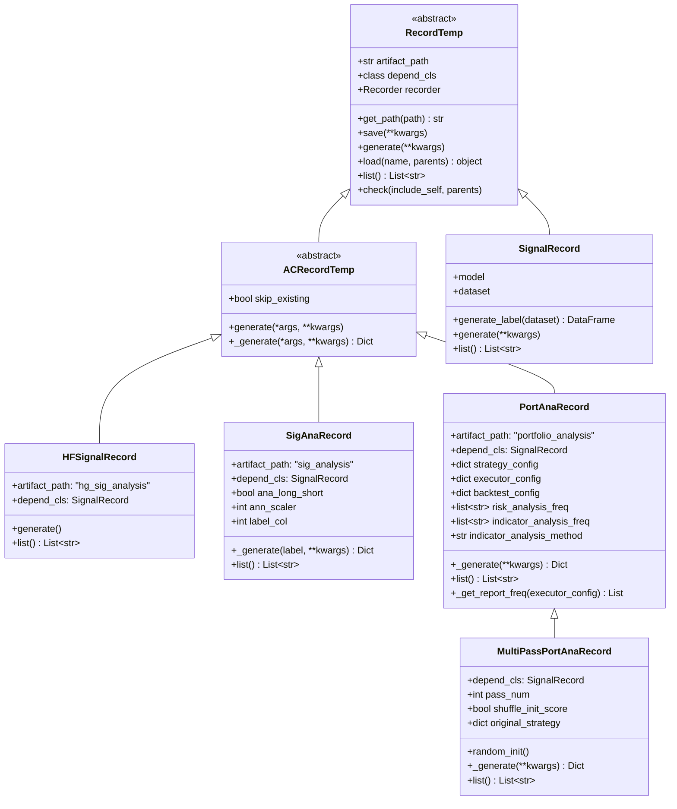
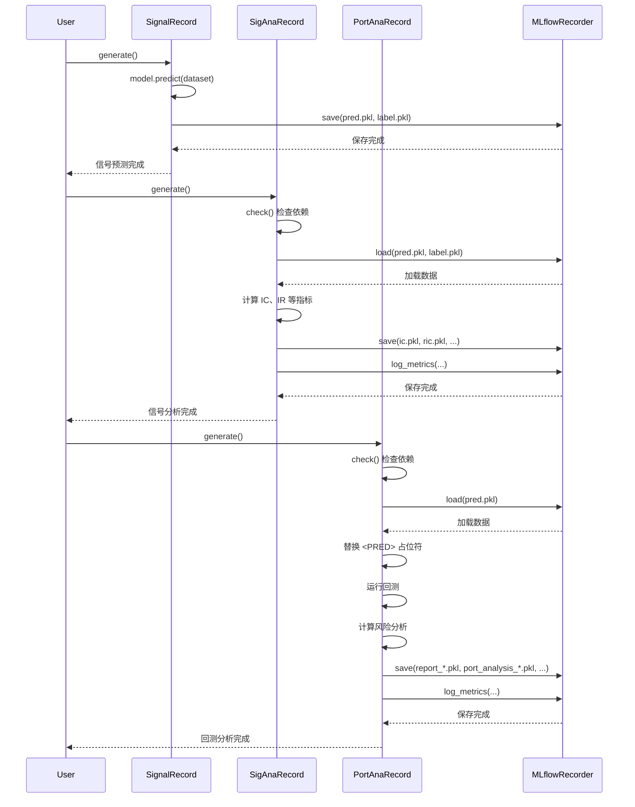
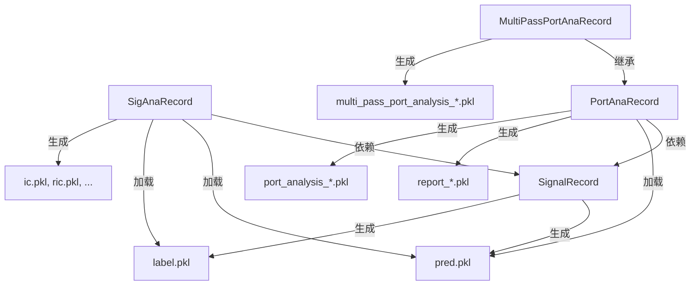

# qlib/workflow/record_temp.py

## 模块概述

`record_temp.py` 模块提供了记录模板功能，用于生成实验结果，如 IC、回测等特定格式的结果。该模块定义了多种记录模板类，用于自动生成和管理实验结果。

该模块的主要功能包括：
- 生成信号预测记录
- 生成信号分析记录（IC、IR 等）
- 生成投资组合分析记录（回测结果）
- 支持多次回测的投资组合分析
- 自动检查依赖和缓存

## 类说明

### RecordTemp

记录模板基类，使用户能够生成 IC 和回测等实验结果。

#### 类属性

| 属性名 | 类型 | 说明 |
|--------|------|------|
| artifact_path | str, None | 工件路径，默认为 None |
| depend_cls | class, None | 记录的依赖类。记录将依赖于 `depend_cls` 生成的结果 |

#### 构造方法参数

| 参数名 | 类型 | 说明 |
|--------|------|------|
| recorder | Recorder | 用于保存记录的记录器 |

#### 属性

| 属性名 | 类型 | 说明 |
|--------|------|------|
| recorder | Recorder | 记录器实例 |

#### 重要方法

##### get_path()

获取工件路径。

```python
@classmethod
def get_path(cls, path=None) -> str
```

**参数：**

| 参数名 | 类型 | 说明 |
|--------|------|------|
| path | str, 可选 | 要附加的路径 |

**返回值：**
- 拼接后的路径字符串

**示例：**
```python
# 假设 artifact_path = "analysis"
path = RecordTemp.get_path("result.pkl")  # 返回 "analysis/result.pkl"
```

##### save()

保存对象到记录器。

```python
def save(self, **kwargs)
```

**参数：**

| 参数名 | 类型 | 说明 |
|--------|------|------|
| **kwargs | dict | 要保存的对象（名称: 值） |

**说明：**
- 行为与 `self.recorder.save_objects` 相同
- 这是一个更简单的接口，因为用户不必关心 `get_path` 和 `artifact_path`

**示例：**
```python
record_temp.save(
    model=my_model,
    predictions=predictions,
    metrics=metrics_dict
)
```

##### generate()

生成特定记录（如 IC、回测等）并保存。

```python
def generate(self, **kwargs)
```

**参数：**

| 参数名 | 类型 | 说明 |
|--------|------|------|
| **kwargs | dict | 生成记录的参数 |

**说明：**
- 这是一个抽象方法，子类必须实现
- 生成的记录会自动保存

##### load()

从记录器加载对象。

```python
def load(self, name: str, parents: bool = True)
```

**参数：**

| 参数名 | 类型 | 说明 |
|--------|------|------|
| name | str | 要加载的文件名称 |
| parents | bool | 是否在父类中递归查找路径，默认为 True。子类优先级更高 |

**返回值：**
- 存储的记录

**说明：**
- 行为与 `self.recorder.load_object` 相同
- 这是一个更简单的接口，因为用户不必关心 `get_path` 和 `artifact_path`
- 支持在父类中递归查找

**示例：**
```python
# 加载对象
model = record_temp.load("model.pkl")

# 不在父类中查找
model = record_temp.load("model.pkl", parents=False)
```

##### list()

列出支持的工件。

```python
def list(self) -> List[str]
```

**返回值：**
- 所有支持工件的列表

**说明：**
- 用户不必考虑 `self.get_path`

##### check()

检查记录是否正确生成和保存。

```python
def check(self, include_self: bool = False, parents: bool = True)
```

**参数：**

| 参数名 | 类型 | 说明 |
|--------|------|------|
| include_self | bool | 是否包含 self 生成的文件，默认为 False |
| parents | bool | 是否检查父类，默认为 True |

**异常：**
- `FileNotFoundError`: 如果记录未正确存储

**说明：**
- 在以下情况下很有用：
  - 在生成新内容之前检查依赖文件是否完成
  - 检查最终文件是否完成

---

### SignalRecord

信号记录类，用于生成信号预测。继承自 `RecordTemp` 类。

#### 构造方法参数

| 参数名 | 类型 | 说明 |
|--------|------|------|
| model | model, 可选 | 用于预测的模型 |
| dataset | Dataset, 可选 | 数据集 |
| recorder | Recorder | 用于保存记录的记录器 |

#### 重要方法

##### generate_label()

从数据集生成标签。

```python
@staticmethod
def generate_label(dataset) -> pd.DataFrame
```

**参数：**

| 参数名 | 类型 | 说明 |
|--------|------|------|
| dataset | Dataset | 数据集对象 |

**返回值：**
- 标签数据（DataFrame）

**说明：**
- 尝试使用 `DataHandlerLP` 后端处理器
- 如果失败，则使用 `DataHandler` 后端处理器
- 如果数据处理器使用 `drop_raw=True` 初始化，则返回 None

##### generate()

生成信号预测并保存。

```python
def generate(self, **kwargs)
```

**生成的文件：**
- `pred.pkl`: 预测结果
- `label.pkl`: 标签（如果数据集是 `DatasetH` 类型）

**示例：**
```python
from qlib.workflow.record_temp import SignalRecord

# 创建信号记录
signal_record = SignalRecord(
    model=my_model,
    dataset=my_dataset,
    recorder=recorder
)

# 生成预测
signal_record.generate()
```

##### list()

列出支持的工件。

```python
def list(self) -> List[str]
```

**返回值：**
- `["pred.pkl", "label.pkl"]`

---

### ACRecordTemp

自动检查记录模板基类。

#### 构造方法参数

| 参数名 | 类型 | 说明 |
|--------|------|------|
| recorder | Recorder | 用于保存记录的记录器 |
| skip_existing | bool | 如果结果已存在，是否跳过生成，默认为 False |

#### 重要方法

##### generate()

自动检查文件并运行具体的生成任务。

```python
def generate(self, *args, **kwargs)
```

**说明：**
- 如果 `skip_existing=True` 且结果已存在，则跳过生成
- 在生成前检查依赖文件是否存在
- 如果依赖文件不存在，则跳过生成
- 调用 `_generate()` 方法执行实际生成任务
- 保存生成的结果

##### _generate()

运行具体的生成任务，返回生成结果的字典。

```python
def _generate(self, *args, **kwargs) -> Dict[str, object]
```

**参数：**

| 参数名 | 类型 | 说明 |
|--------|------|------|
| *args | any | 位置参数 |
| **kwargs | dict | 关键字参数 |

**返回值：**
- 生成结果的字典

**说明：**
- 这是一个抽象方法，子类必须实现
- 调用者方法会将结果保存到记录器

---

### HFSignalRecord

高频信号分析记录类，用于生成 IC、IR 等分析结果。继承自 `SignalRecord` 类。

#### 类属性

| 属性名 | 值 | | 说明 |
|--------|-----|------|------|
| artifact_path | "hg_sig_analysis" | 工件路径 |
| depend_cls | SignalRecord | 依赖类 |

#### 构造方法参数

| 参数名 | 类型 | 说明 |
|--------|------|------|
| recorder | Recorder | 用于保存记录的记录器 |
| **kwargs | dict | 其他参数 |

#### 重要方法

##### generate()

生成信号分析结果并保存。

```python
def generate(self)
```

**生成的文件：**
- `ic.pkl`: IC 值
- `ric.pkl`: Rank IC 值
- `long_pre.pkl`: 多头精度
- `short_pre.pkl`: 空头精度
- `long_short_r.pkl`: 多空收益
- `long_avg_r.pkl`: 平均多头收益

**记录的指标：**
- `IC`: IC 均值
- `ICIR`: IC / IC.std()
- `Rank IC`: Rank IC 均值
- `Rank ICIR`: Rank IC / Rank IC.std()
- `Long precision`: 多头精度均值
- `Short precision`: 空头精度均值
- `Long-Short Average Return`: 多空收益均值
- `Long-Short Average Sharpe`: 多空收益均值 / 标准差

**示例：**
```python
from qlib.workflow.record_temp import HFSignalRecord

# 创建高频信号分析记录
hf_signal_record = HFSignalRecord(recorder=recorder)

# 生成分析结果
hf_signal_record.generate()
```

##### list()

列出支持的工件。

```python
def list(self) -> List[str]
```

**返回值：**
- `["ic.pkl", "ric.pkl", "long_pre.pkl", "short_pre.pkl", "long_short_r.pkl", "long_avg_r.pkl"]`

---

### SigAnaRecord

信号分析记录类，用于生成 IC、IR 等分析结果。继承自 `ACRecordTemp` 类。

#### 类属性

| 属性名 | 值 | | 说明 |
|--------|-----|------|------|
| artifact_path | "sig_analysis" | 工件路径 |
| depend_cls | SignalRecord | 依赖类 |

#### 构造方法参数

| 参数名 | 类型 | 说明 |
|--------|------|------|
| recorder | Recorder | 用于保存记录的记录器 |
| ana_long_short | bool | 是否分析多空收益，默认为 False |
| ann_scaler | int | 年化缩放因子，默认为 252 |
| label_col | int | 标签列索引，默认为 0 |
| skip_existing | bool | 如果结果已存在，是否跳过生成，默认为 False |

#### 重要方法

##### _generate()

生成信号分析结果。

```python
def _generate(self, label: Optional[pd.DataFrame] = None, **kwargs) -> Dict[str, object]
```

**参数：**

| 参数名 | 类型 | 说明 |
|--------|------|------|
| label | pd.DataFrame, 可选 | 标数据框。如果为 None，则从记录器加载 |

**返回值：**
- 生成结果的字典

**生成的文件：**
- `ic.pkl`: IC 值
- `ric.pkl`: Rank IC 值
- 如果 `ana_long_short=True`：
  - `long_short_r.pkl`: 多空收益
  - `long_avg_r.pkl`: 平均多头收益

**记录的指标：**
- `IC`: IC 均值
- `ICIR`: IC / IC.std()
- `Rank IC`: Rank IC 均值
- `Rank ICIR`: Rank IC / Rank IC.std()
- 如果 `ana_long_short=True`：
  - `Long-Short Ann Return`: 年化多空收益
  - `Long-Short Ann Sharpe`: 年化多空夏普比率
  - `Long-Avg Ann Return`: 年化平均多头收益
  - `Long-Avg Ann Sharpe`: 年化平均多头夏普比率

**示例：**
```python
from qlib.workflow.record_temp import SigAnaRecord

# 创建信号分析记录
signal_ana_record = SigAnaRecord(
    recorder=recorder,
    ana_long_short=True
)

# 生成分析结果
signal_ana_record.generate()
```

##### list()

列出支持的工件。

```python
def list(self) -> List[str]
```

**返回值：**
- 如果 `ana_long_short=False`: `["ic.pkl", "ric.pkl"]`
- 如果 `ana_long_short=True`: `["ic.pkl", "ric.pkl", "long_short_r.pkl", "long_avg_r.pkl"]`

---

### PortAnaRecord

投资组合分析记录类，用于生成回测等分析结果。继承自 `ACRecordTemp` 类。

#### 类属性

| 属性名 | 值 | | 说明 |
|--------|-----|------|------|
| artifact_path | "portfolio_analysis" | 工件路径 |
| depend_cls | SignalRecord | 依赖类 |

#### 构造方法参数

| 参数名 | 类型 | 说明 |
|--------|------|------|
| recorder | Recorder | 用于保存记录的记录器 |
| config | dict, 可选 | 配置字典 |
| risk_analysis_freq | str or List[str], 可选 | 风险分析频率 |
| indicator_analysis_freq | str or List[str], 可选 | 指标分析频率 |
| indicator_analysis_method | str, 可选 | 指标分析方法，可选值：'mean'、'amount_weighted'、'value_weighted' |
| skip_existing | bool | 如果结果已存在，是否跳过生成，默认为 False |
| **kwargs | dict | 其他参数 |

**配置说明：**

`config` 字典包含以下键：

| 键名 | 类型 | 说明 |
|------|------|------|
| strategy | dict | 定义策略类及其参数 |
| executor | dict | 定义执行器类及其参数 |
| backtest | dict | 定义回测参数 |

**默认配置：**

```python
{
    "strategy": {
        "class": "TopkDropoutStrategy",
        "module_path": "qlib.contrib.strategy",
        "kwargs": {"signal": "<PRED>", "topk": 50, "n_drop": 5},
    },
    "backtest": {
        "start_time": None,
        "end_time": None,
        "account": 100000000,
        "benchmark": "SH000300",
        "exchange_kwargs": {
            "limit_threshold": 0.095,
            "deal_price": "close",
            "open_cost": 0.0005,
            "close_cost": 0.0015,
            "min_cost": 5,
        },
    },
}
```

#### 重要方法

##### _generate()

生成投资组合分析结果。

```python
def _generate(self, **kwargs) -> Dict[str, object]
```

**返回值：**
- 生成结果的字典

**生成的文件：**
- `report_normal_{freq}.pkl`: 回测报告
- `positions_normal_{freq}.pkl`: 详细持仓
- `port_analysis_{freq}.pkl`: 投资组合风险分析
- `indicators_normal_{freq}.pkl`: 指标分析
- `indicators_normal_{freq}_obj.pkl`: 指标对象

**记录的指标：**
- 风险分析指标（所有分析频率）：
  - `{freq}.{metric_name}`: 各种风险指标
- 指标分析指标（所有分析频率）：
  - `{freq}.{indicator_name}`: 各种指标值

**说明：**
- 如果未设置回测时间范围，会自动从预测文件中提取
- `<PRED>` 占位符会被替换为之前保存的预测结果
- 执行回测并生成报告和分析结果

**示例：**
```python
from qlib.workflow.record_temp import PortAnaRecord

# 创建回测配置
config = {
    "strategy": {
        "class": "TopkDropoutStrategy",
        "module_path": "qlib.contrib.strategy",
        "kwargs": {"signal": "<PRED>", "topk": 50, "n_drop": 5},
    },
    "backtest": {
        "start_time": "2020-01-01",
        "end_time": "2021-12-31",
        "account": 100000000,
        "benchmark": "SH000300",
    },
}

# 创建投资组合分析记录
port_ana_record = PortAnaRecord(
    recorder=recorder,
    config=config,
    risk_analysis_freq=["1day"],
    indicator_analysis_freq=["1day"]
)

# 生成分析结果
port_ana_record.generate()
```

##### list()

列出支持的工件。

```python
def list(self) -> List[str]
```

**返回值：**
- 所有生成文件的路径列表

---

### MultiPassPortAnaRecord

多次回测投资组合分析记录类，运行多次回测并生成分析结果。继承自 `PortAnaRecord` 类。

#### 类属性

| 属性名 | 值 | | 说明 |
|--------|-----|------|------|
| depend_cls | SignalRecord | 依赖类 |

#### 构造方法参数

| 参数名 | 类型 | 说明 |
|--------|------|------|
| recorder | Recorder | 用于保存记录的记录器 |
| pass_num | int | 回测次数，默认为 10 |
| shuffle_init_score | bool | 是否打乱第一次回测日期的预测分数，默认为 True |
| config | dict, 可选 | 配置字典（继承自 `PortAnaRecord`） |
| risk_analysis_freq | str or List[str], 可选 | 风险分析频率 |
| indicator_analysis_freq | str or List[str], 可选 | 指标分析频率 |
| indicator_analysis_method | str, 可选 | 指标分析方法 |
| skip_existing | bool | 如果结果已存在，是否跳过生成，默认为 False |

**说明：**
- 如果启用 `shuffle_init_score`，第一次回测日期的预测分数会被打乱，使初始持仓随机
- `shuffle_init_score` 仅在信号用作 `<PRED>` 占位符时有效
- 占位符会被替换为记录器中保存的 `pred.pkl`

#### 重要方法

##### random_init()

打乱第一次回测日期的预测分数。

```python
def random_init(self)
```

**说明：**
- 加载 `pred.pkl`
- 获取第一次回测日期
- 打乱该日期的预测分数
- 将打乱后的信号用作策略信号

##### _generate()

生成多次回测的投资组合分析结果。

```python
def _generate(self, **kwargs) -> Dict[str, object]
```

**返回值：**
- 生成结果的字典

**生成的文件：**
- `multi_pass_port_analysis_{freq}.pkl`: 多次回测的投资组合分析结果

**记录的指标：**
- 多次回测的统计指标：
  - `{freq}.mean.{metric_name}`: 均值
  - `{freq}.std.{metric_name}`: 标准差
  - `{freq}.mean_std.{metric_name}`: 均值/标准差

**说明：**
- 对每次回测，如果 `shuffle_init_score=True`，则打乱初始分数
- 收集每次回测的风险分析结果
- 计算多次回测的均值、标准差和均值/标准差
- 只关注 "annualized_return" 和 "information_ratio"

**示例：**
```python
from qlib.workflow.record_temp import MultiPassPortAnaRecord

# 创建配置
config = {
    "strategy": {
        "class": "TopkDropoutStrategy",
        "module_path": "qlib.contrib.strategy",
        "kwargs": {"signal": "<PRED>", "topk": 50, "n_drop": 5},
    },
    "backtest": {
        "start_time": "2020-01-01",
        "end_time": "2021-12-31",
        "account": 100000000,
        "benchmark": "SH000300",
    },
}

# 创建多次回测记录
multi_pass_record = MultiPassPortAnaRecord(
    recorder=recorder,
    pass_num=10,
    shuffle_init_score=True,
    config=config,
    risk_analysis_freq=["1day"]
)

# 生成分析结果
multi_pass_record.generate()
```

##### list()

列出支持的工件。

```python
def list(self) -> List[str]
```

**返回值：**
- 多次回测分析文件的路径列表

## 使用示例

### 完整的工作流示例

```python
from qlib.workflow import R
from qlib.workflow.record_temp import (
    SignalRecord,
    SigAnaRecord,
    PortAnaRecord
)
from qlib.workflow.recorder import Recorder

# 启动实验
R.start_exp(experiment_name="my_exp", recorder_name="run_001")

# 获取记录器
recorder = R.get_recorder()

# 1. 生成信号预测
signal_record = SignalRecord(
    model=my_model,
    dataset=my_dataset,
    recorder=recorder
)
signal_record.generate()

# 2. 生成信号分析
signal_ana_record = SigAnaRecord(
    recorder=recorder,
    ana_long_short=True
)
signal_ana_record.generate()

# 3. 生成回测分析
config = {
    "strategy": {
        "class": "TopkDropoutStrategy",
        "module_path": "qlib.contrib.strategy",
        "kwargs": {"signal": "<PRED>", "topk": 50, "n_drop": 5},
    },
    "backtest": {
        "start_time": "2020-0101",
        "end_time": "2021-12-31",
        "account": 100000000,
        "benchmark": "SH000300",
    },
}
port_ana_record = PortAnaRecord(
    recorder=recorder,
    config=config,
    risk_analysis_freq=["1day"],
    indicator_analysis_freq=["1day"]
)
port_ana_record.generate()

# 结束实验
R.end_exp(recorder_status=Recorder.STATUS_FI)
```

### 多次回测示例

```python
from qlib.workflow.record_temp import MultiPassPortAnaRecord

# 创建多次回测记录
multi_pass_record = MultiPassPortAnaRecord(
    recorder=recorder,
    pass_num=10,
    shuffle_init_score=True,
    config=config,
    risk_analysis_freq=["1day"]
)

# 生成多次回测分析结果
multi_pass_record.generate()
```

### 跳过已存在的文件

```python
from qlib.workflow.record_temp import SigAnaRecord

# 创建记录，设置 skip_existing=True
signal_ana_record = SigAnaRecord(
    recorder=recorder,
    ana_long_short=True,
    skip_existing=True
)

# 如果结果已存在，会跳过生成
signal_ana_record.generate()
```

## 类关系图



## 工作流程



## 依赖关系



## 注意事项

1. **依赖关系：**
   - `SignalRecord` 是基础记录，生成预测和标签
   - `SigAnaRecord` 和 `PortAnaRecord` 都依赖 `SignalRecord`
   - 使用 `depend_cls` 属性建立依赖关系

2. **路径管理：**
   - 每个记录类有不同的 `artifact_path`
   - `get_path()` 方法会自动拼接路径
   - 用户不必关心具体路径

3. **自动检查：**
   - `ACRecordTemp` 提供自动检查功能
   - 可以跳过已存在的文件（`skip_existing=True`）
   - 会在生成前检查依赖文件是否存在

4. **占位符：**
   - `<PRED>` 占位符会被替换为预测结果
   - 在 `PortAnaRecord` 和 `MultiPassPortAnaRecord` 中使用

5. **多次回测：**
   - `MultiPassPortAnaRecord` 运行多次回测
   - 可以打乱初始分数（`shuffle_init_score`）
   - 计算多次回测的统计指标

6. **时间范围：**
   - 如果未设置回测时间范围，会自动从预测文件中提取
   - 结束时间会向后移动一个交易日

7. **指标记录：**
   - 所有生成的指标都会通过 `recorder.log_metrics()` 记录
   - 不同频率的指标会用频率名称作为前缀

8. **安全加载：**
   - 使用 `load()` 方法加载对象时，可以指定是否在父类中查找
   - 子类的路径优先级更高
