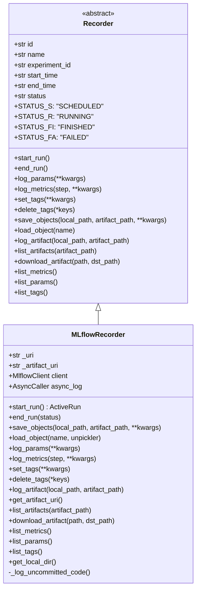
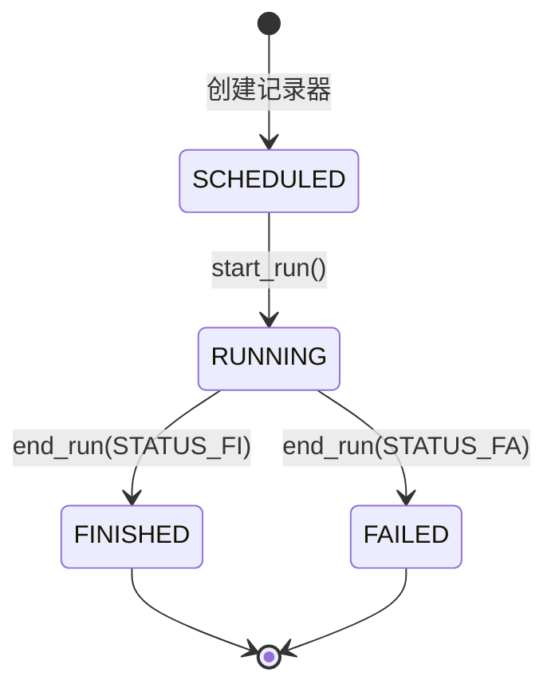
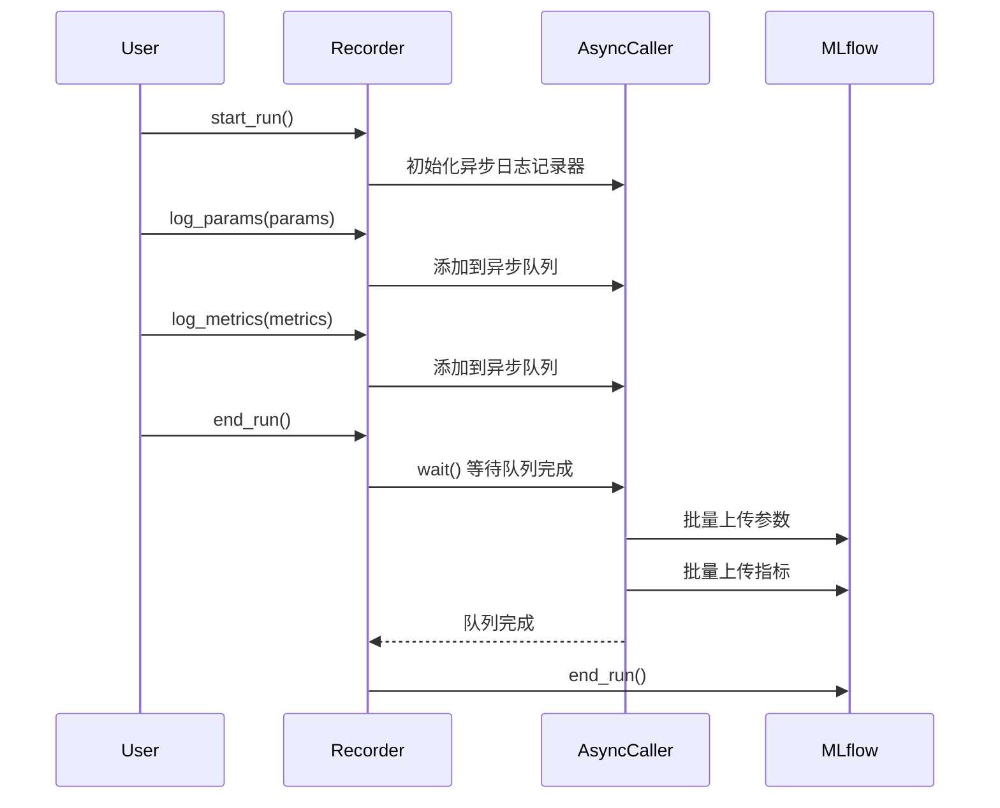

# qlib/workflowflow/recorder.py

## 模块概述

`recorder.py` 模块提供了记录器功能，用于记录实验的参数、指标、标签和工件（artifacts）。API 设计与 MLflow 类似。该模块定义了记录器的抽象接口及其 MLflow 实现。

该模块的主要功能包括：
- 记录实验参数、指标和标签
- 保存和加载实验工件和对象
- 管理记录器的生命周期（启动、结束）
- 自动记录未提交的代码和环境变量
- 异步日志记录功能

## 设计说明

由于 MLflow 只能从文件或目录记录工件，因此使用文件管理器来帮助维护项目中的对象。

不直接使用 MLflow，而是使用包装 MLflow 的接口来记录实验。虽然这需要额外的工作，但给用户带来了以下好处：
- 更方便地更改实验日志后端，而无需无需更改上层代码
- 可以自动执行一些额外操作并使接口更简单，例如：
  - 自动记录未提交的代码
  - 自动记录部分环境变量
  - 用户只需创建不同的记录器即可控制不同的运行（在 MLflow 中，您总是需要切换 artifact_uri 并频繁传入 run id）

## 全局配置

```python
# MLflow 参数值长度限制（默认 500，扩展到 1000）
mlflow.utils.validation.MAX_PARAM_VAL_LENGTH = 1000
```

## 类说明

### Recorder

记录器基类，用于记录实验的抽象接口。API 设计与 MLflow 类似。

#### 记录器状态常量

| 常量名 | 值 | 说明 |
|--------|-----|------|
| STATUS_S | "SCHEDULED" | 已调度，记录器已创建但未开始运行 |
| STATUS_R | "RUNNING" | 运行中，记录器正在运行 |
| STATUS_FI | "FINISHED" | 已完成，记录器成功结束 |
| STATUS_FA | "FAILED" | 已失败，记录器以失败状态结束 |

#### 构造方法参数

| 参数名 | 类型 | 说明 |
|--------|------|------|
| experiment_id | str | 实验的唯一标识符 |
| name | str | 记录器的名称 |

#### 属性

| 属性名 | 类型 | 说明 |
|--------|------|------|
| id | str | 记录器的唯一标识符 |
| name | str | 记录器的名称 |
| experiment_id | str | 所属实验的 ID |
| start_time | str | 开始时间（格式：YYYY-MM-DD HH:MM:SS） |
| end_time | str | 结束时间（格式：YYYY-MM-DD HH:MM:SS） |
| status | str | 记录器状态（SCHEDULED/RUNNING/FINISHED/FAILED） |
| info | dict | 记录器信息字典 |

#### 重要方法

##### start_run()

启动或恢复记录器的运行。

```python
def start_run(self)
```

**返回值：**
- 一个活跃的运行对象（例如 mlflow.ActiveRun 对象）

**说明：**
- 返回值可以在 `with` 块中用作上下文管理器
- 否则必须调用 `end_run()` 来终止当前运行

**示例：**
```python
# 方式 1：使用上下文管理器
with recorder.start_run():
    recorder.log_params({"param": "value"})
    recorder.log_metrics({"metric": 0.95})

# 方式 2：手动调用
recorder.start_run()
recorder.log_params({"param": "value"})
recorder.log_metrics({"metric": 0.95})
recorder.end_run()
```

##### end_run()

结束活跃的记录器。

```python
def end_run(self)
```

**说明：**
- 必须在 `start_run()` 之后调用
- 设置记录器的结束时间和状态

**示例：**
```python
recorder.start_run()
# ... 运行实验 ...
recorder.end_run()
```

##### log_params()

记录一批参数。

```python
def log_params(self, **kwargs)
```

**参数：**

| 参数名 | 类型 | 说明 |
|--------|------|------|
| **kwargs | dict | 要记录的键值对，作为参数 |

**示例：**
```python
recorder.log_params(
    model="LightGBM",
    learning_rate=0.01,
    epochs=100,
    batch_size=32
)
```

##### log_metrics()

记录多个指标。

```python
def log_metrics(self, step=None, **kwargs)
```

**参数：**

| 参数名 | 类型 | 说明 |
|--------|------|------|
| step | int, 可选 | 指标的步骤值 |
| **kwargs | dict | 要记录的键值对，作为指标 |

**示例：**
```python
# 记录指标
recorder.log_metrics(
    accuracy=0.95,
    loss=0.05,
    f1_score=0.93
)

# 记录带步骤的指标
for epoch in range(10):
    recorder.log_metrics(step=epoch, loss=calculate_loss())
```

##### set_tags()

设置一批标签。

```python
def set_tags(self, **kwargs)
```

**参数：**

| 参数名 | 类型 | 说明 |
|--------|------|------|
| **kwargs | dict | 要记录的键值对，作为标签 |

**示例：**
```python
recorder.set_tags(
    model_type="classification",
    dataset="mnist",
    author="user_name"
)
```

##### delete_tags()

删除运行中的一些标签。

```python
def delete_tags(self, *keys)
```

**参数：**

| 参数名 | 类型 | 说明 |
|--------|------|------|
| *keys | str | 要删除的标签名称 |

**示例：**
```python
recorder.delete_tags("tag1", "tag2", "tag3")
```

##### save_objects()

将对象（如预测文件或模型检查点）保存到工件 URI。

```python
def save_objects(self, local_path=None, artifact_path=None, **kwargs)
```

**参数：**

| 参数名 | 类型 | 说明 |
|--------|------|------|
| local_path | str, 可选 | 如果提供，将文件或目录保存到工件 URI |
| artifact_path | str, 可选 | 工件在 URI 中存储的相对路径 |
| **kwargs | dict | 通过关键字参数保存对象（名称: 值） |

**示例：：**
```python
# 方式 1：保存本地文件/目录
recorder.save_objects(
    local_path="/path/to/model.pkl",
    artifact_path="checkpoints/model.pkl"
)

# 方式 2：直接保存 Python 对象
recorder.save_objects(
    model=my_model,
    predictions=pred_array,
    metrics_dict=metrics
)
```

##### load_object()

加载对象（如预测文件或模型检查点）。

```python
def load_object(self, name)
```

**参数：**

| 参数名 | 类型 | 说明 |
|--------|------|------|
| name | str | 要加载的文件名称 |

**返回值：**
- 保存的对象

**示例：**
```python
# 加载保存的对象
model = recorder.load_object("model.pkl")
predictions = recorder.load_object("predictions.pkl")
```

##### log_artifact()

将本地文件或目录作为当前活跃运行的工件记录。

```python
def log_artifact(self, local_path: str, artifact_path: Optional[str] = None)
```

**参数：**

| 参数名 | 类型 | | 说明 |
|--------|------|------|------|
| local_path | str | 要写入的文件路径 |
| artifact_path | str, 可选 | 如果提供，在 `artifact_uri` 中写入的目录 |

**示例：**
```python
# 记录单个文件
recorder.log_artifact("/path/to/config.yaml", "configs/config.yaml")

# 记录目录
recorder.log_artifact("/path/to/checkpoints", "checkpoints")
```

##### list_artifacts()

列出记录器的所有工件。

```python
def list_artifacts(self, artifact_path: str = None)
```

**参数：**

| 参数名 | 类型 | 说明 |
|--------|------|------|
| artifact_path | str, 可选 | 工件在 URI 中存储的相对路径 |

**返回值：**
- 工件信息列表（名称、路径等）

**示例：**
```python
# 列出所有工件
artifacts = recorder.list_artifacts()
print(artifacts)

# 列出特定路径下的工件
checkpoints = recorder.list_artifacts("checkpoints")
```

##### download_artifact()

从运行中下载工件文件或目录到本地目录。

```python
def download_artifact(self, path: str, dst_path: Optional[str] = None) -> str
```

**参数：**

| 参数名 | 类型 | 说明 |
|--------|------|------|
| path | str | 所需工件的相对源路径 |
| dst_path | str, 可选 | 要下载的本地文件系统目标目录的绝对路径。该目录必须已存在。如果未指定，工件将被下载到本地文件系统上一个新的唯一命名目录 |

**返回值：**
- 所需工件的本地路径

**示例：**
```python
# 下载到指定目录
local_path = recorder.download_artifact("model.pkl", dst_path="./downloaded")

# 下载到临时目录
local_path = recorder.download_artifact("model.pkl")
```

##### list_metrics()

列出记录器的所有指标。

```python
def list_metrics(self)
```

**返回值：**
- 指标字典

**示例：**
```python
metrics = recorder.list_metrics()
print(metrics)  # {'accuracy': 0.95, 'loss': 0.05}
```

##### list_params()

列出记录器的所有参数。

```python
def list_params(self)
```

**返回值：**
- 参数字典

**示例：**
```python
params = recorder.list_params()
print(params)  # {'model': 'LightGBM', 'learning_rate': '0.01'}
```

##### list_tags()

列出记录器的所有标签。

```python
def list_tags(self)
```

**返回值：**
- 标签字典

**示例：**
```python
tags = recorder.list_tags()
print(tags)  # {'model_type': 'classification', 'dataset': 'mnist'}
```

---

### MLflowRecorder

使用 MLflow 实现的记录器，继承自 `Recorder`。

#### 构造方法参数

| 参数名 | 类型 | 说明 |
|--------|------|------|
| experiment_id | str | 实验的唯一标识符 |
| uri | str | MLflow tracking server 的 URI |
| name | str, 可选 | 记录器的名称 |
| mlflow_run | mlflow.entities.run.Run, 可选 | 如果提供，从 MLflow Run 对象构造记录器 |

#### 属性

| 属性名 | 类型 | 说明 |
|--------|------|------|
| id | str | 记录器的唯一标识符 |
| name | str | 记录器的名称 |
| experiment_id | str | 所属实验的 ID |
| _uri | str | MLflow tracking server 的 URI |
| _artifact_uri | str | 工件 URI |
| uri | str | tracking URI |
| artifact_uri | str | 工件 URI |
| client | MlflowClient | MLflow 客户端实例 |
| async_log | AsyncCaller | 异步日志记录器 |

#### 重要方法

##### start_run()

启动或恢复记录器的运行。

```python
def start_run(self) -> mlflow.ActiveRun
```

**返回值：**
- mlflow.ActiveRun 对象

**功能说明：**
- 设置 tracking URI
- 启动 MLflow 运行
- 保存运行 ID 和 artifact_uri
- 初始化异步日志记录器
- 自动记录未提交的代码
- 自动记录命令行参数
- 自动记录以 `_QLIB_` 开头的环境变量

**自动记录内容：**
1. 命令行参数：`cmd-sys.argv`
2. 未提交的代码：`git diff`、`git status`、`git diff --cached`
3. 环境变量：所有以 `_QLIB_` 开头的环境变量

**示例：**
```python
run = recorder.start_run()
```

##### end_run()

结束活跃的记录器。

```python
def end_run(self, status: str = Recorder.STATUS_S)
```

**参数：**

| 参数名 | 类型 | 说明 |
|--------|------|------|
| status | str | 记录器的结束状态，必须是以下之一：<br> - Recorder.STATUS_S (SCHEDULED)<br> - Recorder.STATUS_R (RUNNING)<br> - Recorder.STATUS_FI (FINISHED)<br> - Recorder.STATUS_FA (FAILED) |

**功能说明：**
- 设置结束时间
- 更新记录器状态
- 等待异步日志队列完成
- 结束 MLflow 运行

**示例：**
```python
# 成功结束
recorder.end_run(status=Recorder.STATUS_FI)

# 失败结束
recorder.end_run(status=Recorder.STATUS_FA)
```

##### save_objects()

将对象（如预测文件或模型检查点）保存到工件 URI。

```python
def save_objects(self, local_path=None, artifact_path=None, **kwargs)
```

**参数：**

| 参数名 | 类型 | 说明 |
|--------|------|------|
| local_path | str, 可选 | 如果提供，将文件或目录保存到工件 URI |
| artifact_path | str, 可选 | 工件在 URI 中存储的相对路径 |
| **kwargs | dict | 通过关键字参数保存对象（名称: 值） |

**功能说明：**
- 如果提供 `local_path`：
  - 如果是目录，使用 `log_artifacts`
  - 如果是文件，使用 `log_artifact`
- 否则，使用临时目录保存 `**kwargs` 中的对象

**示例：**
```python
# 方式 1：保存本地文件/目录
recorder.save_objects(
    local_path="/path/to/model.pkl",
    artifact_path="checkpoints/model.pkl"
)

# 方式 2：直接保存 Python 对象
recorder.save_objects(
    model=my_model,
    predictions=pred_array
)
```

##### load_object()

从 MLflow 加载对象（如预测文件或模型检查点）。

```python
def load_object(self, name, unpickler=pickle.Unpickler)
```

**参数：**

| 参数名 | 类型 | 说明 |
|--------|------|------|
| name | str | 对象名称 |
| unpickler | unpickler 类 | 自定义反序列化器，默认为 `pickle.Unpickler` |

**返回值：**
- 在 MLflow 中保存的对象

**异常：**
- `LoadObjectError`: 加载对象时发生错误

**功能说明：**
- 下载工件到本地
- 使用 unpickler 加载对象
- 如果是 Azure Blob 存储器，下载后自动删除临时文件以节省磁盘空间

**示例：**
```python
# 使用默认 unpickler
model = recorder.load_object("model.pkl")

# 使用自定义 unpickler（出于安全考虑）
from qlib.utils.serial import RestrictedUnpickler
model = recorder.load_object("model.pkl", unpickler=RestrictedUnpickler)
```

##### log_params()

记录一批参数（异步）。

```python
def log_params(self, **kwargs)
```

**参数：**

| 参数名 | 类型 | 说明 |
|--------|------|------|
| **kwargs | dict | 要记录的键值对，作为参数 |

**说明：**
- 使用异步日志记录器
- 参数值长度限制为 1000（通过全局配置设置）

**示例：**
```python
recorder.log_params(
    model="LightGBM",
    learning_rate=0.01,
    epochs=100
)
```

##### log_metrics()

记录多个指标（异步）。

```python
def log_metrics(self, step=None, **kwargs)
```

**参数：**

| 参数名 | 类型 | 说明 |
|--------|------|------|
| step | int, 可选 | 指标的步骤值 |
| **kwargs | dict | 要记录的键值对，作为指标 |

**说明：**
- 使用异步日志记录器

**示例：**
```python
# 记录指标
recorder.log_metrics(
    accuracy=0.95,
    loss=0.05
)

# 记录带步骤的指标
recorder.log_metrics(step=1, loss=0.1)
recorder.log_metrics(step=2, loss=0.08)
```

##### set_tags()

设置一批标签（异步）。

```python
def set_tags(self, **kwargs)
```

**参数：**

| 参数名 | 类型 | 说明 |
|--------|------|------|
| **kwargs | dict | 要记录的键值对，作为标签 |

**说明：**
- 使用异步日志记录器

**示例：**
```python
recorder.set_tags(
    model_type="classification",
    dataset="mnist"
)
```

##### delete_tags()

删除运行中的一些标签。

```python
def delete_tags(self, *keys)
```

**参数：**

| 参数名 | 类型 | 说明 |
|--------|------|------|
| *keys | str | 要删除的标签名称 |

**示例：**
```python
recorder.delete_tags("tag1", "tag2")
```

##### log_artifact()

将本地文件或目录作为工件记录。

```python
def log_artifact(self, local_path: str, artifact_path: Optional[str] = None)
```

**参数：**

| 参数名 | 类型 | 说明 |
|--------|------|------|
| local_path | str | 要写入的文件路径 |
| artifact_path | str, 可选 | 在 `artifact_uri` 中写入的目录 |

**示例：**
```python
recorder.log_artifact("/path/to/model.pkl", "checkpoints/model.pkl")
```

##### get_artifact_uri()

获取工件的 URI。

```python
def get_artifact_uri(self) -> str
```

**返回值：**
- 工件 URI

**异常：**
- `ValueError`: 如果记录器未正确创建和启动

**示例：**
```python
uri = recorder.get_artifact_uri()
print(f"Artifact URI: {uri}")
```

##### list_artifacts()

列出记录器的所有工件。

```python
def list_artifacts(self, artifact_path=None) -> List[str]
```

**参数：**

| 参数名 | 类型 | 说明 |
|--------|------|------|
| artifact_path | str, 可选 | 工件在 URI 中存储的相对路径 |

**返回值：**
- 工件路径列表

**示例：**
```python
artifacts = recorder.list_artifacts()
print(artifacts)  # ['model.pkl', 'config.yaml', 'predictions.pkl']
```

##### download_artifact()

从运行中下载工件文件或目录到本地目录。

```python
def download_artifact(self, path: str, dst_path: Optional[str] = None) -> str
```

**参数：**

| 参数名 | 类型 | 说明 |
|--------|------|------|
| path | str | 所需工件的相对源路径 |
| dst_path | str, 可选 | 要下载的本地文件系统目标目录的绝对路径 |

**返回值：**
- 所需工件的本地路径

**示例：**
```python
# 下载到指定目录
local_path = recorder.download_artifact("model.pkl", dst_path="./downloaded")

# 下载到临时目录
local_path = recorder.download_artifact("model.pkl")
```

##### list_metrics()

列出记录器的所有指标。

```python
def list_metrics(self) -> Dict[str, float]
```

**返回值：**
- 指标字典

**示例：**
```python
metrics = recorder.list_metrics()
print(metrics)
```

##### list_params()

列出记录器的所有参数。

```python
def list_params(self) -> Dict[str, str]
```

**返回值：**
- 参数字典

**示例：**
```python
params = recorder.list_params()
print(params)
```

##### list_tags()

列出记录器的所有标签。

```python
def list_tags(self) -> Dict[str, str]
```

**返回值：**
- 标签字典

**示例：**
```python
tags = recorder.list_tags()
print(tags)
```

##### get_local_dir()

获取记录器的本地目录路径。

```python
def get_local_dir(self) -> str
```

**返回值：**
- 记录器的本地目录路径

**异常：**
- `RuntimeError`: 如果记录器未保存在本地文件系统中
- `ValueError`: 如果记录器未正确创建和启动

**说明：**
- 仅适用于 `file://` 协议的 URI
- 返回记录器的父目录路径

**示例：**
```python
local_dir = recorder.get_local_dir()
print(f"Local directory: {local_dir}")
```

##### _log_uncommitted_code()

自动记录未提交的代码。

```python
def _log_uncommitted_code(self)
```

**功能说明：**
- MLflow 只记录当前仓库的 commit ID
- 用户通常有很多未提交的更改
- 该方法会自动记录以下内容：
  - `git diff` → `code_diff.txt`
  - `git status` → `code_status.txt`
  - `git diff --cached` → `code_cached.txt`

**限制：**
- 当前只记录当前工作目录的 git 仓库
- 未来可以遍历子目录并记录未提交的更改

**说明：**
- 通常由 `start_run()` 自动调用
- 不应手动调用

## 使用示例

### 基本使用

```python
from qlib.workflow.recorder import MLflowRecorder

# 创建记录器
recorder = MLflowRecorder(
    experiment_id="exp_001",
    uri="mlruns",
    name="run_001"
)

# 启动记录器
run = recorder.start_run()

# 记录参数
recorder.log_params(
    model="LightGBM",
    learning_rate=0.01,
    epochs=100
)

# 记录指标
recorder.log_metrics(
    accuracy=0.95,
    loss=0.05,
    f1_score=0.93
)

# 设置标签
recorder.set_tags(
    model_type="classification",
    dataset="mnist"
)

# 保存对象
recorder.save_objects(
    model=my_model,
    predictions=predictions
)

# 结束记录器
recorder.end_run(status=Recorder.STATUS_FI)
```

### 使用上下文管理器

```python
from qlib.workflow.recorder import MLflowRecorder

recorder = MLflowRecorder(
    experiment_id="exp_001",
    uri="mlruns",
    name="run_001"
)

with recorder.start_run():
    recorder.log_params(model="LightGBM")
    recorder.log_metrics(accuracy=0.95)
    # ... 运行实验 ...
# 自动结束记录器
```

### 加载对象

```python
from qlib.workflow.recorder import MLflowRecorder
from qlib.utils.serial import RestrictedUnpickler  # 出于安全考虑

# 创建记录器（从已有运行）
recorder = MLflowRecorder(
    experiment_id="exp_001",
    uri="mlruns",
    name="run_001"
)

# 加载模型
model = recorder.load_object("model.pkl", unpickler=RestrictedUnpickler)

# 加载预测结果
predictions = recorder.load_object("predictions.pkl")
```

### 列出和搜索记录内容

```python
# 列出所有工件
artifacts = recorder.list_artifacts()
print(f"Artifacts: {artifacts}")

# 列出所有参数
params = recorder.list_params()
print(f"Parameters: {params}")

# 列出所有指标
metrics = recorder.list_metrics()
print(f"Metrics: {metrics}")

# 列出所有标签
tags = recorder.list_tags()
print(f"Tags: {tags}")
```

## 类关系图



## 记录器状态转换



## 异步日志流程



## 注意事项

1. **异步日志记录：**
   - `log_params`、`log_metrics` 和 `set_tags` 使用异步日志记录器
   - 这可能导致上传结果时有延迟
   - 日志记录时间可能不准确
   - `end_run()` 会等待异步队列完成后再结束

2. **参数值长度限制：**
   - MLflow 默认限制参数值长度为 500
   - Qlib 将其扩展到 1000
   - 超过限制的参数值会被截断

3. **自动记录功能：**
   - 启动记录器时会自动记录：
     - 命令行参数（`sys.argv`）
     - 未提交的代码（git diff、git status、git diff --cached）
     - 环境变量（以 `_QLIB_` 开头的变量）

4. **安全性：**
   - 加载对象时应使用安全的 unpickler（如 `RestrictedUnpickler`）
   - 避免加载不可信来源的对象

5. **平台兼容性：**
   - `get_local_dir()` 方法会根据平台（Windows/Unix）处理路径
   - Windows 系统需要额外的路径处理

6. **Azure Blob 存储：**
   - 从 Azure Blob 存储器下载对象后会自动删除临时文件以节省磁盘空间
   - 这种清理只对特定的存储器类型进行

7. **工件管理：**
   - `save_objects` 可以保存本地文件/目录或直接保存 Python 对象
   - 直接保存 Python 对象时会使用临时目录
   - 保存完成后临时目录会被删除
