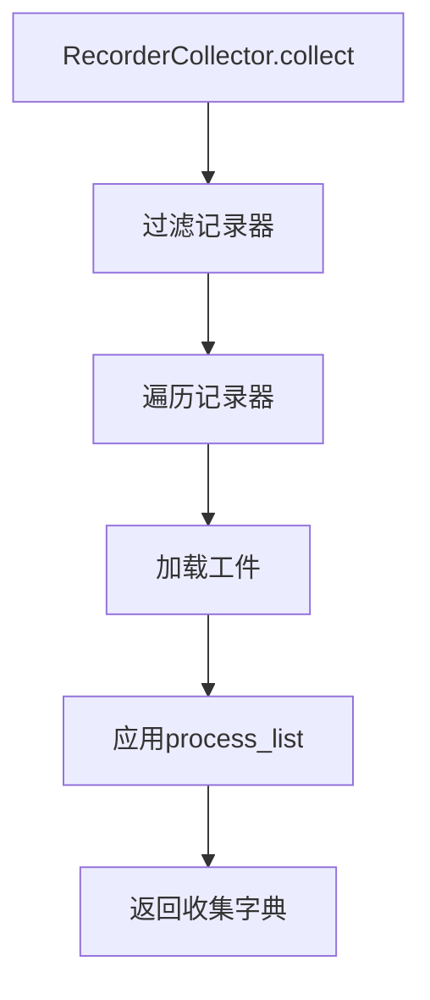

# workflow/task/collect.py 模块文档

## 文件概述

收集器模块可以从各处收集对象并处理它们，例如合并、分组、平均等。

## 类与函数

### Collector 类

收集器基类，用于收集不同的结果。

#### 属性
- \`pickle_backend: str\` - pickle后端（使用dill以dump用户方法）
- \`process_list: List\` - 处理器列表

#### 方法
- \`__init__(self, process_list=[])\` - 初始化
- \`collect(self) -> dict\` - 收集结果并返回{key: things}
- \`process_collect(collected_dict, process_list=[], *args, **kwargs) -> dict\` - 静态方法，对收集的字典进行一系列处理
- \`__call__(self, *args, **kwargs) -> dict\` - 执行收集和处理的完整工作流

### MergeCollector 类

收集其他收集器结果的收集器。

#### 属性
- \`collector_dict: Dict[str, Collector]\` - 收集器字典{collector_key, Collector}
- \`merge_func: Optional[Callable]\` - 生成最外层键的函数

#### 方法
- \`__init__(self, collector_dict, process_list=[], merge_func=None)\` - 初始化
- \`collect(self) -> dict\` - 收集所有结果并重新组合键

### RecorderCollector 类

从Recorder收集结果的收集器。

#### 类常量
- \`ART_KEY_RAW = "__raw"\` - 原始工件键

#### 属性
- \`experiment\` - 实验实例或可调用函数
- \`process_list: List\` - 处理器列表
- \`rec_key_func: Optional[Callable]\` - 获取记录器键的函数
- \`rec_filter_func: Optional[Callable]\` - 过滤记录器函数
- \`artifacts_path: Dict[str, str]\` - 工件名称和路径映射
- \`artifacts_key: List[str]\` - 要获取的工件键
- \`list_kwargs: Dict\` - list_recorders函数参数
- \`status: Iterable\` - 只收集指定状态的记录器

#### 方法
- \`__init__(self, experiment, process_list=[], rec_key_func=None, rec_filter_func=None, artifacts_path={}, artifacts_key=None, list_kwargs={}, status={Recorder.STATUS_FI})\` - 初始化
- \`collect(self, artifacts_key=None, rec_filter_func=None, only_exist=True) -> dict\` - 基于过滤收集工件
- \`get_exp_name(self) -> str\` - 获取实验名称

## 收集流程图



## 使用示例

### 基础收集器

```python
from qlib.workflow.task.collect import Collector

class MyCollector(Collector):
    def collect(self):
        return {"prediction": pred, "metrics": metrics}

collector = MyCollector(process_list=[my_processor])
results = collector()
```

### 合并收集器

```python
from qlib.workflow.task.collect import MergeCollector

# 合并多个收集器
merge_collector = MergeCollector(
    collector_dict={
        "strategy_A": collector_a,
        "strategy_B": collector_b
    },
    process_list=[my_processor]
)

results = merge_collector()
```

### 记录器收集器

```python
from qlib.workflow.task.collect import RecorderCollector
from qlib.workflow import R

# 从Recorder收集
collector = RecorderCollector(
    experiment='my_exp',
    artifacts_path={'pred': 'pred.pkl'},
    status={Recorder.STATUS_FI}
)

results = collector()
```

## 注意事项

1. **处理链**：process_list中的处理器按顺序应用
2. **可调用支持**：experiment可以是可调用函数，返回记录器列表
3. **异常处理**：only_exist=True时，忽略加载失败的工件
4. **重复键警告**：如果键重复，会发出警告并覆盖
