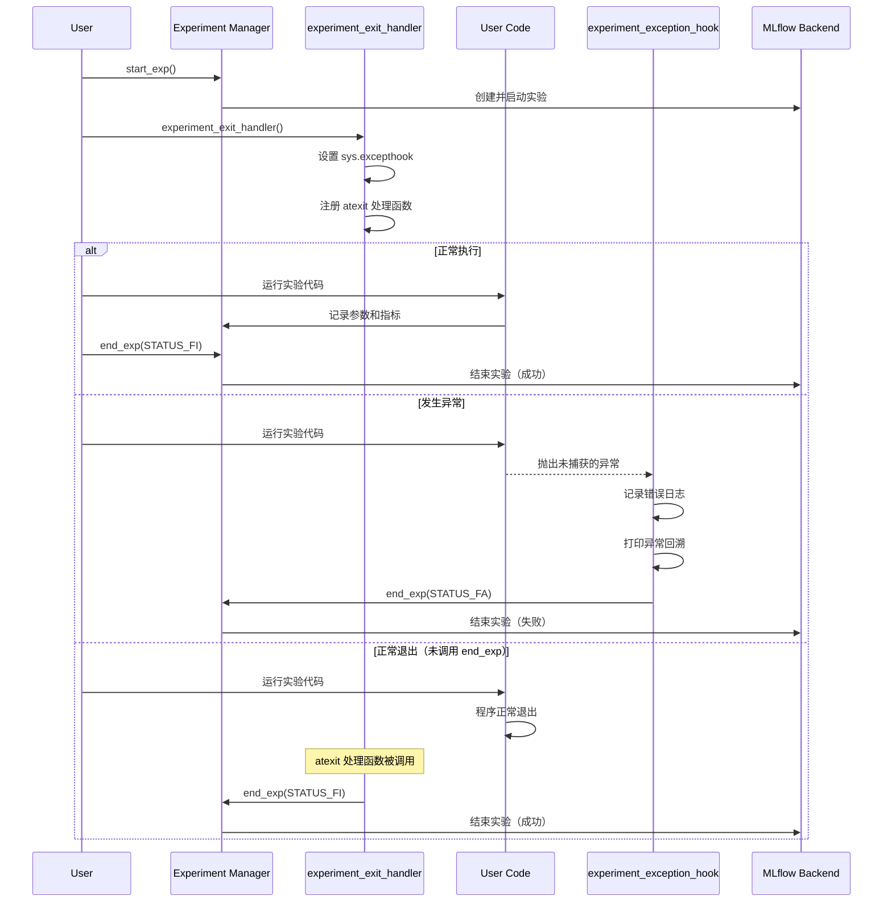
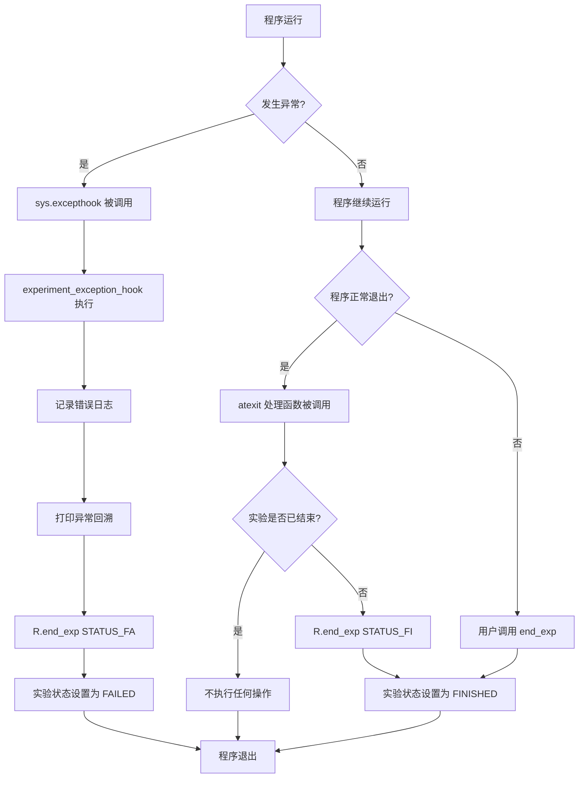
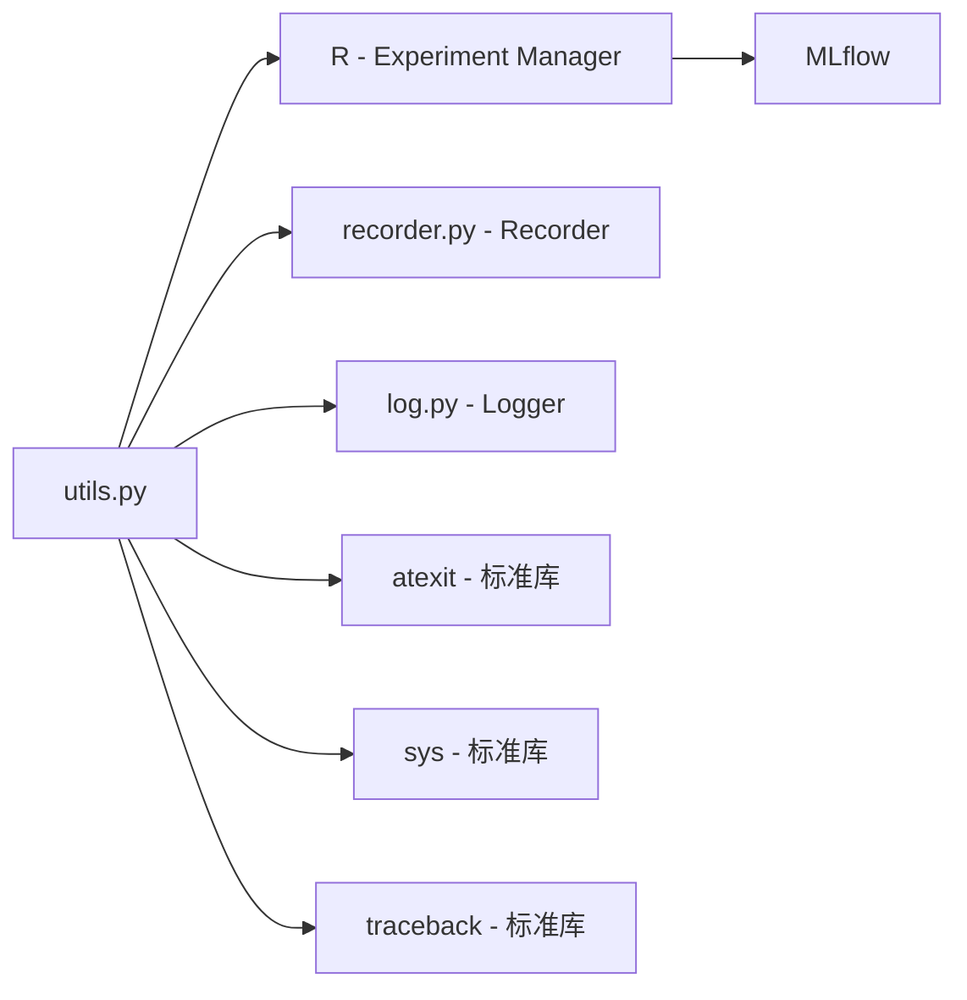

# qlib/workflow/utils.py

## 模块概述

`utils.py` 模块提供了实验退出处理和异常处理的工具函数。该模块主要用于在程序异常退出时自动结束实验，确保实验状态的正确记录。

该模块的主要功能包括：
- 注册程序退出时的实验处理函数
- 捕获未处理的异常并结束实验
- 自动设置实验状态（成功或失败）

## 函数说明

### experiment_exit_handler()

注册实验退出处理函数，处理程序异常退出时的实验状态。

```python
def experiment_exit_handler()
```

**功能说明：**

该方法用于处理程序异常退出时的实验状态。它会：

1. 设置 `sys.excepthook` 来捕获未处理的异常
2. 注册 `atexit` 处理函数，在程序正常退出时结束实验

**限制条件：**

- 如果程序中使用了 `pdb`，当它结束时 `excepthook` 不会被触发，状态将被设置为完成（FINISHED）
- `atexit` 处理函数应该放在最后，因为只要程序结束它就会被调用
- 如果在程序结束前发生异常或用户中断，应该先处理它们
- 一旦 `R` 结束，再次调用 `R.end_exp` 将不会生效

**调用时机：**

应该在实验启动后立即调用此函数，以确保程序退出时实验能被正确结束。

**示例：**
```python
from qlib.workflow import R
from qlib.workflow.recorder import Recorder
from qlib.workflow.utils import experiment_exit_handler

# 启动实验
R.start_exp()

# 注册退出处理函数
experiment_exit_handler()

# 运行实验代码
try:
    # 实验逻辑
    pass
finally:
    # 正常结束实验
    R.end_exp(recorder_status=Recorder.STATUS_FI)
```

---

### experiment_exception_hook()

异常钩子函数，捕获未处理的异常并以失败状态结束实验。

```python
def experiment_exception_hook(exc_type, value, tb)
```

**参数：**

| 参数名 | 类型 | 说明 |
|--------|------|------|
| exc_type | type | 异常类型 |
| value | Exception | 异常的值 |
| tb | traceback | 异常的回溯信息 |

**功能说明：**

该函数用于捕获未处理的异常并自动结束实验。它会：

1. 记录错误日志，包含异常类型和异常值
2. 打印异常回溯信息（与原始格式相同）
3. 以失败状态（FAILED）结束实验

**使用方式：**

该函数通常由 `experiment_exit_handler()` 自动注册到 `sys.excepthook`，不应手动调用。

**示例：**
```python
# 以下代码演示异常钩子的行为
# 不应手动调用此函数
import sys

# 正确方式：使用 experiment_exit_handler()
from qlib.workflow.utils import experiment_exit_handler
experiment_exit_handler()  # 自动设置 sys.excepthook

# 错误方式：手动设置（虽然技术上可行，但不推荐）
# sys.excepthook = experiment_exception_hook
```

## 使用示例

### 完整的实验流程

```python
from qlib.workflow import R
from qlib.workflow.recorder import Recorder
from qlib.workflow.utils import experiment_exit_handler

# 启动实验
R.start_exp(experiment_name="my_experiment", recorder_name="run_001")

# 获取记录器
recorder = R.get_recorder()

# 注册退出处理函数
experiment_exit_handler()

# 运行实验代码
try:
    # 记录参数
    recorder.log_params({"model": "LightGBM", "learning_rate": 0.01})

    # 模拟实验逻辑
    # 如果这里抛出异常，experiment_exception_hook 会捕获并结束实验
    result = train_model()

    # 记录指标
    recorder.log_metrics({"accuracy": result["accuracy"], "loss": result["loss"]})

    # 正常结束实验
    R.end_exp(recorder_status=Recorder.STATUS_FI)

except Exception as e:
    # 捕获异常并手动结束实验（可选，因为异常钩子会自动处理）
    logger.error(f"Experiment failed: {e}")
    R.end_exp(recorder_status=Recorder.STATUS_FA)
    raise
```

### 上下文管理器模式

```python
from qlib.workflow import R
from qlib.workflow.recorder import Recorder
from qlib.workflow.utils import experiment_exit_handler

class ExperimentContext:
    """实验上下文管理器"""

    def __init__(self, experiment_name, recorder_name):
        self.experiment_name = experiment_name
        self.recorder_name = recorder_name

    def __enter__(self):
        # 启动实验
        R.start_exp(
            experiment_name=self.experiment_name,
            recorder_name=self.recorder_name
        )

        # 注册退出处理函数
        experiment_exit_handler()

        return R.get_recorder()

    def __exit__(self, exc_type, exc_val, exc_tb):
        if exc_type is None:
            # 正常退出
            R.end_exp(recorder_status=Recorder.STATUS_FI)
        else:
            # 异常退出
            logger.error(f"Experiment failed with exception: {exc_type.__name__}")
            R.end_exp(recorder_status=Recorder.STATUS_FA)
            # 返回 False 让异常继续传播
            return False

# 使用上下文管理器
with ExperimentContext("my_experiment", "run_001") as recorder:
    recorder.log_params({"model": "LightGBM"})
    # 实验逻辑
    result = train_model()
    recorder.log_metrics({"accuracy": 0.95})
```

## 执行流程图



## 异常处理流程



## 注意事项

1. **退出处理顺序：**
   - `atexit` 处理函数应该放在最后，因为程序结束时它总是会被调用
   - 如果在程序结束前发生异常或用户中断，应该先处理它们
   - 一旦 `R` 结束，再次调用 `R.end_exp` 将不会生效

2. **pdb 调试器限制：**
   - 如果程序中使用了 `pdb`，当它结束时 `excepthook` 不会被触发
   - 在这种情况下，实验状态将被设置为完成（FINISHED）

3. **实验状态：**
   - 正常退出（包括通过 `atexit`）：状态设置为 `STATUS_FI`（FINISHED）
   - 异常退出：状态设置为 `STATUS_FA`（FAILED）

4. **异常日志：**
   - 异常钩子会以原始格式打印异常回溯信息
   - 同时会记录错误日志到日志系统

5. **建议用法：**
   - 在实验启动后立即调用 `experiment_exit_handler()`
   - 仍然建议在代码中主动调用 `R.end_exp`，以明确控制实验结束
   - 退出处理函数作为保险机制，防止忘记结束实验

## 与其他模块的关系



**依赖关系：**
- `R`: 全局实验管理器实例
- `Recorder`: 提供实验状态常量
- `get_module_logger`: 获取模块日志记录器
- `atexit`: 注册退出处理函数
- `sys`: 设置异常钩子
- `traceback`: 打印异常回溯信息
